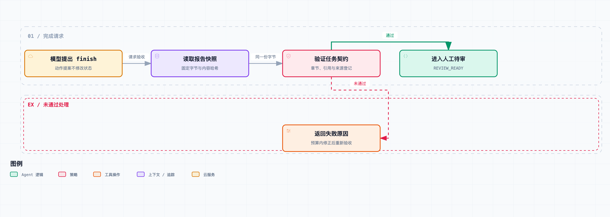

# Agent 系统工程 01｜模型之外，Harness 到底该负责什么？

假设你做了一个技术调研 Agent，让它比较两种方案，最后交一份带来源、带局限分析的报告。

它查了几轮资料，写出一大段文字，然后告诉你：“任务完成。”

你打开报告一看：结论有了，引用编号也有了，可其中一个编号根本没对应到读过的资料，“局限”那一节还是空的。

这时候再给提示词加一句“完成前务必认真检查”，当然可以试。但只要程序里还是“模型说完成，就把任务标为成功”，那决定任务状态的那条路径就一点都没变。

所以这一篇来讨论完成请求的处理：模型提出动作，运行时根据任务契约和实际产物，决定接不接受。

这是[《Agent 系统工程》](https://juejin.cn/column/7686472562230231050)的第一篇。整个系列会围绕同一个“技术调研与文档交付 Agent”逐步演进，先把执行状态和验收机制搭起来。Harness 的范围很大，上下文管理、持久化、外部交付这些先不碰，留到后面的篇目里逐层补上。

## 任务状态由运行时维护

大家都知道，模型只负责“说”，真正“做”的是我们写的程序。所以先把 Harness 的边界画清楚：它是围绕模型工作的运行控制层——组织上下文，接住模型提出的动作，执行允许的工具，记录结果，再决定是继续、验收还是停止。这是一种应用设计方式，各家框架的模块划分并不一定如此。

Anthropic 的 [Managed Agents 工程文章](https://www.anthropic.com/engineering/managed-agents) 就是把模型调用与工具路由所在的循环、持久会话记录、执行环境分开设计的。在这种设计里，模型的上下文、任务的历史记录和工具所在的环境，可以有各自的生命周期。

回到我们的项目，需要先分清四样东西：

- **任务契约**：交什么、满足哪些条件才能进入下一阶段，由应用和用户需求确定。
- **运行状态**：已经执行了什么、拿到了哪些证据、还剩多少预算，由运行时维护。
- **环境事实**：磁盘上究竟有没有报告、工具实际返回了什么，需要通过读取和执行获取。
- **模型看到的上下文**：从前面这些信息中选出的输入，用来帮助它提出下一步动作。

拿完成请求来说，模型输出 `{"kind": "finish"}`，表达的只是一个动作提案。就算它在输出里带了 `verified: true`，那也只是模型说的一句话，程序不能据此认定报告已经通过验收。

同样，报告正文里写“已经核实全部来源”，也只是报告里的一句话。运行时要核实来源，就得去查自己保存的工具记录。

这个分工可以写成两步：

```text
action = 模型(当前上下文)
next_state = 运行时(当前状态, action, 工具结果, 任务契约)
```

下一步做什么，可以留给模型选；但哪些动作允许执行、什么证据能触发状态迁移，要在执行层写明确的规则。这样还有个好处：模型变强以后，有些规划辅助可以撤掉，而交付记录、权限检查和业务验收要不要保留，取决于产品要求，不用跟着模型走。

## 完成请求的验收契约



验收记录绑定当前报告快照；结构检查通过后进入 REVIEW_READY，内容仍需审查。

那验收到底验什么？我们先把这一篇的目标缩小：产出一份**可以交给人审查**的调研报告。“内容绝对正确”“已经向用户交付”“已经公开发布”，都不算进这个阶段。

契约是这样规定的：报告存在且非空；包含“结论、证据、局限”三个非空章节；至少引用两份在本次执行中读到的不同测试资料；没有引用未知的资料编号。

要注意，这里检查的只是结构和来源登记。两个来源存在，不代表它们相互独立；引用编号能查到，也不代表原文支持报告的结论。

对应的状态变化是：

```text
CREATED → RUNNING
             │
             ├─ 读取资料 / 修改报告 → RUNNING
             │
             └─ 提出 finish → VALIDATING
                                ├─ 检查未通过 → RUNNING + 失败原因
                                └─ 检查通过   → REVIEW_READY

越权动作 → BLOCKED
预算耗尽 → EXHAUSTED
```

状态故意叫 `REVIEW_READY`，是想让它只表达一件事：规定的机械检查已通过，可以进入人工审查了。后续要加事实审核或发布步骤，就再加相应的验收条件和状态迁移。

结束状态也要分开命名。如果所有结束方式都返回一个 `success: true`，上层很容易把“模型停止生成”“报告检查通过”和“交付已完成”混成一件事。

停止原因同样要保留下来。工具权限不足、预算耗尽、材料不足，各自的后续处理都不一样，不能因为“这轮不继续了”，就一起算成成功。

## 验收记录绑定报告快照

给系统加一个 `verify_report()` 就够了吗？还有一个容易漏掉的问题：检查时读到的文件，和最后交付的文件，是不是同一份？

假设你先检查 `draft.md`，检查通过后，另一个工具又改了它，最终交付时再按路径读取。这时你交出去的内容，可能已经不在刚才的验收范围内了。

这一篇的处理方式是：**读一次快照，对这份字节内容做检查，再把同一份内容绑定到验收记录上。** 核心代码如下，省略了日志和部分元数据；完整实现放在配套的 `harness_lab.py` 里。

```python
def finish_proposal(self):
    state = self.state
    state.phase = "VALIDATING"

    snapshot = (
        self.draft.read_bytes()
        if self.draft.is_file() else None
    )
    errors = verify(snapshot, state.observed, self.contract)

    if errors:
        state.feedback = errors
        state.phase = "RUNNING"
        return False

    state.accepted_bytes = snapshot
    state.receipt = {
        "artifact_sha256": digest(snapshot),
        "contract_version": self.contract.version,
    }
    state.phase = "REVIEW_READY"
    return True
```

在本地实验里，后续消费者应该使用 `accepted_bytes`。如果要重新按可变路径拿文件，就必须先确认它仍与验收记录匹配。

完整实现还保存了契约和已读取证据内容的哈希。有了它们，我们就能回答三个问题：检查的是哪个版本的报告，用的是哪套规则，当时拿到的是哪份资料。

当然，哈希只能标识内容，证明不了内容为真，也拦不住有权限的人改掉整条记录。实验里的记录放在内存里，更没有跨进程的防篡改和持久化保证。所以单存一个 `sha256` 字段，离可信审计还差得远。

还有一条边界：模型只能请求 `read_evidence`、`write_report` 或 `finish`。它不能替换验收函数，也不能通过工具把任务状态直接改成 `REVIEW_READY`。这一篇用动作分发规则落实这条边界；至于不可信代码的执行环境隔离，是后面要单独处理的问题。

## 结构验收的故障对照实验

这次的实验没有调用在线模型，而是用预先定义好的动作序列，模拟正常提案和各种故障输入；资料也是明确标记的本地测试笔记。这样就能重复触发指定问题，看运行时到底怎么表现。

两组实验用同一套动作脚本、工具白名单和预算：最多 8 次决策、5 次工具调用。唯一的开关是：收到 `finish` 时，执不执行结构验收。预算在发起调用前检查；它限制的是次数，代替不了真实网络请求的超时和取消。

实际运行结果如下：

| 输入场景 | 不执行验收 | 执行结构验收 |
| --- | --- | --- |
| 没写报告，直接声称完成 | 进入待审 | 拒绝，最终预算耗尽 |
| 写出空报告 | 进入待审 | 拒绝，最终预算耗尽 |
| 引用本次未读取的资料 | 进入待审 | 拒绝，最终预算耗尽 |
| 引用不存在的资料编号 | 进入待审 | 拒绝，最终预算耗尽 |
| 报告缺少“局限”章节 | 进入待审 | 拒绝，最终预算耗尽 |
| 第一次缺章节，之后补齐 | 提前接受不完整版本 | 接受补齐后的版本 |
| 报告满足既定契约 | 进入待审 | 进入待审 |
| 格式齐全，但结论夸大 | 进入待审 | 仍然进入待审 |
| 请求直接修改任务状态 | 阻止 | 阻止 |
| 不停调用工具 | 预算耗尽 | 预算耗尽 |

前五项被拒绝后，动作脚本会继续提出同一个完成请求，所以最终落在 `EXHAUSTED`。这样设计是为了检查两件事：失败不会被悄悄改写成成功，循环也能停下来。

在“被拒绝后补齐”场景里，不验收的运行时第四步就接受了残缺报告；启用验收后，第四步被拒绝，第五步写入补齐版本，第六步才进入待审。

不过要说明：补齐动作是测试脚本预先写好的。这个结果只能说明控制流允许“接收反馈、修正产物、重新验收”这个回路走通，**不能说明真实模型收到反馈后一定会自己改对**。

全部 10 个场景都符合预期。另外 9 个自动测试覆盖了空章节、参数错误、非法动作类型、预算执行顺序、反馈回传、伪造验收参数，以及修改原文件后已接受快照是否保持不变；修订版还检查了异常引用语法和旧任务目录复用。

这些都是契约测试，只能证明这份代码在给定输入下的行为，不能写成“Agent 成功率提高了多少”。场景是刻意挑的，通过数量也估算不了真实任务里的可靠性。

## 引用解析与任务目录的反例

检查这份实现时，还发现了两处容易被正常用例漏掉的问题。

第一处是引用解析。原来的正则只提取小写编号，报告里就算额外写了 `[E:UNKNOWN]`，也会被当成没有这条引用。我用一份本来就有两个合格引用的报告补上这个编号，旧实现照样让它进了待审。修订版先识别全部引用标记，再检查编号格式和来源登记；标记不完整也会报错。

第二处是任务目录。如果新建运行时却复用上次的工作目录，旧报告还留在那里。新任务只读两份资料、直接请求完成，也可能验收旧文件。现在的修订版要求新任务使用没有旧草稿的独立目录；恢复既有任务是下一篇的事，得走明确的入口，不能靠“目录刚好相同”来猜。

这两处修订给我的提醒是：验收规则列出来，不等于实现已经覆盖了它。输入解析、产物归属、状态迁移要分别检查，找到的反例也要保留下来。

## 结构验收无法判断引用是否支持结论

我们故意把一份合格报告的结论改成：“只要有 Harness，任何模型都能保证百分之百正确。”

来源编号仍然有效，章节也完整，结构验收照样放行。

因为验收函数没检查“引用是否支持结论”。它把自己负责的部分做完了，但业务目标的另一部分还没人验。

要处理这个问题，可以加主张与证据的对应检查、确定性的事实校验、模型评审或人工审核。不过每多一层，就多一套自己也会犯错的判断机制——评审的模型和写作的模型如果共享同一个错误前提，也可能一起给出错误结论。

Anthropic 的 [Agent 评测文章](https://www.anthropic.com/engineering/demystifying-evals-for-ai-agents) 把任务、执行轨迹、结果和评分器分开了。放到这个例子里：报告是产物，工具过程是轨迹，评分器负责判断。评分器说“通过”，不等于业务结果一定正确。

所以评估一个验收机制，至少要看两边：不合格的产物有多少被放行，合格的产物有多少被误拦。一个永远拒绝的校验器，误放行确实是零，但任务也一个都交不出来。

而为了把错误率压低，系统还要付出更多成本：反复修改、增加审查调用、延长等待。这些都要进指标，不能只挑看起来最好的那项展示。

对我们这个项目，先让结构验收把明显不完整的报告挡在外面，语义判断交给后面的审查阶段。两类检查分开记结果，别把结构合格当成事实正确。

## 如何比较真实模型下的效果

一个常见的比较是：普通 Agent 只跑一次，复杂 Harness 反复规划、执行、审查十几轮，最后复杂版本效果更好。

这个结果可能有用。但想知道提升到底来自什么，就得把额外付出的计算量也算进来。

比如 Anthropic 在 2026 年 3 月的 [Harness 工程报告](https://www.anthropic.com/engineering/harness-design-long-running-apps) 里，列过同一个游戏制作任务的单 Agent 与完整 Harness 案例：分别运行约 20 分钟、6 小时，费用约 9 美元、200 美元。注意这是原作者的个案数据，不是我实测的，也不是普遍的费用估算。两边的工作量和资源消耗差这么多，我不会拿它直接推出“编排方式本身带来了多少收益”。

如果以后要验证这一套运行时，可以设计四组：基础循环；加结构验收；验收失败后允许修正；再加语义评审。固定任务集、模型版本、工具集合和初始环境，在相同预算上限下重复运行，把每组实际用掉的资源也记下来。

任务结果由实验之外、事先定好的标准来评。内部的评审模型可以属于 Harness，但不能让它自己的“通过率”当唯一效果指标，不然系统很容易把“迎合评分器”当成质量提升。

最后把任务完成情况、误放行与误拒绝、成本、延迟、预算耗尽次数放在一张表里报告。不同预算下也要分别看：有的策略在宽裕预算下更好，时限一紧反而更差。

这组真实模型实验目前还没有跑。这一篇实际完成的是前面的故障注入和代码测试；四组方案是留给后面复现的实验设计，暂时没有可以填的模型成绩。

## 完成请求的处理流程

现在，模型的完成请求会先触发验证；验证读的是实际产物，并绑定同一份快照；失败原因会带回下一轮；预算和越权动作各有各的终止状态。`REVIEW_READY` 的含义也被限定住了，不会悄悄变成“事实正确”或者“已经发布”。

配套目录里有 `harness_lab.py`、`test_harness.py` 和原始实验结果。在 Python 3.10 及以上的环境里进入该目录，可以运行：

```bash
python3 harness_lab.py --output experiment-results
python3 -m unittest -v test_harness
```

这份实现仍然是单进程的本地运行时实验，没有接在线模型和真实检索服务；日志、证据登记和验收记录都还在内存里。进程一旦崩溃，恢复问题依然存在。

那下一篇**《任务跑到一半挂了，如何恢复到正确状态？》**就来解决这个问题：把状态和执行记录持久化，再用进程退出实验检查恢复结果。
