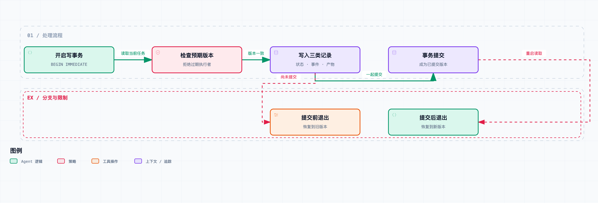

# Agent 系统工程 02｜任务跑到一半挂了，如何恢复到正确状态？

上一篇里，我们给调研 Agent 加了一道验收：报告满足结构和来源登记要求，才能进入 `REVIEW_READY`。但那份实现有个限制：状态都在内存里。

假设它已经查完资料、写好报告，正准备把验收结果记下来，进程突然退出了。重新启动后，磁盘上可能有报告，聊天记录里也可能有“已经写完”的描述。这时候程序该怎么办？直接交付，重新检查，还是全部重做？

如果答案是“把聊天历史重新塞给模型，让它自己接着干”，那其实是把恢复策略交给了另一次不确定的推断。历史可以帮模型决定下一步，但它证明不了上一次操作到底完成到了哪里。

所以这一篇先解决一个范围清楚的问题：**同一台机器上进程意外退出后，让任务状态、事件记录和已验收产物恢复到同一个已提交版本。** 外部接口的副作用先放一放，那是下一篇的内容。

## 恢复需要保存哪些记录

运行中的 Agent 手里至少有几种不同的信息：任务要求、已完成动作、工具返回内容、当前计划、待交付产物，还有模型此刻看到的上下文。

这些信息不能都靠一份摘要来保存。摘要适合帮模型理解进度；恢复程序要的是能直接检查的记录。比如：报告是哪一版、用的哪个验收契约、最后一次持久化事件是什么、有没有结果还没确认的调用。

我们给每个任务一个明确的 `task_id`，再给每次提交递增的 `version`。状态快照表达“截至版本 v，系统承认哪些事实”；事件表达“这个版本因为什么动作产生”；报告字节和哈希标识当时接受的产物。

任务身份这件事，其实也是在补上一篇暴露的坑：新任务复用旧工作目录，可能把上一次留下的报告当成本次成果。上一篇的临时办法是要求新任务换目录；这一篇有了 `task_id`，就能把入口分清楚了——新建任务和恢复任务是两个明确的入口，不靠“这个目录里刚好有文件”来决定。

LangGraph 的持久化文档同样把检查点和线程身份关联起来，供后续恢复或查看历史使用。我们不用它的实现，只是借这个问题核对一下自己的设计：**调用方必须能明确指出，恢复的是哪个任务的哪段历史。** [文档](https://docs.langchain.com/oss/python/langgraph/persistence)

## 分别写入文件会产生版本不一致

先看一种很容易写出来的方案：先覆盖 `report.md`，再写 `state.json`，最后追加 `events.jsonl`。

每个步骤单看都没问题，组合起来却有两个危险窗口。报告改好了但状态没改，恢复后会读到“旧状态、新产物”；状态已经标成待审但事件没写，恢复程序又缺少解释这次变化的记录。

那给三个文件分别做原子替换呢？也不行。问题不在于单个文件有没有写完整，而在于几份记录要描述的是同一次提交，三次替换拼不成一个整体。

这个教学项目的报告很小，所以这一篇干脆把任务状态、事件和报告字节都放进同一个 SQLite 数据库，在同一个事务里提交。这样跨文件的一致性问题就先缩小到一个可验证的边界内。

三张表各有职责：`tasks` 保存当前状态和版本，`events` 保存每次提交的原因，`artifacts` 保存报告内容及其哈希。事件的 `(task_id, version)` 是唯一键，防止同一个任务版本对应两条互相竞争的历史。

如果报告很大，一直放在关系数据库里通常不合适。可以先把不可变内容写入对象存储，验证内容哈希，再在事务里提交对象引用。不过此时还要处理没有被引用的孤立对象，这个额外协议省不掉。这一篇没有实现对象存储版本。

## 提交点：恢复时承认哪一版



提交前退出，恢复旧版本；提交后退出，恢复新版本。这里的三类记录都在同一个 SQLite 事务中。

`lab/runtime.py` 的关键路径可以缩成下面几步，完整代码保留了 SQL 和错误处理：

```python
db.execute("BEGIN IMMEDIATE")
current = load(task_id)
if current["version"] != expected_version:
    raise VersionConflict()

save_artifact(task_id, report_bytes)
append_event(task_id, expected_version + 1, event)
save_state(task_id, expected_version + 1, new_state)
db.commit()
```

这段是流程摘录，不是独立可运行脚本。可以运行的入口在配套项目的 `run.py`。

三个写入只有等事务提交后，才一起成为新的已提交版本。恢复时就读取数据库已经承认的那一版，不根据模型刚才有没有说“成功”来猜。

不过事务解决不了旧工作进程晚到的问题。假设两个执行者都读到了版本 4，一个先提交了版本 5，另一个随后拿着版本 4 的计划继续写。第二个写入必须被拒绝，否则旧判断就覆盖了新进度。

这里用 `expected_version` 做乐观并发检查。`BEGIN IMMEDIATE` 先取得写事务，再检查当前版本，让检查和写入在同一个本地数据库事务里衔接起来。它提供不了分布式任务调度、租约或跨机器的执行者隔离，尤其拦不住旧执行者在数据库之外调用远程工具。

SQLite 配置采用 WAL 和 `synchronous=FULL`。这一篇用的是同机本地文件，这个配置不能直接照搬到网络共享盘。SQLite 官方文档明确说明了 WAL 对同机共享内存的要求，以及多数据库事务的边界。[WAL 文档](https://sqlite.org/wal.html)

## 事务提交前后的进程退出实验

说了这么多机制，还是得看实际表现。配套实验会启动一个子进程，在两个位置调用 `os._exit()`。这个退出不经过常规的 Python 异常处理和连接清理，父进程随后重新打开数据库，检查恢复结果。

第一种情况发生在三个写入已经执行、事务还没提交时。第二种发生在提交已经返回、子进程还没来得及向调用方报告成功时。

| 故障位置 | 恢复版本 | 已提交事件数 | 能否读到报告 |
| --- | ---: | ---: | --- |
| 提交前退出 | 0 | 0 | 否 |
| 提交后退出 | 1 | 1 | 是 |

这两行是本地实际运行结果，不是模型表现。实验检查了状态版本、事件数量和产物是否同时存在，还验证了拿版本 0 去覆盖已提交版本 1 会得到版本冲突。

第二种情况值得多说一句：调用方没收到成功消息，不代表事务没成功。恢复后应该承认数据库里的版本 1。如果“没拿到回执就从头跑”，很可能把已经完成的工作重做一遍。

当然，这次验证覆盖的是进程异常退出，不包括突然断电、磁盘损坏或存储设备虚报刷盘成功。事务机制的完整保证依赖数据库、文件系统和硬件条件，两次子进程测试代替不了这些条件。

## 重放记录，不等于再做一遍动作

恢复以后，经常会听到一个词：重放。这里最好把它拆开看。

如果重放的是“版本 1 已经验收了这份报告”的记录，那程序只是重新构造内部状态。相同输入经过确定的状态更新规则，应该得到相同结果，这一步是安全的。

如果重放的是“再问一次模型”“再抓一次网页”“再提交一次文档”，事情就不同了。模型可能提出新动作，网页可能已经更新，提交可能已经生效。这些都是新的执行，不能当成读取旧记录。

所以工具结果需要保留内容，或者保留可验证的快照引用。过去拿到的资料可以用来解释当时的决策；但如果下一步需要的是“现在仍然成立”，就得重新查询，并把新结果作为新事件记录下来。换句话说，“历史上是真的”和“现在仍然成立”是两次检查，别混在一起。

契约版本也一样。程序升级后验收条件变了，旧的 `REVIEW_READY` 仍然只对应当时那套规则。我们的任务记录保存了 `contract_sha`，但当前代码还没有自动迁移契约。正式接入升级流程时，应该显式选择：继续用旧契约、重新验收，还是暂停任务，不能悄悄套用新规则。

## 检查点密度是一笔实际开销

每个 token 都落盘，代价太高；几个小时才保存一次，恢复后又可能丢掉大量工作。选保存时机时，先看哪些动作跨过了业务边界。

对这个项目，资料返回并登记、报告版本验收、提交意图建立和提交结果确认，都是值得保存的节点；普通的中间措辞变化可以稀疏一些。不管用什么频率，都要记下最后一次检查点之后可能已经产生的外部效果。

事件日志和状态快照各有各的成本。只留最新快照，恢复快，但出了错很难追查是哪一步引入的；只留事件，能还原历史，但长任务恢复时要重建更多状态。当前实现是两者一起保存，代码直观，代价是每次提交都写完整状态。增量和压缩以后再优化。

在配套项目目录运行：

```bash
python3 run.py 02 --output results/02.json
```

到这里，进程重启后，这个实现可以恢复到已提交的本地版本了。但远程提交不在这个事务里：文档已经提交、回执却丢了的情况，还需要单独的交付记录和对账流程。下一篇就来处理它。
