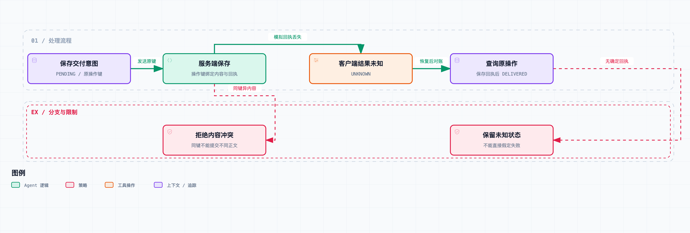

# Agent 系统工程 03｜工具执行成功但回执丢了，重试还是不重试？

我们的调研 Agent 已经能在进程退出后恢复本地状态了。接下来，它要把通过审查的报告交给一个外部服务。

调用发出去了，服务器也保存了文档。可就在返回回执的路上，连接断了。Agent 这边只看到一个超时异常，于是它说：“刚才失败了，我再试一次。”

过了一会儿，收件箱里出现了两份一模一样的报告。

问题出在哪？我们把“超时”和“失败”当成了同一个意思。超时只说明调用方没在约定时间里拿到可用结果，说明不了对方没执行。要把重试做可靠，得先承认一种状态：**操作结果尚不确定。**

## 用 UNKNOWN 表示尚未确认的结果



图中主路径对应“服务端已保存、客户端丢失回执”的实验。无法确认结果时保留 UNKNOWN，不直接创建第二次交付。

上一篇的本地事务可以把任务状态、事件和产物一起提交，但它没办法把一个独立远程服务的数据库也拉进同一个本地事务。

先在本地写“提交成功”，再请求外部服务，会留下假成功窗口；先请求外部服务，再写本地成功，又会留下外部成功、本地没记下来的窗口。把两行代码换个位置，缺口只是换了个地方，消不掉。

所以我们给交付操作单独建一条记录，不直接改整个任务的成功标记：

```text
PENDING → DELIVERED
    │
    └─ 没有拿到确定结果 → UNKNOWN
                            │
                            └─ 查到原操作回执 → DELIVERED
```

`UNKNOWN` 的意思是：后续流程先做对账。这里的“对账”很具体——用原来的操作标识去问服务端，那次提交完成了没有，对应哪个回执。

如果接口没有查询能力，这条路径就走不通。此时系统应该保留不确定状态，根据接口承诺和重复操作的代价决定要不要人工处理，不能把 `UNKNOWN` 自动改成失败然后重发。

## 幂等键标识的是一次意图，不是相同的内容

实现幂等时最容易写错的地方，是在重试函数里生成一个新 UUID。每次请求当然都有唯一标识了，但服务端会把它们当成不同的操作，去重就失效了。

正确的时机是：决定做这次交付时就生成操作标识，先存下来；之后所有属于这次意图的重试，都复用它。

反过来也要注意，两次内容完全相同的提交不一定是同一个意图。用户今天让你给甲发报告，明天又明确要求发一遍，不能因为内容哈希相同就忽略第二次。操作身份还要考虑调用者、任务、目标和业务阶段。

AWS 在讨论幂等 API 时特意区分了“参数相同”和“意图相同”，采用由调用方提供的请求标识，还讨论了同标识、不同参数该怎么报错。客户端的重试实现要遵守这些接口语义。[原文](https://aws.amazon.com/builders-library/making-retries-safe-with-idempotent-APIs/)

这一篇实验用的操作键带任务名、审稿阶段和报告哈希，限定“这次任务的这版报告只提交一次”。最终集成示例更直接，就存 `task-A/review-1` 这个操作标识，单独绑定内容哈希。两者都依赖明确的业务约束；真的允许再发一次时，应该建立新的交付意图。

## 服务端必须将去重与业务写入关联

客户端记住幂等键还不够，服务端得理解这个键，并把“登记这个键”和“产生业务效果”可靠地关联起来。

如果先写去重表再写文档，中间失败后重试，可能被误认为已经完成；反过来先写文档再登记键，中间失败后又会重复创建文档。两边都有窗口。

本地模拟服务用一张 `deliveries` 表代表交付效果，`op_key` 是唯一键，内容哈希和回执在同一条记录里。这里不存在另一个真实收件系统，所以单个数据库事务就能覆盖模拟效果。服务端核心逻辑是：

```python
row = find_delivery(op_key)
if row:
    if row.body_sha != sha256(body):
        raise PayloadConflict()
    return row.receipt

save_delivery_and_receipt_in_one_transaction(op_key, body)
return receipt
```

这是流程摘录。完整的 `DeliveryService.submit()` 在 `lab/delivery.py`，用 SQLite 实现保存和查询。

旧键带着新内容再次出现时，我们明确拒绝。不然调用方很可能以为新版报告已经提交，服务端却返回旧版回执，两边各自“成功”，实际交付的内容对不上。

如果真实服务还要发邮件，那数据库里插了一行也不等于邮件已经发出。这就又冒出一个新的交付边界，需要事务发件箱、下游去重或其他协议。你看，加一个数据库也躲不开“下一次外部调用的结果怎么确认”这个问题。

## 客户端要先保存意图，再发请求

配套代码用独立的客户端数据库存 `op_key`、报告哈希、状态和回执，用另一个数据库模拟服务端。刻意分成两个存储，就是为了保留“两边没法一起提交”这个事实。

`DeliveryClient.send()` 的顺序是：先持久化 `PENDING`，再调用服务端；收到回执后写 `DELIVERED`；遇到模拟超时则写 `UNKNOWN`。如果已有操作的内容哈希和本次不同，客户端同样拒绝。

这不能保证客户端一定来得及记下 `UNKNOWN`——进程可能在收到异常之前就退出，留下 `PENDING`。所以真实的恢复流程不能只扫描 `UNKNOWN`，还要核查超时未完成的 `PENDING`。这类恢复扫描、超时调度和任务认领，这个最小客户端都还没实现。

但有了意图记录，恢复程序至少知道该去查询哪个操作，不用根据报告内容或一段聊天摘要去猜。查询返回确定回执后，再把它写回本地，本地交付记录才算完整。

## 服务端提交后丢失回执的对照实验

实验的做法是：在服务端事务提交以后抛出 `TimeoutError`。没有真实网络请求，但故障点明确放在“效果已发生、调用者没拿到回执”这个窗口。

第一组用错误的重试方式：第二次生成新键。第二组保存原键，第一次超时后关闭客户端数据库连接，重新创建客户端，再按原键查询回执。

| 方案 | 服务端交付记录数 | 客户端最终状态 |
| --- | ---: | --- |
| 超时后换新键重发 | 2 | 调用返回成功，但发生重复 |
| 按原键查询，再调用相同意图 | 1 | `DELIVERED` |

第二组里，第一次超时后的本地状态是 `UNKNOWN`，查询之后才转成 `DELIVERED`。实验还检查了同一个键提交不同内容的情况，得到 `same_key_different_payload`。

要说边界：这些结果只说明当前模拟服务和客户端在这个故障窗口下的行为。真实文档平台是不是支持同样的接口、并发请求、服务端重启、长时间网络分区会怎样，都要读了它对键作用域、保存期限和错误响应的约定才知道。

## 查询不到，不总等于没有发生

如果服务端的查询有延迟，写入刚完成时可能暂时查不到；如果去重记录已经过期，服务端也可能忘了原来的键。于是“查不到就重试”还是可能产生重复效果。

所以要想清楚服务端的几种承诺：查询能不能给出权威结果，幂等键保留多久，保留期外的重试怎么处理，同键不同请求会不会报错。客户端的最大重试周期要和这些承诺一起设计。

还有一个容易忽略的问题是主动取消。用户说“别发了”，不代表刚才的提交被撤销了。操作结果还不确定时，应该先确认结果；已经交付的内容要撤回或更正，那是新的业务动作，有自己的权限和失败窗口。

所以这一篇不承诺端到端的 exactly-once。我们做的是：在一个明确的服务端去重范围内，让同一交付意图最多对应一条模拟记录，再通过查询把客户端状态补齐。范围能不能扩大，取决于真实服务给不给同样的去重和查询保证。

## 重试次数还得服从预算和时限

就算操作幂等，无限重试也会消耗资源，给已经拥堵的服务加压力。次数上限、总时限和间隔要一起设置；单次超时乘上次数，常常比页面上展示的等待时间长得多。

还要留意重试的叠加：本地重试、SDK 自带重试、任务调度器重试，三层各重试几次，总请求量就远超你在最外层配的数字。所以要明确哪一层负责重试，其他层把执行次数和结果透传出来。

当前实验没有实现网络退避算法，因为它要验证的是“重试同一个意图”这个语义。延迟设得再合理，也修不了每次都换键的问题。

在配套项目目录运行：

```bash
python3 run.py 03 --output results/03.json
```

到这里，本地恢复和服务端去重解决了重复交付的一部分问题。但幂等只保证“这个操作可以安全重试”，不代表“这个操作被授权过”。下一篇就来看：外部资料进入上下文以后，工具调用怎么遵守用户授权。
