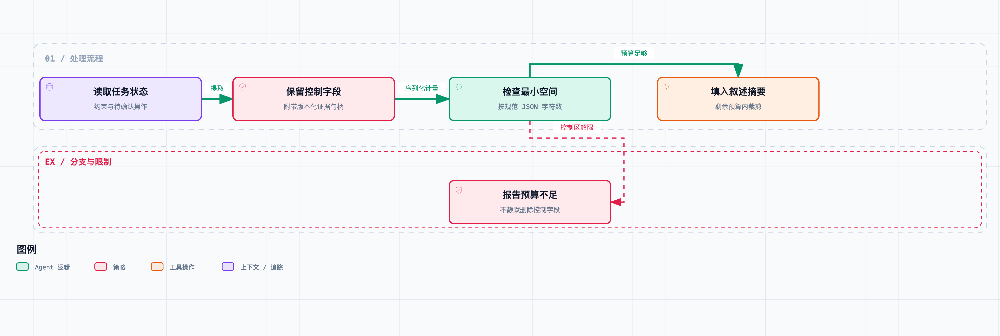

# Agent 系统工程 05｜上下文压缩以后，怎样知道关键信息有没有丢？

报告快写完时，上下文已经很长了。系统生成一段摘要：“已收集主要资料，完成方案比较，报告准备交付。”

这几句话都是真的。麻烦在于，它漏掉了两件事：用户要求先审稿；上一轮的提交结果还没查清。

下一轮模型只看到这段摘要，提出了直接交付。第四篇的执行授权也许会挡住它，但任务还是多走了一次错误决策。

所以评价上下文压缩，除了检查有没有虚构，还要检查后续决策需要的条件全不全。摘要没编造事实，也可能漏掉那些决定下一步动作的约束——这就是这一篇要处理的问题。

## 文本相似，不代表决策条件相同

先想象两段历史。第一段里，用户要求“先给我审查”；第二段里，用户明确同意“按这一版交付”。两边都完成了资料收集和报告撰写。

如果压缩函数对这两段历史都输出“报告准备交付”，那两个本来需要不同动作的状态，就变成了同一份输入。后面的决策器再强，只看这份摘要也没法凭空区分它们。

把这个观察再写具体一点。设历史为 `H`，压缩结果为 `C(H)`。如果存在两段历史 `C(H1) == C(H2)`，但它们需要不同的合法动作，那么只依赖压缩结果的策略，不可能在这两种情况下都区分对。

这个推导没有说自然语言摘要一定不可用，它给的是一个检查方法：主动构造只在关键条件上不同的历史，看压缩之后这种差别还在不在。

比如“操作失败”和“没拿到操作回执”，“这个来源过期了”和“这个来源支持该结论”，“用户没有授权公开发布”和“用户没有反对发布”。压缩时少掉一个限定词，下一步能做什么就变了。

## 把运行状态放在摘要之外

在我们的调研项目里，任务身份、契约版本、待确认操作和审批要求，本来就有结构化记录。没必要先把它们写进长对话，再让模型从长对话里重新提炼一遍。

所以这一篇把输入拆成两部分：一部分是必须保留的控制信息，另一部分是可以压缩的叙述和资料片段。最小控制区长这样：

```text
task_id                 当前任务
contract_sha            使用哪套任务要求
state_version           输入来自哪一版状态
constraints             仍然有效的限制
pending_operations      结果待确认的操作
failed_paths            已尝试而无效的路径
evidence_handles        能重新读取的证据版本
```

“必须保留”来自这份应用的任务协议，不是说这些字段放之四海而皆准。我们的判断依据是：删掉它，会不会改变允许动作、任务进度或下一步核查对象。

Anthropic 关于上下文工程的文章讨论了压缩、结构化笔记和按需获取信息，也提醒过度压缩可能丢掉后来才显得重要的细节。本文沿着这个问题增加应用侧的控制信息，没有复现、也不宣称达到其产品效果。[原文](https://www.anthropic.com/engineering/effective-context-engineering-for-ai-agents)

## 控制字段的保留与失效条件

当然，如果所有信息都进控制字段，JSON 也会一直涨，保留范围还是要定。

这里要区分状态和历史：当前有效的约束直接保留；已经失效的旧约束留在事件记录里；仍然不确定的操作必须显式列出；已经有确定回执的操作，留个可查询的引用就够了。

失败路径也要有失效条件。某个查询昨天失败，不代表永远不该重试。记录里应该有失败类型、发生时间和当时环境。对“永久不存在的来源”和“暂时超时的来源”用同一条“禁止再试”规则，会误伤恢复机会。

这一篇的最小代码只用字符串表示失败路径，用来说明控制区怎么保留；失败分类和到期清理没有实现。正文里的完整字段建议，和代码当前支持的范围，要分开看。

资料正文通常占大头，所以控制区只保留带版本的证据句柄，模型需要具体内容时再通过工具读取。句柄要能定位当时的快照；如果相同编号下的内容变了，读取函数要能识别出来。

这一步和第二篇是接在一起的：历史事件与证据存储负责“可恢复”，上下文负责“给当前决策合适的输入”。模型上下文被清理，不应该把唯一的原始证据也一起删掉。

## 控制信息超过预算时返回错误



控制字段先占用预算，剩余空间才用于叙述摘要。示例按 JSON 字符数计量，不是 Token 数。

`lab/context.py` 的压缩器先复制控制字段和证据句柄，算出它们需要的最小空间，再把剩余预算分给叙述摘要：

```python
view = copy_pinned_fields(state)
view["evidence_handles"] = versioned_handles(state)
minimum = encoded_size(view)
if minimum > budget:
    raise ContextBudgetExceeded()
view["summary"] = fit_narrative(state, budget - minimum)
```

这是流程说明。可运行的实现用规范化 JSON 的字符数计量，**不是 token 数**。不同模型的 tokenizer 算出来的 token 长度不一样，接入真实模型后要换掉计量方法，还要为系统指令、工具定义和模型输出预留预算。

这个区别不能略过：把字符串长度当 token 消耗写进成本表，等于把一串看着精确、实际没意义的数字当成了账单。

控制区本身超预算时，代码明确报错，不从末尾静默截断。上层可以减小本轮任务范围、分批读取资料，或者暂停等待更多资源。怎么选是产品的事，但静默删掉审批条件，不是可以接受的默认行为。

## 字段保留、预算与版本检查

本地实验建了一份带审查要求和未确认提交记录的任务状态，叙述部分重复了很多次，方便观察压缩。对照组是一句省略控制条件的摘要。

为了让问题可重复，决策器用固定规则：看见 `review_required` 就请求审查，否则提出交付。这是刻意简化的消费者，不是在线模型。

| 检查项 | 实际结果 |
| --- | --- |
| 只提供叙述摘要 | 提出交付 |
| 保留结构化控制区 | 请求审查 |
| 控制区超过极小预算 | 明确报预算不足 |
| 句柄指向的正文发生变化 | 拒绝当成原证据读取 |

结构化结果满足了设定的 600 字符 JSON 预算，也保住了待确认操作。原始长度和压缩后长度存在 `results/05.json`，没有换算成 token 节省比例。

这个实验能检查序列化、字段保留和版本校验，也能看出信息丢失会怎样影响一个依赖它的策略。但它证明不了真实模型看到这些字段就一定遵守——所以执行授权那一层还是要留着。

## 模型实验的控制变量

如果以后接入模型，不能拿“长上下文里的任务 A”和“短摘要里的任务 B”比，然后把差异都归给压缩。应该固定任务、模型版本、工具、后续问题和预算，只替换上下文表示这一个变量。

可以比较完整历史、自然语言摘要、滑动窗口，以及控制字段加证据句柄。每组都要有正常信息，也要有关键反例，特别是那种只改一个否定条件的成对样本。

评分别只看摘要相似度，更贴近任务的检查是：有没有重复提交结果未知的操作，有没有再走一遍已确认无效的路径，引用还能不能追到同一版内容，遇到冲突会不会补查，有效任务有没有被过度阻断。

还要记下补查资料带来的工具次数、等待时间和 token 消耗。正文删掉之后，模型可能反复重新读取——输入看着变短了，总成本反而更高。所以压缩率、完成质量和总资源消耗要一起看。

配套代码没有跑这些真实模型比较，所以这里给的是实验设计，不是成绩表。要判断哪种压缩策略适合某个模型，还是得在对应调用环境里重复运行。

## 执行动作前检查状态版本

字段存在，也可能过期。假设上下文来自状态版本 4，但执行器已经对账到版本 5，摘要还写着“交付结果未知”。模型会再提出一次查询，这不算危险，但说明上下文已经落后了。

更严重的是权限或报告版本变了。所以动作提案可以带上它依据的状态版本，执行器再核对关键条件。版本冲突时重新组装上下文，比让旧提案继续流转要好解释得多。

这个设计也有代价：如果任何状态更新都让所有提案失效，系统可能一直在重算。可以只把真正影响当前动作的依赖纳入版本检查，比如交付操作关心授权和报告版本，资料查询可能只关心任务范围。具体粒度靠冲突记录来调。

在配套项目目录运行：

```bash
python3 run.py 05 --output results/05.json
```

这些检查管的是同一次任务里的工作上下文。跨任务保存的信息还需要来源、有效期和撤回规则——记忆要是失效了，依赖它的结论怎么办？下一篇就讨论这个。
