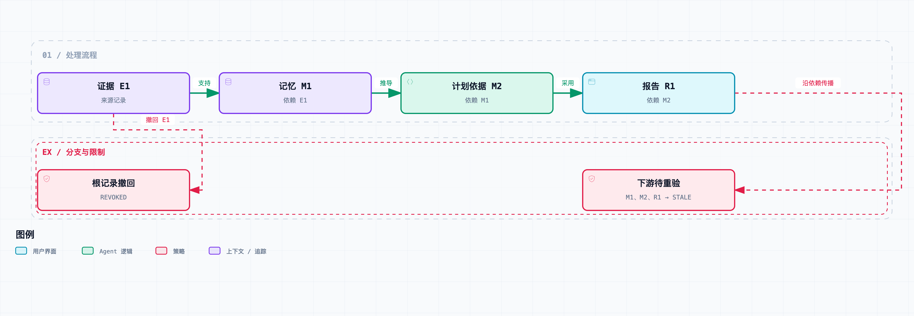

# Agent 系统工程 06｜错误记忆如何越用越真？设计可追溯、可撤销的记忆系统

先看一个熟悉的循环。调研 Agent 第一次看到某个接口，猜了一句“它应该支持安全重试”，这个猜测被写进了记忆。第二次执行时，它检索到“该接口支持重试”，当成了已确认的事实。第三次写报告，又引用了前一次的报告。

几轮下来，同一个没验证过的判断出现了一次又一次，看着越来越可信。但实际上，证据从头到尾只有一条——还是个猜测。

上一篇讨论的是一次长任务里怎么保留信息。这一篇往外走一步，讨论跨任务记忆：什么条件下才值得存，存错了以后怎么追踪受影响的结果。对一个会持续运行的系统，这和“把内容塞进向量数据库”是两码事。

## 将候选写入与批准使用分开

如果模型输出一段“值得记住的经验”，就直接写进下次默认使用的记忆区，那这个写入函数其实同时干了两件事：生成候选，和批准它成为事实。

我们把这两步拆开。新记录先进 `CANDIDATE`，意思只是“有人提出了这个信息”；通过应用规定的检查后才进 `ACCEPTED`，意思是“在标注的范围和有效期内，当前用途可以用它”。

`ACCEPTED` 也不等于永远为真。接口说明可能更新，用户偏好可能改变，事实本身可能只适用于某个版本。所以状态必须和来源、范围、时间放在一起解释。

LangGraph 的记忆文档区分了线程内的短期状态和可以跨线程读取的长期记忆，也用命名空间组织长期记录。它回答的是“存在哪、谁能读”；这一篇要补的是候选、批准、依赖与撤回规则。[文档](https://docs.langchain.com/oss/python/concepts/memory)

最小记录可以写成这样：

```text
id          这条记录的不可混淆身份
scope       项目或任务适用范围
claim_key   它在回答哪个具体问题
value       当前记录的主张
status      候选、可用、已撤回或待重验
expires     最晚有效时间
parents     它依赖的证据或上游记录
```

“事实”“用户偏好”“模型推断”最好还有不同的类型。举个例子：用户明确要求审稿后发布，这是用户约束；网页声称可以自动发布，这是外部内容；模型觉得自动发布更省事，这是建议。把三者检索出来揉成一句“默认自动发布”，权限和事实就一起乱了。

## 来源记录需要定位到内容版本

网页会变，链接也会失效。只存一个 URL，往往答不上来“当时到底读到了什么”。

对这个项目，证据要能定位到具体内容版本，比如抓取时间、内容哈希和快照引用。记忆的 `parents` 指向这份证据记录，而不是一句模糊的“据之前调研”。报告再引用记忆时，也保留这条依赖。

这样就能形成一张很小的图：

```text
证据 E1 → 记忆 M1 → 计划依据 M2 → 报告 R1

独立证据 E2
```

这张图不证明推理正确，它只记录“这个结果承认自己依赖了谁”。为什么这很重要？如果没有这层关系，删掉 E1 之后，M1 和 R1 还留在库里，下次照样被检索出来。错误还在，只是我们更难发现它是从哪来的了。

也要小心，依赖可能被漏记。模型用过一份资料却没写进引用，图就不完整。所以来源追踪要尽量结合运行时观察到的工具记录，不能只信模型自报。即便这样，模型内部的知识影响也没办法全部捕获。

## 撤回以后，下游应该变成什么状态



实线表示已登记的依赖。撤回 E1 后，下游被标为 STALE，需要重新验证，不代表它们已被判定为错误。

发现某条证据错了，最常见的处理是把它从数据库里删掉。但直接删记录，解释历史需要的依据也一起没了。

我们的做法是把根记录标成 `REVOKED`，沿依赖边往下找出所有受影响的记录，标成 `STALE`。`STALE` 的意思是“需要重新验证”，不是“已经被证明错了”。

比如一份报告同时依赖 E1 和 E2。撤回 E1 之后，E2 可能仍然足以支撑这份报告，也可能不够。程序光看图结构判断不了，得重新检查主张和剩余证据的关系。

所以这件事分两步走：先把带着失效依赖的内容从“当前知识”里停下来，再决定它能不能基于其他来源恢复使用。

`MemoryStore.revoke()` 的主要流程如下：

```python
affected = {revoked_id}
while True:
    next_set = affected | records_depending_on(affected)
    if next_set == affected:
        break
    affected = next_set

mark_root_revoked_and_descendants_stale(affected)
```

完整代码在 `lab/memory.py`。状态更新和撤回事件放在同一个本地事务里，避免出现“已标记失效、却没有对应记录”的情况。这个教学实现靠扫描记录表，适合小数据；规模大了要换反向索引和批量失效队列。

## 读取时检查范围、状态、期限与冲突

第一层查范围。项目 A 的接口结论不该自动进项目 B，更不能因为文本相似就跨过用户或租户边界。代码示例检查了 `scope`，但真实服务还要用已认证身份决定调用者能访问哪些范围——让客户端自己传一个范围字符串，构不成授权。

第二层查状态和期限。候选记录不能默认当证据，撤回记录不能因为相关性得分高就冒回来。当前实现还会递归查祖先：当前记录没过期，但它依赖的证据过期了，也一样不能继续用。

第三层查冲突。两条当前有效的记录对同一个 `claim_key` 给出相反值时，读取接口返回 `CONFLICT`，两条都保留。不默认选最后写入的那条，因为写得晚不代表依据更强。

当然，“哪两个自然语言句子其实在讨论同一个主张”本身就是难题。实验用明确的结构化键绕开了语义归并，没有实现自动判断“支持重试”和“重复请求没有副作用”是不是一回事。

如果用向量检索，这些资格检查要落在检索链路上：先限定有权访问的范围，再对候选结果查状态、期限和版本，最后把合格的交给模型。相似度只负责找得像，这些检查它替你做不了。

## 撤回传播与读取过滤实验

实验建了 E1、M1、M2、R1 四条关联记录，外加一条没有依赖关系的 E2。内容都是本地教学数据，批准动作由受信任的测试代码执行，没有用模型打分冒充人工审核。

实际运行结果如下：

| 检查 | 结果 |
| --- | --- |
| 刚写入、尚未批准的候选 | 读取为 `MISSING` |
| 用项目 B 的范围读取项目 A 的记忆 | `MISSING` |
| 撤回 E1 | E1、M1、M2、R1 全部进入受影响集合 |
| 继续读取 R1 | `MISSING` |
| 读取独立的 E2 | 仍然可用 |
| 在到期时间读取 E2 | `MISSING` |
| 同一问题存在相反的有效记录 | `CONFLICT` |

说明一下 `MISSING`：它表示没有可直接使用的记录，不代表历史上没这条记录。审计入口仍然能看到它的状态和撤回原因。

这一组测试验证的是记忆生命周期，没测长期对话准确率。实验也没有自动发现 E1 是错的——“E1 应撤回”是实验输入。发现错误要靠资料更新、规则检查或人的反馈，不能因为撤回功能好使，就反推系统有了可靠的事实判断能力。

## 已经交出去的报告，不能靠数据库改状态撤回

如果 R1 还没交付，把它标成待重验就行。但如果已经发给用户了，数据库里的一个 `STALE` 不会让对方手里的副本消失。

这时需要另外一套更正流程：确定影响范围，重新生成或标注报告，必要时通知接收方。通知和重新交付，仍然要遵守第三篇的操作身份和第四篇的权限约束。

也就是说，“交付曾经发生过”和“报告现在仍然有效”要分开记。前者是历史事实，后者会随证据更新而变化。要是直接把交付状态改回未完成，已经发生的外部效果就被抹掉了。

[本系列](https://juejin.cn/column/7686472562230231050)最后一篇的集成实验会保留这两个维度：交付状态保持 `DELIVERED`，有效性变成 `NEEDS_REVALIDATION`。它只是本地模拟，不会真的给接收方发更正消息。

## 按用途和有效期选择保留内容

记忆越多，检索成本、冲突概率和修正负担都可能变大。存之前想清楚三件事：这个信息以后干什么用，有效期多长，重新查询的成本高不高。

稳定的用户偏好、代价高的调研结果、重要的失败路径，通常比一整段临时措辞值得保留。高时效的服务状态更适合按需读取，不适合长期缓存成事实。

还要避免把每次成功都总结成普遍经验。某次请求成功，证明不了接口有幂等语义；某个模型一次回答正确，也证明不了那个提示词对所有任务有效。记忆条目要保留适用条件，别在总结时把条件删了。

在配套项目目录运行：

```bash
python3 run.py 06 --output results/06.json
```

撤回只能沿着已登记的依赖传播，漏记的依赖还得另外排查。而记忆失效之后，依赖它的计划也要重新检查——继续执行、重新规划还是求助用户？下一篇就来定这些触发条件。
