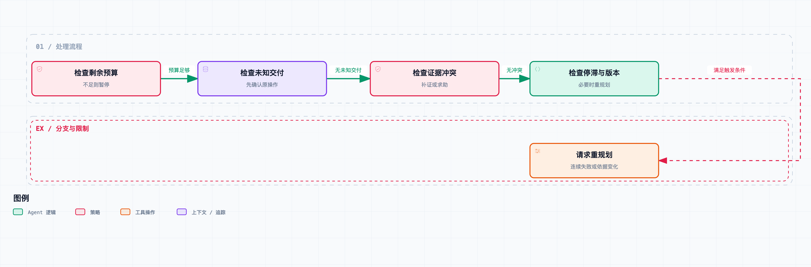

# Agent 系统工程 07｜计划赶不上变化：Agent 何时该继续、重规划或求助？

调研任务开始时，Agent 列了一个计划：查官方文档，比较两个方案，验证关键限制，最后交报告。

跑到第二步，主要资料源一直不可用。它换一个相近的关键词再查一次，把问题描述得更完整再查一次。日志越来越长，任务却一点没接近完成。

这时候就需要控制循环出场了：根据失败次数、交付状态和证据变化，决定是继续执行、重新规划、等待确认，还是干脆问用户要条件。

这一篇沿用前面几篇攒下的状态、证据和记忆记录，在规划器外面加一层可检查的控制规则。计划内容仍然可以由模型来产生，但什么时候必须重新审视计划，由运行时的规则说了算。

## 先把重试和重规划分开

重试是在同一个意图和策略下再试一次。短暂超时后继续查同一份资料，可能很合理。

重规划是原来的路径已经不合适了，重新选一条实现目标的路。资料源持续不可用，改查另一个独立来源，这就是换路径。但换路径不该顺手改用户要求，比如把“需要两份来源”悄悄降成“一份就够”。

求助又是另一种动作。两份资料对同一个限制给出冲突结论，系统判断不了用户关心哪个版本，继续搜索可能比问清楚还费时。这时候提出一个具体问题，比重新生成一份更长的计划有用。

第三篇里还有一种必须单独列的动作：对账。交付结果未知时，应该先查原操作。把“再发一次”写进新计划，绕不过原来的不确定性。

所以规划器最好从一个有限的控制集合开始：继续、对账、重新规划、求助、因预算暂停。每种动作有明确的触发依据，具体工具调用是下一步的事。

## 模型看到的状态，不等于环境的全部状态

一次搜索没有结果，可能是资料不存在，也可能是关键词不对、工具暂时失效或权限不够。模型观察到的是返回信息；至于原因是什么，那只是它的一种解释。

如果把“没找到”直接写成“这件事不存在”，后续规划就建立在错误前提上了。所以要分开记三样东西：原始观察、当前解释，以及解释的依据和不确定处。

ReAct 论文把推理和环境动作交替组织，让新观察参与后续计划调整。它是理解这个循环的研究起点，但没有替应用定义预算、审批和停止条件。这一篇的控制规则是为调研项目设计的，不是对论文算法的复现。[论文](https://arxiv.org/abs/2210.03629)

工程实现里，也没必要要求模型把私有思考过程全交出来。可观察的决策依据已经很有价值：用了哪个来源版本、哪个前置条件失效了、准备改哪条路径、预期拿到什么新信息。

## 用进展判断循环，不只看调用次数

连续调了五次工具，不一定是在兜圈子，可能每次都拿到了新证据；反过来只调了两次，也可能在重复一个已经确认无效的动作。

所以更合适的进展信号是任务相关的变化：新增了独立证据、冲突范围缩小了、完成了一个必要条件、确认了一次外部操作的结果。

对检索动作，可以记录规范化后的目标、参数类别、来源版本和结果类别，构成动作指纹。如果输入环境没变，相同指纹反复得到同样的失败，就值得触发停滞检查。

指纹的粒度要拿捏：过细会把同义改写当成新路径，过粗又会把有意义的查询差异合并掉。阈值也一样，一次失败就换路可能太敏感，十次失败才处理又浪费预算。这些都要结合真实轨迹调。

最小实验没有实现通用语义指纹，只记固定资料源的连续失败次数。我们清楚这个测试世界里来源 A 永久不可用、来源 B 可用，所以能检查控制条件有没有按预期生效。

## 把触发顺序写进代码



这张图表示控制条件的检查优先级。预算不足、结果未知或存在冲突时，会先处理对应条件。

`lab/planning.py` 中的 `next_control()` 用的是下面的优先级：

```text
预算不足                      → 暂停
存在结果未知的交付             → 对账
存在冲突证据                  → 补充证据或求助
重复失败且已重规划过           → 求助
重复失败达到阈值               → 重规划
计划依据的证据版本已经变化      → 重规划
其他情况                      → 继续
```

这些条件的优先级要按业务调。比如对账要不要单独留预算，看系统要求。当前实验把预算耗尽放在最前，所以不会在没资源时还继续对账；真实交付系统可以给只读对账单独留资源，免得普通检索把预算花光后，连状态都查不清。

证据版本变化也不一定非要整份计划重写。如果只是新增了一条和当前步骤无关的资料，继续原计划就行。完整实现应该记录计划依赖，只在相关依赖变化时触发检查。这一篇用单一版本号，是为了演示方便，代价是可能多做不必要的重新规划。

还要区分“提议重规划”和“接受新计划”。新计划照样要过任务范围、预算和工具权限的检查。模型不能因为“原方案做不到”，就自己扩大接收方、删掉验收条件，或者重启已经取消的任务。

## 在同一个受控环境里比较两条路径

实验给两组相同的预算：最多六次工具调用。固定计划始终访问来源 A；事件触发方案在连续失败两次后换到来源 B。

结果是：固定计划调满六次也没拿到资料；事件触发方案两次失败后换路，第三次调用拿到资料，记录了一次重规划。

| 方案 | 是否取得资料 | 工具调用数 | 重规划次数 |
| --- | --- | ---: | ---: |
| 固定访问来源 A | 否 | 6 | 0 |
| 连续失败后切换来源 | 是 | 3 | 1 |

比较范围要说清楚：切换到 B 的规则是预先写好的，没有调用模型规划，也没消耗真实的规划 token。所以这个结果只证明触发机制能终止这条已知的无效路径，证明不了真实模型总能发现备用来源，更不能据此说成本降了一半。

实验还检查了几条独立输入：结果未知的交付返回 `RECONCILE`；证据冲突返回补证或求助；重规划后再次停滞返回求助；预算耗尽返回暂停。

这些输入检查的是不同停止原因的路由，补上了“工具调用成功与失败”之外的控制分支。

## 什么时候值得再收集一条信息

选下一步动作时，要掂量三件事：这个动作可能带来多少新信息，对最终决定有多大影响，以及要花多少时间和资源。

如果两个候选方案都满足用户的全部要求，再花十次调用去确认一个不影响选择的细节，收益就很小。反过来，一个没查清的许可条件可能决定整个方案能不能用，优先补查就很划算。

每次调用的信息价值很难精确算，但可以要求规划器回答几个可观察的问题：这次要核实哪个主张？什么结果会改变当前计划？如果又没拿到新证据，下一步怎么办？

这些问题不要求模型给出貌似精确的概率。没有可靠校准时，“置信度 97%”当不了决策依据。把会改变决策的条件写清楚，反而更容易测试和复查。

停止条件也要对应任务目标。预算耗尽是资源停止，不是任务成功；发现要求互相矛盾是条件停止；用户取消是授权停止。不同原因保留不同状态，别在界面上统一显示“已完成”。

## 求助时，把问题问到用户能回答

“我遇到问题了，请提供更多信息”，这种求助基本推不动任务。更好的请求应该说出当前冲突、已经试过的路径，以及用户的哪个答案会改变下一步。

比如：“两份文档分别描述 v1 和 v2 的接口行为，本次报告针对哪个版本？”或者：“原提交结果仍未知，接口没有查询能力；需要先人工核对收件箱，再决定是否重发。”

恢复执行时，用户的回答要记成新的输入事件，更新相关条件和计划版本。不能聊天里说了句“明白了”，旧计划还拿着旧约束继续跑。

以后要验证真实模型的规划效果，可以固定任务、工具、模型和总预算，比较固定计划、每步重规划和事件触发重规划。除了完成质量，还要记无效动作数、求助次数、总成本和延迟。模型规划调用也必须计入预算，不能给复杂方案白送计算量。

配套代码没有跑这组模型比较。在配套项目目录运行下面的命令，得到的是前面的受控实验结果：

```bash
python3 run.py 07 --output results/07.json
```

当前实验只验证了固定条件下的控制规则。如果引入其他 Agent 来查证，还得检查它们拿到的是不是独立证据——第八篇就来看，来源重复会对协作判断造成什么影响。
