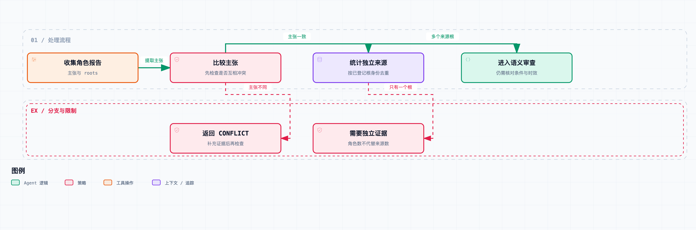

# Agent 系统工程 08｜多个 Agent 一致同意，为什么仍然可能一起错？

研究者查资料，写作者整理报告，审核者最后把关。三个角色都认为某个接口可以放心重试，于是报告通过了。

回头检查引用才发现：研究者读的是一篇转载，写作者引用了研究者的摘要，审核者又从报告里的链接打开了同一篇转载。看上去审了三遍，其实自始至终只有一个未经核查的信息源。

第六篇解决的是错误如何沿记忆传播，第七篇讨论计划怎么调整。这一篇接着看协作：多个 Agent 的报告到底有没有增加独立信息，以及怎么识别重复来源和冲突主张。

## 多数投票的效果依赖错误独立性

先用一个简化模型看看多数投票。假设三个判断者的出错概率都是 p，而且错误相互独立，那么多数投票出错就意味着至少两人出错：

```text
P(多数出错) = 3 × p² × (1-p) + p³
```

当 p 为 0.2 时，结果是 0.104。这是假设下的计算，不是三种模型的实测成绩。

关键在独立性。给同一个模型换三个角色名称，建立不起这个假设；换三个模型，也不保证它们没有共享的错误知识；三个网页转载自同一篇原稿，更算不上三个独立证据。

我们可以再构造一个带共同失败原因的模型：有 q 的概率，来源本身就有误导，三个判断者全部出错；除此之外，每个判断者还有独立的残余错误概率 r。

```text
单个判断者错误率 = q + (1-q) × r
多数投票错误率 = q + (1-q) × (3r²(1-r) + r³)
```

取 q=0.15、r=0.1，单个判断者的错误率是 0.235，多数投票是 0.1738。投票确实有改善，但共同失败的那部分，投票消不掉。

提醒一句：0.1738 和前面的 0.104 不能直接放在一起当系统比较，因为这两组里单个判断者的错误率不一样。这些计算只说明不同假设下的结果，选型用不上。真实的错误相关性要从任务和来源记录里观察，不能先假设独立，再用公式证明多 Agent 一定更好。

## 区分采样、职责、模型与证据差异

第一种是采样差异。同一个输入多跑几次，生成的文字可能不同，但引用的事实前提还是那几条。

第二种是职责差异。研究者关注资料覆盖，审核者关注证据支持。分工能改变关注点，但不保证审核者拿到新的事实。

第三种是模型差异。不同模型的能力和偏差可能不同，但如果都拿到同一份错误摘要，还是可能沿着同一个前提推理下去。

第四种是证据差异。另一个判断者重新访问独立的原始资料，核查版本、条件和反例。这是我们在调研任务里最希望增加的东西，但它也还要回答一个问题：两份资料是不是真的独立。

这几种差异可以组合使用，但互相替代不了。设计协作时，先说清楚指望哪种差异带来收益，再为它保留可检查的证据。

## 交接协议决定了别人能审核到什么



先检查主张是否冲突，再核对证据根是否独立。来源独立也不能替代内容审查。

如果研究者只交出一句“我认为方案 A 更好”，审核者就没有足够的材料做独立核查，最多评评措辞和逻辑顺不顺。

这个项目的交接记录至少要有：主张、证据编号、来源版本、关键摘录、适用条件和未解决的冲突。上层拿到的是一个可追溯的判断，而不是一个语气很肯定的答案。

还要区分资料的原始来源和传播位置。三个不同域名转载同一份内容，对应三个 URL，但信息根是同一个。这里用 `roots` 表示已经登记的原始证据身份。

自动识别转载关系很难，真实系统可能要靠内容相似度、引用链和人工核查。这一篇的实验直接给定根身份，不声称解决了网页来源溯源。

`lab/collaboration.py` 做了一个小检查：主张互相冲突时返回 `CONFLICT`；只有一个证据根时返回 `NEEDS_INDEPENDENT_EVIDENCE`；有多个根且主张一致，进入 `READY_FOR_SEMANTIC_REVIEW`。

注意最后这个状态仍然留着语义审查。两个独立来源也可能同时过时，或者讨论的根本是不同条件。数根的数量，只是避免把明显重复的来源当成多份证据。

## 相同来源下的协作实验

本地实验构造了研究者、写作者和审核者三个角色，它们都支持“重试总是安全”，而且都依赖 `root-A`。

只看投票，是三票赞成。但来源检查返回的是“需要独立证据”。随后加入一条引用 `root-B` 的记录，它指出“安全重试需要接口支持幂等”，结果变成冲突待处理。

| 输入 | 协作检查结果 |
| --- | --- |
| 三个角色，一份共同来源 | `NEEDS_INDEPENDENT_EVIDENCE` |
| 加入独立来源，主张相反 | `CONFLICT` |

这个实验没有启动三个在线模型，角色输出是固定数据；前面的概率也是解析计算。它验证的是来源登记与冲突路由，不是多 Agent 的任务成功率。

值得一提的是，独立查证不一定让系统更快达成一致，反而可能把原先一致的结论变成冲突。如果指标只奖励“最终达成一致”，系统就会学着忽略有价值的反对证据。

## 在相同总预算下比较协作方案

假设单 Agent 只允许查三次资料，多 Agent 有三个角色、每人查三次。后者表现更好，可能来自多出来的六次检索，也可能来自分工，不能都归给角色架构。

比较时要固定总预算，至少把实际模型输入输出量、工具调用、总费用和等待时间都报出来。并行执行可能缩短等待，但不一定减少总计算，交接和审核本身还要多花钱。

Anthropic 在多 Agent 调研系统的工程文章里，同时讨论了并行搜索的收益和额外资源消耗，也指出不是所有共享上下文多、依赖强的任务都适合这种结构。它的案例能帮我们提出比较问题，但替我们的项目下不了结论。[原文](https://www.anthropic.com/engineering/multi-agent-research-system)

对当前项目，可以设计三组：一个 Agent 在总预算内自行查证；多个角色共享研究摘要；多个角色按独立证据路径分工。三组用同一任务集和相同的最终评分标准。

除了答案正确性，还要统计来源重叠、冲突发现率、交接丢失条件的次数，以及审核者能不能拒绝一份措辞漂亮但依据不足的报告。这组真实模型比较还没跑，不能把方案写成实测结论。

## 协作失败，有时来自调度而不是推理

一个角色拿着版本 3 的报告开始审查，另一个角色已经把报告改到了版本 4。审核结果回来时只写了一句“通过”，主 Agent 很可能把它直接套到新版报告上。

第一篇的产物哈希在这里继续有用：审核意见应该绑定具体版本。审核过期后，可以重新检查变更部分，也可以重新完整审核，但旧的通过标记不能随意搬过来用。

另外，两个角色都被要求“查找关键限制”，可能重复搜索同一个问题。任务交接要注明范围、产物和预算，必要时登记已经认领的子问题。不然看着是并行，实际是在同时付两份重复的成本。

分工本身也有代价：拆得过细，交接就多；拆得过粗，角色之间容易重复。比较合适的边界，是能独立拿到证据、最后按明确接口合并的子问题。光增加角色名称，减不掉步骤之间的依赖。

## 什么时候应该保持单 Agent

如果任务很短、资料都放得进一个上下文、步骤之间高度依赖，加多个角色未必有足够收益。先让单个运行时把工具、状态和验收做可靠，还能帮你定位耗时和失败主要出在哪个环节。

如果任务能拆成互不依赖的资料路径、来源很多，或者确实需要独立核查，多个 Agent 才有更明确的机会。即便如此，也要保留单 Agent 基线，方便判断某次变化到底是能力提升，还是预算增加。

还有一种简单方案值得拿来比：只在遇到冲突、高风险主张或证据薄弱时才叫第二个审核者。它可能比全程三角色省资源，但触发条件自己也会漏判，要和完整审核方案一起评估。

在配套项目目录运行：

```bash
python3 run.py 08 --output results/08.json
```

要不要上多 Agent，得同时比任务质量、证据独立性和总开销。那这些机制做完之后，系统的可靠性到底怎么量化？第九篇就来定义完成率、重复执行稳定性、故障恢复和成本的评测方式。
