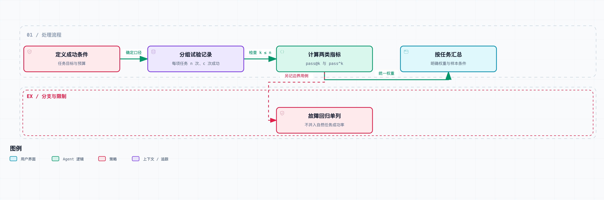

# Agent 系统工程 09｜Agent 的可靠性怎么测？成功率、恢复能力与成本

一个任务跑五次，只成功一次。开发者挑出成功的那条轨迹，觉得系统已经能用了；用户连试三次都没成，觉得它根本不可靠。

两边看到的现象可以同时成立，差别在于回答的问题不同：“有没有机会成功”和“每次交给它能不能完成”，本来就不是同一个指标。

前面八篇把状态恢复、重试、授权、上下文、记忆和协作都做了。这一篇来收个尾：这些机制的验收方法怎么整理，完成率、重复执行稳定性、故障恢复和成本怎么分开测。

## 先确定成功发生在什么地方

对我们的调研项目来说，模型说“完成”、报告结构检查通过、人工审查通过、外部交付成功，是四个不同的事件。

如果任务要求“交一份有充分来源支持的报告”，只检查文件存在会放过事实错误；如果任务要求“送到指定收件箱”，只检查生成了一份好报告，又会漏掉交付失败。

所以每个评测任务都要事先定好目标：哪些产物必须存在，哪些主张需要证据，哪些外部状态必须成立，允许花多少资源，什么情况下应当停止或求助。

τ-bench 通过比较交互结束后的数据库状态与目标状态来评价任务，并提出 pass^k 观察多次执行的一致性。这里借用它的评测问题和指标定义，论文任务本身没有复现。[论文](https://arxiv.org/abs/2406.12045)

还有一点第一篇就出现过：内部验收器不能当唯一裁判。错误结论只要格式合格，就能通过结构验收。评测要另外检查业务要求，不然优化来优化去，可能只是在提高内部检查器的通过率。

## pass@k 与 pass^k 衡量不同的结果

`pass@k` 关心的是 k 次尝试里至少成功一次。它适合允许生成多个候选、并且有办法挑出合格结果的场景。

`pass^k` 关心的是 k 次执行是不是全部成功。它更接近“多次把任务交给系统，表现稳不稳定”这个问题。

还要注意，拥有一个成功候选，不代表系统一定选得中它。如果用最终答案验证器在所有尝试里挑最好的结果，这个选择能力也属于系统，成本和误判都要计入。

在一个固定任务上，如果每次独立执行的成功概率都是 p，两个概率分别是：

```text
至少一次成功：1 - (1-p)^k
全部成功：p^k
```

这两个表达式依赖明确的重复试验条件。不同任务难度不同，不能先把全体任务平均成一个 p，再代入公式，假装所有任务难度一样。共享缓存、记忆污染和服务故障也可能破坏独立性。

Anthropic 的评测工程文章同样把任务、试验、评分器、轨迹和最终结果分开定义，并解释了这两个指标对应不同的产品需求。[原文](https://www.anthropic.com/engineering/demystifying-evals-for-ai-agents)

## 有限样本里，怎样实际计算



先按任务计算，再对任务取平均。这里的输入是教学数据，用来核对计算方式。

假设一个任务运行了 n 次，其中 c 次成功。从这 n 次记录里均匀选出 k 次，组合总数是 `C(n,k)`。

至少一次成功，用一减去全部失败的组合比例；全部成功，直接算成功记录能组成多少组：

```text
pass@k = 1 - C(n-c,k) / C(n,k)
pass^k = C(c,k) / C(n,k)
```

当可选的成功或失败记录少于 k 时，相应的组合数取零。计算要求 `1 ≤ k ≤ n`；样本数不够时应该返回缺失或明确报错，不能悄悄填零，也不能拿别的任务的试验来凑。

先说清楚：这两个公式描述的是已观察记录中不放回抽取的比例。要把它们解释成“未来重复执行的表现”，还得靠试验条件稳定和合适的统计假设，评测数据保证不了未来环境不变。

配套代码故意用了四个虚构的教学任务，每个跑五次，成功数分别是 5、4、2、0，不是模型调用结果。逐任务计算再等权平均，得到：

| 指标 | 计算结果 |
| --- | ---: |
| pass@1，也等于 pass^1 | 55% |
| pass@2 | 67.5% |
| pass^2 | 42.5% |

拿成功两次的那个任务算一遍：从五次里选两次共十种组合；两次全失败有三种，所以 pass@2 是 70%；两次全成功只有一种，所以 pass^2 是 10%。其他任务同样算，最后取平均。

这组数字只用来说明指标怎么算，可别写成“[本系列](https://juejin.cn/column/7686472562230231050) Agent 的成功率是 55%”——真实模型、真实任务分布和真实业务评分，这组教学数据里一个都没有。

## 任务平均和试验平均，也会给出不同答案

如果简单任务被跑了一百次，困难任务只跑了五次，把所有试验混在一起求成功率，简单任务的权重就被放大了。

逐任务计算再平均，默认每个任务权重相同；按真实业务频率加权，回答的是另一个问题。两种都合理，但权重要在比较前定好，不能看结果不顺眼就临时换权重。

重复执行也不等于扩大了任务覆盖。对同一个简单任务跑一千次，能更清楚地看它的波动，但说明不了系统能不能处理没出现过的困难类别。

报告里应该分别给出任务数量、每个任务的重复次数、任务类别和失败分布。需要置信区间时，还要说明重采样单位或统计模型——把同一任务下高度相关的试验都当独立样本，区间会显得过窄。

这一篇的四个教学任务只用来验证计算，没有据此估计实际系统的置信区间。真实验收门槛要根据错误代价和使用频率来定。

## 把故障恢复单独放进评测矩阵

正常环境下能完成任务，只说明正常路径可用。第二篇之后，我们还得检查故障发生时，系统会不会恢复到错误状态。

可以按故障类型和发生位置组织用例：事务提交前后退出、远程效果发生后丢回执、审批后修改产物、上下文压缩后遗漏限制、记忆撤回后读取旧结论。

每一类都有自己的验收条件。比如丢回执场景，既要查最终交付数，也要查客户端是不是还停在未知状态；撤回记忆，既要查相关下游失效没有，也要查无关信息是不是还正常可用。

这些刻意构造的边界用例，不要和自然任务混在一起，然后宣称某个统一百分比代表真实成功率。它们适合做回归集，保障指定机制没退步；任务能力测试则要覆盖实际用户会提出的问题。

同样，拒绝了越权动作不能直接算整项任务成功——权限保住了，目标没完成的情况是存在的。保护结果、任务结果和停止原因要分别记。

## 成本和延迟必须跟着结果一起出现

一种方案跑十次才碰到一个好结果，另一种跑一次就拿到稍差但合格的结果。只比较最终最优答案，代价就被藏起来了。

至少要记录输入输出 token、工具调用数、实际费用、端到端耗时，以及失败尝试消耗的资源。没有接入在线模型的本地实验，只能报本地测得的项目，不能估造 API 账单。

比较时可以固定每项任务的预算上限，再展示不同预算下的质量。有的协作方案在宽裕预算下有优势，时限一紧，可能交接还没完成资源就耗尽了。

“每次成功的成本”也要定义清楚。只统计成功那条轨迹的费用，会漏掉前面失败尝试的投入。可以报整个任务集的总成本除以成功任务数，同时保留每个任务的原始记录。没有成功任务时，指标应该标成不可用，不能当成零。

## 评分器也需要一套自己的回归集

格式规则可能误拒绝合法写法；模型评分器可能偏爱更长的回答；人工评分者之间对“资料充分”也可能有不同理解。

所以要准备已知合格和已知不合格的样本，检查误放行和误拒绝。对研究报告，至少把“来源是否存在”“来源是否支持主张”“覆盖是否足够”分开，分别记录各项检查结果和失败原因。

如果评分器就是生成报告的那个模型，还要额外检查共享前提和自我偏好。评分器换了版本之后，历史分数可能不再可比，版本要保留，必要的基线要重算。

环境也要重置。上次试验留下的文件、缓存答案、已批准记忆和外部提交记录，都可能改变下一次的难度。保留原始轨迹有助于查出这类污染，不能只存最后的分数。

在配套项目目录运行：

```bash
python3 run.py 09 --output results/09.json
```

评测记录要同时留住任务条件、评分器版本、执行轨迹和成本。那这些记录攒起来能干什么？最后一篇就用一个真实的缺陷案例，走一遍定位、修复和回归验证的全流程。
