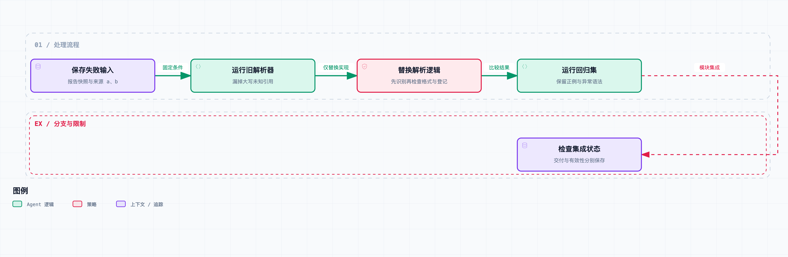

# Agent 系统工程 10｜一次长任务失败，如何定位原因并验证修复？

这一篇从[本系列](https://juejin.cn/column/7686472562230231050)代码里实际发现的一个问题讲起。

第一篇的报告检查器要求：引用必须对应已经读取的资料。原始实现用正则提取 `[E:a]` 这样的编号，再检查这些编号是不是都在来源登记表里。

复查时，我在一份本来合格的报告里加上了 `[E:UNKNOWN]`。这个来源不存在，但旧实现仍然放这份报告进了待审。原因很直接：正则只识别小写编号，大写的未知引用压根没进入后面的检查。

如果只看最终状态，系统运行顺利，连异常日志都没有。要找到问题，得回到输入、解析结果和验收规则之间的关系上。

这一篇就用这个缺陷当例子，讲清楚三件事：怎么保存失败输入，怎么定位检查器的错误，以及怎么验证修复真的覆盖了原问题。

## 先区分失败表现和失败原因

用户看到的是报告引用有问题。模型确实生成了一个无效引用，但这还没回答另一个问题：验收器为什么放行了它？

沿着执行链继续拆：报告字节有没有被改过，来源登记是不是缺了，解析器提取出了哪些编号，验收器实际检查了什么，状态是谁改成待审的。每个问题对应不同的修复位置。

这次的缺陷出在解析阶段。它把自己无法识别的引用形式直接忽略了，而应用却把“提取出来的编号都合法”理解成了“报告里的引用都合法”。前一个命题推不出后一个命题。

如果只是加强提示词，要求模型“请不要使用大写引用”，检查漏洞还是在那里。提示词能减少某种输入出现的机会；修复则要让检查器正确处理它承诺覆盖的输入，这是两回事。

所以定位时要保留两个层次：哪个上游动作产生了不合格内容，哪个控制机制没能按要求识别它。把所有问题统一归成“模型幻觉”，会错过很多本来能直接修好的程序缺陷。

## 日志需要回答关系，而不只是记录时间

一堆按时间排序的字符串，未必能重建任务。多个任务并发、重试跨进程、审核结果延迟返回时，只靠时间很容易把不同操作混在一起。

日志至少要能关联起：任务、具体动作、动作的父级、输入和输出版本，以及用的模型或验收器版本。外部交付还要带上第三篇的操作键；审核记录要带上第一篇的产物哈希。

OpenTelemetry 把一次操作表达为 span，再通过父子关系和上下文传播组织成 trace。本文借这种关联方式来理解执行链，配套实验输出的是简化 JSON，没有安装完整的 OpenTelemetry SDK。[文档](https://opentelemetry.io/docs/concepts/signals/traces/)

对引用问题，一段足够追踪的记录可以长这样：

```text
task-A / a1  读取证据 a、b
task-A / a2  写入报告，内容哈希为 H
task-A / a3  检查报告 H，验收器版本 original，错误列表为空
```

只有哈希还不够。要能找到对应的报告快照和证据内容，否则哈希只能说明“曾经有某份内容”，我们没法重现解析过程。

记录也不需要包含模型私有的完整思考过程。工具输入输出、可观察的动作提案、决策时引用的证据、版本和验证结果，已经能覆盖大量工程排障问题。

## 把外部变化冻结，才能比较修复前后



固定输入与预期结果，用同一用例比较修改前后的行为；外部系统变化需要另外验证。

发现问题以后，如果直接让整个 Agent 重跑一次，可能得到一份不含大写引用的新报告。测试通过了，但原缺陷修没修好，谁也说不准。

所以要先把最小失败输入保存下来：两个合法引用，加一个未知的大写引用；已登记来源固定为 a、b；验收规则固定。比较过程中只替换引用检查的实现。

旧实现是：

```python
ids = re.findall(r"\[E:([a-z0-9_-]+)\]", text)
```

它只提取符合格式的内容。修订版先找出全部引用标记，再分别检查闭合、编号格式和是否已登记。这样，格式不合法的标记会报错，而不是从检查视野里消失。

完整 Markdown 很复杂，代码块里的示例引用、转义字符和多种链接语法都可能需要更严格的解析。[本系列](https://juejin.cn/column/7686472562230231050)用的是明确限定的 `[E:id]` 教学协议，没有把一个正则扩充版说成通用 Markdown 验证器。

修复也不能只对 `UNKNOWN` 这个字符串硬编码。回归集加了大写未知编号、小写未知编号、没闭合的标记和空编号，同时保留正常引用通过的正例。

## 引用解析的回归结果

`lab/episode_10.py` 保留了旧版引用提取逻辑和修订逻辑，对同一份输入做离线比较。它复现的是第一篇原实现里已经确认的缺陷，没有调用在线模型。

| 输入 | 修订后是否通过引用检查 |
| --- | --- |
| 已登记的 a、b | 通过 |
| 未登记的小写编号 | 拒绝 |
| 未登记的大写编号 | 拒绝 |
| 未闭合的引用标记 | 拒绝 |
| 空引用编号 | 拒绝 |

同一份带 `[E:UNKNOWN]` 的报告，旧逻辑下错误列表是空的，新逻辑下报出编号格式错误和未登记来源错误。第一篇的完整运行时也加了相应测试，不是只在这里摆一个独立小函数。

复查时还发现了另一个问题：新运行时复用旧任务目录，可能接受上次留下的报告。第一篇的修订版要求新任务不能复用已有草稿的目录；第二篇再通过明确的任务身份，把创建和恢复分成两个入口。回头看，这两处修的其实是同一个问题——产物到底属于哪次任务——只是在不同阶段用了不同范围的实现。

两类修复都说明：测试应该围绕应用承诺建反例，而不是把程序当前会走的正常分支重复一遍。

## 离线重放和重新执行，能回答不同问题

这次离线重放固定了报告和来源，所以能清楚地检查解析器变化有没有挡住原输入。但它证明不了修复之后，真实模型的输出分布会怎么变。

要观察整个 Agent，应该在离线回归通过后，再跑一组真实任务，看完成率、误拒绝、调用次数和延迟。模型可能因为更严格的错误反馈进行多轮修正，也可能改不动，最后耗尽预算。

远程工具更不能随便重放。回看第三篇的提交轨迹，目的是解释已经发生的效果；如果排障工具把旧的提交请求再发一遍，就可能制造新的效果。安全的离线回放应该用保存的响应或模拟服务，真要重新执行时，再建明确的授权和操作身份。

就算固定了大部分输入，模型调用也不一定完全可重现。要保存实际使用的模型版本、采样参数和工具定义，靠重复试验观察差异。一次重跑成功只是一个观察点，不能自动证明原问题消失了。

## 状态、授权、交付与记忆的集成实验

配套的 `integration.py` 把[整个系列](https://juejin.cn/column/7686472562230231050)的模块串进一个本地流程：创建任务，登记证据与记忆，组织上下文，检查控制条件和协作来源，验收报告，再依据可信测试授权交给模拟服务。

交付时故意丢掉回执。客户端恢复以后查询原操作，确认只产生了一条交付记录。随后撤回一份证据，观察依赖它的报告怎么改变有效性。

实际执行记录有四次状态提交：

```text
1. 报告结构验收通过             REVIEW_READY
2. 已调用交付，但结果未知        DELIVERY_UNKNOWN
3. 查询到原操作回执             DELIVERED
4. 上游证据撤回                 DELIVERED + NEEDS_REVALIDATION
```

第四步刻意保留了 `DELIVERED`。报告确实已经交付，证据撤回抹不掉这个历史事实；变化的只是它现在还能不能被当作有效结论。

这组集成检查验证了三件事：交付记录只有一条、接受的报告字节保持不变、相关记忆被标记失效。资料、角色提案和批准动作都是本地测试数据，没有真实模型、网络检索或外部发布。所以它是机制集成验证，还不是一个经过真实任务评测的成品调研服务。

## 不要把最后一条报错直接当根因

刚才的解析器案例里，固定输入、替换函数、结果按预期变化，我们有比较明确的证据指向这个缺陷。

但一般的模型错误要复杂得多。报告写错，可能来自检索遗漏、上下文压缩、过期记忆、任务理解偏差，甚至评分器自己判断不当。一条轨迹里的先后关系，证明不了因果。

可以逐步做受控替换：固定检索结果，换上下文组装；固定上下文，比规划策略；固定报告，比验收器。每次只改一个主要因素，再看结果和代价怎么变。

还有些故障要多个因素凑齐才出现。单独换一个模块看不出变化，也不能断定它没有责任。这时候应该保留失败样本的完整条件，继续缩小范围，而不是为了写结论，硬给某个模块安一个没有依据的“责任百分比”。

## 排障记录的内容、权限与保留期限

把所有资料和工具参数永久记下来，查错是方便了，但存储、隐私和访问控制的问题也跟着来了。原始内容、脱敏内容和聚合指标可以用不同的保留策略。

凭证不该进普通日志；用户数据要按权限访问；必要的证据快照要能定位、也能删。只记哈希能减少内容暴露，但离线复现能力会下降，这个取舍要想明白。

运行日志也不是天然的防篡改审计。如果同一个执行者可以随便改写历史，日志就只是调试线索，当不了独立可信的证明。更严格的场景需要外部持久记录、访问隔离或签名机制，这些本项目都没有实现。

可以在配套项目目录运行：

```bash
python3 run.py 10 --output results/10.json
python3 integration.py
```

这些本地实验覆盖了状态恢复、交付对账、授权检查、记忆撤回和引用解析回归。接上真实模型和外部工具之后，模型反馈修正、网络故障、并发交付和真实任务完成质量都还要补测——现有结果替代不了这些。
