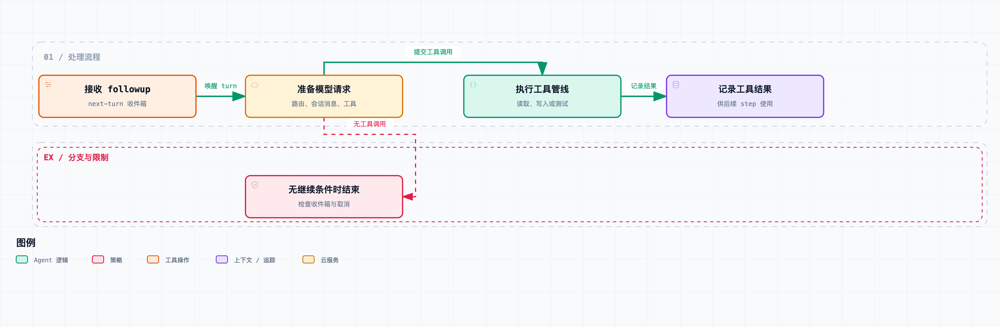

# 拆开 DeepSeek Harness 01｜“帮我修个 Bug”发出去后，跑了哪条路？

点下发送，看到 Agent 读文件、改代码、跑测试，我们很容易把中间这段概括成“模型调用了几个工具”。但真到调试的时候，光有这句话是不够的，还得知道每次调用之前和之后，运行时处于什么状态。

比如：文件已经改了，为什么界面还在转？模型说测试通过了，能直接当交付结果吗？点了停止之后工具又返回了，下一轮会不会把这次调用忘掉？要回答这些问题，就得把一句话拆成一次次明确的状态变化。

[《拆开 DeepSeek Harness》](https://juejin.cn/column/7686394441277259822)固定阅读 [DeepSeek Harness](https://github.com/deepseek-ai/deepseek-harness) `0.1.6-alpha.2`，提交 [ddefc45fbc7f8e46dd73185e68295696d1297887](https://github.com/deepseek-ai/deepseek-harness/commit/ddefc45fbc7f8e46dd73185e68295696d1297887)。第一篇先沿着一次任务从头走完，后面再分别拆装配、循环、日志、工具和生命周期。文中说的函数、行为和测试，都以这个版本为准。

先交代这次测试怎么做。准备一个临时文件，里面只有一行带 Bug 的代码：

```js
export const total = (price, count) => price + count;
```

独立 Node 进程执行断言 `total(12, 3) === 36`，修复前退出码为 1。随后让 Harness 跑一段固定轨迹：读取文件，应用乘法修复，启动 Node 再测一次，最后输出完成消息。

这里的模型适配器是仓库已有的 `MockAdapter`，四次回复由脚本预先给定；三个 `column_*` 工具也是为专栏测试注册的工具，修复内容已经写好。真实执行的是 Harness 的循环、工具管线、日志，以及文件读写和测试进程。所以这个测试用来看运行机制是合适的，但它证明不了模型能独立找到 Bug，也不代表产品内置编辑工具的全部行为。



测试从 Agent API 进入，模型回复由 MockAdapter 固定给出，读文件、写文件和测试进程实际执行。

用户输入进入循环时，先碰到的不是模型接口，而是 Agent 的收件箱。测试直接从 Agent API 调用 [followup()](https://github.com/deepseek-ai/deepseek-harness/blob/ddefc45fbc7f8e46dd73185e68295696d1297887/packages/core/agent-loop/src/agent.ts#L137-L153)；Web 按钮之前的通信链路不在本次测试范围内。`followup()` 把消息送入 `next-turn`，并请求唤醒驱动。注意，这个方法本身不会返回“这条消息的最终答案”。

这里要区分“接收”和“完成”：发送成功，只说明输入交给了运行时，任务离完成还远。多个输入可能共用一段 running 状态，中间还可能有追加指令、工具反馈和取消。生产集成如果只等一次 idle，再把最后一句话归给某条消息，遇到并发输入就可能认错结果。本次测试只有一个输入，明确独占整个运行区间，所以才用 [whenIdle()](https://github.com/deepseek-ai/deepseek-harness/blob/ddefc45fbc7f8e46dd73185e68295696d1297887/packages/core/agent-loop/src/agent.ts#L211) 等它收束。

驱动唤醒之后，[turn()](https://github.com/deepseek-ai/deepseek-harness/blob/ddefc45fbc7f8e46dd73185e68295696d1297887/packages/core/agent-loop/src/agent.ts#L270-L348) 先追加 `turn/start`。接着 [preStep()](https://github.com/deepseek-ai/deepseek-harness/blob/ddefc45fbc7f8e46dd73185e68295696d1297887/packages/core/agent-loop/src/agent.ts#L241) 从收件箱领取输入，组装系统提示和当前可见工具，再通过 `agent/pre-step` 扩展点决定这一小步是否进入。

可以把这一步理解为：先确定“这次准备让模型干什么、能用什么”，再决定要不要真的花掉一次模型请求。扩展可以在这里拦住任务；初始输入如果被移走，循环也可以结束一个没有模型请求的 turn。所以记录了任务开始，不代表一定请求了模型。

发请求前，[prepareRequest()](https://github.com/deepseek-ai/deepseek-harness/blob/ddefc45fbc7f8e46dd73185e68295696d1297887/packages/core/agent-loop/src/agent.ts#L502-L620) 负责准备路由。

它先通过 `agent/request` 拿到候选路由，再调用 `llm.prepareCall()`，确定本次的 provider、model 和适配器能力。系统提示和待提交的用户消息，要等这一步之后才进入模型可见的日志。这样安排是有讲究的：异步选路期间如果发生取消，运行时就不会提前写入一份“好像已经交给模型”的上下文。

设想模型路由需要等待一个服务，而用户这时撤销了任务。如果消息已经被当成已提交输入，恢复后就分不清消息到底是提交了，还是还在排队。Harness 用不同事件和提交位置来区分这些事实。

路由准备好，[buildRequest()](https://github.com/deepseek-ai/deepseek-harness/blob/ddefc45fbc7f8e46dd73185e68295696d1297887/packages/core/agent-loop/src/agent.ts#L554-L620) 记录请求头，里面包含有效模型配置和工具 schema；必要时还记录请求上下文。消息列表由 [session.deriveMessages()](https://github.com/deepseek-ai/deepseek-harness/blob/ddefc45fbc7f8e46dd73185e68295696d1297887/packages/core/session/src/index.ts#L841-L865) 从会话的模型可见视图导出，然后冻结交给适配器。

也就是说，请求消息是从会话记录里导出来的，不是发完请求再补记的。发出去的每一条请求，都要能从已经承认的会话事实里解释出来。这个约束第四篇会专门展开。

第一次脚本回复是一条 `column_read` 工具调用。流式生成期间，界面订阅的是 live stream；流收束后，运行时才提交 `assistant/message`。工具调用是这条 assistant 消息里的一个内容块——不是模型越过运行时，直接执行了 JavaScript 函数。

随后，循环交给 [executeToolCalls()](https://github.com/deepseek-ai/deepseek-harness/blob/ddefc45fbc7f8e46dd73185e68295696d1297887/packages/core/agent-loop/src/tool-calls.ts#L60)：记录调用，走工具执行管线，再把结果记成 `tool/result`。本测试的工具从临时文件里读到了那行加法代码，这个结果就成了下一次模型请求的输入。

把关键事件缩短之后，这次运行长这样：

```text
turn/start
  step/start → 请求 1 → assistant/message：读文件
    tool/call → 真实读取 → tool/result → step/end
  step/start → 请求 2 → assistant/message：改文件
    tool/call → 真实写入 → tool/result → step/end
  step/start → 请求 3 → assistant/message：跑测试
    tool/call → Node 断言 → tool/result → step/end
  step/start → 请求 4 → assistant/message：完成说明
    step/end
turn/end
```

这是删去提示、收件箱和请求配置事件后的示意，不是完整日志。完整运行记录保留在配套测试的 `task-trace.json`。

最终断言确认：1 个 turn、4 个 step、4 次模型请求、3 条工具调用、3 条工具结果；文件里的运算符已经变成乘号，修复后测试退出码为 0。任务轨迹和外部文件状态都查了一遍，没有只听最后那句“测试通过”。

工具调用后通常还需要再请求一次模型，因为模型提出操作时，还没读到操作结果。读到旧代码、写入成功、测试退出码，这些都是后来的新事实。默认情况下，循环要再给模型一次机会消化结果，直到它不再提出工具调用，而且运行时也没有新的下一步输入。

不过，“下一次”不是无条件发生的。取消可以打断它，工具也有明确结束 turn 的机制。这些分支第三篇会解释，先不要在脑子里把它写死成“每次工具后面必有一次模型请求”。

这条执行链里，除了模型请求，还有一堆状态管理：什么时候承认输入、给模型哪些工具、接住工具结果、维护记录、判断是否继续。模型负责生成本轮内容；至于这些内容怎么变成一个可执行、可解释的过程，是运行时的事。

这也改变了排查问题的顺序。模型没读到某条补充信息？先检查收件箱领取和请求快照。工具根本没执行？检查执行前的拦截和取消。界面显示过一句话，恢复后却不见了？检查流的最终落点。不要一上来就把所有故障都归为“模型不稳定”。

还有一个边界要留住：这次文件修改能被测试验证，不代表它和会话日志处在同一个数据库事务里。文件写入成功、后续日志保存失败，仍然可能同时发生——运行记录撤销不了已经完成的外部写入。第六篇讲停止、第九篇讲卸载，都会再碰到这个问题。

排查这个实现时，可以分别检查输入接收、请求定型、动作执行和完成判定这四个位置，再对照对应的会话事件。

源码与验证：

- [输入、turn 和 step 的实现](https://github.com/deepseek-ai/deepseek-harness/blob/ddefc45fbc7f8e46dd73185e68295696d1297887/packages/core/agent-loop/src/agent.ts#L137-L501)
- [请求准备与冻结](https://github.com/deepseek-ai/deepseek-harness/blob/ddefc45fbc7f8e46dd73185e68295696d1297887/packages/core/agent-loop/src/agent.ts#L502-L620)
- [上游工具往返测试](https://github.com/deepseek-ai/deepseek-harness/blob/ddefc45fbc7f8e46dd73185e68295696d1297887/packages/core/agent-loop/tests/loop.spec.ts#L475-L512)

配套的 [集成测试](https://github.com/j-tide/juejin-article/blob/main/02-%E6%8B%86%E5%BC%80%20DeepSeek%20Harness/code/column-evidence.spec.ts) 和 [完整执行轨迹](https://github.com/j-tide/juejin-article/blob/main/02-%E6%8B%86%E5%BC%80%20DeepSeek%20Harness/code/evidence/task-trace.json) 放在[本专栏](https://juejin.cn/column/7686394441277259822)配套的 [code 目录](https://github.com/j-tide/juejin-article/tree/main/02-%E6%8B%86%E5%BC%80%20DeepSeek%20Harness/code)（GitHub）。测试使用固定模型回复，没有调用真实模型。
