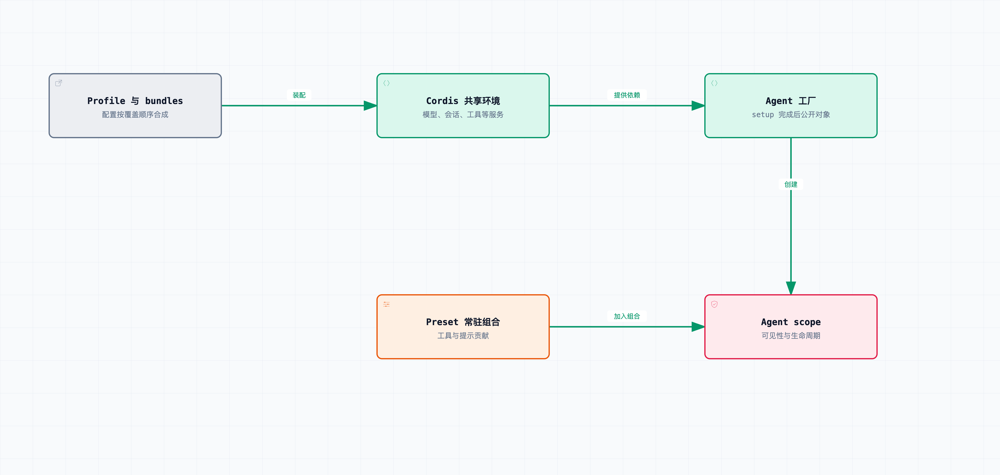

# 拆开 DeepSeek Harness 02｜连 Agent Loop 都是插件，谁把这些插件组装成 Agent？

上一篇用到的模型、工具、日志和 Agent Loop，其实都由插件提供。它们得先按依赖关系装配好，才能创建和运行 Agent。

启动包含两个过程：先搭一个能运行 Agent 的环境，再在里面创建具体的 Agent。配置装配和 Agent 创建各有各的入口与生命周期。

这一篇继续固定在 [DeepSeek Harness](https://github.com/deepseek-ai/deepseek-harness) `0.1.6-alpha.2`，提交 [ddefc45fbc7f8e46dd73185e68295696d1297887](https://github.com/deepseek-ai/deepseek-harness/commit/ddefc45fbc7f8e46dd73185e68295696d1297887)。这一版用 Cordis 负责插件组合和生命周期，DSH 的启动层负责找到配置、合成配置，再把组合交给它。

先从启动配置说起。一个 profile 不是几句给模型看的提示词，它有自己的目录、`package.json` 和 `cordis.patch.yml`。`package.json` 里的 [dsh.profile.bundles](https://github.com/deepseek-ai/deepseek-harness/blob/ddefc45fbc7f8e46dd73185e68295696d1297887/packages/boot/app-boot/src/profile.ts) 指明要按什么顺序组合哪些 bundle。

bundle 是声明了一份组合补丁的包。比如一个 bundle 提供基础运行环境，另一个提供 Web 入口。启动层先按顺序应用这些补丁，再应用 profile 自己的补丁，以及 home、启动参数这些后续覆盖层。

这里只描述常规层次。源码还处理遥测开关之类的启动约束，不能把最后一层机械理解成“任何事情都能随便覆盖”。真要排查配置，看的是启动后合成出来的条目，以及条目有没有成功激活。

这也是为什么“我明明改了那个 YAML，怎么没生效”不能只检查文件保存时间。可能改的是低优先级层，后面又被覆盖回去了；可能值改对了，但当前 profile 只在启动时加载；也可能配置保存了，插件却因为缺依赖或配置校验失败，没进入可用状态。

仓库提供 `dsh --profile web --dump-config` 来观察组合结果。它适合回答“最终配置是什么”，但回答不了“运行时真的活着吗”——配置树和运行对象是两层证据，都得看。

[AgentLoop](https://github.com/deepseek-ai/deepseek-harness/blob/ddefc45fbc7f8e46dd73185e68295696d1297887/packages/core/agent-loop/src/index.ts#L359-L453) 通过以下声明列出服务依赖：

```ts
static inject = [
  'agents', 'sessions', 'llm',
  'tools', 'systemPrompt', 'sessionProjections',
]
```

这些字段声明了实现所依赖的服务。Cordis 要在相应服务可用的环境里应用它，也要在依赖和所属插件变化时处理生命周期。

这里还有一组容易叫混的名字。`agents` 是 Agent 注册与工厂入口；`AgentLoop` 是一个具体的驱动实现。后者通过 [ctx.agents.setFactory(this)](https://github.com/deepseek-ai/deepseek-harness/blob/ddefc45fbc7f8e46dd73185e68295696d1297887/packages/core/agent-loop/src/index.ts#L421) 把自己接到前者上。这样调用方就只面向 `ctx.agents.create()` 工作，不必知道背后究竟是哪一种循环。

“循环也是插件”的价值就在这：替换循环时，不必要求每个上层调用方直接 import 你的新类。当然这也有成本——两边需要明确的创建、状态、处置契约，不然接口名保持一致，行为照样可能不兼容。



启动配置先装配共享环境，AgentFactory 再创建具体 Agent。工具和能力是否可见，还取决于作用域。

环境搭好之后，才轮到创建一只 Agent。第一篇的测试就是这么做的：先安装 LLM、Session、SystemPrompt、Tools、AgentRegistry、AgentLoop 等实现，再通过工厂创建一个句柄。

创建并不只是 new 一个循环对象。运行时还要准备 Session、创建 Agent scope、应用 setup、发布对象，以及安排所有权和失败清理。要是 setup 还没成功就把半成品放进全局列表，上层监听者可能马上给它发消息——而它的工具和提示还没装齐。

上游 [scope-lifecycle.spec.ts](https://github.com/deepseek-ai/deepseek-harness/blob/ddefc45fbc7f8e46dd73185e68295696d1297887/packages/core/agent-loop/tests/scope-lifecycle.spec.ts) 专门覆盖了这种窗口：异步 setup 没结束之前，对象不能提前公开；创建过程中取消或出错，要撤掉临时状态；调用方或工厂卸载时，还在创建中的对象也必须被收束。我们在这个固定提交上实际跑过这组 40 个测试。

所以替换实现时，创建前、异步创建中、创建后三种对象状态都要处理。

接下来再区分 profile 和 agent preset。profile 通常承载运行环境中共享的服务，例如模型路由、会话存储、沙箱和审批栈；preset 则为某个 Agent 的作用域贡献工具、persona 和提示段。

假设要做一个审查助手，有两类修改看起来都叫“加能力”，实际位置不同。

第一类是给这只助手加入审查提示，以及一个只对它可见的证据清单工具。这适合在 preset 层完成——另一只聊天 Agent 不应该因此突然多出一个工具。

第二类是更换所有 Session 使用的持久化服务。这影响的是共享环境，不该把服务提供者随手塞进一个普通 preset，就指望所有会话都正确感知。当前创造模式的说明也明确区分 Host 和 Agent preset 两个层面；确实需要由单个 Agent 独占的服务，可以走独立隔离域，但必须说明谁会消费它。

这里的 scope 首先是注册可见性和生命周期边界，不是操作系统沙箱。某个工具只对 A 可见，不等于工具实现只能访问 A 的文件；某个插件跟随 A 卸载，也不等于它启动的任意外部进程都会自动消失。后面这两件事，还要靠工具执行和资源所有权来配合。

我们实际运行的 preset 挂载测试，验证了两个会话可以拿到不同的工具和提示，而全局工具目录不会被污染。测试检查的就是装配后的工具和提示可见性。

但还有一层不能省：这一版会为 preset 建立常驻组合，Agent 通过 scope 关系加入它。相同 preset、相同代际可以复用插件实例，不是每创建一个会话就把所有插件重新执行一遍。需要隔离的会话数据，还是要按 Agent 或 Session 管理，不能随手放在共享插件实例的普通字段里。配置文件变化后，新会话可以加入新代际，已运行的会话保留原来那份；具体的释放代价，第九篇会用测试展开。

再看热更新。Web 组合可以配合 HMR 重读配置，而其他只在启动加载的组合，就不能想当然地认为实时生效。配置重载测试还覆盖了一个很实用的行为：遇到坏配置保留上一份可用树，下一次有效修改再继续应用。

这是个有意识的取舍。服务不中断了，但“磁盘上的配置”和“当前运行的配置”可能暂时不一致。如果管理页面只显示“文件保存成功”，用户会以为新能力已经可用了。所以源码里的保存结果、激活结果、重启要求，要分别读取。

当所有东西都能做成插件，依赖图本身也成了系统的一部分。一次调用由什么决定，不只看 import 关系，还受当前组合、scope、覆盖顺序和插件存活状态影响。调试时只顺着函数跳转，容易漏掉“这个实现根本没被装上”的情况。

排查时先确认最终配置、已激活的服务和请求作用域中的可见实现，再检查具体的工具函数。

这一篇复查了 profile 组合的 42 个测试、配置重载的 10 个测试，以及 preset 挂载的 53 个测试。它们是配置与运行时行为测试，没有用真实模型判断效果，说明的是被覆盖场景里装配边界符合断言；任意第三方插件是不是天然兼容，它们管不了。

装配完成后，循环还要根据工具结果、收件箱和取消信号决定是否继续。第三篇就来分析这些结束条件。

源码与验证：

- [profile、bundle 与补丁层](https://github.com/deepseek-ai/deepseek-harness/blob/ddefc45fbc7f8e46dd73185e68295696d1297887/packages/boot/app-boot/src/profile.ts)
- [AgentLoop 的服务依赖与工厂注册](https://github.com/deepseek-ai/deepseek-harness/blob/ddefc45fbc7f8e46dd73185e68295696d1297887/packages/core/agent-loop/src/index.ts#L359-L453)
- [创建、取消与卸载的生命周期测试](https://github.com/deepseek-ai/deepseek-harness/blob/ddefc45fbc7f8e46dd73185e68295696d1297887/packages/core/agent-loop/tests/scope-lifecycle.spec.ts)
- [preset 的实际挂载和隔离测试](https://github.com/deepseek-ai/deepseek-harness/blob/ddefc45fbc7f8e46dd73185e68295696d1297887/packages/preset/agent-presets/tests/mount.spec.ts)
