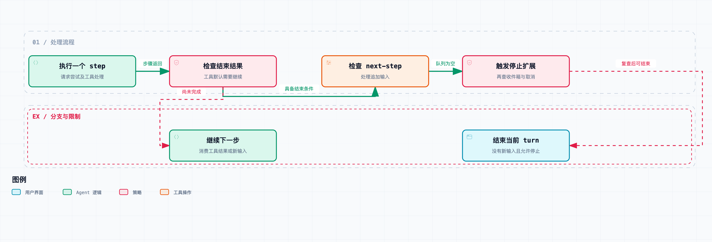

# 拆开 DeepSeek Harness 03｜模型已经回答完了，Agent 为什么还没结束？

你可能见过这样的界面：回答已经完整显示了，Agent 却还在运行；或者它明明说了句“完成了”，紧接着又发起一次模型请求。

先别急着认定它陷入死循环。模型输出结束和任务结束，本来就不是同一个判断。

这一篇继续读 [DeepSeek Harness](https://github.com/deepseek-ai/deepseek-harness) `0.1.6-alpha.2`，提交 [ddefc45fbc7f8e46dd73185e68295696d1297887](https://github.com/deepseek-ai/deepseek-harness/commit/ddefc45fbc7f8e46dd73185e68295696d1297887)。`agent.ts` 的 [turn()](https://github.com/deepseek-ai/deepseek-harness/blob/ddefc45fbc7f8e46dd73185e68295696d1297887/packages/core/agent-loop/src/agent.ts#L270-L348) 和 [step()](https://github.com/deepseek-ai/deepseek-harness/blob/ddefc45fbc7f8e46dd73185e68295696d1297887/packages/core/agent-loop/src/agent.ts#L353-L499) 分别处理运行周期与步骤，界面状态要对照这两个函数的返回条件来看。

先把三个单位摆好：

| 单位 | 在这里表示什么 |
| --- | --- |
| request / attempt | 一次模型调用尝试，可能成功，也可能失败后重试 |
| step | 一次已经进入的循环步骤，包含请求尝试及对应工具执行 |
| turn | 从 `turn/start` 到 `turn/end` 的一次运行周期，可以包含多个 step |

所以，一次请求返回，不代表这个 step 的动作都做完了；一个 step 结束，也不代表 turn 就能结束。另外，同一个 step 遇到允许恢复的请求错误，还可能重试模型调用。



工具结果通常进入下一步模型请求；工具主动结束、取消和异常会走其他分支。

先看最常见的工具路径。模型生成一条工具调用，流结束后，Harness 提交 assistant 消息，执行工具，记录结果。`step()` 返回的并不是普通的 completed，而是用 `null` 表示当前 turn 还需要继续——除非工具执行明确给出了结束信号。

通常，工具运行后还需要一次模型请求来处理结果。第一篇的读、改、测流程就是这样：三次工具请求之后还有一次最终说明，总共四次请求。

不过这只是默认路径，不是每次工具调用后的必然行为。源码里有工具主动 conclude turn 的分支，取消和异常也可以终止过程。实现调度器时，别照着口头解释写一个无条件的 `continue`。

再看没有工具调用的回复。假设模型直接给出一段完整文字，`step()` 确实可以返回 completed。但 `turn()` 还会检查收件箱：有没有属于下一步的输入？

这个检查是为了接住模型生成期间到达的新事实。比如文件监控插件发现依赖刚被改动，或者用户补充了一句“顺便考虑空数组”。这类输入如果应该影响当前任务，运行时就不能只凭模型刚才那句 finish 就结束整个 turn。

源码里有三个长相相近、语义不同的入口：

```text
followup(message) → next-turn，并唤醒
steer(message)    → next-step，并唤醒
inject(message)   → next-step，不主动唤醒
```

[followup()](https://github.com/deepseek-ai/deepseek-harness/blob/ddefc45fbc7f8e46dd73185e68295696d1297887/packages/core/agent-loop/src/agent.ts#L137-L153) 表达的是排到后续 turn 的输入；`steer()` 表达的是会影响接下来一步的输入。`inject()` 更适合插件补上下文：运行中可以被接续消费，空闲时先留下来，等下一次唤醒——而不是每次背景有变化，就替用户开启一个任务。

这三个入口还决定了输入要不要主动唤醒循环。如果文件观察器每次发现变化都唤醒模型，Agent 自己改文件又触发观察器，就可能多出一圈调用，甚至连续自激。选 inject 可以避免把每个观察事件都变成新的唤醒请求，但插件自己也要注意，别无限注入重复信息。

当 step 已经具备结束条件、且下一步收件箱为空时，循环还会发出一个串行扩展点：[agent/turn-stopping](https://github.com/deepseek-ai/deepseek-harness/blob/ddefc45fbc7f8e46dd73185e68295696d1297887/packages/core/agent-loop/src/agent.ts#L317)。

注意它不是“已经结束”的通知。它处在结束前的窗口，监听者仍然可以加入下一步输入。等监听完成后，循环会再检查一遍收件箱与取消信号，然后才决定是否退出。

仓库里有一个受控测试：模型脚本依次回答 `step 1`、`step 2`、`step 3`，三次回复都是纯文字，没有工具调用。监听者在 stopping 窗口检查已完成的步骤数，不足三步就 `steer('continue')`。

最终断言是同一个 turn 里跑出三步、发生三次请求。这个测试我们实际执行通过了。它证明的是运行时允许在结束前追加工作，不是模型自己忽然决定多想两轮。

这个扩展点也可能让循环停不下来。一个插件如果每次 stopping 都塞入新消息，那模型无论说多少次“完成”，turn 都不一定结束。这时候光改提示词、让模型“回答完就停止”，解决不了问题——真正的驱动条件不在这。

该检查的是：输入是谁追加的、什么时候追加、有没有终止条件，以及外层有没有预算和用户取消机制。扩展点提供的是“继续运行”的能力，继续条件和停止条件得由业务逻辑自己设置。

还有一种更隐蔽的“多跑一次”：模型请求失败后的重试。`step()` 内部本身还有一层尝试循环；[firstAttempt](https://github.com/deepseek-ai/deepseek-harness/blob/ddefc45fbc7f8e46dd73185e68295696d1297887/packages/core/agent-loop/src/agent.ts#L361) 让本 step 的用户消息只承认一次，不会每次重试都重复追加。

同一份步骤输入、同一次预处理，可能要经过多个调用尝试才拿到有效输出。所以算成本时数 request，看业务进展时数 step，看用户这一轮怎么收束时数 turn。把三个数字揉成一句“Agent 调用了 N 次”，最需要解释的信息就丢了。

日志也区分有效的 assistant 消息和未成功落到模型历史中的 attempt。重试失败的片段可以留作诊断材料，但不能随手当成“已经说给模型听”的历史。第四篇会接着拆这件事。

源码还记录了 `max-tokens`：这个结束事实在 turn 中是黏性的。一旦某个 step 达到上限，后面正常完成，也不能把整个 turn 的结果悄悄降回普通 completed。

最终回复完整，不代表之前的步骤没发生过截断，所以这个状态要保留。调用方得知道运行经历过什么，才能决定要不要向用户提示、要求补做或者记录诊断。这不是说凡是到达 token 上限的任务都失败了，而是不能把重要的运行事实藏掉。

从产品层面看，最好不要用一个“正在思考”的状态盖住所有阶段。模型正在生成、工具仍在执行、结束前扩展还没处理完，是三种不同的等待。用户看到完整文字后还在等，至少应该有机会知道系统在等什么。

不过，要展示这些状态，就得订阅运行时的事实，不能靠文字内容猜。回复里出现“已完成”不构成状态转换；出现“让我检查一下”，也不保证后面真的执行了工具。

这一篇相关的 `loop.spec.ts` 共 65 个测试、`inbox.spec.ts` 共 7 个测试，都在固定提交上通过。重点包括停止窗口追加下一步、空闲注入不启动 turn，以及工具执行中的注入顺序。它们用受控回复核对调度语义，不衡量真实模型的任务成功率。

turn 结不结束，取决于模型动作、工具结束信号、收件箱、结束前扩展和取消状态。排查持续运行时，这些条件要逐项检查；只改模型的结束措辞，改变不了运行时条件。

源码与验证：

- [三个输入入口及其目标队列](https://github.com/deepseek-ai/deepseek-harness/blob/ddefc45fbc7f8e46dd73185e68295696d1297887/packages/core/agent-loop/src/agent.ts#L137-L153)
- [turn 的结束检查](https://github.com/deepseek-ai/deepseek-harness/blob/ddefc45fbc7f8e46dd73185e68295696d1297887/packages/core/agent-loop/src/agent.ts#L270-L348)
- [step 内的请求尝试与工具分支](https://github.com/deepseek-ai/deepseek-harness/blob/ddefc45fbc7f8e46dd73185e68295696d1297887/packages/core/agent-loop/src/agent.ts#L353-L499)
- [停止窗口追加三步的测试](https://github.com/deepseek-ai/deepseek-harness/blob/ddefc45fbc7f8e46dd73185e68295696d1297887/packages/core/agent-loop/tests/loop.spec.ts#L1085-L1108)
