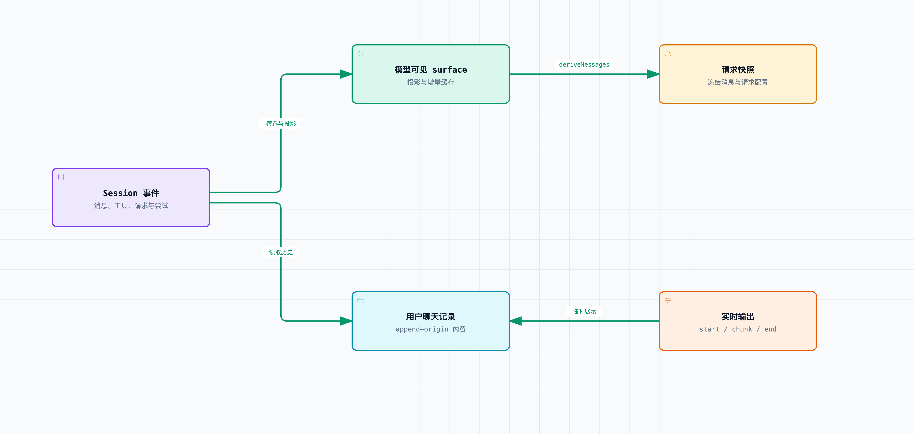

# 拆开 DeepSeek Harness 04｜模型看到的上下文，为什么要从日志里重新生成？

写一个能聊天的 Demo，最顺手的办法是维护一个 messages 数组：用户发一句就 push，模型回一句再 push，下次整包发出去。

只要没有中断、重试、压缩和恢复，这个办法很好理解。可一旦你要回答“上一次请求到底看到了什么”，情况就不一样了——界面显示的文字、内存里当前的消息、磁盘里的会话，可能已经是三份不同的东西。

[DeepSeek Harness](https://github.com/deepseek-ai/deepseek-harness) 在这个位置定了一条约束：循环发出的模型请求，要能从承认下来的会话事实中重建。这一篇基于 `0.1.6-alpha.2`，提交 [ddefc45fbc7f8e46dd73185e68295696d1297887](https://github.com/deepseek-ai/deepseek-harness/commit/ddefc45fbc7f8e46dd73185e68295696d1297887)。

先纠正标题可能带来的误解。“从日志里重新生成”，不是说每次调用都重新读一遍磁盘 JSONL，也不是从第一条事件开始重算全部历史。

事件记录、模型输入与界面内容是不同视图。模型输入可通过增量缓存推导，不要求每次全量读取磁盘。

核心 Session 持有事件和投影，持久化是另外装配的能力。[deriveMessages()](https://github.com/deepseek-ai/deepseek-harness/blob/ddefc45fbc7f8e46dd73185e68295696d1297887/packages/core/session/src/index.ts#L841-L865) 维护增量缓存：单纯在尾部增长，就只处理新增节点；如果模型可见内容发生替换或投影变化，再按新的 generation 重建。它每次返回一份新数组，数组里的消息对象则可以复用已经冻结的内容。

所以这条约束首先管的是数据来源，其次才涉及存储与计算策略。把“日志是事实来源”直接讲成“每次全量磁盘回放”，和这套实现的缓存机制对不上。

再看事件日志里有什么。除了用户和 assistant 消息，还有 turn、step 的边界、工具调用、工具结果、请求配置和失败尝试。这些对解释运行过程都有用，但不是每一条都应该发给模型。

比如 `tool/call` 是运行时记录的调用事实，模型历史里已经有对应 assistant 的工具调用块，再把它转成一条普通消息就可能重复。`assistant/attempt` 记录的是某次没成功形成有效消息的尝试，有助于排障，但也不能自动充当模型对话。

源码把这层筛选叫作 surface，可以理解成“当前模型可见的会话视图”。通常参与生成消息的类型是 `system/message`、`user/message`、`assistant/message` 和 `tool/result`，同时还要满足相应的 surface 标记与内容规则。

[deriveEventMessage()](https://github.com/deepseek-ai/deepseek-harness/blob/ddefc45fbc7f8e46dd73185e68295696d1297887/packages/core/session/src/surface.ts#L119) 负责把合适的事件投成消息；`deriveMessages()` 按 surface 的节点顺序收集它们。空内容的 assistant 消息即使为了保留 usage 而存在，也不会因此变成一个没有内容的模型对话轮次。

接下来是这篇文章的核心矛盾：日志要把发生过的事留住，模型上下文却经常需要调整。

假设工具读出了一份很长的文件，几轮之后不再需要全部原文，只要摘要或处理过的部分。直接修改旧消息，历史事实就被覆盖了；永远不许改模型上下文，长任务又会不断膨胀。

当前实现的做法是：通过日志中的 surface 操作与消息投影，改变后续模型看见的内容，同时保留原始事件。哪些消息在可见列表里，和这些消息当前怎么呈现，是两个相关但不同的问题。

读消息投影代码时，有个约束值得留意：投影要保留消息身份，基于先前历史给出不可变的新内容，不能就地修改输入。这样同一条历史事实仍然能被追踪，而“修改”是一个可解释的新决定。

用户聊天记录也不能直接用当前模型 surface。上下文替换可能把早期对话从模型视图里遮掉，但用户是看过那些内容的。所以源码另外区分 append-origin 事件与 replacement：原来追加进去的事件，是人类聊天记录的持久来源之一；模型专用的替换副本，冒充不了用户真的看到过的一轮聊天。

还有第三种东西：实时流。

模型正在输出时，浏览器需要立刻显示字符。Harness 通过 `agent/assistant-stream` 发送 start、chunk、end 等 live 事件。这个临时显示的过程，不等于每个 token 都已经被保存成独立的会话事件。

流正常收束后，精确的流记录会随 `assistant/message` 一起落入事件；失败或重试的尝试可以记为 `assistant/attempt`。如果进程在最终收束前硬退出，当前尝试的实时片段仍可能丢失。可恢复的会话系统，不等于任何时刻断电都零损失。

取消又稍微特别一些：已经形成的文字前缀可以被收束成 interrupted assistant 消息，而半截工具参数不能随手当成合法工具调用。这些取消窗口，第六篇会专门看。

模型请求除了 messages，还有工具 schema、provider、model、推理配置等。只记录聊天文字，还是回答不了“那次模型为什么能调用这个工具”。所以 [buildRequest()](https://github.com/deepseek-ai/deepseek-harness/blob/ddefc45fbc7f8e46dd73185e68295696d1297887/packages/core/agent-loop/src/agent.ts#L554-L620) 还维护 `request/header`，在初始请求、配置变化或请求序列变化时留下相应记录。

请求上下文里的适配器能力也会记录。比如系统提示更新采用什么方式，取决于实际绑定的路由。要是先用 A 的能力拼上下文，最后换成 B 发送，事后就算日志完整，也很难解释这个请求为什么长这样。

这也是第一篇强调 prepareCall 顺序的原因：先知道本次用谁，再承认与它对应的模型可见输入。

最后还有冻结。`buildRequest()` 冻结请求头与消息快照，避免某个插件在模型请求发出后，还通过共享对象改掉它的“历史输入”。不然回放时看到的，可能是请求发送之后才发生的修改。

当然，冻结范围要排除仍会变化的对象——取消信号就必须继续变化。[request-freeze.spec.ts](https://github.com/deepseek-ai/deepseek-harness/blob/ddefc45fbc7f8e46dd73185e68295696d1297887/packages/core/agent-loop/tests/request-freeze.spec.ts) 就专门验证了消息嵌套结构不可变，而 live signal 仍能观察发送后的取消。

一句话总结：请求快照保持不变，取消信号继续传递，两者用的是不同的更新规则。

本次实际通过了消息投影 5 个测试、Session fork 14 个测试、请求头 10 个测试和请求冻结 5 个测试。第一篇附带的测试也保留了完整事件和四次请求的角色序列，可以对照工具结果怎么进入后续模型输入。

也要说清楚：能重建输入，不代表再次调用会得到相同输出。模型服务、采样、外部工具和环境都可能变化。日志回放证明的是“当时给了什么、记录了什么”；真实重跑是另一件事。测试里用了录制回复或固定适配器，也应该明确说出来。

实现恢复功能时，还要检查插件里的临时上下文有没有可重建的来源。只存在于临时内存里的信息，进程退出就丢了；恢复之后的模型请求，也可能因此和原任务状态对不上。

源码与验证：

- [surface 与事件到消息的转换](https://github.com/deepseek-ai/deepseek-harness/blob/ddefc45fbc7f8e46dd73185e68295696d1297887/packages/core/session/src/surface.ts#L1-L162)
- [deriveMessages 的缓存与不可变快照](https://github.com/deepseek-ai/deepseek-harness/blob/ddefc45fbc7f8e46dd73185e68295696d1297887/packages/core/session/src/index.ts#L830-L865)
- [请求头、请求上下文和冻结边界](https://github.com/deepseek-ai/deepseek-harness/blob/ddefc45fbc7f8e46dd73185e68295696d1297887/packages/core/agent-loop/src/agent.ts#L554-L620)
- [消息投影测试](https://github.com/deepseek-ai/deepseek-harness/blob/ddefc45fbc7f8e46dd73185e68295696d1297887/packages/core/session/tests/message-projections.spec.ts)
