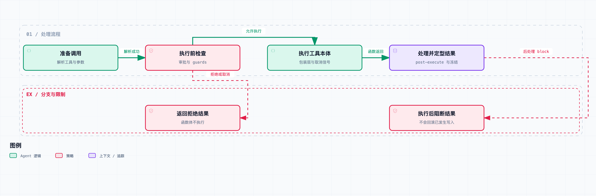

# 拆开 DeepSeek Harness 05｜模型想调用工具，为什么不是直接执行？

很多工具调用的示例，核心只有一行：找到函数，把模型生成的参数传进去。

可一旦让 Agent 操作文件、命令和外部服务，事情就多了：要检查工具可见性、参数和审批，要处理取消，还要确定结果怎么序列化、怎么提交。

[DeepSeek Harness](https://github.com/deepseek-ai/deepseek-harness) 把这些事放进了工具执行管线。这一篇固定到 `0.1.6-alpha.2`，提交 [ddefc45fbc7f8e46dd73185e68295696d1297887](https://github.com/deepseek-ai/deepseek-harness/commit/ddefc45fbc7f8e46dd73185e68295696d1297887)，重点看 `core/tools`，不把某个具体工具的实现当成整个系统的保证。



图中合并了部分管线阶段。输入失败、审批拒绝或取消可以提前结束，不会无条件执行到工具本体。

先沿正常路径走一遍。循环拿到 assistant 消息中的工具调用，记录 `tool/call`，交给注册表。注册表解析工具定义与输入，经过执行前检查、审批和守卫，再进入实际的 execute；返回后还有后处理和最终定型，最后形成会话中的 `tool/result`。

画成一条缩短的路径是这样：

```text
工具调用记录
  → 查找与输入准备
  → pre-execute / 审批 / guards
  → execute 包装层与工具本体
  → post-execute
  → finalizeContent / 最终结果通知
  → 工具结果记录
```

不要把这张图理解成“每个失败都会经过所有阶段”。输入准备失败、执行前取消、守卫拒绝、工具本体异常，走的是不同分支。源码会把可处理的管线失败规范成工具错误结果；被拒绝的调用，根本不会进函数体。

第一道边界是“这个调用是否存在于当前能力视图里”。全局注册过工具，不代表每只 Agent 都能用它。scope、restriction 和 PTC 展示模式都会影响可见与可调度的能力。

尤其要区分工具 schema 和执行入口。schema 告诉模型有哪些操作、参数长什么样；真正执行时，还要重新按调用环境解析一遍。不然模型拿着旧 schema，或者猜一个未授权的名字，就可能绕过当前视图。

第二道边界是 [tools/pre-execute](https://github.com/deepseek-ai/deepseek-harness/blob/ddefc45fbc7f8e46dd73185e68295696d1297887/packages/core/tools/src/index.ts#L146)。它是一个 waterfall：处理者可以继续委托，也可以给出 allow、deny、ask 等决策。注意 ask 不是弹一个对话框就算完，运行时需要一个真正可用的审批通道，并等它返回决定。

如果没有审批服务，或者服务在、但没人能回答，默认退化为拒绝。这个行为很实际：无头任务不能因为没人点按钮，就把“需要询问”悄悄变成允许。

接着是 [guards](https://github.com/deepseek-ai/deepseek-harness/blob/ddefc45fbc7f8e46dd73185e68295696d1297887/packages/core/tools/src/index.ts#L706)。这里的设计强调单调性：守卫只能拒绝或不表态，后面一个普通的“允许”不能把已有守卫的限制反向放开。执行身份也有保护——不能本来检查的是 A，最后借包装层执行了 B。

这两种扩展别混用。waterfall 适合有顺序的处理与委托；guard 适合独立的、不能被后续普通允许覆盖的限制。读权限代码时，先弄清限制挂在哪一层，才能判断别人有没有机会绕过去。

前面这些检查都通过，才轮到 [tools/execute](https://github.com/deepseek-ai/deepseek-harness/blob/ddefc45fbc7f8e46dd73185e68295696d1297887/packages/core/tools/src/index.ts#L157) 的包装层与工具本体。计时、指标、超时和某些重试可以围绕 dispatch 组织，但外部操作能不能重试，还是工具自己的业务语义。

比如上传已经成功、响应在路上丢了，简单再跑一遍就可能重复创建。把重试做成统一中间件，只能统一触发方式，变不出幂等性。调用 ID 用于关联执行，也不会自动成为外部服务认可的幂等键。

工具本体返回以后，管线还没走完。[post-execute](https://github.com/deepseek-ai/deepseek-harness/blob/ddefc45fbc7f8e46dd73185e68295696d1297887/packages/core/tools/src/index.ts#L169) 可以保留结果、替换允许的呈现、阻断结果，或追加后续上下文。后处理也可能看见执行前被拒绝的结果，用来给模型补充解释。

这里最容易说错的是“阻断”。执行后的 block 改变的是最终交给调用方的结果；已经发生的文件写入或网络请求，不会因此回滚。所以审查返回内容和阻止动作发生，必须在不同的时间点做。

同样，如果工具返回了一份结构值，后处理不能随手同时给出互相冲突的 value 和 content。当前实现会明确检查这种替换，还拒绝有损或不符合 schema 的结果。模型看见的是文本或内容块，程序侧使用的可能是结构值，两边要有一致的来源和呈现规则。

随后是工具定义自己的 [finalizeContent](https://github.com/deepseek-ai/deepseek-harness/blob/ddefc45fbc7f8e46dd73185e68295696d1297887/packages/core/tools/src/index.ts#L241)。它只负责最终内容变换，不能把整个结果身份与错误状态任意改写。之后结果被定型、冻结，再通过 [tools/result](https://github.com/deepseek-ai/deepseek-harness/blob/ddefc45fbc7f8e46dd73185e68295696d1297887/packages/core/tools/src/index.ts#L191) 通知观察者，作为这次执行的权威结果。

注意两个相似的名字：`tools/result` 是运行时事件，`tool/result` 是 Session 日志里的记录。前者用来观察已定型的执行结局，后者进入可重建的会话。监听点挂错了，就可能拿到还没稳定的中间结果。

工具产生的额外上下文也有固定的插入顺序。当前循环会在一批工具结果记录完成后，再按队列顺序补入上下文，避免在工具调用和结果之间塞进一条不合时宜的用户消息。排查上下文异常时，要检查工具调用和结果的对应关系，以及排列顺序。

本次执行的 `tools.spec.ts` 有 137 个测试，其中包括：没有审批接收方时拒绝；执行前检查等待期间收到取消，工具本体调用次数仍为 0；执行后 block 转成明确错误结果。另有 scoped 工具的 27 个测试核对隔离行为。

这些测试能证实对应的管线行为，但证明不了任意第三方工具安全。一个工具完全可以在 execute 里自己发网络请求，绕开业务预期；一个插件如果拿到更高权限的宿主 API，光靠模型 schema 也限制不住它。

所以还要把三个层次分清楚：工具可见性决定模型通常能提出什么，审批与守卫决定运行时准不准这次调用，操作系统沙箱约束进程最终能碰到什么。三层互相配合，缺一层都不行。

举个例子，内置文件工具的读前写保护，只属于那条特定的文件操作路径。通过 Bash 或 Node 直接写文件，不会因为“也算一个工具调用”就自动经过同一套文件编辑检查。要约束后者，得检查它的执行环境、沙箱，以及那个工具自己的实现。

实现工具时要写清楚：拒绝发生在哪个阶段、异常时已经有哪些副作用、最终结果怎么记录、恢复规则是什么。执行后的结果阻断撤销不了写入，这类操作还得靠业务侧的幂等或补偿协议。

源码与验证：

- [工具执行管线说明](https://github.com/deepseek-ai/deepseek-harness/blob/ddefc45fbc7f8e46dd73185e68295696d1297887/docs/tool-execution-pipeline.md)
- [执行准备、取消与实际 dispatch](https://github.com/deepseek-ai/deepseek-harness/blob/ddefc45fbc7f8e46dd73185e68295696d1297887/packages/core/tools/src/index.ts#L1461-L1560)
- [结果最终定型](https://github.com/deepseek-ai/deepseek-harness/blob/ddefc45fbc7f8e46dd73185e68295696d1297887/packages/core/tools/src/index.ts#L1611-L1678)
- [权限、审批与取消测试](https://github.com/deepseek-ai/deepseek-harness/blob/ddefc45fbc7f8e46dd73185e68295696d1297887/packages/core/tools/tests/tools.spec.ts)
