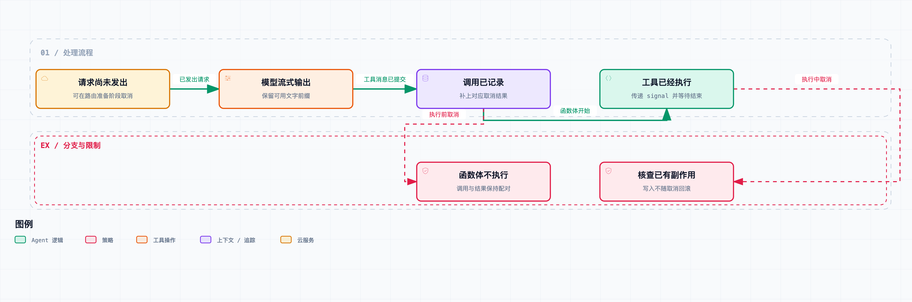

# 拆开 DeepSeek Harness 06｜点下“停止”以后，哪些事已经来不及撤回？

用户按下停止后，模型可以停止生成，工具可以接到取消信号。但已经写入的文件和已发出的请求不会自动撤销，后续恢复也不一定从原来的步骤继续。

这一篇继续固定到 [DeepSeek Harness](https://github.com/deepseek-ai/deepseek-harness) `0.1.6-alpha.2`，提交 [ddefc45fbc7f8e46dd73185e68295696d1297887](https://github.com/deepseek-ai/deepseek-harness/commit/ddefc45fbc7f8e46dd73185e68295696d1297887)，主要看运行时取消的语义——可别把按钮动画消失当成执行已经停止。

Agent 的 [cancel()](https://github.com/deepseek-ai/deepseek-harness/blob/ddefc45fbc7f8e46dd73185e68295696d1297887/packages/core/agent-loop/src/agent.ts#L149-L153) 很短。默认先清空收件箱，清理当前运行阶段的唤醒标记，然后对活动阶段的 AbortController 发出取消。如果设置 `keepInbox`，则保留仍在排队的输入。

取消能保证什么，取决于它到达的时间。取消发生在模型选路前、流式输出中、工具审批中，还是工具已经产生副作用之后，最终能保证的事情完全不同。



横向顺序表示取消可能到达的几个时间窗口，不表示取消后仍会依次执行所有阶段。已经产生的外部副作用不会自动撤销。

先看最早的窗口。循环已经打开 turn，但还没真正发起模型请求。异步准备路由期间会检查 signal，检查之后才承认对应的系统提示和用户输入。取消可以让这一轮没有实际请求，或者没进入任何 step，但已经打开的 turn，还是要以一致的边界收束。

这也是为什么不能只看“有没有 assistant 回复”来判断任务是否存在——日志里可能有一次被取消的 turn，只是没花到模型请求。

第二个窗口是流式生成。模型已经输出了一部分文字，用户按了停止。当前实现会把可保留的 interrupted 内容收束到会话里：已完成的文字或推理前缀保留，半截的工具调用不能直接拿去执行。

假设工具参数停在下面这样：

```text
{"path":"src/a.ts","content":"export const
```

它既不是有效的完整输入，也代表不了模型最终想做的操作。留下这次尝试当诊断材料，和把这个残缺调用执行掉，是两回事。

上游测试明确覆盖了“保留前面的完整文字，丢弃半截工具调用”，也覆盖了没有任何可见内容时不凭空提交 assistant 消息。错误重试又有自己的记录分支：失败的 attempt 可以留下，但不能和最终成功的回复拼成一条模型消息。

第三个窗口是 assistant 的完整工具调用刚刚提交、工具本体还没执行。这时取消要保留调用记录：模型历史里已经承认它提出过一个调用，后面的会话要有对应结果，才解释得清这次动作到底发生了什么。当前循环会补上一个匹配的工具结果，内容表示执行前已取消，函数体调用次数为 0。

[cancel.spec.ts](https://github.com/deepseek-ai/deepseek-harness/blob/ddefc45fbc7f8e46dd73185e68295696d1297887/packages/core/agent-loop/tests/cancel.spec.ts#L407-L460) 里有个测试，就在 `assistant/message` 观察者里立刻取消。断言同时检查两件事：危险工具没有执行；日志中的调用 ID 与错误结果对应。之后再发起一轮新任务，恢复出来的模型历史，仍然能看到这个明确的取消结果。

这比“收到取消就 return”多做了些工作，换来的是不留悬空调用。日志要完整，动作要停得及时，两头都得照顾。

第四个窗口是审批或 pre-execute 还在等待。即使用户后来批准了原操作，调用也可能已经被取消。注册表会在关键边界重新检查原始调用方的 signal，防止一份过期的批准，让一个本该终止的工具突然启动。

所以审批通过后还要再查一次调用状态。批准、调用仍然有效、执行环境仍然存在，这三件事必须在进入实际动作时同时成立。

第五个窗口是工具本体已经开始执行。

[注册表会把原始调用方的取消信号和 execute 包装层提供的信号合并](https://github.com/deepseek-ai/deepseek-harness/blob/ddefc45fbc7f8e46dd73185e68295696d1297887/packages/core/tools/src/index.ts#L1526-L1570)，工具通过这个 signal 感知中断。源码还明确强调，不会仅因为取消就遗弃一个已经启动的 Promise：要等它真正收束，再确定最终取消结果。

这带来一个重要代价。如果工具不理取消，或者它在等一个没有超时的外部调用，停止就可能不会立刻完成。框架能传递信号、管理自己拥有的资源，但没办法安全地强杀同一进程里一段不合作的异步逻辑。

独立进程的工具可以由进程管理层终止相应范围，但那又涉及具体平台、后端和子进程观测能力。不能从 `AbortController.abort()` 一行代码，推出“所有后代进程必然立刻消失”。

还要记住：等工具结束，不等于撤销已有副作用。

```text
写入文件成功
  → 收到取消
  → 工具最终返回取消结果
```

这三件事可以同时为真。最终结果表示本次调用没有正常完成，不代表文件还是旧内容。网络请求也一样：客户端这边等待被取消了，服务端那边可能早就完成了动作。

如果业务需要撤销，就得另有补偿或事务协议，并确认它成功了没有。取消 API 不会替工具生成一份反向操作。特别提醒：看到 ABORTED 之后，别自动把同一个非幂等动作再执行一遍，先确认外部状态。

`keepInbox` 也值得单独说说。它保留的是还在队列中的输入，不会把已经被本轮领取的消息恢复成“从未开始”。取消后这些排队消息先停放，等以后一次有效唤醒再消费；新输入恰好落在 abort 到 idle 的窗口里时，还要靠唤醒锁存逻辑避免丢掉。

所以“停止但保留后续任务”和“把刚才那一步退回队列”并不是一回事。做自动化系统时，最好把待执行、已领取、已承认输入、已完成动作分开记录，别用一个 pending 标记包办。

这一篇实际运行了上游取消文件的 39 个测试；工具测试还核对了执行前取消与审批的竞争。它们用受控的流和工具，能重复触发短暂的竞争窗口。付费接口、真实发布、外部撤销这些场景没有实测，这里只是说明取消语义的边界。

产品上，停止的反馈至少应该分三层：取消请求已经发出、活动执行已经收束、外部修改要不要检查。具体工具如果知道“文件已经写入”，就应该保留这个事实，而不是只留下一个笼统的失败。

判断取消的效果，要确认取消到达时：输入提交了没有、调用记录了没有、函数体开始了没有、副作用完成了没有。对已经发生的外部效果，要查询或补偿，不能从取消状态反推它没发生过。

源码与验证：

- [Agent.cancel 与队列处理](https://github.com/deepseek-ai/deepseek-harness/blob/ddefc45fbc7f8e46dd73185e68295696d1297887/packages/core/agent-loop/src/agent.ts#L137-L153)
- [调用已提交但尚未执行时的取消测试](https://github.com/deepseek-ai/deepseek-harness/blob/ddefc45fbc7f8e46dd73185e68295696d1297887/packages/core/agent-loop/tests/cancel.spec.ts#L407-L460)
- [流式取消与失败 attempt 测试](https://github.com/deepseek-ai/deepseek-harness/blob/ddefc45fbc7f8e46dd73185e68295696d1297887/packages/core/agent-loop/tests/cancel.spec.ts#L484-L704)
- [工具信号合并及等待本体收束](https://github.com/deepseek-ai/deepseek-harness/blob/ddefc45fbc7f8e46dd73185e68295696d1297887/packages/core/tools/src/index.ts#L1526-L1570)
