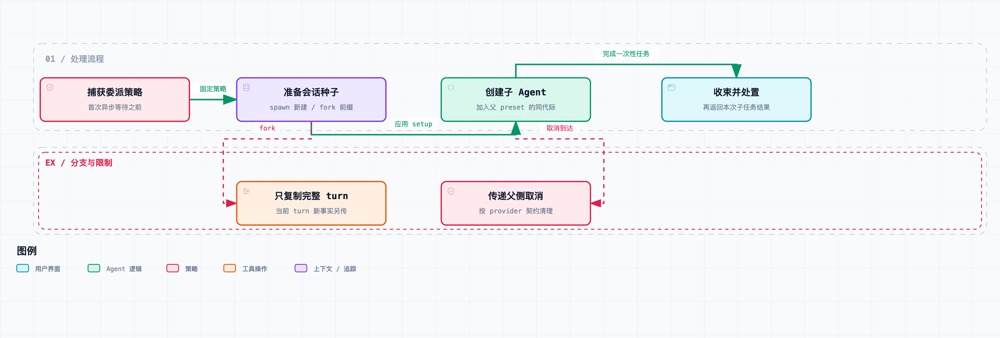

# 拆开 DeepSeek Harness 07｜子 Agent 接到的，究竟是一句话还是一套运行环境？

把任务委派给子 Agent，传一句需求过去就完了吗？显然不是。历史从哪开始、能用哪些工具、工作目录和权限是什么、父任务取消后怎么办、哪些输出算这次子任务的，都得先定下来。

这一篇继续阅读 [DeepSeek Harness](https://github.com/deepseek-ai/deepseek-harness) `0.1.6-alpha.2`，提交 [ddefc45fbc7f8e46dd73185e68295696d1297887](https://github.com/deepseek-ai/deepseek-harness/commit/ddefc45fbc7f8e46dd73185e68295696d1297887)。先看进程内实现，再说清楚哪些结论不能推广到所有后端。

DSH 把委派拆成三层：`subagent` 服务定义共同接口；provider 决定子任务在哪里、以什么方式运行；模型可见的委派工具，把调用变成服务请求。

所以只挂一个服务，不会凭空出现能工作的子 Agent。没有 provider，就没有实际后端；没有委派工具，模型也不一定能主动发起这种操作。反过来，同一套上层接口可以挂进程内、ACP 或其他后端，但它们支持的能力并不完全相同。

源码用 capability 描述 provider 是否支持模型配置覆盖、结构化输出、深度限制、工具筛选和 persona 等选项。调用方不能看到字段名，就默认每个后端都能兑现——接口统一的是请求的形状，不是每个执行环境的保证。

图中只画进程内后端。spawn 使用新会话，fork 使用父会话已完成 turn 的前缀，其他 provider 的保证可能不同。

进程内的两个 provider 是 [spawn](https://github.com/deepseek-ai/deepseek-harness/blob/ddefc45fbc7f8e46dd73185e68295696d1297887/packages/subagent/subagent-spawn-in-process/src/index.ts) 和 [fork](https://github.com/deepseek-ai/deepseek-harness/blob/ddefc45fbc7f8e46dd73185e68295696d1297887/packages/subagent/subagent-fork-in-process/src/index.ts)。它们共用 [startInProcessRun()](https://github.com/deepseek-ai/deepseek-harness/blob/ddefc45fbc7f8e46dd73185e68295696d1297887/packages/subagent/subagent-in-process-driver/src/index.ts#L104)，区别首先在怎么准备会话种子。

spawn 从新会话开始，不继承父对话。fork 则截取父 Session 中最后一个 `turn/end` 之前、包含该结束事件的完整前缀。要是父 Agent 还没完成过任何 turn，fork 也只能从空历史开始。

fork 为什么只取完整前缀？因为委派经常发生在父任务执行工具的过程中。这时父会话里可能已经有 assistant 的工具调用，但还没有工具结果。把这段没结束的记录复制过去，子会话里就会带着没有结果的工具调用，而子 Agent 未必能完成它。

这是拿一点“最新上下文”，换一个解释得清的历史起点。当前 turn 里刚得到的关键发现，要在委派 prompt 或约定的任务载荷里明确传递；不能因为用的是 fork，就假设它什么都知道。

所以子 Agent 缺少父任务刚确认的条件时，先检查继承前缀和委派载荷里有没有这些新事实。

另一个方向同样容易误解：spawn 不继承父对话，不代表它没有父环境。

共享驱动会创建新的 Session ID，记录父子关系和深度，解析子 Agent 的模型配置，在 setup 阶段应用子任务的组合、persona、工具过滤与结构化输出能力。工作目录这些会话元数据，也要按创建路径承接。

也就是说，“历史隔离”和“运行环境继承”是两件事。一个全新的对话，仍然可以用同一套工具体系、同一个工作目录，也因此可能改到同一组文件。把上下文清空，当不了文件系统隔离用。

在 preset 这一层，当前实现还有个不太显眼的选择：子 Agent 加入的是父 Agent 正在用的那一代常驻组合，而不是拿 preset 名称重新挂载最新文件。这样，父任务开始之后就算有人改了 preset，子任务也不会突然换到另一套插件实例。

如果插件实例里有共享状态，这个复用就要求作者自己区分每个 Agent 的数据——scope 可见性不会替任意普通变量复制一份。

权限继承更不能拖到最后随便读一次。`startInProcessRun()` 在第一个异步等待之前，先捕获父任务的委派策略覆盖；创建子 Agent 时，再把这些事实追加进去。

这解决的是时间竞争：委派发起时父任务是一种策略，异步创建期间父任务又切换了设置，到底用哪个？源码把创建这次委派时的策略固定下来，不让结果取决于服务刚好在哪一毫秒返回。

相关测试还覆盖了：fork 继承的旧日志里可能有较早的策略，新捕获的委派策略必须排在它之后，作为子任务实际使用的事实；子任务的提权请求也有明确的拒绝边界。不能从“父任务用过某项能力”，直接推出“子任务总能用更高权限”。

再说结果和生命周期。一次性子任务返回的 run 句柄，不只是一个结果 Promise，还有取消与 dispose 的责任。驱动会把父侧取消传递给子 Agent，也会处理“创建完成、取消监听交接”之间的窗口。

整理结果时，不能只取整个子会话里最后一段 assistant 文本。fork 的子会话里包含父历史，如果子任务自己没有输出，误把种子里的父答案当成子答案，就是一次假成功。实现会用继承边界区分本次子任务产生的内容，上游测试也专门覆盖了这个情况。

[settleRun()](https://github.com/deepseek-ai/deepseek-harness/blob/ddefc45fbc7f8e46dd73185e68295696d1297887/packages/subagent/subagent/src/run-settlement.ts#L61) 按这个顺序处理：先收束并 dispose，再报告结果。清理失败了这件事，不会因为模型说完话就消失；结果失败和清理失败同时出现，两份信息都要保留。

但也别从这里推出“父任务一结束，所有子 Agent 都必须销毁”。DSH 还支持可继续对话的子任务，它有独立的激活与恢复管理。一次性委派、后台运行、可继续对话，是三种不同的生命周期契约，要按具体 provider 和调用方式判断。

容量限制也是分开设计的。默认深度是 1，供没单独指定深度的委派工具使用；continuable 的活动容量默认是 8，约束的是对应活动池里的驻留子任务。它不是全系统子任务的统一上限，也不是累计 token 预算。容量满了就拒绝创建或冷恢复，而不是无条件排队，等父任务自己占着的槽位。

这一篇实际核对了 spawn 的 27 个测试、fork 的 11 个测试、策略继承的 9 个测试，以及结果收束的 11 个测试，重点验证历史前缀、创建时机、权限捕获和结果归属，没有做多 Agent 效率跑分。

任务能并行时，拆给多个 Agent 可能省时间；但它们共享同一份可变文件时，也可能增加协调成本。源码给的是派生环境和管理生命周期的办法；任务划分得合不合理，还是上层设计的事。

委派接口要同时说清楚历史起点、能力组合、策略快照、资源所有者和结果归属。进程内实现的这些行为，还要逐项和其他 provider 的 capability 对照，不能只凭统一接口，就假定每个后端的保证相同。

源码与验证：

- [spawn：新会话与能力声明](https://github.com/deepseek-ai/deepseek-harness/blob/ddefc45fbc7f8e46dd73185e68295696d1297887/packages/subagent/subagent-spawn-in-process/src/index.ts)
- [fork：截取已完成 turn 的前缀](https://github.com/deepseek-ai/deepseek-harness/blob/ddefc45fbc7f8e46dd73185e68295696d1297887/packages/subagent/subagent-fork-in-process/src/index.ts)
- [创建、策略捕获与运行驱动](https://github.com/deepseek-ai/deepseek-harness/blob/ddefc45fbc7f8e46dd73185e68295696d1297887/packages/subagent/subagent-in-process-driver/src/index.ts#L97-L229)
- [结果与清理顺序测试](https://github.com/deepseek-ai/deepseek-harness/blob/ddefc45fbc7f8e46dd73185e68295696d1297887/packages/subagent/subagent/tests/run-settlement.spec.ts)
- [深度、continuable 容量及后端限制](https://github.com/deepseek-ai/deepseek-harness/blob/ddefc45fbc7f8e46dd73185e68295696d1297887/packages/subagent/subagent/README.md)
