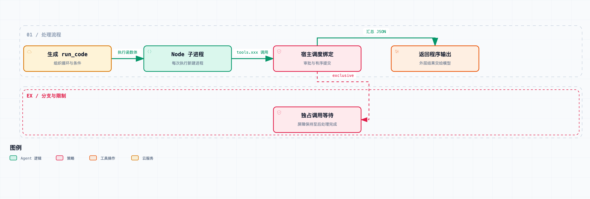

# 拆开 DeepSeek Harness 08｜把多次工具调用写成一段程序，PTC 到底改变了什么？

假设 Agent 要检查三组数据，筛出异常项，再只把异常部分交回来。普通工具调用很可能是这样：请求模型，查第一组；再请求模型，查第二组；再请求模型，查第三组；最后再让模型汇总。

这些往返里，有一些确实需要模型判断，但另一些只是循环、条件和结果拼装。让模型反复生成这些调度动作，未必划算。

PTC，也就是 Programmatic Tool Calling，把一部分调度交给模型生成的程序。[DeepSeek Harness](https://github.com/deepseek-ai/deepseek-harness) 当前可以把能力暴露为程序里的绑定，模型调用 [run_code](https://github.com/deepseek-ai/deepseek-harness/blob/ddefc45fbc7f8e46dd73185e68295696d1297887/packages/core/tools/src/ptc.ts#L23)，让程序在一次执行中组织多个工具动作。

这一篇固定阅读 `0.1.6-alpha.2`，提交 [ddefc45fbc7f8e46dd73185e68295696d1297887](https://github.com/deepseek-ai/deepseek-harness/commit/ddefc45fbc7f8e46dd73185e68295696d1297887)，重点拆工具注册表与 Node runtime 的连接，没有测量线上延迟或 token 节省。

先看模型那头的入口变化。普通模式中，某个工具可以直接以独立 schema 出现；PTC 模式中，工具能力被呈现为 SDK 声明，模型要在 `run_code` 的程序里通过 `tools.xxx()` 调用。

注意，声明出现在上下文里，不代表同名工具在这个模式下还能被模型直接调用。源码有专门测试：PTC 模式下绕过传输入口、直接请求内部工具，会被当成未知工具。展示协议和实际调度入口，必须对得上。

下面是一个形状示例，假设当前组合确实暴露了 `bash` 绑定。它只展示程序怎么组织两个固定命令，不是这一篇执行过的性能测试：

```ts
const stat = await tools.bash({
  command: 'git diff --stat',
  description: '查看改动范围',
});
const check = await tools.bash({
  command: 'git diff --check',
  description: '检查空白错误',
});
return { stat, check };
```

这段程序仍然需要一次模型生成，命令也仍然要执行。减少的，是中间那些可以由确定性代码完成的模型往返。至于实际快多少，取决于模型延迟、工具耗时、要不要重试，以及原来有没有合批——不能凭调用图直接报一个比例。



程序通过绑定调用宿主工具，仍受工具管线约束。模型往返减少不等于工具执行成本和风险消失。

再往里看，`run_code` 不是给模型一个能直接访问宿主对象的函数。Node provider 为每次程序启动新的进程，通过专门的控制通道，把宿主提供的异步绑定接过去。

模型编写的是 async 函数体，所以支持顶层 await 和 return。TypeScript 只接受可擦除的语法，类型标注当不了运行时的安全保证。每次执行都是新状态，默认不存在跨次保存的 Node REPL。

分工是：子进程负责运行程序，宿主负责策略、绑定查找、协议校验、时限和清理。程序发出绑定调用后，宿主再走注册表的执行管线，不是拿到工具函数引用就越过审批。

换句话说，外层 `run_code` 和里面的工具调用，各有各的边界。允许执行一段程序，不等于程序里所有工具都自动获批。内部绑定被拒绝时，程序收到的是拒绝异常；没接住，整个程序就可能失败。

PTC 也就改变了错误的传播位置。原来工具错误直接作为下一轮模型输入；现在程序可以先 catch，再决定记录诊断、跳过一项，还是继续收集其他结果。但程序要保留错误状态：catch 之后返回“全部成功”，只是把错误藏起来了，失败的动作不会因此变成功。

部分成功也不会自动回滚。程序先完成 A，再因为 B 被拒绝而退出，A 的副作用仍然可能存在。源码测试明确覆盖了拒绝后的既有动作信息，也确认运行时不会悄悄申请更高权限、再把整段程序自动重跑。

说到多调用，另一个常见误读是：写了 `Promise.all`，工具就一定同时执行。

当前调度器有 `parallel` 与 `exclusive` 分类，还有并发上限。可并行的调用允许函数体重叠；独占调用要等前面的池子排空，自己单独跑完，后面的调用才能继续。

更细的一点是，独占屏障一直保持到提交完成，包括 post-execute。前置检查与结果提交都走有序通道，结果按提交顺序落下——函数体先跑完，不代表能越过这些顺序约束抢跑。

可以这么理解：程序表达的是并发意图，哪些动作真的允许重叠，由运行时决定。关键是工具实现声明的执行分类；共享写入支不支持并发，还是取决于工具实现。

我们跑过的 [ptc.spec.ts](https://github.com/deepseek-ai/deepseek-harness/blob/ddefc45fbc7f8e46dd73185e68295696d1297887/packages/core/tools/tests/ptc.spec.ts) 有 125 个测试。其中既有三个 safe_read 函数体同时在途的用例，也有默认独占 probe 在 Promise.all 里仍然串行的测试；还有独占调用等到 post-execute 结束才放行后续调用，以及函数体乱序结束、结果仍有序提交的测试。

这些是受控 runtime 与工具对调度桥接的验证，不是三次线上网络请求的测速。这一篇引用的是“并发有没有发生、顺序成不成立”，不把测试耗时当产品性能指标。

上下文也会变化。内部绑定调用不会逐条变成普通模型对话里的独立工具往返，外层结果负责把程序输出交给模型；内部调度仍有 `tool/ptc-dispatch-start` 和 `tool/ptc-dispatch` 这些运行记录，方便关联子调用。

所以 PTC 可以让模型只看筛选后的数据，少收无关的中间结果。代价是程序作者必须决定保留哪些证据——一旦只返回一句概括，把失败项、来源和必要原文全丢了，后续模型就没法从这份输出还原被删掉的信息。

还有一个不能含糊的安全边界：Node runtime 里，直接的文件、网络和子进程 API 仍然是 Node 操作，受选中的操作系统沙箱约束。它们不是通过 `tools.xxx` 绑定发出的调用，就不能想当然地归进同一套工具审批或文件编辑守卫。

这一版默认执行时限 120 秒，V8 old-generation 限额 512 MiB，另有输出和协议消息限制。但 512 MiB 不是整棵进程树的总内存上限，执行时限也不是 CPU 计费器。等内部工具或审批，同样消耗这段墙钟时间；清理完成之前，调用返回还可能晚于执行截止点。

输出要求是可准确表达的 JSON。程序里的对象、异常和日志怎么穿过进程边界，要靠具体协议处理，不能假定 JSON.stringify 能完整保存所有类型的值。本次另外跑过绑定与 JSON 输出相关的 20 个测试；所有平台的沙箱与进程树实测没有完成，这一篇不据此宣称全平台隔离能力。

PTC 最适合的，是那些规则清楚、可以提前写成控制流的动作组合。碰到需要新的语义判断、结果含义不确定的节点，仍然值得把结果交回模型。合并更多动作能减少模型往返，也会让一次失败后要检查的状态变多。

它给 Agent 多了一种组织工具的方式。用不用，最好按任务里的确定性步骤、数据量、错误恢复成本和证据需求来定。

源码与验证：

- [run_code 与内部有序调度](https://github.com/deepseek-ai/deepseek-harness/blob/ddefc45fbc7f8e46dd73185e68295696d1297887/packages/core/tools/src/ptc.ts#L315-L455)
- [PTC 并发、审批与失败测试](https://github.com/deepseek-ai/deepseek-harness/blob/ddefc45fbc7f8e46dd73185e68295696d1297887/packages/core/tools/tests/ptc.spec.ts)
- [Node runtime 的执行与限制](https://github.com/deepseek-ai/deepseek-harness/blob/ddefc45fbc7f8e46dd73185e68295696d1297887/packages/ptc-runtime/ptc-runtime-node/README.md)
- [JSON 输出验证](https://github.com/deepseek-ai/deepseek-harness/blob/ddefc45fbc7f8e46dd73185e68295696d1297887/packages/ptc-runtime/ptc-runtime-node/tests/output-json.spec.ts)
