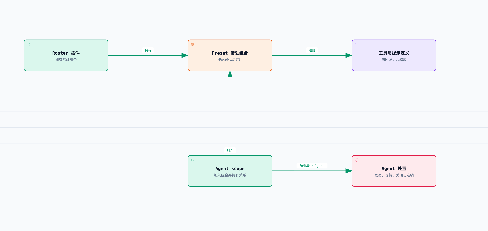

# 拆开 DeepSeek Harness 09｜插件卸载了，它注册过的工具、监听器和任务怎么办？

插件加载后，可以向工具列表注册能力；卸载时，就要分别处理在途调用、监听器和定时器，还要防止重新加载后重复注册。而且有些对象属于常驻组合，生命周期并不跟着单个 Agent 走。

这一篇基于 [DeepSeek Harness](https://github.com/deepseek-ai/deepseek-harness) `0.1.6-alpha.2`，提交 [ddefc45fbc7f8e46dd73185e68295696d1297887](https://github.com/deepseek-ai/deepseek-harness/commit/ddefc45fbc7f8e46dd73185e68295696d1297887)。先从配套实验里修正过的一项所有权假设说起。

配套测试做了一个最小 preset，注册 `review_checklist` 工具和一段审查提示。然后创建 Agent，调用工具，结束并 dispose 这个 Agent。我最初加了一条断言：此时这个工具定义应该已经不存在了。

该断言失败。

如果只看“插件卸载会清理注册”这句话，很容易把它当成资源泄漏。继续追到 [agent-presets/src/index.ts](https://github.com/deepseek-ai/deepseek-harness/blob/ddefc45fbc7f8e46dd73185e68295696d1297887/packages/preset/agent-presets/src/index.ts)，才发现是自己的所有权假设不对：这一版 preset 采用 standing mount，也就是常驻组合。Agent 加入这份组合，工具定义归组合所有，不归单个 Agent 所有。

dispose 之后，Agent 已经从活动注册表移除，普通 sibling Agent 也没有因此获得该工具。但原来的 preset 组合还活着，旧对象引用沿着原有 scope 关系仍可能查到那份定义。当然，拿一个已处置 Agent 的引用做查询，不能据此认定这只 Agent 还能继续运行。

测试随后改成核对真实边界：Agent 处置后，常驻定义保留；拥有组合的 roster 插件处置后，工具与提示贡献消失。两步都验证通过。这两项断言，分别对应 Agent 和常驻组合的资源所有权。



Agent 的处置与常驻组合的处置分别验证；单个 Agent 结束时，组合拥有的定义可以继续存在。

从这个例子回头看 Cordis 的 effect 机制就容易多了。插件通过上下文注册服务、监听器或可撤销贡献，生命周期系统记下相应的清理函数；等拥有它的 fiber 被处置时，再按约定撤掉这些资源。

[ctx.tools.register()](https://github.com/deepseek-ai/deepseek-harness/blob/ddefc45fbc7f8e46dd73185e68295696d1297887/packages/core/tools/src/index.ts#L1043-L1068) 自己就返回一个准确的注销函数，内部通过当前上下文所属的层来跟踪 effect；`ctx.on()` 的监听也关联上下文。要管理额外资源，可以显式用 `ctx.effect()` 把启动和清理绑起来。

下面只演示资源所有权的写法：

```ts
ctx.effect(() => {
  const timer = setInterval(() => collectMetrics(), 1000);
  return () => clearInterval(timer);
});
```

注意，这段示意不保证 `collectMetrics()` 自己启动的异步任务已经结束。清掉定时器只能阻止未来触发，已经发出的请求仍要单独持有、取消并等待。插件要为实际创建的每项资源，登记对应的清理操作。

这也是框架替插件补不上的地方。如果插件随手给 process 挂监听、开一个没人跟踪的计时器，或者启动外部进程后把句柄一丢，运行时根本不知道怎么把它找回来。

[AgentLoop 的处置流程](https://github.com/deepseek-ai/deepseek-harness/blob/ddefc45fbc7f8e46dd73185e68295696d1297887/packages/core/agent-loop/src/index.ts#L575-L624) 比同步注销要长。它会给机器发出 disposed 原因的取消，等待 `whenIdle()`，再处置作用域；随后关闭会话句柄，让已提交的事件按持久化路径收束，最后移除注册、释放所有权关系。

这个顺序的要求是：一个对象从列表里消失时，不能还有后台动作悄悄以它的身份继续写东西。只发一个 abort 就立刻返回 dispose 成功，是确认不了在途活动已经结束的。

源码把“真正结束活动”叫 quiescence，这里可以直接理解成“这次生命周期拥有的在途活动，已经没有了”。等它，意味着卸载有时会变慢；不等，就可能留下还在执行的活动。

清理的错误也不能吞。会话关闭时可能第一次暴露持久化失败，工具收束可能失败，注册撤销也可能失败。实现会继续尝试必要的清理，并把错误保留下来，让并发调用 dispose 的各方看到同一轮处置结果，而不是有人拿到成功、有人拿到另一套状态。

这里还要区分两类看起来都像“卸载”的动作：撤掉将来的能力，和结束已经进入的工作。先把工具从列表里隐藏，可以阻止新模型请求继续发现它；但已有的工具调用取消没有、等没等完成，取决于它的执行与资源所有者。注册表少了一行，推不出后一件事也完成了。

第二篇说过，常驻 preset 有代际。配置文件变了，新会话可以用新组合，已有会话继续用旧组合。这避免了运行中途工具定义突然变化，但也带来一个当前版本明确存在的代价。

[ensureStanding()](https://github.com/deepseek-ai/deepseek-harness/blob/ddefc45fbc7f8e46dd73185e68295696d1297887/packages/preset/agent-presets/src/index.ts#L773-L824) 附近有一个 TODO：还没有基于加入 Agent 数量的旧代际回收。被新版本替代的组合，会保留到整棵树卸载——不是“最后一个会话结束就自动释放”。

如果旧代际里有文件 watcher，那些 watcher 也可能一直活着。反复修改 preset、再创建新会话，资源就按配置代际累积，而不是按每个会话复制一份。不过按代际增长照样有成本，不能因为它不是线性于会话数，就说没问题。

这个版本选择保留运行中会话的组合，同时推迟旧代际回收。评估热更新的资源开销时，要把这项限制算进去。

开发插件时，我会把验证拆成几个互相替代不了的观察点：加载后能力可见；另一个作用域不受影响；卸载后新调用拿不到能力；在途任务确实收束；再次加载只有一份注册。涉及代际复用时，还要确认旧会话和新会话各用哪一份。

本次实际执行了上游 scope 生命周期 40 个测试、scoped 工具 27 个测试，以及相关配置重载测试。额外的 preset 集成测试保留了 `standingSurvivesAgent` 和 `toolRemovedAfterRosterDispose` 两个独立事实。测试没有改宿主的实际 DSH 配置，所有示例 preset 都在临时目录里运行并清理。

最后再接上第六篇：把工具、监听器和任务清干净，也撤销不了已经发生的外部动作。插件卸载前发出的一封邮件、一次写入，还得靠业务自己的补偿机制。生命周期清理负责结束在途活动和注册，不负责撤销已完成的业务操作。

验证卸载时，要检查资源所有者处置了没有、在途工作结束了没有、哪些状态按契约继续保留。只看到 dispose 被调用、工具列表变短，证明不了清理已经完成。

源码与验证：

- [工具注册与 effect 所有权](https://github.com/deepseek-ai/deepseek-harness/blob/ddefc45fbc7f8e46dd73185e68295696d1297887/packages/core/tools/src/index.ts#L1043-L1068)
- [Agent 的取消、等待、关闭与注销](https://github.com/deepseek-ai/deepseek-harness/blob/ddefc45fbc7f8e46dd73185e68295696d1297887/packages/core/agent-loop/src/index.ts#L575-L624)
- [preset 常驻组合与代际](https://github.com/deepseek-ai/deepseek-harness/blob/ddefc45fbc7f8e46dd73185e68295696d1297887/packages/preset/agent-presets/src/index.ts#L407-L464)
- [旧代际回收的实际 TODO](https://github.com/deepseek-ai/deepseek-harness/blob/ddefc45fbc7f8e46dd73185e68295696d1297887/packages/preset/agent-presets/src/index.ts#L773-L824)

配套 `preset-trace.json` 记录了这一篇的最小测试结果；它验证注册与生命周期，不测真实模型的审查质量。
