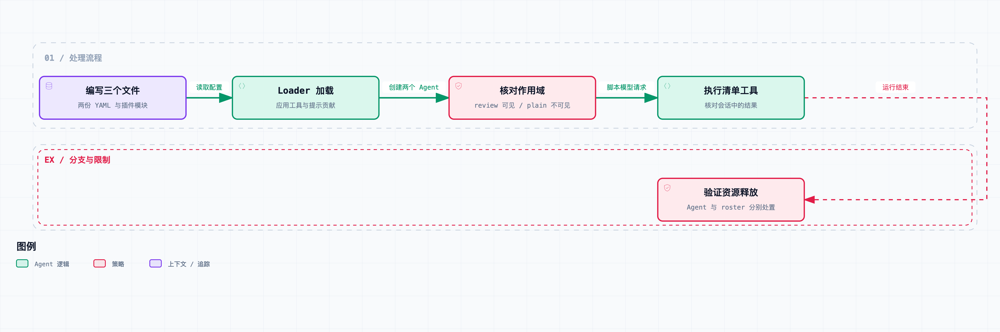

# 拆开 DeepSeek Harness 10｜创造模式在“创造”什么？让 Agent 组装一种新工作方式

[DeepSeek Harness](https://github.com/deepseek-ai/deepseek-harness) 的“创造模式”，允许 Agent 检查运行接口、管理插件、编写 preset。这一篇看看 `0.1.6-alpha.2`，提交 [ddefc45fbc7f8e46dd73185e68295696d1297887](https://github.com/deepseek-ai/deepseek-harness/commit/ddefc45fbc7f8e46dd73185e68295696d1297887) 里，它具体多了哪些入口，以及一次可验证的改造应该怎么交付。

先打开[内置 `cordis` preset](https://github.com/deepseek-ai/deepseek-harness/blob/ddefc45fbc7f8e46dd73185e68295696d1297887/packages/preset/agent-presets/presets/cordis/agent.cordis.yml)。它保留标准模式的能力，再加入运行时检查、持久化插件管理，以及编写组合与插件的指导。它不是换了一套特殊的模型权重，而是给当前 Agent 更明确的环境信息和工具。

只读检查入口是 [cordis_inspect_list](https://github.com/deepseek-ai/deepseek-harness/blob/ddefc45fbc7f8e46dd73185e68295696d1297887/packages/extensions/tool-cordis/README.md) 和 `cordis_inspect_query`。名字里有 inspect，这里也确实是只读检查：先列出 Host、Client 的提供者，再查询准确的服务、事件、工具或 UI 接口。

它们不会因为返回了某个方法声明，就直接执行那个方法，更不会靠一次 query 自动把新代码装进运行时。Client 查询还需要有能响应的页面。把接口发现和代码执行分开，是理解创造模式的第一步。

为什么要先查一遍？插件系统在持续更新，模型记忆里的 API 可能和当前版本对不上。让它先读当前安装环境里的声明和工具 schema，再写代码，能减少接口版本不匹配的问题。

不过，声明读得再准，也只是输入证据。模型仍然可能写错实现，插件仍然可能挂不上。所以接下来还需要文件、加载结果和行为验证，不能把“代码生成成功”当成能力已经生效。

第二个入口是 [plugin_manager](https://github.com/deepseek-ai/deepseek-harness/blob/ddefc45fbc7f8e46dd73185e68295696d1297887/packages/boot/plugin-manager/README.md)。它处理当前 profile 的持久化 bundle 安装、移除与启停。注意这是共享环境的修改，会影响使用同一 profile 的多个 Session，不能和“只给某个 Agent 加一段提示”混为一谈。

在这个版本里，管理工具每次调用都受它自身的权限规则约束：Full access，或者该次调用通过审批。安装依赖的构建脚本许可是另一项授权。批准一次管理操作，不会自动改变 Session 的长期权限模式。

还有个结果必须读仔细：保存成功、依赖安装成功、Host 激活成功，以及需要重启，是四个不同的事实。源码会明确返回相关阶段与状态。配置写进了磁盘，却报告 restart-required，这时不能告诉用户“你现在已经能调用新能力”。

第三个入口是 preset 创作。内置提示把修改位置分成 Host 和 Agent preset 两层：共享服务放在合适的 Host 组合里，单个工作方式贡献的工具与提示放在 preset 里。另外，不要直接覆盖部署自带的 preset，复制一份自己管理。

配套测试创建了“证据审查” preset。目标故意收得很小：让加入它的 Agent 获得一个审查清单工具，以及一段要求区分事实和推测的提示。先把装配和作用域跑通，复杂审查能力以后再说。

文件只有三份：

```text
evidence-review/
  preset.yml
  agent.cordis.yml
  review-plugin.mjs
```

`preset.yml` 提供名称和简介。`agent.cordis.yml` 指定插件入口：

```yaml
- id: review-checklist
  name: './review-plugin.mjs'
```

插件声明自己依赖 `tools` 和 `systemPrompt`。它注册的提示要求审查结果给出代码位置、复现条件和影响，不把推测写成已验证结果。另一个贡献是 `review_checklist`，返回一条固定的核对顺序：

```text
位置 → 触发条件 → 可复现步骤
    → 实际结果 → 影响 → 修复验证
```

固定工具用来验证装配对不对，不评价模型的审查能力。完整插件随配套测试提供，输出 schema、呈现函数和 effect 清理都在文件里，没有省成一段加载不起来的伪代码。



测试验证手工编写的 preset 能加载、调用并卸载，没有验证模型自主编写插件的成功率。

测试通过实际的 AgentPresets 与 Loader 读取这三份文件。它先创建加入该 preset 的 review Agent，再创建没加入它的 plain Agent，检查两者的工具列表。

结果是：review 看得到 `review_checklist`，plain 看不到；提示组装中出现了审查契约。随后脚本模型发出真实工具调用，注册表执行工具，Session 中出现预期的清单结果，第二次脚本回复结束这轮任务。

这段测试用的是固定 MockAdapter，没有调用真实模型。它证明文件加载、scope 可见性、提示组装和工具往返成立，证明不了模型真的能做出高质量代码审查。要评价后一件事，还得给它准备有已知缺陷和误报边界的真实任务集。

测试还接着检查卸载：处置 review Agent，活动 Agent 注册消失，但 preset 的常驻定义仍然保留；处置拥有它的 roster 后，工具和提示贡献才被撤掉。第九篇已经解释过，这两个所有者为什么不同。

这个示例交付了 preset 配置、插件和行为测试，同时记录了各项贡献的资源所有者与释放条件。

当然，它还缺实际审查需要的读取代码和测试能力。要做可用的审查 preset，可以以标准 preset 为起点复制，在保留所需工具的同时加入这里的约束，再明确允不允许修改文件。

但要注意，“只审查，不修改”如果只写在提示里，那就只是一项行为要求。真正要限制写入，得检查可见工具、执行守卫和沙箱策略；要是还暴露着能写文件的 Bash 或 Node 路径，就不能因为删掉一个编辑工具，就说已经只读了。

同样，这条清单只规范输出结构，保证不了模型引用的行号和复现结论准确。评价时应该直接核对文件、运行断言，记录误报与漏报，而不是看输出分没分六个小标题打分。

这一篇还实际运行了上游 preset 创作的 19 个测试，以及挂载相关测试。它们覆盖复制用户 preset、拒绝路径逃逸、拒绝删除部署自带 preset 等边界。本次示例只用临时目录，没有改动宿主的真实 DSH profile，也没有执行持久化插件安装。

回过头看[整个系列](https://juejin.cn/column/7686394441277259822)，创造模式恰好把前九篇串到了一起：启动层决定环境怎么装配，scope 决定谁看见能力，循环安排调用，日志解释上下文，工具管线执行动作，取消与生命周期负责收束。

生成出来的插件，也要遵守这套结构的注册与生命周期规则。有未跟踪监听器，照样泄漏；误用共享字段，照样串会话；只读提示和实际权限不一致，照样误操作。

所以创造模式的改动，最终落实为配置和插件文件。验证时要分别检查文件加载、权限、作用域、工具行为与卸载结果——模型生成了代码，不代表这些条件都满足了。

源码与验证：

- [创造模式的实际组合与说明](https://github.com/deepseek-ai/deepseek-harness/blob/ddefc45fbc7f8e46dd73185e68295696d1297887/packages/preset/agent-presets/presets/cordis/agent.cordis.yml)
- [只读运行时检查工具](https://github.com/deepseek-ai/deepseek-harness/blob/ddefc45fbc7f8e46dd73185e68295696d1297887/packages/extensions/tool-cordis/README.md)
- [插件管理的权限、保存与激活结果](https://github.com/deepseek-ai/deepseek-harness/blob/ddefc45fbc7f8e46dd73185e68295696d1297887/packages/boot/plugin-manager/README.md)
- [用户 preset 创作边界测试](https://github.com/deepseek-ai/deepseek-harness/blob/ddefc45fbc7f8e46dd73185e68295696d1297887/packages/preset/agent-presets/tests/authoring.spec.ts)

三个 preset 文件、[集成测试](https://github.com/j-tide/juejin-article/blob/main/02-%E6%8B%86%E5%BC%80%20DeepSeek%20Harness/code/column-evidence.spec.ts) 和 [执行记录](https://github.com/j-tide/juejin-article/blob/main/02-%E6%8B%86%E5%BC%80%20DeepSeek%20Harness/code/evidence/preset-trace.json) 都放在[本专栏](https://juejin.cn/column/7686394441277259822)配套的 [code 目录](https://github.com/j-tide/juejin-article/tree/main/02-%E6%8B%86%E5%BC%80%20DeepSeek%20Harness/code)（GitHub）里，可以按 [运行说明](https://github.com/j-tide/juejin-article/blob/main/02-%E6%8B%86%E5%BC%80%20DeepSeek%20Harness/code/README.md) 在固定提交上复跑。
