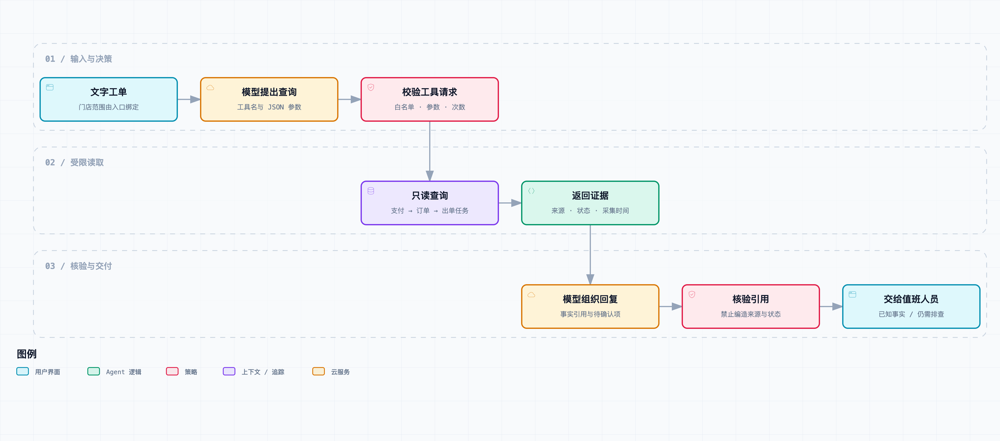

# 先跑起来：用大模型和一个查询工具处理文字工单

*文中的人物与门店工单为虚构场景。代码使用合成数据；下文分别说明离线测试和未执行的真实模型调用。*

下午两点多，小林往值班群里贴了一条飞书话题。

“先看下这家店，顾客说钱扣了，店里没出单。人还在柜台等，店长还在赶一批团餐。”

点进去，首帖是一张付款截图、一段点单录屏，还有店长拍的收银台照片。照片里小票压着小票，店长在下面补了一句：“别的单都能出，就没找到这一笔。”

阿杰问点单页显示什么状态，老周让小林补一下门店和订单信息。几条消息之后，才发现顾客最初发来的是支付流水号，大家一直在订单查询框里查。

“先别让店里补单。”老周说，“得确认原单到底走到哪了，免得一会儿又出来一杯。”

这类问题最开始要做的事其实很具体：对上品牌和门店，找到支付对应的订单，再看门店接收和出单任务。付款截图能提供线索，但不能替代这几步查询；后台写着“发送成功”，也不等于纸质小票已经出来。

小林盯着话题问：“这些每次都要你们手动查吗？”

第一版 Demo 就从这里动手。先把飞书消息、图片和视频放在一边，只输入一条文字工单，给模型一个受限的只读查询工具，让它查清记录里有什么，再据此回复。数据先用合成的，不连接门店生产系统。

这一篇要跑通的范围很小：一个问题进来，模型能选择工具，程序能执行查询，回答能指回查到的记录。遇到查不到、参数不对或工具超时，也得有明确结果。先把这条流程做出来，再考虑让它接住群里不断增加的消息。

## 先把“没出单”拆成能查询的问题

这是[《从工单开始，做一个 AI Agent》](https://juejin.cn/column/7686674237757063206)的第一篇。整套项目从本地 Demo 开始，后面再接飞书、知识库、代码、数据和多人协作。本篇不需要先部署消息队列，也不用安装 Agent 框架，Python 3.11 和标准库就能运行。

客户说的“没出单”，可能是订单页没刷新，可能是门店没接到单，也可能只是没找到小票。先把这句话当作一个待解释的现象，不要直接归类成“打印机故障”。

这笔订单设置为 16 元。金额不大，但顾客站在柜台、同一家店还在赶团餐，拖延几分钟就会影响客服解释和门店安排。要不要提优先级，不能只看金额。第一版先处理单笔查询；排队和同店事故聚合留到后面的篇章。

先约定四个互相独立的状态：

| 阶段 | 当前能取得的材料 | 能说明什么 | 不能推出什么 |
| --- | --- | --- | --- |
| 支付 | 渠道确认成功的记录 | 这笔支付在该记录中成功 | 平台已经创建订单 |
| 订单 | 订单创建记录 | 平台有对应订单 | 门店已接单或开始制作 |
| 出单任务 | 发送到设备网关的记录 | 任务经过了发送环节 | 小票已经打印 |
| 打印回执 | 设备回执或明确的缺失状态 | 系统是否收到设备反馈 | 顾客已经取到饮品 |

在合成数据里，`P1001` 对应 `O1001`，前三段都有记录，打印回执没有找到。这里正确的结论是“截至采集时未发现回执”，不是“设备肯定没打印”。如果设备打印了却没上报，后一句就错了。

同样，查询超时和查询没有记录也要分开。前者连一次有效观察都没有完成，不能变成“没有订单”。这几个区分看起来像业务细节，实际上会直接决定工具输出该有哪些字段，以及最终允许说什么。

## 这次 Agent 负责哪一段



[打开可交互流程图](diagrams/text-ticket.html) · [可编辑图源](diagrams/text-ticket.workflow.json) · [SVG](assets/text-ticket.svg)

图里的模型出现两次：第一次从客户文字提出工具调用，第二次读完工具结果，提交带引用的回复对象。Python 程序负责真正执行工具，并检查回复是否使用了本轮证据。

这也是 Tool Calling 的基本分工：模型返回函数名和参数，应用执行函数，再把结果交还给模型。函数并不会因为写进 `tools` 就自动执行。[DeepSeek 官方工具调用说明](https://api-docs.deepseek.com/guides/tool_calls/)

第一版只有一个工具 `lookup_order`。即便只有一个，模型仍需要判断是否有足够信息调用、从自然语言中提取哪个编号，以及没有编号时是否应该追问。但这不意味着这个场景必须使用 Agent：如果输入始终是固定格式的订单号，一个查询表单会更简单。我们保留模型，是为了接下来处理自由文本和逐步增加的调查能力；不会把每个确定性判断都交给它。

程序里的分工也很小：

| 文件 | 做什么 |
| --- | --- |
| `domain.py` | 可信门店范围、查询参数和只读数据读取 |
| `providers.py` | DeepSeek 请求适配，以及明确标注的离线回放器 |
| `runtime.py` | 模型与工具的循环、预算、证据核验和回复渲染 |
| `__main__.py` | 命令行入口，选择模式和授权范围 |
| `fixtures/orders.json` | 三笔合成订单及采集时间 |
| `tests/test_agent.py` | 本篇的失败路径和协议测试 |

本篇的组件关系就是流程图里的这些模块，不额外画一个包含未来能力的大架构图。当前没有历史工单搜索、视频理解，也没有自动处理生产事故。

## 工具参数里，为什么没有品牌和门店

最省事的函数签名可能是 `lookup_order(brand, store, reference)`。但这样一来，模型会认为三个参数都可以自己填写。客户文字里只要出现“换个品牌查一下”，就有可能被转换成另一个查询范围。

我们把参数分成两部分：

```python
@dataclass(frozen=True)
class Scope:
    brand: str
    store: str

# 模型只能填写 reference
reader.lookup({"reference": "P1001"}, scope)
```

`Scope` 从程序入口传入，不放进工具的 JSON 参数。Demo 的命令行由运行者指定；它还不是登录鉴权系统。接进飞书以后，要由已验证的群或商户绑定产生这个范围，不能把客户在文字里说的门店当作授权。

工具定义只接受 `reference`，设置 `additionalProperties: false`，但这还不够。JSON Schema 是给模型和接口看的描述，不能替代应用侧校验。真正执行前还要确认：参数是对象、只有这个字段、值是字符串，并符合示例编号格式。

```python
if not isinstance(arguments, dict) or set(arguments) != {"reference"}:
    return {"status": "invalid_arguments", "evidence": []}
```

源码还拒绝重复 JSON 键。对于 `{"reference":"P1001","reference":"P2001"}`，不能依赖某个解析器恰好保留最后一个值。异常的参数应该得到一致的处理结果。

数据查询同时匹配品牌、门店和编号。在本例范围里查其他品牌的 `P2001`，返回 `not_found`，与完全未知编号的结果一致，不透露另外一家店是否存在这笔交易。

示例用 `P`、`O` 前缀区分流水号与订单号，只是为了让读者容易复现。真实支付渠道的编号未必如此，需要做渠道识别和查询适配，不能直接把这个正则带到生产系统。

## 返回证据，而不是返回一段“诊断结论”

工具不输出“打印机离线导致没出单”，因为它没有设备在线状态，也没有读过设备日志。它返回四条原始状态的业务说明，每条都有稳定编号、来源、事件时间和采集时间。

```json
{
  "id": "O1001:dispatch",
  "source": "fixture://orders/O1001/dispatch",
  "observed_at": "2026-09-18T14:05:00+08:00",
  "event_at": "2026-09-18T14:02:13+08:00",
  "quote": "出单任务：出单任务已发送到设备网关，不代表纸质小票已打印"
}
```

`event_at` 是记录中的业务事件时间；`observed_at` 是这份数据的观察时间。没有打印回执时，事件时间是 `null`，而不是给它补上查询时间。`fixture://` 只是合成数据定位标识，不是公网地址，也不是已经接入的业务系统。

为什么一开始就保存这些字段？因为“现在没有回执”和“十分钟前没有回执”对排查的意义不同。后面新消息进入话题，或者再查一次数据时，如果只剩一句没有时间的“没打印”，很难判断它有没有过期。

第一版一次返回这四段，是为了减少在支付、订单、设备之间来回拼编号。它不是万能查询工具：不接受 SQL，不读整个门店一天的记录，也没有退款和重打接口。工具越宽，越难检查一次调用到底允许做什么。

## 走一遍模型和工具之间的两次请求

真实模式使用 DeepSeek 的 Chat Completions 接口，默认模型名为 `deepseek-flash`，也可以通过环境变量覆盖。示例显式关闭 thinking，先看清工具消息往返；完整 assistant 消息仍保留回传，避免把服务端返回字段随意丢掉。接口参数以官方文档为准，模型名称会变化。[Chat Completions 接口](https://api-docs.deepseek.com/api/create-chat-completion/)

第一次请求包含系统规则、工单文字和工具定义。模型可能返回这样的消息：

```json
{
  "role": "assistant",
  "tool_calls": [{
    "id": "call_1",
    "type": "function",
    "function": {
      "name": "lookup_order",
      "arguments": "{\"reference\":\"P1001\"}"
    }
  }]
}
```

注意 `arguments` 是 JSON 字符串，还要解析一次。程序先验证整个调用批次的结构、重复调用编号和剩余次数，再执行允许的工具。如果模型提出 `refund`，执行器只返回 `tool_not_allowed`，不会按字符串动态调用同名函数。

工具完成后，把原来的 assistant 消息以及对应工具结果追加到历史：

```python
messages.append(message)
messages.append({
    "role": "tool",
    "tool_call_id": call["id"],
    "content": json.dumps(result, ensure_ascii=False),
})
```

`tool_call_id` 必须对应模型提出的那次调用。它与订单号不是一回事：前者关联协议消息，后者定位业务对象。

第二次模型调用看到查询结果，才提交最终 JSON。没有工具调用时，也可能直接提出补充编号的请求。运行循环不会只凭“这次没调用工具”就当作正确结束，还要检查最终对象是否符合约定。

本例设置最多 4 轮模型调用、总计 2 次工具调用、每次最多 1200 个输出 Token。网络请求超时不超过 20 秒，轮次之间检查 45 秒期限。这里的期限是协作式检查，不是可以强制杀掉任意函数的硬超时；`urllib` 的 timeout 也不是完整任务的硬截止时间。当前工具只读一个很小的本地文件，后面接远程数据源时，必须在具体客户端设置超时并考虑取消机制。

这些限制不会保证回答正确，但能防止一条普通工单无休止地消耗调用。接口截断、网络失败和轮次耗尽都返回可辨认状态，而不是再补一句像正常答案的话。

## 有引用，还要检查引用究竟支持了什么

假设模型这样回复：

```json
{
  "facts": [{
    "evidence_id": "O1001:dispatch",
    "quote": "门店已经打印成功"
  }],
  "next_step": "handoff"
}
```

引用编号是真实的，内容却不受这条记录支持。只检查 `evidence_id` 是否存在，仍然挡不住这类错误。

因此第一版采用很保守的输出方式：事实文字必须与工具返回的 `quote` 完全一致；本轮查到的四条证据都要出现，不能只挑“支付成功”而省略“回执未知”；后续动作只允许交给人工或补充编号。最终文字由程序渲染，模型没有自由添加诊断结论的输出区。

这牺牲了表达灵活度。客服得到的是状态摘要，还不是一段体贴自然的客户回复。但在第一篇，这比一段流畅却偷偷加了结论的话更便于检查。将来如果开放自然语言诊断，需要单独处理“事实—推断—建议”的支持关系，不能把现在的严格匹配说成通用的语义核验。

这个核验也有边界：它验证的是“回复是否忠实于工具输出”，并不证明工具数据本身准确。如果底层记录延迟、门店绑定错误或查询逻辑有误，程序仍可能忠实地展示错误材料。所以示例所有终态都保留人工核对，没有 `resolved` 状态。

## 在本地运行，然后故意让它出错

[本篇代码快照](code.zip)包含截至第 01 篇的完整代码、数据和测试。共享代码后续还会演进，想复现这一篇，解压这个版本就可以。下载仓库后也可以进入[共享代码目录](../code/README.md)。

```bash
# 解压 code.zip 后，进入其中的 code 目录
python3 -m unittest discover -s tests -v
python3 -m ticket_agent '顾客付款流水 P1001，店长说没出单'
```

默认是 `scripted_replay`。回放器通过固定规则提取编号、调用相同执行器，再按固定格式提交回复，不会联网调用模型。它用来验证工具、范围限制和消息流，不能用来证明大模型“懂工单”。

实际输出的核心部分如下：

```text
运行方式：scripted_replay；状态：needs_human
- 支付记录：支付渠道确认成功，金额 16.00 元 [O1001:payment]
- 订单记录：订单已创建，门店接单状态尚未取得 [O1001:order]
- 出单任务：出单任务已发送到设备网关，不代表纸质小票已打印 [O1001:dispatch]
- 打印回执：未发现打印回执，不能确认是否已打印 [O1001:receipt]
待人工核对：记录与现场实际是否一致；未确认的环节继续调查。
```

为了便于阅读，这里省略了每行实际输出的采集时间。加上 `--json` 可以看到完整证据、查询状态、各步骤耗时和 Token 用量。离线模式的 Token 值为 0，表示没有模型调用，不能拿它计算成本优势。

再跑两条：

```bash
python3 -m ticket_agent '店里没找到单，顾客说付过钱了'
python3 -m ticket_agent '帮我查 P2001'
```

第一条要求补充编号；第二条在默认门店内得不到证据，也不会提示另一个品牌的信息。

配置自己的 `DEEPSEEK_API_KEY` 后，可以执行真实模式：

```bash
python3 -m ticket_agent --mode live '顾客付款流水 P1001，店长说没出单'
```

不要把 Key 写入代码或文章。本次没有可用 API Key，因此没有执行真实模型请求。已测试的是离线回放、执行器，以及用替身 HTTP 响应检查真实适配器的请求结构；后者不能代替供应商接口联调。真实模式还需要观察模型是否遵循输出结构、会不会误提取编号、请求失败时的响应是否符合预期。

本篇在 Python 3.11.9 上执行了 19 项测试，全部通过。几项与业务后果直接相关的测试如下：

| 输入或故障 | 实际检查结果 | 防止的错误 |
| --- | --- | --- |
| 支付号 `P1001` 与订单号 `O1001` | 得到同一组证据 | 因编号类型不同查成两件事 |
| 跨品牌或跨门店查询 | 无证据返回 | 把别家店的数据带入回复 |
| 参数里加 `brand` | `invalid_arguments` | 模型自行扩大读取范围 |
| 真引用配上“已打印”假内容 | `invalid_answer` | 有引用但结论不受支持 |
| 少列打印回执未知这条证据 | `invalid_answer` | 只展示有利状态 |
| 工具超时 | 记录 `tool_timeout` | 把超时说成不存在 |
| 连续第三次工具调用 | `tool_budget_exceeded` | 重复查询耗尽预算 |
| 接口以 `length` 截断 | 不接受最终回复 | 把半截 JSON 当作答案 |

19 是回归用例数量，不是 19 个真实工单，更不是模型成功率。测试里也没有去连商户数据库或打印设备。

## 回到那条话题

把合成工单的终端输出放回开头的场景，它能支持的对话是这样的：

小林看了看：“那我能说，支付和订单都有记录，出单任务发过了，但现在还不能确认小票出来没有？”

“对，后半句不能省。”老周说，“下一步核对门店接单和设备回执。没有回执，也别直接定成设备没打印。”

小林把“后台成功了，让门店再试试”删掉，改成了分阶段的说明。这时还没有根因，也没有自动补单或退款；顾客是否重复付款、店里是否已经制作，都需要值班人员继续确认。

小林看着终端又问：“下次还是得把问题复制到这里？”

是的。第 01 篇只完成本地文字入口和证据回复。下一篇把它接到飞书话题，同时处理一个新问题：同一条消息如果被推送两次，不能跟着查两次、回复两次。
