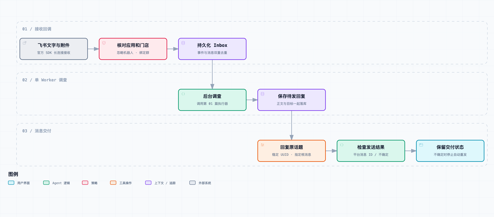

# 接入飞书：让 Demo 接收客户话题并回复查询结果

*人物与工单为虚构场景。本篇已验证本地事件回放与官方 SDK 请求结构，尚未使用真实应用凭证联调。*

“这个窗口能不能省掉？”

小林指着我的终端，问得很直接。

本地 Demo 的操作不复杂：复制工单，填入必要信息，执行查询，再把回复贴回飞书。拿一条准备好的文字测试时，这几步很顺。放进客服的工作里，就变成了又一个要来回切换的窗口。

小林上午同时在跟两家门店的问题。一家查支付，一家查出单。她刚把第一条问题复制过来，店长就在原话题里纠正：“截图发错了，看后面那张。”等她回头找补充消息，另一个话题又有人问进度。

“你看，问题本来就在这里，回复也得回到这里。我还要替它搬一遍。”

让 Agent 出现在飞书话题里，首先要解决的就是这件事。客户创建的话题、值班人员的回复和机器人发出的结果，需要知道各自属于哪一单。

接入也不是收到文字后直接调用一下模型就结束了。同一条事件可能再次送来，几家门店会同时说话，机器人自己的回复也不能再被当成新工单。接单接口还得尽快返回，不能一直等调查结束。

这一篇给上一版 Demo 加一个飞书入口。先接文字，保留消息、发送者和话题关系，去重后交给已有的调查函数，再把结果回复到原话题。图片和视频先记下引用，暂时读不了就明说。

小林不必再复制来复制去。但话题接通以后，下一个问题很快就会出现：首帖经常只有一句“帮忙看看”，真正有用的信息，是后来才补齐的。

## 先选接入方式，而不是先写模型提示词

这是[《从工单开始，做一个 AI Agent》](https://juejin.cn/column/7686674237757063206)的第 02 篇。上一版已经能从文字提取订单线索、查询合成数据、输出带来源的状态。本篇复用它，只增加事件接收、消息归属、持久化去重和回复交付。

先分清两种“飞书机器人”。拿到一个群自定义机器人的 Webhook，可以向指定群推送消息；它并不等于一个能够订阅客户消息的应用。这里要接收 `im.message.receive_v1`，因此使用开放平台应用的机器人能力，以及官方 SDK 的长连接事件接收。原先用于推送审稿的 Webhook 不参与这个 Demo。

长连接适合这个阶段：本地进程向平台建立连接，不需要先给本机准备公网回调地址。应用凭证、订阅范围、可见范围和消息权限仍要配置。它只是改变事件进入程序的方式，没有替我们决定哪个客户能查哪个门店。[飞书 Python SDK](https://github.com/larksuite/oapi-sdk-python) · [接收消息事件](https://open.feishu.cn/document/server-docs/im-v1/message/events/receive)

示例固定使用 `lark-oapi==1.7.3`，用底层事件分发器和回复接口，不依赖额外的高层会话封装。写作时实际安装了这个版本，检查了事件对象和回复请求的字段，并执行本地契约测试；没有连接真实飞书应用。

如果换成 HTTP 事件订阅，不能把下面的 `accept()` 函数直接暴露成接口。它假设上游已经通过可信 SDK 传输拿到事件，本身不验证 HTTP 签名、解密请求或处理平台挑战。接入方式变了，入口的信任条件也要重新实现。

## 一条消息里，至少有三种编号

很多“回错话题”的问题，开始于把所有编号都叫成 `id`。

| 编号 | 本篇用途 | 不能替代什么 |
| --- | --- | --- |
| `event_id` | 标识一次平台事件，去重 | 不能当业务订单号 |
| `message_id` | 定位用户消息，并做第二层去重 | 不能代表整个群 |
| `root_id` | 找到话题根消息，作为回复目标 | 不能用最后一条子回复随意代替 |
| `chat_id` | 找群和受信任的门店绑定 | 不能作为每张工单的唯一键 |
| `tenant_key` | 飞书租户隔离 | 不能省掉后只看群内文字 |
| 支付号或订单号 | 提供业务查询线索 | 不能拿来给消息去重 |

同一个群里可能同时有两条话题在讨论，如果只用 `chat_id` 建状态，支付问题和出单问题就容易混在一起。反过来，同一话题里有客服、前端和后端的十条回复，也不应该被看成十个互不相关的问题。

本篇先保存这些关系，不在这里实现完整会话合并。根消息没有 `root_id` 时，可以用自己的 `message_id`；子回复如果有 `parent_id` 却没有根消息信息，则返回 `missing_root`，暂不处理。我们宁可留下一个需要补查的事件，也不退化成往群里随便发一条结果。

`thread_id` 在数据里也会保留，但不会假定每个事件都有它。最终使用回复接口的 `message_id` 路径参数指向根消息，并设置 `reply_in_thread=True`。具体话题形态和应用权限，需要在实际群里验证。[回复消息接口](https://open.feishu.cn/document/server-docs/im-v1/message/reply)

## 接收回调里不要等待模型



[交互流程图](diagrams/feishu-intake.html) · [图源](diagrams/feishu-intake.workflow.json) · [SVG](assets/feishu-intake.svg)

流程分成三个阶段：接收回调、后台调查、消息交付。图中的 Inbox 和 Outbox 都在同一个 SQLite 文件里，并不是额外部署的两套服务。

回调只做短操作：检查应用和发送者，找到授权绑定，规范化事件，然后持久化入库。这里没有模型请求，也没有查订单。

```python
def receive(data):
    payload = json.loads(lark.JSON.marshal(data))
    status = inbox.accept(payload, bindings, app_id)
    print("intake:", status, flush=True)
```

原因很直接：模型可能花几秒甚至更久，消息接收却不应该跟着挂住。回调成功意味着“已接住这条输入”，不能被解释成“调查已经完成”。本地数据库写入失败时也不能假装接受成功；当前实现让失败向上传播，由接收机制和运行人员处理。

为了控制第一版复杂度，后台只有一个 Worker，按入库顺序调查。这样对多家门店同时进来的消息会有等待，不支持高并发处理。它是本章明确的容量限制，后面再引入优先级、事故聚合和调度，不能因为已经用了线程就称为高并发系统。

## 门店权限来自绑定，不来自聊天里的自我介绍

绑定文件长这样：

```json
{
  "tenant-demo:chat-demo": {
    "brand": "demo-brand",
    "store": "store-001"
  }
}
```

左边是已确认的飞书租户与群，右边是当前允许查询的业务范围。这里采用“一组租户和群映射一个门店”的最小配置，只适合本章专用测试群。

现实中一个客户群往往讨论多家门店，到那时必须引入商户身份、允许门店集合、工单对象确认等机制。不能简单把群里的“我是某某门店”写进 `Scope`，也不能给整个群一个品牌全量读取权限，就认为问题已经解决。

进入 Inbox 前，还有两项过滤：`app_id` 必须是当前应用，`sender_type` 必须是 `user`。后者挡住机器人自己发出的回复，避免“接到自己的回复—再次调查—再次回复”。它不会判断人类消息是否真的是工单；测试群里的每条文本仍可能进入调查，这也是后面需要路由和会话状态的原因。

本篇的附件不送进文字模型。图片的 `image_key`、视频的 `file_key` 等内容会随原消息保存，Worker 只回复“已保存附件引用，本版本尚未解析”。没有下载文件，也没有产生 OCR 或视频理解结果。这样客服至少知道哪些材料还没被使用，而不是看到机器人给了答案就以为它看过全部附件。

## 去重不是在内存里放一个集合

事件再来一次时，最容易写出一个 `seen_ids`。进程不重启的时候看起来没问题，重启后集合清空，同一条消息又会进入模型。

本篇在 SQLite 上建立两个唯一约束：

```sql
CREATE TABLE inbox (
  event_id TEXT PRIMARY KEY,
  tenant TEXT NOT NULL,
  message_id TEXT NOT NULL,
  -- 还有根消息、发送者、时间、授权范围、内容和处理状态
  UNIQUE (tenant, message_id)
);
```

事件编号挡住原样重投；租户与消息编号的组合挡住事件编号不同、但业务上仍然是同一条消息的情况。数据库决定插入是否成功，回调只根据受影响行数返回 `accepted` 或 `duplicate`。这比先查再插更容易避免竞争窗口。

需要注意，这里订阅的是“接收消息”事件，不是已经完成消息编辑同步。将来处理编辑、撤回时，要为不同事件类型和版本定义去重规则。不能复用现在的消息唯一约束，把所有后续变化都当重复输入丢掉。

Worker 认领一条 `pending` 后，把它改为 `running`，提交事务，再做模型调用。不会把数据库写锁一直拿到模型结束。调查完成后，在同一个事务里创建 Outbox 记录，并把 Inbox 改成 `done`。

这个事务能保证本地“结果已保存”和“该条调查完成”一起成立。但如果模型已调用、进程在保存结果前崩溃，重启后只读调查可能重新执行，模型费用也可能重复发生。本篇不承诺模型调用恰好执行一次。

## 发送消息有另一种失败：不知道有没有发出去

假设调查结束，程序调用回复接口。平台已经创建了消息，网络却在响应回来之前断开了。

此时如果立刻把状态重置成 `pending`，下一轮就可能发出第二条相同回复。对正在处理团餐的店长来说，这不只是多一条通知，还可能让他误以为有两次独立调查结果。

所以 Outbox 分开记录这些状态：

| 状态 | 含义 | 自动行为 |
| --- | --- | --- |
| `pending` | 本地已保存，尚未开始发送 | Worker 可以认领 |
| `sending` | 已开始向平台发送 | 不被其他发送轮次重复认领 |
| `sent` | 已取得平台消息编号并落库 | 不再发送 |
| `uncertain` | 请求异常、返回无法确认，或进程在发送中退出 | 停止自动重发，等待核对 |

开始发送前先持久化 `sending`。收到明确的平台消息编号后才写 `sent`。本章把发送异常统一保守归入 `uncertain`，还没有按错误码区分“肯定未送达”和“可能已送达”，因此需要人工处理的情况会偏多。

每条待发记录还生成稳定的 UUID：由租户和输入消息编号计算，保存在 Outbox，构建回复请求时带上。它可以用于平台支持的请求去重，但本例不靠猜测平台去重窗口来承诺永久恰好一次。

```python
body = (ReplyMessageRequestBody.builder()
    .content(json.dumps({"text": text}, ensure_ascii=False))
    .msg_type("text")
    .reply_in_thread(True)
    .uuid(send_uuid)
    .build())
```

`content` 在这里是一个 JSON 字符串，里面才有文本字段，不能直接把普通文本塞进去。模型没有权限决定 `root_id`、UUID 或请求接口，这些都由已经保存的输入关系产生。

`recover_single_worker()` 只在唯一 Worker 启动时运行：未完成的只读调查恢复成 `pending`，中断的 `sending` 变成 `uncertain`。不能在还有另一个 Worker 工作时调用它，否则可能把正常调查误认成崩溃任务。本篇也没有提供“自动解决 uncertain”的按钮；真实部署前需要补上平台消息核对与人工重发流程。

## 先用本地事件检查，再接真实应用

[本篇完整代码快照](code.zip)包括第 01 篇实现、新增的 `inbox.py`、`feishu.py`、四个合成事件和测试。[共享代码运行说明](../code/README.md)随专栏继续更新。

解压后，在 `code/` 运行：

```bash
python3 -m unittest discover -s tests -v
python3 -m ticket_agent.feishu --db /tmp/ticket-agent-ch02.sqlite3
```

这个命令默认是本地回放，绝不会向飞书发送消息。四个输入分别是文字工单、同一事件重复一次、同话题图片、机器人消息；发送器也由本地函数替代，只记录它本来准备发到哪个根消息。

使用全新的运行数据库，实际接收结果是：

```text
accepted
duplicate
accepted
ignored
```

两条输入被保存，两条回复记录进入 `sent`，这里的 `sent` 只表示本地替身发送器成功，不代表飞书平台送达。两条记录分别是文字查询结果和附件尚未解析的说明。

用同一个数据库再跑一次，前三个用户事件都被识别成重复，不增加回复；机器人消息仍被忽略。删除或更换测试数据库会得到新的实验起点，但业务运行时不能随意清空它。

若要检查官方 SDK 的类型与请求构建，再安装固定依赖：

```bash
python3 -m venv .venv
.venv/bin/python -m pip install -r requirements-feishu.txt
.venv/bin/python -m unittest discover -s tests -v
```

没有 SDK 时，31 项测试运行、1 项 SDK 契约测试跳过；安装后实际执行 32 项，全部通过。其中 19 项来自上一章，新增部分检查重启后去重、跨应用过滤、不同话题隔离、附件处理、发送结果不确定，以及 SDK 事件和回复结构。它们仍然是脚本化测试，不是平台稳定性统计。

真实接入需要准备应用自己的 `FEISHU_APP_ID`、`FEISHU_APP_SECRET`、`DEEPSEEK_API_KEY`，启用机器人、配置长连接事件订阅和必要消息权限，将应用加入测试群，并把已经核实的租户与群写入绑定文件。不同权限组合能收到哪些消息，以当前开放平台配置为准。

```bash
.venv/bin/python -m ticket_agent.feishu \
  --live \
  --db /tmp/ticket-agent-live.sqlite3 \
  --bindings /path/to/private-bindings.json
```

凭证从环境变量读取，不放进绑定示例，也不写入仓库。SQLite 会保存工单正文、发送者和调查结果；测试数据无个人信息，接真实客户后需要受限的运行目录、保留期限和脱敏策略，不能把运行库提交成示例材料。

本次没有应用凭证，没有执行长连接握手、平台实际投递或真实回复。已完成的是官方 SDK 适配、持久化收发流程和本地事件回放。实际联调时要另外确认：订阅是否生效，群范围是否正确，回复是否落在预期话题，以及平台错误能否在本地状态中找到。接口结构测试不能代替这些检查。

## 小林不用搬消息了，但还得有人记住前后文

把本地回放结果对应到开头的场景，小林指了指输出里的根消息编号：“这条回原来的支付话题，图片提示也留在那里，不会跑到另一家店下面，对吧？”

“本地回放核对的是这个关系。”我说，“真实群还要联调，先不把本地发送成功当成平台送达。”

我们重新投递同一事件，数据库里没有多一条调查，也没有多一条待发回复。再模拟发送超时，状态停在 `uncertain`，没有为了表现得积极而连续刷出几条相同结果。

小林随后问：“那店长新补一个订单号，它知道是在补刚才那张工单吗？”

目前还不知道。本篇保存了话题关系，但仍逐条处理消息，补充信息不会自动与之前的问题合并。下一篇开始保存调查进度：等谁补充什么、当前采用哪个订单、谁已经接手，以及新消息到来后哪些旧结果必须作废。
