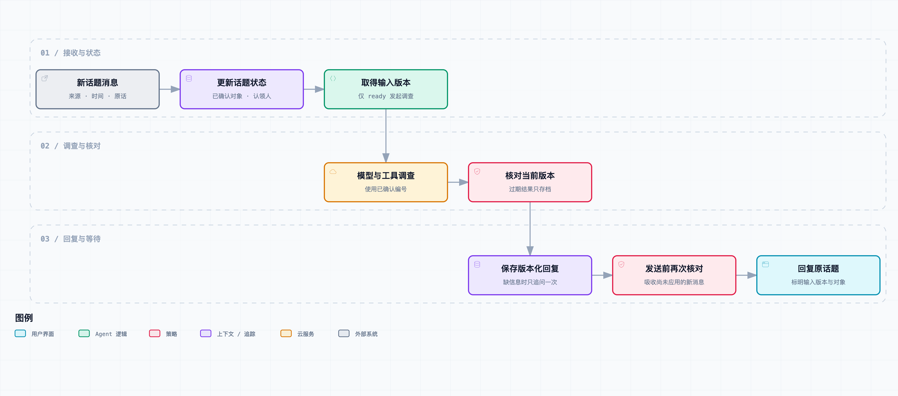

# 新消息来了：让 Demo 会追问、等待和继续调查

*人物与工单为虚构场景。本文使用合成消息和确定性回放验证状态变化；真实模型与飞书端到端调用尚未验证。*

门店负责人发来的首帖只有一句话：

“又没出来，帮忙看一下。”

Agent 问需要核对的订单信息。小林随后贴了一张订单详情截图，又补上门店编号。过了一会儿，店长说：“等下，不是这个单，这个已经取走了。”

与此同时，老周在下面回：“我在查，先别补打。”

如果把话题中的每条消息都独立交给上一版 Demo，麻烦就在这里：最初的问题缺信息，后面的订单号缺问题背景，“不是这个单”又推翻了刚才的输入。即使其中一次查询完成了，结果也可能对应已经被排除的那笔订单。

小林要的很简单：“信息不是都在这条话题里吗？能不能接着刚才的查？”

这一次，需要给 Demo 留下处理进度。它得记住自己问过什么、目前采用哪个业务对象、谁已经认领检查，以及哪些结果还有效。缺信息时先等，新消息来了再继续；有人纠正订单号，就让旧查询的结果退出当前结论。

这里还得处理一个容易忽略的时刻：查询已经发出，店长却在回复送达前改了信息。仅仅让模型再读一遍聊天记录不够，发送结果前也要核对它依据的是哪一版输入。

我们会从几种简单状态开始，把追问、等待、继续和人工接手接起来，再用这段乱序补充的对话验证。能不能顺利结束查询是一回事，能不能始终在查大家现在说的那张工单，是这一篇要解决的问题。

## 上一篇接住了消息，这一篇接住变化

这是[《从工单开始，做一个 AI Agent》](https://juejin.cn/column/7686674237757063206)的第 03 篇。第 01 篇做只读查询和证据回复，第 02 篇把消息接到飞书入口。本篇继续用同一套模型适配器、查询工具和合成订单，增加话题状态、等待与恢复，以及带版本的结果交付。

如果只把上面五条聊天拼接成一个字符串，模型可能知道店长改过订单号，也可能挑了最早出现的编号。即使这次选对，也不代表程序能知道“已经发出去的那次查询用的是哪一版输入”。

我们需要的不是让模型记住一句“请注意最新消息”，而是让执行器拥有可以检查的对象：当前订单、输入版本、调查状态和认领人。模型继续负责有边界的查询决策；是否允许启动、是否还允许回复，由这些字段决定。

先约定本章的限制：只实现单个业务对象的调查。话题里同时讨论两笔订单，或者支付问题和优惠券问题混在一起时，本版不会自动拆成子工单。复杂讨论的事实、分歧和任务分配，会在后续文章处理。

## 给话题留下一份可恢复的状态

新增代码在 `conversation.py`。它复用上一章的 Inbox 接收逻辑，增加三张表：

| 表 | 保存什么 | 为什么与原消息分开 |
| --- | --- | --- |
| `topics` | 当前输入版本、选定对象、状态、认领人、是否追问过 | Worker 不必每次猜当前在做什么 |
| `topic_runs` | 每次调查依据的版本、结果、当前有效或过期 | 旧结果不应被删除，也不能继续冒充当前结果 |
| `topic_outbox` | 每版回复、发送状态、平台消息编号 | 发送前还要核对一次输入版本 |

原始消息仍在 `inbox`，保留发送者、消息时间、内容及话题关系。`topics` 是按当前规则计算的状态，不是对原始讨论的替代。以后规则有改动，可以从原始输入重新分析，而不必相信某次摘要已经包含了全部信息。

一条话题的身份使用 `(tenant, root_id)`，避免把不同租户或不同话题串起来。对象编号单独放在 `reference`，更换订单不等于换一条话题。

本版状态如下：

| 状态 | 当前意味着什么 | 接下来允许做什么 |
| --- | --- | --- |
| `waiting_input` | 缺少足够的调查对象或问题信息 | 追问一次，然后等待 |
| `waiting_confirmation` | 编号出现冲突或被明确否定 | 等人明确选择对象 |
| `ready` | 已有当前确认的编号，且无人接手 | 可以发起一次调查 |
| `investigating` | 正按某一版输入查询 | 等结果，并继续接收新消息 |
| `human_owned` | 值班人员认领了本话题 | 暂停自动调查，继续保存消息 |
| `needs_human` | 已产出该版查询结果 | 等人工核对，不能自动关闭 |

这里没有 `resolved`。完成一次查询，不能证明顾客拿到饮品、门店恢复出单，更不能证明根因已经修复。客户没有再说话，也只会停在等待状态，不会被定时器改成“处理完成”。

## 不要每来一句话就再问一遍订单号

第一条“又没出来”进入后，状态变成 `waiting_input`。Worker 保存一条追问，并记住已经安排过追问。

问题不会固定写成“请提供订单号”。用户也可能在说后台登录失败、上传营销海报卡住，当前没有理由查询订单。因此本版先问正在操作什么功能、预期和实际表现；只有涉及支付或出单，才要求确认订单号或支付流水号。

如果对方回答“我找一下”，仍然没有业务对象，但也没有必要再发一条相同提示。追问已经送出，就保持等待。如果上一条追问尚未发送，新消息让它失效，程序会给当前版本保留一条追问，不会因为 `asked=1` 就永远不问了。

这一处很容易在代码里漏掉：去重追问和确保追问确实有机会送达，是两个不同要求。我们的测试同时检查了“已发后不重复”和“未发被替代后仍能发出一次”。

等待记录保存在 SQLite。重启进程，状态和 `asked` 都还在。它不会重新读第一句，再像第一次见到这个问题一样从头询问。

不过这里还没有智能的缺口清单：不会判断前端已经给出的版本号是否足够，也不会理解视频里已经显示了订单编号。这个阶段只做明确的对象确认和等待控制，还不能说已经做完了全部上下文工程。

## 先让关键动作明确，再逐步改善交互

模型可以从自然语言里提取候选编号，但“当前调查对象换成另一笔”和“有人接手了”会影响正在运行的任务，不能仅凭一句含糊表达静默改变。

本章先提供四个明确动作：

```text
/订单 P1002
/清除订单
/接手
/继续
```

第一条确认当前对象；第二条取消已选对象；第三条由配置中的值班人员暂停自动调查；第四条只能由当前认领人恢复。

首次出现单个编号时，Demo 可以把它作为初始查询对象。一旦已有编号，后面出现另一个，或者一条消息提到多个编号，就进入 `waiting_confirmation`，不猜哪个是真的。等待确认期间，再有人重复一个编号也不会自动选中，必须通过明确动作确认。

对开头“不是这个单”的场景，示例有少量确定性停止规则，包括“不是这个单”“单号错了”。它们只负责清除当前对象并等待确认，不负责猜新订单。这里没有运行自然语言意图模型，也不指望几条字符串判断就能覆盖客户的所有说法。

把这些操作先做成命令，是为了让状态变更可复现。之后可以把命令换成飞书按钮，或让模型提出结构化候选动作，再由人员确认。换交互形式时，底层的授权和状态检查仍应保留。

“老周说他在查”也不是已验证身份。示例绑定文件中的 `operators` 保存明确的发送者标识，只有这些人能 `/接手`。普通客户即使把昵称改成后端值班，也不会因此得到控制权限。本章只实现整条话题的认领，没有细分到“设备日志由谁查、支付流水由谁查”；任务级协作还没做。

## 查询发出去后，输入可能已经换了



[交互流程图](https://github.com/j-tide/juejin-article/blob/main/03-%E4%BB%8E%E5%B7%A5%E5%8D%95%E5%BC%80%E5%A7%8B%EF%BC%8C%E5%81%9A%E4%B8%80%E4%B8%AA%20AI%20Agent/03%EF%BD%9C%E6%96%B0%E6%B6%88%E6%81%AF%E6%9D%A5%E4%BA%86%EF%BC%9A%E8%AE%A9%20Demo%20%E4%BC%9A%E8%BF%BD%E9%97%AE%E3%80%81%E7%AD%89%E5%BE%85%E5%92%8C%E7%BB%A7%E7%BB%AD%E8%B0%83%E6%9F%A5/diagrams/conversation-version.html) · [图源](https://github.com/j-tide/juejin-article/blob/main/03-%E4%BB%8E%E5%B7%A5%E5%8D%95%E5%BC%80%E5%A7%8B%EF%BC%8C%E5%81%9A%E4%B8%80%E4%B8%AA%20AI%20Agent/03%EF%BD%9C%E6%96%B0%E6%B6%88%E6%81%AF%E6%9D%A5%E4%BA%86%EF%BC%9A%E8%AE%A9%20Demo%20%E4%BC%9A%E8%BF%BD%E9%97%AE%E3%80%81%E7%AD%89%E5%BE%85%E5%92%8C%E7%BB%A7%E7%BB%AD%E8%B0%83%E6%9F%A5/diagrams/conversation-version.workflow.json) · [SVG](https://github.com/j-tide/juejin-article/blob/main/03-%E4%BB%8E%E5%B7%A5%E5%8D%95%E5%BC%80%E5%A7%8B%EF%BC%8C%E5%81%9A%E4%B8%80%E4%B8%AA%20AI%20Agent/03%EF%BD%9C%E6%96%B0%E6%B6%88%E6%81%AF%E6%9D%A5%E4%BA%86%EF%BC%9A%E8%AE%A9%20Demo%20%E4%BC%9A%E8%BF%BD%E9%97%AE%E3%80%81%E7%AD%89%E5%BE%85%E5%92%8C%E7%BB%A7%E7%BB%AD%E8%B0%83%E6%9F%A5/assets/conversation-version.svg)

每应用一条新的有效消息，话题版本增加。比如：

```text
v1：只有“又没出来”，等待补充
v2：确认 P1001，开始查询
v3：改为 P1002，旧查询尚未结束
```

查询开始时取到的版本是 `v2`。模型返回后，不直接创建回复，而是重新读取当前状态：

```python
valid = (
    current["version"] == snapshot["version"]
    and current["status"] == "investigating"
)
```

如果当前已经是 `v3`，`v2` 的查询结果只进入 `topic_runs`，标为 `stale`。它仍然可能准确描述 `P1001`，但不再回答当前话题的问题。

这和“模型回答错了”不是同一种错误。证据内容可能没错，错误在于应用对象和时间已经不合适。给模型换一条更长的提示词，不能代替结果提交前的检查。

本例也没有强行中断已经开始的模型请求。旧请求可能继续产生耗时和费用，只是结果不再交付。取消和资源回收需要底层客户端配合，不能把“丢弃迟到结果”说成“已取消调用”。

为了避免模型重新选中原始描述里的旧编号，送去查询的文本单独包含当前已确认对象，原始现象中的编号被占位符替换。结果回来后，还会检查实际查询的 `reference` 是否与当前快照一致。若不同，不会把它作为该话题的成功回复。

这里的首次问题描述只是上下文的一部分。后续消息完整保存在 Inbox，但尚未全部整理进模型上下文；因此本章能接住对象更正和认领，不等于模型已经理解前后端讨论中的每个假设。

## 为什么还要在发送前检查一次

只在模型返回时检查，仍然有一个窗口：

1. 查询结果对应 `v2`，核对通过，进入待发列表。
2. 客户补充消息，输入变成 `v3`。
3. 发送器从待发列表取出旧回复。

因此每条 `topic_outbox` 也保存版本，发送器只认领与当前话题版本相同的记录。新消息应用时，尚未发送的旧记录改为 `superseded`。开始发送前还会先处理 Inbox 中已保存、却尚未应用到话题状态的消息。

最后这一点是为了处理进程崩溃：接收函数可能已经把输入保存到 Inbox，却没来得及更新 `topics`。如果发送器只读 `topics`，就会误以为没收到新消息。`_apply_pending()` 在接收后、调查前、结果提交前和发送前都可以运行，用原始输入补齐状态。

更新状态和创建本地回复记录都使用短事务。`BEGIN IMMEDIATE` 提前取得写事务，避免先读后写时再去争抢升级；SQLite 同时只能有一个写事务，仍可能在事务开始时遇到忙碌，但不能由此推导出系统有无限并发能力。[SQLite 事务说明](https://www.sqlite.org/lang_transaction.html)

模型调用和飞书网络请求都在事务之外。否则一次慢请求会占住数据库写入，新的客户消息反而无法及时落库，这会破坏我们原本想处理的“输入持续变化”。

还要承认最后一个边界：发送前检查结束之后，网络请求完成之前，仍可能到达新消息。本地数据库事务不能与飞书创建消息原子提交，所以本篇没有承诺回复永远对应用户看到的最新一瞬间。已发送回复明确带输入版本和确认编号，且不会被本例自动撤回。进一步需要版本化消息更新或补充更正机制。

## 乱序消息不能静默覆盖已经确认的对象

“后收到”不一定等于“后发生”。网络重投和连接恢复都可能让较早创建的消息晚到。

本版保存平台消息创建时间。如果迟到消息的时间早于当前已应用的事件，就标记为 `late_needs_review`，不拿它覆盖新对象。测试里先应用 `P1002` 的明确确认，再补进时间更早的 `P1001`，当前对象仍是 `P1002`。

这是一个保守取舍，不是完整的分布式消息排序。晚到的材料也可能很重要，当前版本只是保存并标记，尚未自动生成补充审阅提醒；运行人员需要检查这些记录。时间相同的消息也只能沿本地接收顺序处理。想恢复准确因果关系，还要结合回复关系、编辑事件和业务动作，而不是把一个时间字段当作所有事实的最终顺序。

## 用可控交错复现，不靠碰运气等网络变慢

[本篇代码快照](https://github.com/j-tide/juejin-article/blob/main/03-%E4%BB%8E%E5%B7%A5%E5%8D%95%E5%BC%80%E5%A7%8B%EF%BC%8C%E5%81%9A%E4%B8%80%E4%B8%AA%20AI%20Agent/03%EF%BD%9C%E6%96%B0%E6%B6%88%E6%81%AF%E6%9D%A5%E4%BA%86%EF%BC%9A%E8%AE%A9%20Demo%20%E4%BC%9A%E8%BF%BD%E9%97%AE%E3%80%81%E7%AD%89%E5%BE%85%E5%92%8C%E7%BB%A7%E7%BB%AD%E8%B0%83%E6%9F%A5/code.zip)包含前两章和新增话题状态；共享目录的[运行说明](https://github.com/j-tide/juejin-article/blob/main/03-%E4%BB%8E%E5%B7%A5%E5%8D%95%E5%BC%80%E5%A7%8B%EF%BC%8C%E5%81%9A%E4%B8%80%E4%B8%AA%20AI%20Agent/code/README.md)提供入口。默认第 02 篇模式仍可运行，本章通过 `--conversation` 开启，实验使用一个独立数据库。

```bash
python3 -m ticket_agent.feishu \
  --conversation \
  --db /tmp/ticket-agent-ch03.sqlite3
```

本地回放输入是 `fixtures/conversation-events.json`，所有人物标识和消息均为合成。它不连接飞书，也不请求模型服务，仍使用第 01 篇的固定回放器。

回放不使用 `sleep()` 去碰一个“刚好发生竞争”的时刻，而是在查询替身返回前插入更正事件：

```python
def interrupted(text, scope):
    add_correction_event()  # 当前话题从 v2 变成 v3
    return investigate(text, scope)
```

这样每次都能检查同一个交错顺序。真实环境当然有更多时序，脚本只能证明已设计的这条路径，不能代表所有并发条件。

实际回放结果：

| 阶段 | 当前版本 | 当前对象 | 状态 | 是否交付 |
| --- | --- | --- | --- | --- |
| 首帖缺少对象 | v1 | 空 | `waiting_input` | 一条追问 |
| 查询 P1001 时改成 P1002 | v3 | P1002 | `ready` | 旧查询不发 |
| 后端认领 | v4 | P1002 | `human_owned` | 不另起查询 |
| 认领人允许继续 | v5 | P1002 | `needs_human` | 交付 P1002 的证据 |

调查记录中恰好有两次运行：`v2/stale` 与 `v5/current`。回复记录中是一次追问和一次当前结果。这里的“交付”全部是本地替身发送器行为，不能读成已经在真实飞书话题发过消息。

继续运行：

```bash
python3 -m unittest discover -s tests -v
```

安装第 02 篇的可选 SDK 依赖后，本篇累计 45 项测试全部通过；未安装 SDK 时跳过其中 1 项契约测试。本章新增 13 项，除上面的竞争路径，还包括重启保留等待、普通用户不能认领、只有认领人能继续、冲突编号必须确认，以及发送前补齐尚未应用的输入。

实际长连接入口也可使用同一实现：

```bash
python3 -m ticket_agent.feishu --live --conversation \
  --db /tmp/ticket-agent-conversation-live.sqlite3 \
  --bindings /path/to/private-conversation-bindings.json
```

绑定格式参考 `fixtures/conversation-bindings.example.json`。延续上一章，真实运行需要应用与模型凭证、权限和测试群，本次仍未完成平台端到端联调。不要把第 02 篇运行库直接当迁移测试：本章保留旧模式的表和代码，用新数据库选择新模式，正式升级旧运行数据还需单独设计迁移。

## 回到“不是这个单”之后

在这份合成对话的回放里，小林先补了 `P1001`，查询尚未结束，店长又更正为 `P1002`。旧结果留在运行记录中，没有继续进入待发回复。

老周发出 `/接手` 后，小林看到状态停在人工处理中，没有再冒出一轮自动查询。

“所以我说错编号，也不会晚一点突然收到旧单子的结论？”她问。

“发送检查之前收到的更正会挡住旧结果。”我说，“已经发出去的内容，现在还不会自动撤回，所以回复里会标明版本和对象。”

老周确认可以继续后，Demo 查询当前订单。设备回执在合成记录里存在，但它仍然没有替门店证明顾客已经取到饮品。这个业务结果依旧要人核对。

小林又翻出一条优惠券话题：“这种没有支付流水，要先看活动规则的呢？”

当前版本只能保存等待和交接，不能解释优惠条件。下一篇给它接历史工单与知识库，同时检查另一个常见错误：找到一段很相似的旧案例，不代表这次也该照着同样的办法处理。
