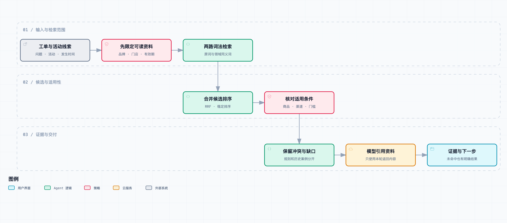

# 接上历史工单和知识库：让 Agent 有依据地查相似问题

*人物、工单与活动资料为合成示例。实际执行了本地检索和回归测试；没有把脚本回放写成真实模型效果。*

小林在同一天下午收到两条几乎一样的问题。

“这张券为什么用不了？”

第一家门店发来结算页截图，订单里有两杯饮品。第二家也有两杯，券面上的优惠金额一样。把文字抽出来看，连报错提示都相同。

小林翻到一张旧工单，里面的建议是确认商品是否参加活动。她刚准备照着追问，品牌运营补了一张活动配置截图：“这两家店不是同一批活动，第二家今天刚上线。”

一张券看起来一样，不代表适用条件一样。门店、商品、渠道、活动时间和叠加方式都可能不同。旧工单里的处理办法当时有效，也不说明今天仍然适用。

我们已经能在话题里接单、查询和继续对话，但它还不知道这些业务资料放在哪里。让客服每次替 Agent 找旧记录，显然没有减少多少工作。把整份知识库塞进提示词，又很难保证它选对那条规则。

这一篇接入历史工单和业务知识库。先根据当前问题找出品牌、门店、时间和活动线索，再检索适用的案例与规则，保留具体来源。命中旧工单时，要比较条件；发现资料相互矛盾时，要留下分歧继续查。

我们会用这两条相似问题检查检索有没有用：结果里出现了“优惠券”三个字远远不够。它需要帮调查选对下一步，也要允许一种结果——现有资料没有解释清楚，不能直接给顾客一个确定答案。

## 找到相似文字，只完成了其中一步

这是[《从工单开始，做一个 AI Agent》](https://juejin.cn/column/7686674237757063206)的第 04 篇。前三篇做了订单只读查询、飞书接收和话题状态。本篇给同一个执行器增加 `search_knowledge`，让它查活动资料和已确认的历史工单。我们先在独立的资料调查入口验证这个能力，尚未让飞书中的每条自由文本自动切换调查类型。

先看开头两家店的区别。我们把它们做成合成数据：每家都买两杯水果茶，每杯 16 元，活动商品金额都是 32 元。门店 A 的活动只包含奶茶，门店 B 当天新上线的活动包含水果茶。两个规则的门槛同为 30 元，报错描述也相似。

如果按照“优惠券用不了”搜索，A 的历史工单很容易排在前面。但把“商品未参加活动”套到 B，会让客服沿着错误方向继续追问。B 的资料条件能匹配，只说明现有资料没有解释它为什么失败，还需要核对实际配置、结算请求和页面表现。

所以本章把三个问题分开：

1. 我有没有权限读这份资料，它属于本次活动吗？
2. 它与当前问题是否相关，具体条件是否相符？
3. 即使相关且条件相符，它能支持什么结论？

第三个问题尤其容易被省略。历史工单可以支持“当时有人这样排查过”，不能直接支持“这次也是同一个原因”。规则文档可以支持“资料如此约定”，不能代替当前后台配置，更不能证明前端实际发了什么参数。

检索增强的基本思路是让生成过程使用外部资料。原始 RAG 研究讨论了带检索器的生成模型；本章并没有复现论文的训练方法，只借用“按问题取回资料再回答”的应用组织方式。[RAG 原论文](https://arxiv.org/abs/2005.11401)

## 工具从一个变成两个，执行器不用重写

前三篇的 `run_ticket()` 只认识 `lookup_order`。这次把“给模型哪些工具”和“程序实际执行哪些函数”拆成两个显式参数：

```python
run_ticket(
    text, scope, provider, OrderReader(),
    tools=[SEARCH_TOOL],
    handlers={"search_knowledge": reader.search},
    instructions=knowledge_instructions,
)
```

默认参数仍使用订单查询，之前的代码和测试继续运行。资料调查入口只开放检索工具，不把没有必要的订单查询暴露给这一轮模型。

工具名必须同时出现在声明和处理函数映射中，才会执行；仍然没有 `eval` 或按字符串任意查找函数。调用预算、参数解析、工具结果回传和最终引用核验沿用第 01 篇。

模型只能填写 `query`。品牌和门店继续由 `Scope` 绑定；活动、故障发生时间和已知资料的时间截点，由调用方提供 `KnowledgeContext`。本章这些信息由运行者明确填写，尚未实现从任意客户消息自动识别活动并验证身份，不能把人工输入的正确条件算成模型的提取能力。

这样做是为了先检查检索本身：条件明确时能不能找对；条件缺少时会不会乱补。等以后接入活动配置查询或确认卡片，再替换上下文来源，工具内部的范围检查仍然保留。

## 文档入库时，就要保留它的适用范围

知识库不是只有一段正文和一个向量。示例的 `fixtures/knowledge.json` 保存十份合成资料，每份有这些字段：

| 字段 | 作用 |
| --- | --- |
| `id`、`version` | 定位这一份资料及其版本 |
| `brand`、`stores`、`campaign` | 限定可读范围和所属活动 |
| `valid_from`、`valid_to` | 资料适用于哪一段业务时间 |
| `published_at` | 调查者最早何时能知道这份资料 |
| `approved`、`revoked` | 是否已经确认、是否被撤销 |
| `kind` | 区分规则和历史案例 |
| `requirements` | 本例可逐项比较的适用条件 |
| `text`、`source` | 正文及可回查的来源 |

一份规则今天发布，不代表它适用于昨天的结算；一份活动规则从昨天开始生效，也不代表昨天上午的值班人员已经拿到了修订版。因此 `occurred_at` 和 `known_at` 分开传入，时间必须带时区，不能让本机时区悄悄改变筛选结果。

筛选逻辑在排序之前执行：品牌匹配、门店属于范围、活动一致、资料已确认且未撤销、故障时间落在有效区间，并且发布时间不晚于调查的知识截点。有效区间采用左闭右开，刚到失效时刻的旧规则不能继续命中。

如果活动编号缺失，本篇入口要求补充，不自动搜索全品牌所有活动。商品和渠道缺失则保留为未知，后面做条件对比。这里区分了“缺少用于限定资料的关键范围”和“缺少用于判断规则是否满足的业务事实”，不能一律填默认值。

示例数据由开发者整理，本章没有实现知识库审核后台。`approved` 是测试输入，不是已经接通的企业审批系统。真实资料还需要明确谁能修改、谁确认过、为什么撤销；这些字段有了，不代表治理过程也自动有了。

## 先做一个能看清排序原因的检索基线



[交互流程图](https://github.com/j-tide/juejin-article/blob/main/03-%E4%BB%8E%E5%B7%A5%E5%8D%95%E5%BC%80%E5%A7%8B%EF%BC%8C%E5%81%9A%E4%B8%80%E4%B8%AA%20AI%20Agent/04%EF%BD%9C%E6%8E%A5%E4%B8%8A%E5%8E%86%E5%8F%B2%E5%B7%A5%E5%8D%95%E5%92%8C%E7%9F%A5%E8%AF%86%E5%BA%93%EF%BC%9A%E8%AE%A9%20Agent%20%E6%9C%89%E4%BE%9D%E6%8D%AE%E5%9C%B0%E6%9F%A5%E7%9B%B8%E4%BC%BC%E9%97%AE%E9%A2%98/diagrams/knowledge-retrieval.html) · [可编辑图源](https://github.com/j-tide/juejin-article/blob/main/03-%E4%BB%8E%E5%B7%A5%E5%8D%95%E5%BC%80%E5%A7%8B%EF%BC%8C%E5%81%9A%E4%B8%80%E4%B8%AA%20AI%20Agent/04%EF%BD%9C%E6%8E%A5%E4%B8%8A%E5%8E%86%E5%8F%B2%E5%B7%A5%E5%8D%95%E5%92%8C%E7%9F%A5%E8%AF%86%E5%BA%93%EF%BC%9A%E8%AE%A9%20Agent%20%E6%9C%89%E4%BE%9D%E6%8D%AE%E5%9C%B0%E6%9F%A5%E7%9B%B8%E4%BC%BC%E9%97%AE%E9%A2%98/diagrams/knowledge-retrieval.workflow.json) · [SVG](https://github.com/j-tide/juejin-article/blob/main/03-%E4%BB%8E%E5%B7%A5%E5%8D%95%E5%BC%80%E5%A7%8B%EF%BC%8C%E5%81%9A%E4%B8%80%E4%B8%AA%20AI%20Agent/04%EF%BD%9C%E6%8E%A5%E4%B8%8A%E5%8E%86%E5%8F%B2%E5%B7%A5%E5%8D%95%E5%92%8C%E7%9F%A5%E8%AF%86%E5%BA%93%EF%BC%9A%E8%AE%A9%20Agent%20%E6%9C%89%E4%BE%9D%E6%8D%AE%E5%9C%B0%E6%9F%A5%E7%9B%B8%E4%BC%BC%E9%97%AE%E9%A2%98/assets/knowledge-retrieval.svg)

本篇使用两个词法检索分支，不调用 Embedding，也没有把规则映射伪装成语义向量搜索：

- 原始分支：英文标识按连续字符取词，中文按相邻两个字切分，计算词集合交并比。
- 扩展分支：先用一个很小的领域词表，把“代金券”“抵扣券”归到“优惠券”，把“用不了”归到“无法使用”，再执行相同计算。

两条分支只对已获授权的候选资料排序，没有先全库搜索再让模型过滤。领域词表也是人工维护的，不是系统自己学出来的。

中文双字切分不需要额外依赖，容易复现，但会丢掉长词和语序，遇到反义句也不可靠。这里用它建立可检查的起点，并不认为它比成熟的全文检索或向量方案更好。

两个分支使用 RRF 合并名次：

```text
score(document) = Σ 1 / (60 + rank(document))
```

名次从 1 开始；某条分支没有返回该文档，就不加这一项。最终同分按文档 ID 排序，保证脚本回放稳定。RRF 合并的是名次，不要求两个检索器的原始分数在同一尺度上。[RRF 原始论文](https://cormack.uwaterloo.ca/cormacksigir09-rrf) · [Elastic 对 RRF 的说明](https://www.elastic.co/docs/reference/elasticsearch/rest-apis/reciprocal-rank-fusion)

但融合排序有一个容易被误解的地方：分数高，不等于资料真的适用，更不是“结论有 90% 可信”。如果两个分支都把旧规则排得很高，融合后只是更稳定地排错。品牌、时间和活动这些条件依然需要程序检查。

工具最多返回四份资料，并保留 `truncated` 标识。当前没有自动翻页和多次改写检索词策略；一旦结果被截断，不能声称已经检查了所有相关资料。案例只有十份，本章也没有给出检索延迟或海量数据下的性能结论。

## 条件不匹配和条件不知道，要给出不同结果

取到资料后，程序逐项对比渠道、商品和活动商品金额：

```python
if field in requirements:
    if value is None:
        unknown.append(field)
    elif value not in requirements[field]:
        mismatches.append(field)
```

金额使用整数分。两杯 16 元饮品构成 3200 分的活动商品金额；这里的字段不是每杯客单价，也不是扣完优惠之后的最终实付金额。真实营销系统中，计算门槛的金额口径必须跟规则一致，本章只使用资料中明确定义的口径。

结果有三种：`match`、`mismatch` 和 `unknown`。只要已知条件中有不符合项，整体标为不匹配，但未知项也会保留，不会被抹掉。

对于门店 A，水果茶不在活动商品集合里，结果是 `mismatch`，具体字段为 `product`。对于门店 B，水果茶、小程序和 32 元都满足资料中的条件，结果是 `match`。

第二个结果不能翻译成“这张券肯定能用”。我们还不知道客户实际选中的活动、前端提交的商品标识、服务端配置和结算计算是否与这些人工确认条件一致。它更适合作为下一步：现有资料不能解释失败，需要拿运行证据核对实现。

若不提供商品，A 的资料仍可检索，但对比结果为 `unknown`，列出待补充字段。这样 Agent 不必给所有问题都追问同一张长表，也不能用“看起来是奶茶”把未知填成已知。

## 历史案例要标明身份，资料冲突也不能藏起来

工具返回的引用不是单纯的文档摘要。它把资料类型、标题、版本、条件对比和缺口一起放入 `quote`，并保存内容哈希和来源：

```json
{
  "id": "doc:rule-b@1",
  "source": "fixture://knowledge/rule-b",
  "kind": "rule",
  "conditions": {"status": "match", "mismatches": [], "unknown": []},
  "conflict": false
}
```

完整结果还包括正文、时间和哈希。`fixture://` 指向合成数据的逻辑来源，不是可以在浏览器访问的企业知识库链接。读者可在代码包里按 ID 回查；真实系统应替换为有权限控制的资料地址。

历史工单的引用明确前缀为“历史案例，仅作排查线索”。第 01 篇的核验器继续要求模型原样引用本轮返回的证据，因此模型不能把这个前缀删除，再把过去的原因写成现在的原因。

对冲突也采取保守处理。合成活动 C 同时存在两份已生效规则：一个说满 30 元，一个说满 40 元。它们被标为同一个 `rule_key`，但结构化条件不同，工具返回 `conflicting_sources`，而不是选检索分数更高的那份当正确答案。

这个检测只覆盖本例约定的同一规则槽位，不是通用的自然语言矛盾识别。两个合法子活动可以有不同门槛，不能粗暴当成冲突；真实数据需要更细的规则标识和适用主体。正文里存在矛盾、结构化字段却一样时，本章也不会自动发现。

同样，引用核验只能证明回复忠于这次工具输出，不能证明文档真实，也不能证明结构化条件没有录错。资料与运行配置对不上时，必须继续调查，而不是再找一份看起来更权威的文字结束工单。

## 跑两条看起来一样的工单

下载[第 04 篇代码快照](https://github.com/j-tide/juejin-article/blob/main/03-%E4%BB%8E%E5%B7%A5%E5%8D%95%E5%BC%80%E5%A7%8B%EF%BC%8C%E5%81%9A%E4%B8%80%E4%B8%AA%20AI%20Agent/04%EF%BD%9C%E6%8E%A5%E4%B8%8A%E5%8E%86%E5%8F%B2%E5%B7%A5%E5%8D%95%E5%92%8C%E7%9F%A5%E8%AF%86%E5%BA%93%EF%BC%9A%E8%AE%A9%20Agent%20%E6%9C%89%E4%BE%9D%E6%8D%AE%E5%9C%B0%E6%9F%A5%E7%9B%B8%E4%BC%BC%E9%97%AE%E9%A2%98/code.zip)，解压进入 `code/`；也可以进入仓库的[共享代码目录](https://github.com/j-tide/juejin-article/blob/main/03-%E4%BB%8E%E5%B7%A5%E5%8D%95%E5%BC%80%E5%A7%8B%EF%BC%8C%E5%81%9A%E4%B8%80%E4%B8%AA%20AI%20Agent/code/README.md)。不需要安装向量数据库。

```bash
python3 -m ticket_agent.research '两杯水果茶，优惠券用不了' \
  --campaign campaign-a --store store-001 \
  --at 2026-09-18T14:00:00+08:00 \
  --known-at 2026-09-18T14:10:00+08:00 \
  --channel miniapp --product fruit-tea --basket-cents 3200
```

把活动和门店改成 B：

```bash
python3 -m ticket_agent.research '两杯水果茶，优惠券用不了' \
  --campaign campaign-b --store store-002 \
  --at 2026-09-18T14:00:00+08:00 \
  --known-at 2026-09-18T14:10:00+08:00 \
  --channel miniapp --product fruit-tea --basket-cents 3200
```

实际对照如下：

| 回放条件 | 资料结果 | 允许得出的结论 |
| --- | --- | --- |
| A 店、活动 A、两杯水果茶 | 规则与历史案例，商品条件不匹配 | 资料不支持当前商品参加活动 |
| B 店、活动 B、同样的购买描述 | 当日生效规则，条件匹配 | 资料尚不能解释本次失败 |
| A 店但商品未知 | `needs_context` | 先确认商品，再比较条件 |
| 活动 C、规则门槛相互矛盾 | `conflicting_sources` | 先核对实际活动配置 |
| 查询打印机断电 | `no_match` | 当前优惠资料没有回答这个问题 |

测试中，过期版本、调查时尚未发布的版本、未确认案例、已撤销资料以及不属于当前范围的文档，都没有混入结果。这里没有用真实顾客消息，也没有把五条回放结果统计成模型正确率。

```bash
python3 -m unittest discover -s tests -v
```

装有前篇可选飞书 SDK 的环境中，累计 58 项测试全部通过，本章新增 13 项。没有 SDK 时跳过其中一项契约测试，其余不依赖网络。

默认 provider 仍为 `scripted_replay`，它按固定策略发起一次检索，并原样组织证据。添加 `--live` 才会使用环境变量里的模型凭证；本次没有真实模型调用条件，所以只验证了检索、执行器和脚本回放。两个词法分支的效果也没有与 Embedding 检索做真实工单对照，不能宣称它们更准确。

这一章新增的是可被 Agent 调用的资料查询能力和显式调查入口。飞书长连接仍沿用前三篇路径，还没有接上自动活动识别、资料模式路由和上下文确认表单。这个集成缺口写出来，比把本地工具调用说成客服已经可以直接用更有帮助。

## 再看那两条“券用不了”

小林把两条回放结果放在一起：“A 这边是资料说水果茶不参加；B 这边规则条件对得上，所以不能让第二家照着第一家的办法处理。”

“还要看资料和实际配置是不是一致。”老周说，“尤其是今天新上的活动。条件对上了，只是少了一个解释，不代表没故障。”

运营能看到引用的活动和版本，客服也能说明哪些条件已经核对、哪些没有。历史工单留作线索，没有成为一个被照搬的结论。

第二家店随后又发来一段录屏：“规则我看过了，实际点的时候是这样。”

前几篇一直把附件列为未解析材料。现在要把它们真正处理起来：保留截图里的可见文字、视频中错误提示出现的时刻，并让后面的每个判断还能回到原始画面。
