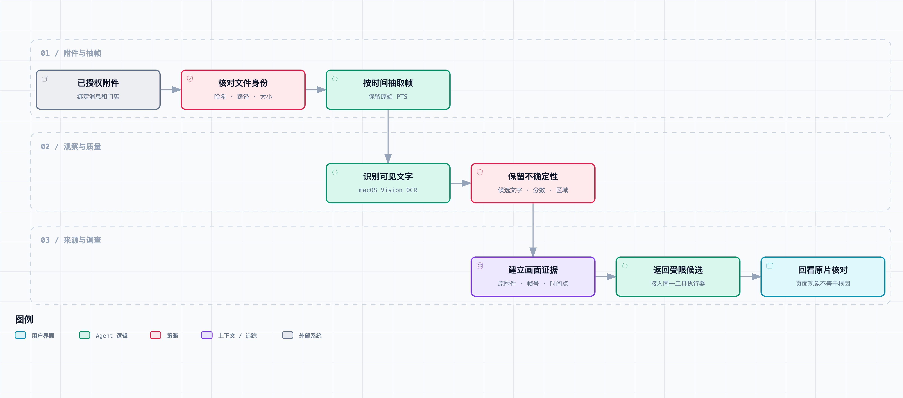

# 看懂图片和演示视频：把客户操作变成可回查的证据

“我点了几次都正常。”阿杰在话题里回了一句。

门店负责人很快发来一段录屏：“你看这个，顾客就是这么点的。”

顾客选了两杯水果茶，结算页显示 32 元。点下确认支付，页面短暂闪过一条提示，又停在原处。只看最后一帧，没有明显报错；把中间那一小段放慢，才能看清“价格已更新，请重新确认”。

小林问：“那现在该查价格，还是查按钮没反应？”

原始文字写的是“点不了支付”。如果 Agent 只拿这句话去搜，网络、按钮事件、支付服务都可能被列进排查范围。客户已经上传的画面，却没有参与调查。

这是[《从工单开始，做一个 AI Agent》](https://juejin.cn/column/7686674237757063206)的第 05 篇。上一版能按活动条件查资料，这次让附件提供可回查的线索。人物和工单仍是虚构场景；下面的抽帧和 OCR 实验实际运行过，输入是代码生成的合成视频，没有使用客户资料。

## 先分清画面告诉了我们什么

这条提示能支持“页面出现过价格变化提示”，暂时支持不了“优惠券计算错了”。后台可能返回了不同金额，也可能只是价格版本变化；还可能是前端对一个异常码的统一展示。要判断哪种情况，需要继续读代码和查运行记录。

图片与视频进入 Agent 后，常见的错误是把观察和解释混在一个摘要里。比如模型写出“顾客使用优惠券导致支付失败”，这句话同时添加了因果关系、后台状态和支付结果，画面本身并没有给出这些证据。

我们先收窄这版能力：识别截图和视频采样帧中的文字，把候选文字、位置、时间和原始附件关联起来。没有动作识别，没有语音转写，也没有训练一个会理解所有门店操作的视频模型。前面的故事提供业务背景，实验只检验其中“短暂提示是否被采到并识别”这一件事。



[打开交互流程图](diagrams/media-evidence.html) · [查看可编辑规格](diagrams/media-evidence.workflow.json)

流程分成两层。`MediaReader` 负责处理已授权的本地附件；`media_handler` 把它包装成 Agent 工具，限制模型能查的附件和返回量。第 02 篇保存的飞书附件引用还没有自动下载到这一层，这次使用本地授权目录演示。接真实飞书资源接口时，还需要把租户鉴权、资源获取和失效处理补到入口。

## 不能只保存一句识别结果

假设回复写着“视频里出现价格更新”。阿杰要复核时，仍然得从头播放一遍。换成下面的记录，就能回到具体位置：

```json
{
  "source": "attachment://checkout#frame=12",
  "media_time_s": 1.2,
  "frame_index": 12,
  "text": "价格已更新，请重新确认",
  "confidence": 0.5,
  "certainty": "uncertain_text",
  "event_at": null
}
```

实际记录还带附件 SHA-256、原消息 ID、接收时间和文字框位置。完整结构见 [media.py](../code/ticket_agent/media.py)。

这里有三个容易混淆的时间：消息接收时间、视频播放时间、业务事件发生时间。视频第 1.2 秒只是相对位置；客户可能晚了十分钟才上传，也可能发的是上午的录屏。因此 `observed_at` 保存接收记录的时间，`media_time_s` 保存帧时间，`event_at` 保持空值，不能把上传时间自动当成下单时间。

位置来自 OCR 的归一化文字框，坐标原点在左下角。以后做浏览器高亮，如果页面坐标原点在左上角，需要转换纵坐标；否则文字能认对，框却画到了另一处。我们把这个坐标约定保留在字段名里，不让消费者猜。

SHA-256 则用于确认复核时拿到的是同一份附件。它不证明附件内容真实，也不证明文件来自可信客户；它只解决“这次解析的字节和登记时是否一致”。授权范围仍然由品牌、门店及附件目录约束。

## 做一个会漏掉提示的实验

样本是一段 720×960、10 fps、3 秒、无音轨的视频。两杯饮品合计 32 元，提示仅出现在第 11、12、13 帧，对应区间 `[1.1, 1.4)` 秒。输入生成器和真值文件放在 [fixtures/media](../code/fixtures/media/)，内容明确标注为合成演示。

[下载实验视频](../code/fixtures/media/checkout.mp4)。下面这张图是从视频第 12 帧实际解码得到的，不是另画的一张示意图。


先每秒抽一帧。采样点在 0、1、2 秒，正好避开提示。然后由操作者把窗口缩到 0.8—1.6 秒，改成每秒 5 帧，采样 0.8、1.0、1.2、1.4 秒。这个窗口是人工指定的，不能写成 Agent 自己已经学会定位可疑片段。

| 策略 | 处理帧数 | 提示文字结果 |
| --- | ---: | --- |
| 全段 1 fps | 3 | 没有匹配到 |
| 局部 5 fps，0.8—1.6 秒 | 4 | 1.2 秒帧出现候选，置信分数 0.5 |

这次使用 macOS Vision 的文字识别，FFmpeg 负责解码，FFprobe 提供帧时间。本地环境是 macOS 27.0、FFmpeg 8.1.2，结果保存在 [experiment-results.json](../code/fixtures/media/experiment-results.json)。没有调用云模型 API。

它不是准确率测试。只有一个人为安排提示时机的样本，能说明这种稀疏采样会漏掉短提示，以及局部加密在这个样本上找到了候选。换一台设备、一个字体或一种编码，OCR 输出和分数可能变化，不能从这张表推导线上识别成功率。

为什么不一开始就处理每一帧？因为成本随采样数增加。十几秒录屏还容易接受，几分钟的视频加上几十张截图，很快会把值班队列占满。实际系统可以先做低成本扫描，再对客户指出的时间段或候选变化区间加密；代价是没采到的区间仍然未知，回复不能省略这个限制。

## 帧号和时间要来自解码结果

代码没有用“第 N 张导出图片 × 抽帧间隔”冒充原视频时间。它先读取 `best_effort_timestamp_time`，根据这些时间选择原始帧号，再用 FFmpeg 的 `select` 导出对应帧。

```python
selected = sample_frames(times, fps=5, start=0.8, end=1.6)
# 当前样本：[(8, 0.8), (10, 1.0), (12, 1.2), (14, 1.4)]
```

这种方式保留了原视频中的位置，适合演示固定频率采样。遇到可变帧率视频，也不把帧号除以一个假定帧率当成时间。如果容器没有可用时间戳，当前实现直接返回元数据错误，不补一个看起来合理的时间。

导出后检查帧数是否和选择结果一致，再逐帧 OCR。临时 PNG 在处理完成后清理，原视频、帧号、时间和哈希用于重新提取。本文展示的一张实验帧单独保留，读者可以直接看，不必先安装工具。

## 识别正确的文字，也可能只有低分

这次提示文字识别对了，但 Vision 返回的分数是 0.5。代码用 0.8 作为演示阈值，把它标为 `uncertain_text`，没有为了让结果好看就改成高置信度。

这个阈值没有经过业务数据校准，分数也不是“这句话有 50% 概率正确”。它只是识别器的候选置信分数，适合决定是否提示人工回看，不能直接当成诊断概率。换场景后应当用标注样本评估阈值，而不是沿用一个小数就算完成验收。

同一次 OCR 还把画面里的“优惠券”识别成了“优惠劵”。对人来说容易理解，对按字匹配的工具却可能造成漏检。当前工具按查询文字做子串匹配，因此查“价格已更新”能命中，查一个被识别错的完整句子可能查不到。后续可以增加别字候选或文本相似匹配，但匹配放宽后，要继续保留原始候选，不能把修正后的词悄悄当成原文。

同样，画面上的“确认支付”是按钮文字，不是支付成功记录；“优惠券待核对”是页面状态，不是后台优惠资格判断。OCR 做完，只是多了一组有位置的观察。

## 把解析能力注册成一个受限工具

[MEDIA_TOOL](../code/ticket_agent/media.py) 只让模型传 `query`。附件 ID、采样频率和时间窗口由应用层绑定，模型不能把一个路径或 URL 塞进参数，让工具去下载别人的文件。

```python
from ticket_agent.media import MEDIA_TOOL, MediaReader, media_handler

reader = MediaReader('/tmp/vision-ocr')
handler = media_handler(reader, 'checkout', fps=5, start=0.8, end=1.6)
# 交给现有执行器：
# tools=[MEDIA_TOOL], handlers={'inspect_media': handler}
```

调用结果最多返回 6 条匹配候选，超出时标记 `truncated`。每条候选的引用文字包含不确定标记和“不是后台执行证据”。现有执行器要求最终答案原样带回全部本轮证据，脚本化测试验证了模型若删掉这个限定，会被拒绝。

这也不代表任意自然语言解释就都可靠了。当前回复约束比较保守，适合把“发现了什么”交给值班人员；它没有自动把附件、订单和资料组织成完整调查，也没有让模型自行选择最佳视频片段。工具协议是后续接入点，真实模型对它的调用效果尚未测试。

## 附件处理本身也需要预算

本地目录按品牌和门店过滤，文件必须位于登记目录内，内容哈希必须匹配。演示限制单文件 20 MB、视频 20 秒、画面 400 万像素、最多处理 40 帧，采样频率上限 10 fps。预算超出直接返回状态，不静默删掉后半段，再声称“完整看完”。

外部命令通过参数列表调用，没有让模型生成 Shell；FFmpeg 和 FFprobe 只允许本地文件相关协议。每个子进程最多运行 30 秒。这是单条命令超时，不是整个附件任务 30 秒硬截止，逐帧识别累积仍可能更长。

这些约束只是 Demo 的输入边界。实际接客户附件，还要考虑解码库隔离、并发限额、存储保留期、用户撤回后的清理，以及录屏里的个人信息。当前既没有生产隔离沙箱，也没有自动隐私脱敏，因此使用的都是可公开的合成输入。

失败也要区分。`hash_mismatch` 表示内容变化，`attachment_unavailable` 表示登记文件不可用，`frame_budget_exceeded` 表示采样计划超限。它们都不是“视频里没问题”。`no_matching_text` 也只表示选中帧的 OCR 候选没有命中，不能扩展为整段视频没有这个提示。

## 在本机重跑

[本篇代码快照](code.zip) 包含累计源码、测试、已生成视频和实验记录。解压后进入 `code/`。Python 使用 3.11+；原生 OCR 路径需要 macOS、Swift 编译器和 FFmpeg。其他平台仍可运行纯 Python 的逻辑测试，但没有实现替代 OCR 后端。

```bash
swiftc scripts/vision_ocr.swift -o /tmp/vision-ocr
python3 -m ticket_agent.media checkout --ocr /tmp/vision-ocr --fps 1
python3 -m ticket_agent.media checkout --ocr /tmp/vision-ocr --fps 5 --start 0.8 --end 1.6
python3 -m ticket_agent.media notice --ocr /tmp/vision-ocr
TICKET_OCR_BINARY=/tmp/vision-ocr python3 -m unittest discover -s tests -v
```

本次装有前文固定的飞书 SDK，并设置了 OCR 路径，累计 70 项测试全部通过，包含真正解码和识别该视频的集成测试。不设 OCR 环境变量会跳过原生集成测试；没有飞书 SDK 时还会跳过对应 SDK 契约测试。

需要重新生成视频时，再安装 Pillow；本次生成使用 Pillow 12.3.0。生成器用 `--font` 接收本机可用中文字体，仓库没有分发系统字体。直接重跑识别不需要 Pillow。具体说明见[共享代码运行文档](../code/README.md)。

## 回到话题里

阿杰点开 1.2 秒处的画面，重新看了一遍。

“提示对得上。先查价格更新的分支，别直接写支付按钮没响应。”

小林问：“那能说优惠券算错了吗？”

“还不能。识别结果分数也不高，先人工确认文字。视频没有后台返回值。”

她在调查记录里留下候选文字、帧位置和待核对项。客户不必再把视频重述一遍，研发也知道接下来该从哪里查。

阿杰接着打开结算页：“我找一下这句话在哪个分支弹出来。”

老周补了一句：“先确认门店用的是哪个版本。主分支的代码，不一定就是出问题时的代码。”

下一篇从这个问题开始，把只读代码工具接上，并区分“源码里存在一条路径”和“本次请求确实走过这条路径”。

## 参考资料

- [Apple：Recognizing text in images](https://developer.apple.com/documentation/vision/recognizing-text-in-images)：文字识别请求及结果处理。
- [Apple：VNRecognizeTextRequest](https://developer.apple.com/documentation/vision/vnrecognizetextrequest)：本文使用的 Vision 请求类型。
- [FFprobe 官方文档](https://ffmpeg.org/ffprobe.html)：流、帧和时间信息的读取方式。
