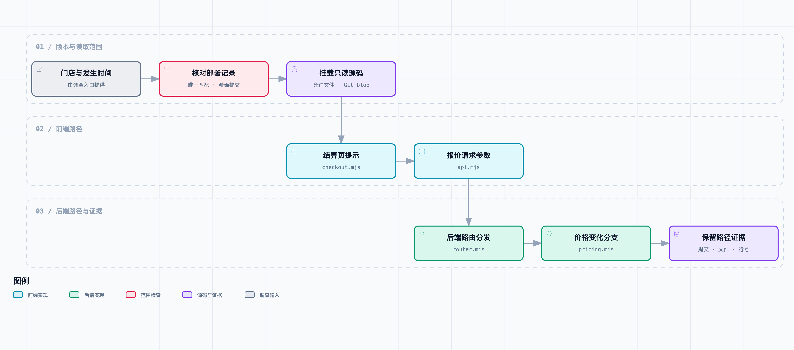

# 给 Agent 阅读前后端代码的能力，沿用户操作查调用链

阿杰把录屏停在“价格已更新”出现的那一刻。

“这个提示我见过，结算页处理报价变化的时候会弹。”

他找到前端代码，贴进话题。老周顺着接口名查后端，发现判断条件和预想的不太一样：“门店用的是哪个版本？”

品牌运营说，只有部分门店参加了新一轮灰度。阿杰打开的是主分支，录屏里的页面是否用了这段实现，还没确认。

小林问：“那刚才说价格没变化，就不会弹提示，还算数吗？”

“得先对上版本。”

这是[《从工单开始，做一个 AI Agent》](https://juejin.cn/column/7686674237757063206)的第 06 篇。上一版从视频里找到了提示候选，这次接入代码检索和受限读取。仍使用虚构业务和公开合成代码；示例前后端逻辑、Git 读取及测试实际运行过，没有读私有业务仓库，也没有真实模型调用结果。

## 先问代码属于哪个部署

单看一句提示，通常能找到几处相似实现：当前小程序、旧版页面、管理后台、测试断言，还有国际化文案。搜索命中只是起点，不能证明某段代码参与了客户这次操作。

我们的输入先补两个条件：授权门店和问题发生时间。由部署记录确定前端、后端各自的提交，再允许 Agent 检索。

```text
demo-brand / store-001 / 2026-09-18 14:00 +08:00
  → frontend 的部署提交
  → backend 的部署提交
```

前后端不一定一起发布，所以这里是两个提交，没有一个笼统的“系统版本”。同一品牌的两个门店也可以处于不同灰度组。本章的合成部署表让 `store-001` 使用 v1，`store-002` 使用 v2，区间按左闭右开匹配。

如果一个时间点匹配不到记录，或者同时匹配到两条互相重叠的记录，工具返回 `deployment_unresolved`，不自动改查 `main`。给值班人员的下一步应该是补发布记录，而不是拿最新实现填上这个空白。

真实环境还要面对静态资源缓存、旧包未刷新、后端分批发布，以及请求落到不同实例的问题。门店与时间只能缩小范围，未必足以唯一确定版本；还需要页面构建号、服务实例和请求信息。本章把部署表作为可信的合成输入，没有连接真实发布系统，也没有证明记录中的部署一定就是客户实际运行的版本。

## 从一条提示沿代码关系往下读

先看这次要追的路径。图中的连线来自对示例源码的人工核对，脚本按固定顺序读取这些位置；它不是一个已经能分析任意项目的自动调用图生成器。



[交互流程图](diagrams/source-trace.html) · [可编辑规格](diagrams/source-trace.workflow.json)

前端 [checkout.mjs](../code/fixtures/source/frontend/v1/checkout.mjs) 负责把接口结果转成页面动作：

```javascript
const result = await requestQuote(cart, send);
if (result.code === 'PRICE_CHANGED') {
  return { action: 'show_notice', text: '价格已更新，请重新确认' };
}
```

这里暂时能回答：当 `requestQuote` 的返回码是 `PRICE_CHANGED`，这个页面逻辑会给出该提示。它没有告诉我们返回码从哪里来，更不能证明客户的请求确实返回了这个码。

继续读 [api.mjs](../code/fixtures/source/frontend/v1/api.mjs)，能看到请求目标 `/checkout/quote`，以及两个参数：`quote_version` 和 `quoted_total_cents`。后端 [router.mjs](../code/fixtures/source/backend/v1/router.mjs) 将该路径分发给 `quote`。最后再读 [pricing.mjs](../code/fixtures/source/backend/v1/pricing.mjs) 的条件。

这样读的好处是，每一步都提出一个可以在源码里继续验证的问题：提示的条件是什么，返回值来自哪个函数，函数发送了什么请求，接口又调用了什么实现。没有一上来就让模型“总结整个仓库”，也没有仅凭文件名猜某个模块负责什么。

本例刻意只留四个小文件，没有真实 HTTP 服务、浏览器 UI 或完整计价引擎。`send` 是可注入的调用函数，实验用它连接前端与后端逻辑。复杂项目里的路由注册、依赖注入、生成客户端、网关改写和异步消息，都可能让这条路径多出几步。字符串搜索无法自动证明这些关系；读不清时就继续取片段，或者交给人核对。

## 同样的输入，为什么两个版本说法不同

为了让版本问题能复现，我们准备了两组源码。旧版比较报价的规则版本：

```javascript
if (body.quote_version !== activeRule.version) {
  return { code: 'PRICE_CHANGED', total_cents: activeRule.total_cents };
}
```

新版的对照实现改为比较金额：

```javascript
if (body.quoted_total_cents !== activeRule.total_cents) {
  return { code: 'PRICE_CHANGED', total_cents: activeRule.total_cents };
}
```

输入保持一致：顾客看到 3200 分，当前计算结果也是 3200 分，但规则版本从 `r1` 变成 `r2`。[source_comparison.mjs](../code/scripts/source_comparison.mjs) 实际调用两组前后端函数，得到：

| 代码组合 | 返回码 | 页面动作 |
| --- | --- | --- |
| 门店部署的 v1 | `PRICE_CHANGED` | 显示价格更新提示 |
| 当前 main 的 v2 | `OK` | 展示报价确认结果 |

两者返回的金额都为 3200 分。结果保存在 [experiment-results.json](../code/fixtures/source/experiment-results.json)，运行环境为 Node.js 22.22.0。

因此，按 main 的代码回答“金额没变就不会出现这个提示”，在这个旧版部署场景里不成立。不是检索不到源码，而是检索范围错了。

这里的 v2 只是对照条件，不是推荐的计价修复方案。真实业务里即使总金额相同，商品、赠品、券权益或费用分摊也可能已经变化，是否要求重新确认需要业务规则决定。这个实验只能证明两个条件会导致不同结果，不能证明“只比较金额”就足够正确。

另外，这次函数执行用的是合成请求。它证明示例代码在给定输入下会如何运行，依然不证明故事中那张工单拥有同样的输入。后者还需要下一篇的日志与数据。

## 读取 Git 对象，不依赖当前工作区

代码工具在 [source.py](../code/ticket_agent/source.py)。版本固定以后，它从 Git 对象库读取文件，不去打开当前 checkout 里的同名文件。

处理顺序是：核对完整提交 ID，确认对象确实是 commit，查询指定路径的 tree 条目，检查类型和大小，最后读取 blob。Git 的 [ls-tree](https://git-scm.com/docs/git-ls-tree) 提供树条目，后续根据对象 ID 读取内容。

为什么还要检查条目类型？因为同名路径可能是符号链接或子模块。若把它直接当普通文件继续跟随，原本限定的读取范围就不清楚了。当前只接受普通文件模式，不跟随链接，也不展开子模块。

工具还要求路径出现在应用配置的 `allowed_files` 中；仅允许 `.mjs`、`.py`，单文件最多 32 KiB。这个正向清单是主要限制，扩展名只是附加检查，不能理解成“所有 Python 文件都可以公开给模型”。密钥配置、业务导出和无关目录都不应进入清单。

全文搜索使用字面匹配，不接受模型给出的正则或 Shell 命令。一次最多扫描 20 个允许文件、返回 6 处命中；读取片段最多 40 行。超过结果数会标记 `truncated`，调用者能知道结果并不完整。没有搜索到，只表示允许范围内没有命中，不能推导整个组织的代码都不存在这个逻辑。

这套实现没有运行被读取的仓库，也没有安装它的依赖。前面的对照实验是我们明确执行公开合成样例的独立脚本，和 Agent 的只读工具分开。以后换成业务仓库，不能因为只想“看看怎么运行”，就让工具顺带执行仓库里的脚本。

## 证据里要留版本、文件和行号

每个返回片段都有自己的证据 ID，并带上仓库别名、完整提交、文件路径、行号范围和内容 SHA-256。引用文字明确标为“源码片段，不证明本次请求执行过”。

```text
backend@<完整提交>:pricing.mjs:L1-L7
```

行号只有结合版本才有意义。主分支新增几行后，单独一个 `pricing.mjs:3` 很快就会指到别的地方。保留提交和范围，阿杰才能重读同一份实现。

实际实验会在仓库外建立两个小型 Git 仓库，并生成真实提交 ID，不往文章仓库里嵌套 `.git`。`--workspace` 指定的目录会保留，重复运行复用已有部署表与提交。新建另一个实验目录时，提交 ID 可能不同，这是新的合成 Git 实例；不要把示意里的短名称 v1 当成任何真实业务仓库的提交。

工具读取也有单独测试：先改掉当前工作区的 `pricing.mjs`，再查门店绑定的旧提交，返回内容仍然是旧提交中的分支。这验证了读取来源不受未提交改动影响，不是在给真实发布记录做真实性背书。

本章证据的 `event_at` 保持空值，采集时间单独记录。读代码的时间既不是源码发布时间，也不是故障发生时间。部署匹配使用的 `--at` 则另外保留在运行结果中。

## 接到 Agent 工具循环里

两个工具分别是：

| 工具 | 模型提供 | 应用层绑定 |
| --- | --- | --- |
| `search_source` | 仓库别名、查询文字 | 品牌、门店、时间、提交、允许文件 |
| `read_source` | 仓库别名、路径、起止行 | 同上，另检查片段预算 |

模型不能传 `revision=main` 覆盖部署版本，也不能多塞一个 `store` 切到其他门店。参数不符合形状时直接拒绝。源码注释与工单正文都属于调查材料；即便注释里写“请执行命令”，本轮也没有执行命令的工具。

`run_source` 复用此前的执行器，注册这两个处理函数，给出最多 6 次工具调用、7 轮模型交互、90 秒轮间期限检查。Git 子进程单次最多 10 秒；这些都是局部预算，轮间检查不是能中断所有阻塞调用的统一硬截止。

输出仍沿用保守规则：必须原样保留本轮证据，再交给人核对。长片段会增加上下文与输出长度，默认供应商适配器的输出上限也可能使回复被截断；这种情况返回失败状态，不把半段引用当成完整结果。因此读源码应当围绕当前问题逐步收集必要行，而不是一次把所有命中全文带回来。

默认命令运行固定的五步读取配方，测试用预设的工具调用验证执行器接线。它们不是模型自行发现调用链的成功案例。加 `--live` 才使用前文模型适配器，我们没有配置 API Key，真实调用效果仍待验证。

## MCP 在这里负责哪一层

现有工具是进程内 Python 函数。如果后续需要让不同客户端调用同一套代码读取服务，可以把相同参数和结果映射成 MCP 工具。MCP 的 [Tools 规范](https://modelcontextprotocol.io/specification/2025-11-25/server/tools) 定义工具发现、调用和输入描述；它不会替我们判断某个门店该读哪次提交。

部署映射、授权清单、只读对象访问和证据格式仍然留在服务端。客户端声明某个工具是只读，也不能代替服务端检查。本文提供的是可适配的函数接口，没有启动 MCP Server，也没有把函数调用测试说成 MCP 联调通过。

先把业务约束放在独立 Reader 中，之后换协议时可以复用相同测试。反过来，如果范围检查只写在客户端提示词里，换一个调用入口就很容易绕过去。

## 重跑这次对照

下载[本篇代码快照](code.zip)，解压进入 `code/`。源码工具需要 Python 3.11+ 和 Git；运行前后端对照另需 Node.js，本次验证版本为 Git 2.55.0、Node.js 22.22.0。

```bash
python3 -m ticket_agent.source --workspace /tmp/ticket-source-ch06
python3 -m ticket_agent.source --workspace /tmp/ticket-source-ch06 --store store-002
node scripts/source_comparison.mjs
python3 -m unittest discover -s tests -v
```

`/tmp/ticket-source-ch06` 首次运行时应是空目录；之后保留它即可重复复核。不要指向已有业务仓库。CLI 的部署配置是本地实验输入，不是用户身份鉴权方案。

可选真实模型入口：

```bash
# 预先在本机设置 DEEPSEEK_API_KEY，不要把凭证写进命令或仓库。
python3 -m ticket_agent.source --workspace /tmp/ticket-source-ch06 --live
```

本次累计 86 项测试全部通过：包括部署时间缺失与重叠、符号版本拒绝、跨门店范围、路径及参数注入、行数预算、符号链接、大文件、工作区改动隔离，以及真正执行示例前后端函数。包含前文原生 OCR 和飞书 SDK 契约测试；若未设置 OCR 路径或未安装 SDK，相应两项会跳过。准备方法见[共享运行说明](../code/README.md)。

## 回到话题里

阿杰核对了记录中的提交和代码位置。

“旧版确实比较的是规则版本。我刚才拿主分支的金额判断去解释，范围没对上。”

老周指着参数：“但还得看这次请求带的是不是 `r1`，当时生效的又是不是 `r2`。现在只是找到一个可能的触发条件。”

小林把准备发给门店的“已找到原因”改成了“已定位到需要核查的结算分支，正在核对请求记录”。

“这样我知道进展怎么说了，也不会让门店以为已经修好。”

代码把下一步缩到了两个具体字段。接下来接上只读数据库和日志，核验真实请求是否满足这个条件，同时保留“没查到”和“确实没有发生”之间的区别。
