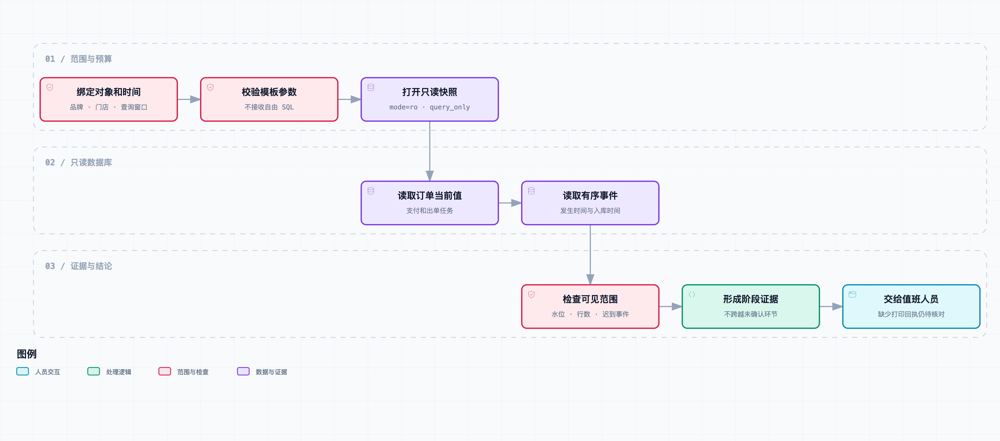

# 接上只读数据库和日志，让代码推断得到验证

老周贴出查询结果：“订单支付状态是成功。”

店长回了张打印机旁边的照片：“钱肯定付了，我现在是没找到小票。”

又一条记录被贴进来，出单任务显示发送成功。小林问：“这个成功，是发出去了，还是店里已经打出来了？”

话题里出现了两个“成功”，柜台那边却还在等。支付记录、订单创建、任务发送、设备打印，说的是不同阶段。把前一个状态当成后一个阶段已完成，就会让调查提前结束。

这是[《从工单开始，做一个 AI Agent》](https://juejin.cn/column/7686674237757063206)的第 07 篇。上一版能读部署版本对应的代码，这次回到最初的“付款但没出单”工单，把 JSON 查询适配器扩展成真正以只读连接访问的 SQLite 查询。人物、业务和数据是合成示例；下面的 SQL、事件对照和权限测试实际运行过，没有连接生产数据库。

## 从可能的路径，转向这笔订单的记录

代码能告诉我们：任务在哪个条件下发送、设备回执怎样被接收。要知道这笔订单发生了什么，还需要对应业务对象、请求时间和事件标识。

先定义这次回复能说到哪里：

| 取得的记录 | 支持的表述 | 尚不能支持 |
| --- | --- | --- |
| 支付接受记录 | 系统记录该笔支付已接受 | 门店已出单 |
| 订单创建记录 | 系统创建了订单 | 任务已经到设备 |
| 任务发送记录 | 系统记录一次发送 | 打印机已打印 |
| 设备打印确认 | 设备返回了打印确认 | 饮品已制作、顾客已取走 |

即使最后拿到打印回执，也不能把工单直接写成“顾客已收到”。终端设备可能回报错误，门店也可能需要重新核实现场。本章保留的是系统记录支持到哪一步，实际业务结论仍然要结合现场。



[交互流程图](https://github.com/j-tide/juejin-article/blob/main/03-%E4%BB%8E%E5%B7%A5%E5%8D%95%E5%BC%80%E5%A7%8B%EF%BC%8C%E5%81%9A%E4%B8%80%E4%B8%AA%20AI%20Agent/07%EF%BD%9C%E6%8E%A5%E4%B8%8A%E5%8F%AA%E8%AF%BB%E6%95%B0%E6%8D%AE%E5%BA%93%E5%92%8C%E6%97%A5%E5%BF%97%EF%BC%8C%E8%AE%A9%E4%BB%A3%E7%A0%81%E6%8E%A8%E6%96%AD%E5%BE%97%E5%88%B0%E9%AA%8C%E8%AF%81/diagrams/database-evidence.html) · [可编辑规格](https://github.com/j-tide/juejin-article/blob/main/03-%E4%BB%8E%E5%B7%A5%E5%8D%95%E5%BC%80%E5%A7%8B%EF%BC%8C%E5%81%9A%E4%B8%80%E4%B8%AA%20AI%20Agent/07%EF%BD%9C%E6%8E%A5%E4%B8%8A%E5%8F%AA%E8%AF%BB%E6%95%B0%E6%8D%AE%E5%BA%93%E5%92%8C%E6%97%A5%E5%BF%97%EF%BC%8C%E8%AE%A9%E4%BB%A3%E7%A0%81%E6%8E%A8%E6%96%AD%E5%BE%97%E5%88%B0%E9%AA%8C%E8%AF%81/diagrams/database-evidence.workflow.json)

图中的订单表、事件表和同步进度放在同一个本地 SQLite 文件里，查询使用同一读事务。线上往往跨数据库、日志平台和设备服务，本章没有把一次本地快照冒充跨系统一致性快照。

## 工具接收对象，不接收 SQL

第一篇的执行器调用 `reader.lookup(arguments, scope)`。这次换成 [SqlOrderReader](https://github.com/j-tide/juejin-article/blob/main/03-%E4%BB%8E%E5%B7%A5%E5%8D%95%E5%BC%80%E5%A7%8B%EF%BC%8C%E5%81%9A%E4%B8%80%E4%B8%AA%20AI%20Agent/code/ticket_agent/evidence_db.py)，调用接口保持不变。模型仍然只传订单号或支付流水号，品牌、门店、时间范围由应用绑定。

```python
reader = SqlOrderReader(
    database_path,
    start='2026-09-18T14:00:00+08:00',
    end='2026-09-18T14:00:15+08:00',
    as_of='2026-09-18T14:00:30+08:00',
)
```

Reader 使用三个固定查询：定位订单、查询该订单的事件、读取该门店的同步进度。工具没有 `sql` 参数，也没有“查不到就去掉门店条件”的第二条路径。

订单查询的条件始终包含品牌和门店，订单号与支付号使用参数绑定：

```sql
SELECT order_id, payment, dispatch, updated
FROM orders
WHERE brand = ? AND store = ?
  AND (order_id = ? OR payment_id = ?)
  AND updated <= ?
LIMIT 2
```

最多取两行，是为了识别一个输入意外匹配多个对象的情况。结果不唯一就返回 `ambiguous_reference`，不能随便选第一笔。跨品牌记录和本范围不存在的记录，都不会返回业务内容。

参数绑定负责把值与 SQL 结构分开，但它不会自动补上业务授权。漏写 `store = ?` 的参数化查询，依然可能读到同品牌其他门店的数据。因此参数校验、执行模板和范围条件必须一起检查。

本地 CLI 的 `--store` 只是操作合成样例的入口，不是真实身份认证。线上应该从可信身份及工单归属取得范围，不能直接相信客户正文里写的门店号。

## 只读要落到数据库连接上

“提示模型不要修改数据”约束不了执行权限。我们的连接使用 SQLite URI 的 `mode=ro`，并打开 `PRAGMA query_only=ON`。数据库不存在时直接失败，不隐式创建一个空库，让 Agent 误以为业务没有数据。

另外通过 `set_authorizer` 限定可读表和列，只允许需要的 SELECT 及字段读取。合成订单表里故意放了一个 `customer_phone` 字段，用测试确认它不能被这个连接查询到。程序输出也不会把整行 `SELECT *` 塞给模型。

这三层分工不同：文件连接防止写入，查询模式进一步约束连接操作，授权回调缩小可见对象。工具服务自己的代码仍属于可信执行层，如果服务被改写成用另外一个可写账号连接，这些规则不会凭空保护它。

本章还没有独立数据库账号或网络隔离。SQLite 是嵌入式数据库，不能拿它的文件只读模式等同于 PostgreSQL 的最小权限角色。换到生产数据库，需要落实服务账号、授权视图、只读事务、连接池和审计等对应机制，保留相同的工具契约与越权测试。

## 当前值一样，历史可以完全不同

测试数据有两笔订单，当前快照都是 `payment=paid`、`dispatch=sent`。如果只读这两个字段，Agent 得到的文字完全一样。

再看事件：

| 订单 | 事件顺序 | 查询中是否取得打印回执 |
| --- | --- | --- |
| O1001 | 支付接受 → 订单创建 → 任务发送 | 没有 |
| O1002 | 支付接受 → 订单创建 → 设备离线 → 第二次发送 → 打印确认 | 有 |

这个结果由真实 SQLite 查询得到，输入在 [database.json](https://github.com/j-tide/juejin-article/blob/main/03-%E4%BB%8E%E5%B7%A5%E5%8D%95%E5%BC%80%E5%A7%8B%EF%BC%8C%E5%81%9A%E4%B8%80%E4%B8%AA%20AI%20Agent/code/fixtures/database.json)，实际对照摘要在 [database-results.json](https://github.com/j-tide/juejin-article/blob/main/03-%E4%BB%8E%E5%B7%A5%E5%8D%95%E5%BC%80%E5%A7%8B%EF%BC%8C%E5%81%9A%E4%B8%80%E4%B8%AA%20AI%20Agent/code/fixtures/database-results.json)。事件里保留订单、事件 ID、尝试次数和追踪标识；没有记录手机号或完整请求正文。

O1002 的 `dispatch=sent` 并不否定此前设备离线。它只是当前保存的值。值班同事要解释“为什么顾客刚才等了很久”，需要事件顺序；要知道“现在有没有回执”，又需要当前已取得的记录。两种问题不能只用一个状态字段回答。

同样，O1001 没查到打印回执，不能直接写“打印失败”。可能没有打印，也可能回执没有上报、入库延迟、时间窗口不合适，或者返回行数被截断。当前回复会明确写“本次查询未取得设备打印回执”，并保留这些限制。

## 发生时间和入库时间不是同一条时间线

O1002 的打印回执在业务时间 14:00:06 发生，但到 14:00:20 才进入查询数据源。我们固定事件窗口为 `[14:00:00, 14:00:15)`，改变调查时可见的数据截止点：

| 可见数据截至 | 是否查到该回执 |
| --- | --- |
| 14:00:15 | 否 |
| 14:00:30 | 是 |

事件时间都在查询窗口内，早查却看不到，原因是当时还没有入库。这次对照用 `ingested <= as_of` 显式模拟可见性，没有真的启动一个异步复制数据库，也没有制造网络延迟。

查询条件因而分成两部分：`happened` 限定业务事件窗口，`ingested` 限定当时可见的记录。所有输入时间要求带时区，写入后转成时间戳比较，避免直接按混杂时区的字符串排序。

回复中的 `observed_at` 是这次采集时间，`event_at` 是来源记录的发生时间，`ingested_at` 是入库时间。采集晚不意味着事件发生晚，客户端时间也不天然比服务端可靠。真实跨系统调查还需要说明时钟来源与误差，不能把差一两秒的日志强行排成精确因果顺序。

当前订单表只有一个快照，并没有历史版本。条件 `updated <= as_of` 只能避免把更新晚于截止点的快照读进来；若当前行太新，会查不到，不能自动恢复它之前的值。要回答真正的历史状态问题，需要版本表或事件重建，这个 Demo 尚未实现。

## 查询结果需要带上覆盖范围

工具除了事实，还返回一条覆盖说明：窗口、可见截止点、同步进度、是否截断，以及日志完整性尚未证明。

样例里的“副本水位”是来源报告的同步进度标记，不是“此前所有事件都已完整到达”的保证。迟到事件仍可能出现在更早的业务时间。代码据此提示延迟可能性，但不会凭这个标记签发完整性证明。

一次事件查询最多返回 10 行，内部取 `limit + 1` 行判断是否还有更多。如果只允许两行，O1002 的打印确认就不会进入返回内容，此时 `truncated=True`。我们宁可明确提示需要缩小问题或交给人核对，也不悄悄丢掉后续事件再宣布没有回执。

截断不应由模型自行无限调大。范围变更是新的调查决策：为什么要扩大时间，扩大后会多读哪些对象，是否需要更高权限，都应由执行端约束。这里最多 20 分钟的窗口和 10 行只是教学预算，不能当作适用于所有工单的生产参数。

## 超时和权限失败不能变成负面证据

连接的锁等待上限为 0.1 秒；SQLite 虚拟机每执行一批指令检查进度回调，默认查询预算 0.2 秒。进度回调实际触发中断的测试已经跑过。

这两项也不同：锁等待上限不限制所有 SQL 执行，进度回调则是协作式检查，不能保证任意磁盘 I/O 都在 0.2 秒内被强制打断。线上要结合数据库自己的语句超时与请求取消能力。

查询失败统一返回 `query_unavailable`，不把数据库异常正文交给模型，也不伪造一个空结果。这个 Demo 没有做故障自动重试；值班人员能看到查询不可用，现有执行器继续把缺证据的状态交给人。

只读也不等于没有成本。一条大范围 SELECT 一样会占 CPU、I/O 和连接。限定字段、索引、对象、窗口、行数和执行预算，是为了让“能查”不会变成无限扫描。这次只验证小型合成数据，未进行大表性能压测。

## 保持原来的 Agent 调用方式

新增 Reader 可以直接传给 `run_ticket`，默认回放策略仍按订单号调用 `lookup_order`。实际 SQL 返回的每条证据都由执行器核对 ID 和原文，最后程序渲染回复。

当前一个工具调用会执行前述三个受限查询。这样既能对齐同一订单，也能在单一读事务内得到本地一致的表视图。代价是模型不能任意拼调查查询；对这篇的固定问题，这个限制让结果更容易复核。

还没有把数据库选项接入飞书长连接命令，也没有自动根据新讨论调整时间窗口。数据库入口已经复用同一执行器，真实平台路由和生产连接仍要在后续接线时单独验证。这里使用的是固定策略回放，不是模型成功率实验。

## 自己跑一次

[本篇代码快照](https://github.com/j-tide/juejin-article/blob/main/03-%E4%BB%8E%E5%B7%A5%E5%8D%95%E5%BC%80%E5%A7%8B%EF%BC%8C%E5%81%9A%E4%B8%80%E4%B8%AA%20AI%20Agent/07%EF%BD%9C%E6%8E%A5%E4%B8%8A%E5%8F%AA%E8%AF%BB%E6%95%B0%E6%8D%AE%E5%BA%93%E5%92%8C%E6%97%A5%E5%BF%97%EF%BC%8C%E8%AE%A9%E4%BB%A3%E7%A0%81%E6%8E%A8%E6%96%AD%E5%BE%97%E5%88%B0%E9%AA%8C%E8%AF%81/code.zip) 包含全部累计代码。解压后进入 `code/`，Python 3.11+ 自带的 SQLite 接口即可运行本篇核心实验：

```bash
python3 -m ticket_agent.evidence_db --db /tmp/ticket-evidence-ch07.sqlite3 --init-demo
python3 -m ticket_agent.evidence_db --db /tmp/ticket-evidence-ch07.sqlite3 --reference P1002 --as-of 2026-09-18T14:00:15+08:00
python3 -m ticket_agent.evidence_db --db /tmp/ticket-evidence-ch07.sqlite3 --reference P1002 --as-of 2026-09-18T14:00:30+08:00
python3 -m unittest discover -s tests -v
```

初始化不会覆盖已存在的文件；后续命令去掉 `--init-demo`。运行库放在仓库外，不把临时数据库当作文章素材提交。

累计 100 项测试通过，包含写操作拒绝、私有字段拒绝、参数注入、跨门店查询、读取前后数据库字节不变、缺失文件不创建、事件迟到、截断和实际查询中断。完整套件依赖前几篇的 Git、Node.js；原生 OCR 和飞书 SDK 的启用方式见[共享运行说明](https://github.com/j-tide/juejin-article/blob/main/03-%E4%BB%8E%E5%B7%A5%E5%8D%95%E5%BC%80%E5%A7%8B%EF%BC%8C%E5%81%9A%E4%B8%80%E4%B8%AA%20AI%20Agent/code/README.md)。这些测试验证程序行为，没有测真实模型，也没有生产数据规模。

## 回到柜台那张照片

小林重新看了回复。

“这下我知道问店里什么了。任务发出去了，但我们还没取得这笔单的打印回执，不能直接说店里已经打印。”

老周带着订单号、发送尝试和时间窗口继续核对设备侧。门店按对应单号确认现场，尚未取得的证据保留在待办里。

快到交接时间，接班同事问：“这些记录对应的是哪一次补充？前面那个页面问题排除了吗？”

小林往上翻了几屏，又看到一张后来更正过的团餐清单。

材料越来越多以后，下一步不只是再接一个查询工具。我们需要把当前事实、未验证猜测、人员认领和已被纠正的说法分开，让接班的人能从已有进度继续查。

## 参考资料

- [Python sqlite3 文档](https://docs.python.org/3/library/sqlite3.html)：参数绑定、授权回调和进度处理接口。
- [SQLite URI 文档](https://www.sqlite.org/uri.html)：连接 URI 与只读模式。
- [SQLite query_only](https://www.sqlite.org/pragma.html#pragma_query_only)：连接级查询模式及限制。
