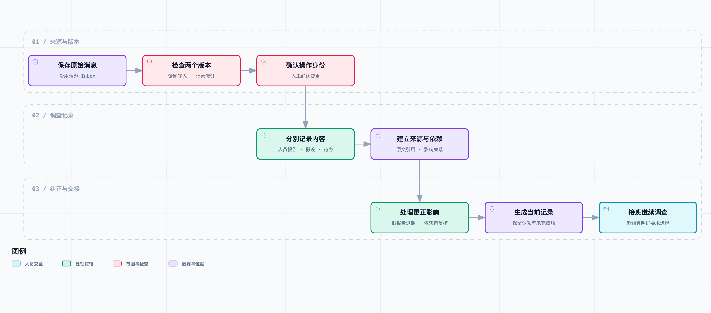

# 值班讨论越来越长：让 Agent 记清事实、分歧和待办

交接班时，接班同事问：“这批团餐现在什么情况？”

小林把话题往上翻。最初是门店说少了两杯，后来联系人补充有人临时改过口味。阿杰怀疑页面缓存，老周说去查修改记录。收单时间已经过了，门店还在等一份能照着做的清单。

“所以现在到底缺两杯，还是两杯口味不对？”

小林没有马上回答。这个问题前面有人问过，答案夹在一张图片和两条引用回复之间。

这是[《从工单开始，做一个 AI Agent》](https://juejin.cn/column/7686674237757063206)的第 08 篇。前面陆续接上资料、附件、源码和只读数据，这次给同一个话题数据库增加调查记录。我们会用合成对话实际回放更正与交接，保留人员报告、假设、待办及其来源，没有调用模型自动压缩聊天记录。

## 一段流畅的摘要，可能改掉事情的状态

把这段对话压成“团餐因页面缓存少了两杯，后端已查明修改记录”，看起来很顺，却连续改了三件事：把猜测变成原因，把旧数量报告当成当前事实，把“我来查”变成“查完了”。

这些错误不一定来自模型不知道业务词。更多时候是输入没有明确标出内容类型和有效状态，而输出又只剩下一段自然语言。

我们先把交接记录分成三类：

| 类型 | 例子 | 它表示什么 |
| --- | --- | --- |
| `reported` | 客户说数量少两杯 | 人员报告，尚未由系统证据核验 |
| `hypothesis` | 可能是页面缓存 | 待验证解释 |
| `todo` | 我来查修改记录 | 待办或认领，不等于完成 |

这里特意没有给客户原话贴一个泛化的 `fact` 标签。原话确实是来源，但“有人说数量少了”与“系统已核验数量少了”不是同一件事。前几篇的工具证据仍保留在原来的调查结果里，本章不把一条消息直接升级成数据库事实。

用户报告也可能是调查中最重要的线索。类型区分不是降低它的价值，而是让接班的人知道该如何继续确认。



[交互流程图](https://github.com/j-tide/juejin-article/blob/main/03-%E4%BB%8E%E5%B7%A5%E5%8D%95%E5%BC%80%E5%A7%8B%EF%BC%8C%E5%81%9A%E4%B8%80%E4%B8%AA%20AI%20Agent/08%EF%BD%9C%E5%80%BC%E7%8F%AD%E8%AE%A8%E8%AE%BA%E8%B6%8A%E6%9D%A5%E8%B6%8A%E9%95%BF%EF%BC%9A%E8%AE%A9%20Agent%20%E8%AE%B0%E6%B8%85%E4%BA%8B%E5%AE%9E%E3%80%81%E5%88%86%E6%AD%A7%E5%92%8C%E5%BE%85%E5%8A%9E/diagrams/investigation-board.html) · [可编辑规格](https://github.com/j-tide/juejin-article/blob/main/03-%E4%BB%8E%E5%B7%A5%E5%8D%95%E5%BC%80%E5%A7%8B%EF%BC%8C%E5%81%9A%E4%B8%80%E4%B8%AA%20AI%20Agent/08%EF%BD%9C%E5%80%BC%E7%8F%AD%E8%AE%A8%E8%AE%BA%E8%B6%8A%E6%9D%A5%E8%B6%8A%E9%95%BF%EF%BC%9A%E8%AE%A9%20Agent%20%E8%AE%B0%E6%B8%85%E4%BA%8B%E5%AE%9E%E3%80%81%E5%88%86%E6%AD%A7%E5%92%8C%E5%BE%85%E5%8A%9E/diagrams/investigation-board.workflow.json)

## 原消息继续保留，只新增调查视图

第 03 篇已经把消息保存到 `ConversationInbox`，并维护话题输入版本。本章的 [InvestigationBoard](https://github.com/j-tide/juejin-article/blob/main/03-%E4%BB%8E%E5%B7%A5%E5%8D%95%E5%BC%80%E5%A7%8B%EF%BC%8C%E5%81%9A%E4%B8%80%E4%B8%AA%20AI%20Agent/code/ticket_agent/investigation.py) 直接复用这个数据库，不另建一套消息来源。

新增两张表：`investigation_board` 保存当前调查视图，`investigation_operations` 保存每次确认过的操作。操作带操作者、操作 ID、期望版本、输入话题版本和正文，不覆盖旧操作。

因此，原消息、当前视图和修改经过可以分开查。某条报告从有效变成过期，并不意味着原消息被删了。别人问“为什么最初怀疑数量少了”，仍然能展开当时的说法。

这借用了保留状态变更历史的思路，但本章没有实现通用事件重建器、跨服务日志或任意时点回滚。不能因为多存了一张操作表，就说已经具备完整 Event Sourcing 系统。这里先解决当前交接状态可复核、操作可追查的问题。

## 每一项都要有来源和所属问题

一条调查项包含 `id`、`kind`、`issue`、`text`、`source_id` 和 `depends_on`。

```json
{
  "id": "cache",
  "kind": "hypothesis",
  "issue": "quantity",
  "text": "可能是页面缓存，先核对数量。",
  "source_id": "group-message-2",
  "depends_on": ["count-v1"]
}
```

`issue` 在本次样例里只支持 `quantity` 和 `flavor`，分别表示数量与口味。不是已经实现了可以自动发现任意子问题的分类器，而是用明确的两个问题把状态关系做出来。

文本必须能在同话题原消息中找到，来源 ID 也必须存在。这样能挡住凭空添加“已全部送达”这种原文没有的内容。它不能证明所选文本是完整语义，也不能防止人把一个猜测错误地标成报告；分类与更正仍需要被授权的值班人员确认。

每条记录保存来源，不把几条消息混成一句找不到出处的话。后续如果让模型提出候选分类，可以继续使用这个校验器，但模型输出应当停在建议层，不能凭一段 JSON 就获得确认事实或关闭任务的权力。

## 更正要影响依赖它的判断

这次回放中，第一条报告是“清单 v1 显示少两杯”。缓存假设依赖这个数量报告。后来客户更正：“数量没少，两杯口味不对，按清单 v2 核对。”

如果只是新增一条更正，两种说法可能长期并排留在上下文里；模型或接班的人还得重新判断哪个有效。如果直接把旧句子改掉，又会丢掉此前排查的依据。

`correct` 在一个事务里做三步：将旧报告标为 `superseded`，沿 `depends_on` 找到受影响的后续项并标为 `stale`，最后新增有来源的新报告。只要新项验证失败，整次操作回滚，旧报告不会先失效一半。

依赖失效是递归的。比如“数量少了”支撑“怀疑缓存”，后者又支撑一项排查任务，那么数量更正后，这两项都需要复核。测试包含这条两级依赖，不仅检查直接相连的一条边。

`stale` 不是“已经证伪”。缓存仍然可能影响口味展示，但原先因为少杯而提出的依据变了。若要继续调查，需要重新确认它与口味问题的关系，形成新的有效项，不能自动把旧推断平移过去。

当前代码要求依赖项已存在且有效，新增项只能指向已有项，避免直接形成循环。这里并不自动计算因果关系，依赖由确认操作明确提供；少记一条关系，就可能漏掉应当失效的判断，这也是后续需要评测的内容。

## 认领、完成和业务解决分开记录

老周说“我来查修改记录”，我们新增一个待办，再执行明确的 `claim` 操作，状态变为 `claimed`，负责人是老周对应的操作者 ID。

另一个人再来认领同一任务，会得到 `task_already_claimed`。两个人同时看见同一待办，也不能各自覆盖对方的负责人。

完成需要另一项明确操作：当前认领人提交 `complete`，并引用自己在同话题中的结果消息。没有结果来源、不是当前负责人，或者任务已过期，都会被拒绝。

这里的“完成”表示授权人员确认该项检查已完成，不意味着系统能够验证他真的做过检查，更不等于整个工单已经解决。结果消息也可能有误，仍需看它引用了什么工具证据。程序不能仅通过检查一个字段，就为人的业务结论提供真实性保证。

这一版没有自动认领、转交、人员离线回收或超时升级。处理中的待办会留给下一班继续看，而不是过了十分钟就被程序擅自标为完成。

## 为什么需要两个版本号

话题版本表示“原始输入更新到哪一条”，调查视图版本表示“确认过几次记录变更”。两者不能共用一个数字。

假设小林和老周都读到了调查修订 3。小林先完成一次更正，修订变成 4。老周仍基于修订 3 提交认领，程序拒绝 `stale_board_revision`，让他重读，不让旧操作覆盖新状态。

另一个情况是调查视图没有变，但客户又发了一条消息。此时即使视图修订仍然是 3，操作所依据的话题输入也过期了，应当返回 `stale_topic_input`。

这两个检查与更新放在 `BEGIN IMMEDIATE` 事务内。一次成功操作同时保存新视图和操作记录。SQLite 在这里提供单写事务的基础，本章没有做高并发性能验证；遇到写锁争用会失败并交给调用方处理，也不宣称有无限并发能力。

操作 ID 负责重试去重。同一个 ID、同一份操作再提交，返回原来的修订号；同一个 ID 换了正文，则报告冲突。一次网络重发不会新增两条更正，也不会把同一个任务认领两遍。

## 新消息来了，旧交接记录不能继续当当前状态

视图保存 `basis_topic_version`。读取时同时获取当前话题版本，二者不一致就返回 `needs_update`。当前 Agent 读取工具在这种情况下不返回旧条目，避免旧摘要随着新消息一起继续流转。

它没有自动理解新消息。新消息可能只是“谢谢”，也可能推翻关键事实，这一版统一要求确认更新，比较保守。后续可以加入判断是否影响调查的候选分类，但在验证之前，不应通过“看起来像闲聊”来跳过版本变化。

已经发出去的回复也不会因为视图变更自动消失。第 03 篇处理过发送前的版本检查；本章提供的是读取调查视图的状态，不新增飞书撤回或编辑能力。要把它接进真实发送流程，还得沿用原来的发送检查。

## 给模型的是可展开的记录，不是整个群聊

`read_investigation` 工具不接收品牌、门店或话题参数。应用先绑定一个 Board，工具再核对调用范围。返回内容分别带上“人员报告，尚非系统核验事实”“未验证假设”或“待办记录”的标签。

模型能读当前条目，但没有调用新增、更正、认领、完成操作的工具。写入路径保留给本地演示中的明确操作者确认，避免模型自己把推断写回记忆，再在下一轮当成已有结论。

需要查看原话时，服务端可以按来源 ID 展开消息，仍然限制在绑定话题内。当前没有向模型开放任意群历史读取；也没有自动把前几篇的所有工具输出都转换成 Board 项。工具证据保留原存储，正式接入时还需要扩展类型和引用校验。

视图默认预算为 6000 个字符，不是 Token 数。如果超出，返回 `needs_selection` 和所需长度，不静默丢掉更正或负责人。条目本身最多 100 项，每项文本最多 300 字、依赖最多 8 项，防止简单拼接无限增长。

后续选择上下文时，可以先按当前子问题取关联条目，再展开必要来源；但必须保留影响该问题的更正和未决项。不能只按“最短”或“最近”挑几句，就假定它们足够代表整张工单。

## 看实际回放结果

执行器收到四条合成话题消息，依次确认六次视图操作，结果保存在 [investigation-results.json](https://github.com/j-tide/juejin-article/blob/main/03-%E4%BB%8E%E5%B7%A5%E5%8D%95%E5%BC%80%E5%A7%8B%EF%BC%8C%E5%81%9A%E4%B8%80%E4%B8%AA%20AI%20Agent/code/fixtures/investigation-results.json)：

| 项目 | 当前结果 |
| --- | --- |
| 清单 v1 的数量报告 | `superseded` |
| 依赖旧数量报告的缓存假设 | `stale`，保留记录待复核 |
| 清单 v2 的数量报告 | 当前人员报告 |
| 两杯口味不对 | 另列为口味问题的人员报告 |
| 修改记录查询 | `claimed`，负责人 backend，尚未完成 |

六次操作的输入是显式编写的操作结构，不是模型从自然语言里自动抽取的结果。这个回放验证状态与来源机制，不能换个名字就当成摘要质量评测。

运行[本篇代码快照](https://github.com/j-tide/juejin-article/blob/main/03-%E4%BB%8E%E5%B7%A5%E5%8D%95%E5%BC%80%E5%A7%8B%EF%BC%8C%E5%81%9A%E4%B8%80%E4%B8%AA%20AI%20Agent/08%EF%BD%9C%E5%80%BC%E7%8F%AD%E8%AE%A8%E8%AE%BA%E8%B6%8A%E6%9D%A5%E8%B6%8A%E9%95%BF%EF%BC%9A%E8%AE%A9%20Agent%20%E8%AE%B0%E6%B8%85%E4%BA%8B%E5%AE%9E%E3%80%81%E5%88%86%E6%AD%A7%E5%92%8C%E5%BE%85%E5%8A%9E/code.zip)：

```bash
# 解压后进入 code/
python3 -m ticket_agent.investigation --db /tmp/ticket-board-ch08.sqlite3
python3 -m ticket_agent.investigation --db /tmp/ticket-board-ch08.sqlite3
python3 -m unittest discover -s tests -v
```

第二次运行返回相同视图，不重复追加六次操作。数据库保留在仓库外。已有话题模式新增两张独立表，没有改变前三篇表结构；没有实现其他版本数据的通用迁移框架。

累计 117 项测试通过，包括来源与原文校验、原子更正、两级依赖失效、竞争修订、话题更新、重复操作、认领权限、重启恢复和预算失败。完整套件依赖及可选测试见[共享运行说明](https://github.com/j-tide/juejin-article/blob/main/03-%E4%BB%8E%E5%B7%A5%E5%8D%95%E5%BC%80%E5%A7%8B%EF%BC%8C%E5%81%9A%E4%B8%80%E4%B8%AA%20AI%20Agent/code/README.md)。没有接真实飞书群，也没有测模型分类或摘要质量。

## 交接时，大家知道接着查哪一项

小林把当前记录交给接班同事。

“数量按 v2 清单核对。最初的少杯说法已经更正；口味问题还在。老周认领了修改记录，状态是处理中。”

阿杰问：“缓存呢？”

“旧猜测依赖的是数量问题，现在标了待复核。不是说排除了，只是不能拿旧依据继续解释口味。”

老周补了一句：“我查的那项留着，先别再开一份同样的查询。”

工单没有因为生成交接记录就结束，但下一班知道哪些说法有效、哪些待确认，以及谁正在处理。把独立的检查列清楚以后，下一篇再讨论哪些适合并行交给多个执行者，哪些仍然必须等前一步结果。

## 参考资料

- [SQLite 事务文档](https://www.sqlite.org/lang_transaction.html)：显式事务、读快照与单写者行为。
- [Martin Fowler：Event Sourcing](https://martinfowler.com/eaaDev/EventSourcing.html)：记录状态变更与重建状态的区别；本文只实现其中有限的记录机制。
