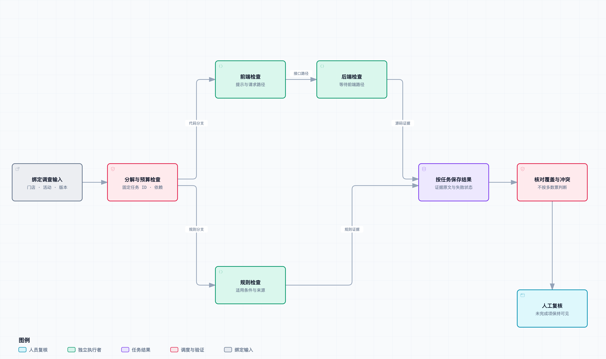

# 借鉴 EvoX 蜂群协作，让多个 Agent 分头调查

老周在话题里发了一句：“我查活动服务，先别催。”

几家门店反馈同一张券用不了，其中一段录屏还闪过“价格已更新”。阿杰已经在看结算页，运营在核对参与门店，小林要先分清哪些反馈属于当前活动。

“能不能分头查？”她问，“但查完以后，谁知道有没有漏项？结论不一样，我该转哪一份？”

这两个问题在人员协作时很常见，放进 Agent 系统也不会消失。增加执行者只是让更多检查有机会同时运行；输入、分工和结果没有约定好，最后可能得到几份互相矛盾的长报告。

这是[《从工单开始，做一个 AI Agent》](https://juejin.cn/column/7686674237757063206)的第 09 篇。我们沿用前文的资料与源码工具，加入有依赖、权限和预算的分支执行，再用程序核对覆盖范围。默认实验运行固定本地检查；真实模型工作者的接口已接好，但没有 API Key，模型协作效果没有实测。

## 从 EvoX 的讨论里借鉴什么

这里指的是 EvoMap 的 EvoX。[它的研究文章](https://evomap.ai/research/self-organizing-ai-swarms)讨论了任务拆成独立部分、输出位置固定，以及由程序汇集结果的做法。本文借鉴这几个执行层约束，没有安装 EvoX，也没有复现其论文题集或报告中的准确率。

对工单而言，对应的问题很具体：每项检查有没有 ID，谁负责，依赖哪项输入，交付什么证据，失败以后是否仍然可见。模型可以提出分工，但执行端必须能验证这些约定。

不能直接把题集上的协作结果迁移到门店工单。这里的任务带权限、迟到证据和人工更正；多个分支还可能引用同一条错误资料。组织方式是否有收益，需要用相同工单、模型、预算和评分方法再验证。

## 先缩小到一个门店、一轮调查

场景里有几家门店，但本轮输入先固定为一个授权门店、一场活动和一个已确认的时间点。跨门店处理需要分别建立范围，不能把群里提到的所有门店默认并进一次查询。

`InvestigationInput` 保存品牌与门店、话题版本、调查视图版本、问题和材料摘要哈希。材料摘要包含部署提交、知识库内容及检索上下文，使各分支依据同一组输入工作。

这不是跨系统数据快照协议。本例的知识库在运行前载入内存，源码固定到 Git 提交，因而材料比较稳定；真实数据库和日志可能在调查期间更新，仍需保留前几篇的采集时间和可见范围。

输入对象用不可变数据结构表示，避免某个分支顺手更改其他分支的问题或门店。Python 进程内的不可变对象也不是安全沙箱，它只是约束应用自身的使用方式。

## 拆成三个有交付要求的任务

这次的分解是明确编写的，不是让模型自由生成未知数量的子 Agent。

| 任务 | 检查内容 | 依赖 | 工具预算 |
| --- | --- | --- | ---: |
| frontend | 找到价格提示，读取报价请求 | 无 | 2 次 |
| rules | 核对活动规则与当前商品条件 | 无 | 1 次 |
| backend | 读取接口路由和价格变化条件 | frontend | 2 次 |

规则检查与前端检查可以并行。后端分支需要先看到前端给出的接口路径，因而等待 frontend 完成。它不会因为规则分支还没完成，就被无关的等待拖住。

前端任务还要求取得 `checkout.mjs` 和 `api.mjs` 的源码证据，后端任务要求 `router.mjs` 和 `pricing.mjs`。这比“工具返回过一次成功”更具体：模型随便读一段无关代码，不能满足这个样例的交付契约。

这些文件名是演示任务已知的边界，适合做调度与汇总实验。要让 Agent 面对陌生仓库自行找文件，需要先验证搜索过程，再调整任务验收条件，不能拿这组指定文件测试当成自主导航能力。



[打开协作结构图](diagrams/swarm-structure.html) · [可编辑规格](diagrams/swarm-structure.architecture.json)

图展示任务依赖与主要结果流。每项任务的状态和证据都会进入本轮结果表，包括前端的中间结果；后端失败时，前端已取得的证据不会一起丢失。

## 调度前先检查计划

[validate_plan](../code/ticket_agent/swarm.py) 检查任务 ID 唯一、角色已登记、依赖存在、没有自依赖或环，以及总工具预算是否超过限制。

为什么要在执行前检查总预算？假设三个分支都觉得自己最多查三次不算多，加起来就是九次。每个局部都满足限制，不代表整张工单满足限制。本例先预留 5 次调用额度，任何任务计划超过总额，尚未执行工具就拒绝。

调度器最多同时运行两个工作者。无依赖的任务可以启动；依赖都成功后才能启动后继；父任务失败或缺少上下文，后继标为 `blocked`，不会拿空材料继续猜。

等待采用“有一个任务完成就重新判断”的方式，不要求同一批任务全部结束。比如前端先返回，空出来的工作者可以立即做后端检查，规则分支仍然继续运行。

单个分支抛异常，只改变该分支状态。其已完成的工具观察仍然保留，其余独立任务继续。结果中明确列出 `incomplete`，不能因为两份报告写得完整，就把第三份失败悄悄省略。

## 每个角色拿到不同工具

规则角色只能调用 `search_knowledge`；前端角色只能调用前端搜索与读取；后端角色只能读取绑定的后端仓库。

应用层把仓库别名绑定在处理函数里，模型没有 `repository` 参数来覆盖它。门店和部署提交同样来自本轮上下文。让多个角色协作，不意味着它们可以互相借用更大的权限。

`Gateway` 在每次调用前检查角色允许的工具与剩余次数，并保存实际返回的证据副本。模型模式复用原来的 `run_ticket`，每个分支有独立上下文与调用轮数，再通过 Gateway 使用真实工具。

这里隔离的是模型上下文和工具入口，不是操作系统进程。工作者都是同一 Python 进程里的可信代码；若允许第三方任意插件运行，它完全可能绕过一个 Python 对象直接访问文件。那需要另一层进程与权限隔离，不能用“不同角色”替代。

## 汇总不再让另一个模型重写证据

工作者返回任务 ID、本轮输入摘要和证据集合。汇总前核对三件事：任务编号是否一致，输入摘要是否一致，证据是否与实际工具观察逐项相同。

不仅比较引用文字，还比较整个证据对象。若工作者保留了原句，却把来源地址换成另一个文件，测试同样会拒绝。漏掉工具已经返回的限制说明，也不能通过。

结果按证据 ID 去重。同一个 ID 出现不同引用文字时，记录冲突的两边，不通过覆盖写入挑一个胜者。前文知识库主动标记的结构化规则冲突，也会继续保留。

这是一组能检查的结构冲突，尚不能识别任意自然语言矛盾。例如两份报告分别写“可能是缓存”和“可能是价格版本”，它们既可能冲突，也可能同时成立，程序不会凭关键词投票。跨来源因果判断仍需补证据或人工核对。

这里的 `coverage_complete` 只表示计划中的任务都按契约完成，不代表原因已经确认。最终状态仍然是 `needs_review`。全部分支返回，并不意味着可以关闭工单。

## 多份一致意见，不等于多份独立证据

假设规则角色、前端角色和后端角色都引用了同一篇过期说明，再分别写一次“这个活动支持水果茶”。这是同一个来源被转述三次，不是三次独立核验。

本例汇总按证据 ID 合并重复项，至少不会通过报告数量给同一观察增加权重。但 ID 去重也有边界：同一内容被复制成三份不同文档，仍可能拥有不同 ID。来源关联、复制关系与独立性评估需要另做，不能把去重说成已经消除了共同错误。

更合适的分工，是让角色取得互补材料：规则文档说明适用条件，源码解释可能的分支，请求记录验证实际发生过什么。它们回答不同层次的问题，不靠互相赞同来提高可信度。

本章只并行组织规则与源码检查，没有把第 07 篇的订单事件硬塞进优惠券根因里。需要验证报价请求时，还要接入相应请求数据，现有支付与打印样例不能替代它。

## 对照一次串行与并行

默认执行固定检查配方，分别设置一个工作者和两个工作者。使用同一份知识库、同一组源码提交、相同问题和 5 次工具预算，实际结果如下：

| 方式 | 完成任务 | 工具调用 | 去重后的证据 | 本次耗时 |
| --- | ---: | ---: | ---: | ---: |
| 一个本地工作者，串行 | 3 | 5 | 6 | 157 ms |
| 两个本地工作者，受依赖约束并行 | 3 | 5 | 6 | 154 ms |

证据 ID 与原文一致，结果见 [swarm-results.json](../code/fixtures/swarm-results.json)。这是一轮真实本地执行记录，没有用固定延时伪装工具耗时。

3 ms 的差异不能作为加速结论。数据很小，Git 子进程和本地计算占了主要开销；要看稳定收益，需要多次运行、记录分布，并考虑机器负载。我们本轮验证的是并行不会漏结果、依赖不会被跳过，不是证明“蜂群一定更快”。

它也不是单 Agent 与多 Agent 模型准确率对照：没有模型调用，只有单工作者与多工作者的执行方式对照。真实模式会增加多个模型上下文、提示和汇总检查成本，工具调用次数相同并不代表 Token 或费用相同。

测试另外使用同步屏障确认两个独立任务确实重叠执行，不依靠这 3 ms 去推断程序已经并发。

## 超时、旧输入和失败怎样收尾

调度器有 30 秒派发期限，超过后不再启动新任务。已经运行的线程不会被 Python 强行终止；它仍依赖具体工具自己的超时结束。第 06 篇的 Git 命令保留单次超时，模型适配器也保留请求超时。

所以不能把这里称为整张工单 30 秒硬截止。底层调用如果不配合，线程池退出时仍然可能等它。需要更强的取消保证时，应考虑隔离工作进程及可取消请求，而不是仅给 Future 写一个 timeout。

汇总前还能通过 `current_versions` 检查话题输入版本和调查视图修订。任意一个变化，结果标为 `stale_input`。旧材料仍然可查看，但不能当作当前话题的可发送结论。CLI 的静态回放没有并发飞书消息，这条分支通过版本变化测试验证。

当前结果表在单次运行的内存里，CLI 输出 JSON，没有持久化任务租约和进程崩溃恢复。下一篇再补排队和运行记录，避免把一个线程池说成已经能承受活动高峰的生产调度系统。

## 运行与验证

[本篇代码快照](code.zip) 解压后进入 `code/`：

```bash
python3 -m ticket_agent.swarm --workspace /tmp/ticket-swarm-ch09 --workers 1
python3 -m ticket_agent.swarm --workspace /tmp/ticket-swarm-ch09 --workers 2
python3 -m unittest discover -s tests -v
```

实验目录首次为空，之后保留复用合成 Git 提交。源码和资料来自前几篇共享代码，不读取其他业务项目。

已在本机设置 `DEEPSEEK_API_KEY` 后，可显式开启真实模型工作者：

```bash
python3 -m ticket_agent.swarm --workspace /tmp/ticket-swarm-ch09 --workers 2 --live
```

真实模式每个分支使用独立的供应商适配器，最多 4 轮，工具次数仍分别为 2、1、2。缺 Key 会退出，不降级成回放。我们只用脚本化 Provider 验证了这条接线，没有实际请求模型，也没有评估其任务拆解或推理表现。

累计 134 项测试通过，覆盖真实并发重叠、依赖等待、父任务失败、重复 ID、依赖环、总预算、角色权限、分支预算、伪造来源、遗漏证据、缺少必需文件、输入修订和结构冲突。完整依赖见[共享运行说明](../code/README.md)。

## 回到小林的问题

小林看到的是一张按任务编号排列的记录：活动规则返回了什么，前端找到了哪个接口，后端读到哪段实现。失败和待确认项单独列出。

“如果两份结果不一样呢？”

阿杰点开引用：“先看是不是同一个范围、同一个版本。冲突留着，补查对应记录，不能按人数定结论。”

老周看了一眼本地对照：“这次几乎没快多少，先别拿这个数据说线上能提速。”

“但至少知道有没有漏查了。”小林说。

他又补了一句：“一张单最多两个工作者，活动开始同时来几十张单，怎么算？”

单工单预算不等于整个系统预算。下一篇把排队、同类事故聚合和整体运行开销接上，再看高峰时哪些任务先处理、哪些应该等待或交给人。
