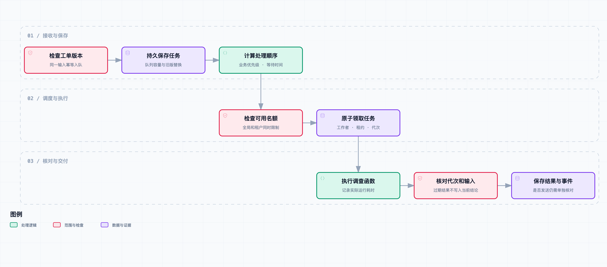

# 工单多起来以后：补上排队、事故聚合和运行观测

活动刚开始，小林的飞书未读消息就一直往上加。

一家店说结算慢，另一家说付款后状态不刷新。还有人只贴了一张加载中的截图。小林刚把几条话题归到一起，第三家店长又催了一句：“我们是团餐，一会儿要统一送走，别跟普通点单混了。”

其中还夹着一条“没出单”。阿杰看了录屏，发现顾客根本还没完成支付，和其他几家不一定是同一件事。

“上一版不是能分头查了吗？”小林问。

老周指着工作者数量：“一张单分两路，二十张就是四十路。数据库和模型接口不会因为我们赶时间，就多给一份额度。”

这是[《从工单开始，做一个 AI Agent》](https://juejin.cn/column/7686674237757063206)的第 10 篇。上一版解决单张工单内部怎样分工，这次处理多张工单之间的顺序与资源限制。我们加一个持久化队列、事故候选分组和运行记录，再用逻辑时钟验证调度，用真实本地工具执行来验证接线。故事和工单均为虚构示例，没有线上流量或模型吞吐实测。

## 消息到了，不等于必须立即启动调查

飞书消息的接收、任务排队和调查执行是三件事。接收端先保存原始事件，更新话题输入版本；满足调查条件后，才建立任务。工作者从队列领取任务，执行工具与模型循环，最后留下结果。

本篇提供独立的 `WorkQueue`，通过 `execute_one(worker)` 接入已有调查函数。它尚未替换第 03 篇飞书工作者，也没有自动发送排队提示。将来接入时，要先保证原始事件落库，再尝试入队，不能因为队列满就丢弃客户刚发来的图片或文字。

有两种完成状态也要分开：一次任务执行结束，可以是 `done`；工单业务问题是否解决，要看结果中的证据和人工处理情况。样例执行完成后依然是 `needs_human`，没有打印回执就不能说门店恢复出单。



[打开完整流程图](https://github.com/j-tide/juejin-article/blob/main/03-%E4%BB%8E%E5%B7%A5%E5%8D%95%E5%BC%80%E5%A7%8B%EF%BC%8C%E5%81%9A%E4%B8%80%E4%B8%AA%20AI%20Agent/10%EF%BD%9C%E5%B7%A5%E5%8D%95%E5%A4%9A%E8%B5%B7%E6%9D%A5%E4%BB%A5%E5%90%8E%EF%BC%9A%E8%A1%A5%E4%B8%8A%E6%8E%92%E9%98%9F%E3%80%81%E4%BA%8B%E6%95%85%E8%81%9A%E5%90%88%E5%92%8C%E8%BF%90%E8%A1%8C%E8%A7%82%E6%B5%8B/diagrams/queue-flow.html) · [可编辑规格](https://github.com/j-tide/juejin-article/blob/main/03-%E4%BB%8E%E5%B7%A5%E5%8D%95%E5%BC%80%E5%A7%8B%EF%BC%8C%E5%81%9A%E4%B8%80%E4%B8%AA%20AI%20Agent/10%EF%BD%9C%E5%B7%A5%E5%8D%95%E5%A4%9A%E8%B5%B7%E6%9D%A5%E4%BB%A5%E5%90%8E%EF%BC%9A%E8%A1%A5%E4%B8%8A%E6%8E%92%E9%98%9F%E3%80%81%E4%BA%8B%E6%95%85%E8%81%9A%E5%90%88%E5%92%8C%E8%BF%90%E8%A1%8C%E8%A7%82%E6%B5%8B/diagrams/queue-flow.workflow.json)

图中从领取到核对结果是一轮执行。图下的说明另外标出两个例外：租约到期要等待确认，事故候选仍需调查。它们不是正常成功路径上的自动跳转。

## 用话题版本确定一份任务

本例用 `(tenant, topic, version)` 作为幂等键，并保存输入字段的哈希。同一键、相同内容重复入队，返回原任务 ID；同一键却换了门店或优先级，报 `idempotency_conflict`，让上游明确产生一个新版本。

为什么不只拿话题 ID 去重？因为小林可能刚补充了正确支付流水，阿杰也可能更正“未支付”的判断。同一话题的新材料应该触发新一轮调查，不能被当作重复消息忽略。

新版本入队时，还没开始的旧版本标为 `superseded`。已经执行的旧版本不强行删除，等它返回时，再检查队列中的最新版本；如果已经变化，结果标为 `stale_input`。

这里检查的是**已入队的最新输入**。如果飞书话题已经更新，但接收端尚未将新版本送到这个队列，仅靠队列就看不到变化。因此接入平台时，发送前仍要复用话题存储的版本检查，不能把队列版本当成完整的飞书新鲜度保证。

队列容量默认 100，统计 `ready`、`running` 和 `uncertain`。同一话题等待中的版本允许替换，不会因为容量恰好用完而阻止纠错；新增话题超限则明确返回 `queue_full`。保存拒绝原因、延后重试或转人工属于接入层职责，本例没有偷偷丢弃最旧任务。

## 团餐可以优先，但普通工单不能一直等

优先级来自受信任的业务规则。比如已经核验的团餐交付时间、影响门店数和支付阶段，可以参与计算；不能让客户在文字里写一句“最高优先级”，就直接改变调度字段。

当前实现接受 0—30 的基础分，每等待一分钟再增加 1 分：

```text
调度分 = 基础优先级 + floor(等待秒数 / 60)
```

分数相同先取较早进入队列的任务，再用任务 ID 打破平局。团餐的示例基础分为 30，普通单为 0。普通单等待超过 30 分钟后，有机会排在刚来的高优先级单前面。

这是防止低优先级任务一直被新任务挤开的简单策略，不是业务 SLA 保证。租户名额、故障工作者和持续超载依然可能让任务等很久；如果到达速度长期超过处理速度，调分不会创造处理能力。

团餐也不应该一律压过所有付款问题。一个快到配送时间、但已有人工接手的团餐，可能比不上大量门店正在重复扣款的异常。我们把优先级入口留下，示例只验证分数怎样影响领取顺序，尚未实现自动风险分级。

## 领取必须在同一个事务里完成

最容易写错的流程是：先查一个等待任务，释放数据库连接，再把它改成运行中。两个工作者可能在中间同时看到同一条记录，然后各执行一次。

[claim](https://github.com/j-tide/juejin-article/blob/main/03-%E4%BB%8E%E5%B7%A5%E5%8D%95%E5%BC%80%E5%A7%8B%EF%BC%8C%E5%81%9A%E4%B8%80%E4%B8%AA%20AI%20Agent/code/ticket_agent/work_queue.py) 使用 SQLite 的 `BEGIN IMMEDIATE`，在一个事务中完成过期检查、名额统计、任务选择和状态更新。别的工作者要等事务结束后，才能基于新状态领取。

这依赖 SQLite 的写事务协调机制，适合这里的单机 Demo。写锁等待仍可能失败，应用需要处理数据库忙的情况；不能据此推断它已适合多地域高吞吐调度。[SQLite 事务文档](https://www.sqlite.org/lang_transaction.html)说明了 `IMMEDIATE` 事务的行为和竞争时可能返回的错误。

测试实际启动了 6 个并发领取者，每个使用独立连接。在全局名额为 2 时，只得到两个不同任务，没有重复领取。另一个测试重新打开数据库，检查等待中和执行中的任务状态仍然存在。

本轮就发现过一个很普通的恢复问题：索引创建没写 `IF NOT EXISTS`，第二次打开数据库会直接报错。修复后再做重启与并发检查，比只跑一次命令更接近后台进程的使用方式。

## 两层名额限制，还没有覆盖所有调用

队列默认全局最多执行两张工单，同一租户最多一张。领取时同时满足两项限制，避免单个租户把所有名额占完。

“全局两张”不是“全局两个模型请求”。如果两张单各启动上一章的两个分支，最多仍可能同时运行四个分支；一个分支内部还可能有不同工具。队列限制的是工单工作者，底层模型与数据库需要自己的共享配额。

把这两层混在一起，很容易出现单元测试通过、活动高峰仍然打满数据库的情况。完整接入还需要在所有工作者共用的工具入口限制并发、请求速率与 Token 预算，并说明获取不到额度时是排队还是结束本轮。本篇未实现这些跨工作者的供应商配额。

也不要在工具调用期间一直持有队列数据库事务。领取成功就提交，再执行调查，结束时开启新事务写结果。否则一个慢查询会连带阻塞其他工单入队。

## 租约到期后，先承认状态不确定

每次领取保存工作者 ID、递增的 `generation` 和租约截止时间。正常完成必须同时匹配这三类信息：还是运行中、仍是该工作者、仍是该代次。

假设工作者 A 领取第一代任务，过了 30 秒没有报告。它可能已经崩溃，也可能只是请求慢，甚至已经拿到结果、还没来得及写入。我们没有证据直接认定它已经停止。

当前处理如下：

| 情况 | 状态与动作 |
| --- | --- |
| 租约到期 | 改为 `uncertain`，继续占用名额 |
| 尚未确认旧工作者停止 | 不自动重跑，不接受过期完成 |
| 人工或受信任执行层确认停止 | 可以重试，下一次领取增加代次 |
| 旧代次之后又返回 | 拒绝写入，返回 `stale_lease` |
| 连续三次领取都无法完成 | 确认停止后结束为 `failed` |

`stopped=True` 是执行管理层的确认输入，不是模型工具，也不是“传了布尔值就能停止进程”。本例没有进程终止、租约续期和分布式心跳服务。没有确认来源时，应停在 `uncertain`，代价是名额暂时无法释放。

默认 30 秒租约只是调度实验配置，不能直接包住上一章可能耗时更长的模型调查。实际接入需按工作者上限设置租约，或先实现有身份校验的续租；否则正常但较慢的结果也会被拒绝。

代次检查只阻止旧结果覆盖队列记录，不会撤回已经发生的外部操作。本系列工具保持只读，尚不涉及自动退款或补打。未来增加写操作时，需要操作本身的幂等键与结果核查，不能只靠这里的租约机制。

## 相似反馈先组成事故候选

小林把“结算慢”“状态不刷新”和“没出单”放在一起，是为了减少来回翻话题。但运行系统不能从这些表述直接得到共同根因。

候选键包含租户、品牌、服务、业务阶段、错误码、部署版本、活动以及五分钟时间桶。门店不放进键里，是为了发现同一租户与品牌下多家店的相似反馈。任意关键字段缺失或为 `unknown`，先不生成候选组。

这些字段来自已核验的上下文或调查结果，示例直接提供合成字段，没有实现从客户自然语言准确提取错误码。未支付的“没出单”，和已支付的超时因阶段不同而分开；不同部署、不同租户的反馈也不混在一起。

每组始终带 `confirmed_incident: false`。它只是供内部值班人员集中查看的候选，不会共用一个根因、自动关闭成员话题，也不会把其他门店的订单信息发给当前店长。

五分钟桶有明显取舍：间隔一秒但跨了桶边界的两张单会分开；同一桶里的两个独立故障也可能暂时合在一起。因此它适合做便宜的第一轮筛选，后续应按共享依赖、请求证据和实际影响范围核对。没有证据时，宁可保留两张独立调查。

当前分组查询只采用每个话题的最新入队版本，但保留历史任务，没有事故生命周期、自动过期或监控订阅。调用方仍需选择要查看的时间范围；`snapshot()` 则是本地管理检查接口，包含各租户任务，不能直接暴露给门店用户。

## 先分清时间花在哪里，再谈优化

队列记录领取时的等待时间，完成时记录运行时间。`execute_one` 还用单调时钟测量工作者函数的实际耗时，避免用系统时钟差值代替函数计时。

现有 Agent 结果中保存每轮 Provider 返回与工具返回的耗时。排查时先沿任务 ID 看同一轮记录：是迟迟没领到名额，还是拿到名额后卡在某个工具。默认回放的 Provider 只是固定策略，事件名虽然沿用 `model_returned`，并不代表真实请求了模型。

Token 用量无法取得时保留 `null`。本文实际工具接线使用 Replay，并明确移除其占位用量；不把缺失数据当成“零成本”，也没有拿本地执行时间估算线上模型价格。现有队列事件只提取输入 Token 字段，完整输出用量和工具明细仍在结果中，尚未做账单汇总。

[OpenTelemetry 的可观测性说明](https://opentelemetry.io/docs/concepts/observability-primer/)区分了日志、指标和调用追踪。本篇只保存结构化事件与耗时，没有安装 OpenTelemetry SDK，也没有导出分布式 Trace。以后接入时，可以将话题、输入版本、任务和执行代次串起来；订单号等高基数字段适合放受控追踪记录，不适合直接成为指标标签。

## 两个实验，分别回答两个问题

调度回放放入四个合成话题：两张普通已支付超时、一张高优先级团餐，以及一张未支付反馈。固定逻辑时钟下，团餐先被领取；三个已支付话题形成一组事故候选，未支付话题没有被并入。

本次等待记录依次是 5、8、11、14 秒。它们由逻辑时钟推进产生，不是机器真的处理了 14 秒，更不能拿来算吞吐量。相同分数与进入时间的任务还会按随机任务 ID 排序，因此后三张的具体顺序不是验收条件。

第二个实验实际调用 `execute_one`，在工作者里运行前文的 `run_ticket`、固定 Replay 和本地订单工具。结果取得四条阶段证据，队列状态为 `done`，业务输出仍为 `needs_human`。本次函数耗时约 1 ms，多条内部耗时四舍五入为 0 ms，只说明本地样例很小，不代表网络查询没有成本。

[实验结果](https://github.com/j-tide/juejin-article/blob/main/03-%E4%BB%8E%E5%B7%A5%E5%8D%95%E5%BC%80%E5%A7%8B%EF%BC%8C%E5%81%9A%E4%B8%80%E4%B8%AA%20AI%20Agent/code/fixtures/queue-results.json)保留这两种模式；[实验代码](https://github.com/j-tide/juejin-article/blob/main/03-%E4%BB%8E%E5%B7%A5%E5%8D%95%E5%BC%80%E5%A7%8B%EF%BC%8C%E5%81%9A%E4%B8%80%E4%B8%AA%20AI%20Agent/code/ticket_agent/queue_experiment.py)可以重新生成结果。没有调用真实模型或飞书，也没有测并发压测下的 P95、超时率或单工单成本。

## 运行与复核

[下载本篇代码快照](https://github.com/j-tide/juejin-article/blob/main/03-%E4%BB%8E%E5%B7%A5%E5%8D%95%E5%BC%80%E5%A7%8B%EF%BC%8C%E5%81%9A%E4%B8%80%E4%B8%AA%20AI%20Agent/10%EF%BD%9C%E5%B7%A5%E5%8D%95%E5%A4%9A%E8%B5%B7%E6%9D%A5%E4%BB%A5%E5%90%8E%EF%BC%9A%E8%A1%A5%E4%B8%8A%E6%8E%92%E9%98%9F%E3%80%81%E4%BA%8B%E6%95%85%E8%81%9A%E5%90%88%E5%92%8C%E8%BF%90%E8%A1%8C%E8%A7%82%E6%B5%8B/code.zip)，解压后进入 `code/`：

```bash
# 每次想重新演示调度时，使用一个新的临时目录。
DEMO_DIR=$(mktemp -d)
python3 -m ticket_agent.work_queue --db "$DEMO_DIR/queue.sqlite3"

# 自动建立临时库，分别执行逻辑时钟调度与真实本地工具接线。
python3 -m ticket_agent.queue_experiment
python3 -m unittest discover -s tests -v
```

重复使用第一个命令的数据库不会重新执行已经完成的任务，这是幂等行为。运行所有章节测试的依赖和 OCR 设置见[共享运行说明](https://github.com/j-tide/juejin-article/blob/main/03-%E4%BB%8E%E5%B7%A5%E5%8D%95%E5%BC%80%E5%A7%8B%EF%BC%8C%E5%81%9A%E4%B8%80%E4%B8%AA%20AI%20Agent/code/README.md)。

累计 155 项测试覆盖了优先级与等待加分、容量、重复输入、实际并发领取、租户限制、重启保留、旧结果拒绝、租约过期占位、确认停止后的重试、三次尝试上限、候选范围以及异常工作者收尾。测试数量表示回归覆盖，不表示模型工单成功率。

## 回到活动高峰

小林先看那张团餐：“确实先领到了。但这只是开始查，不能告诉店长马上就能好了。”

“对。”老周说，“这里显示执行结束，里面还留着待确认事项。”

阿杰点开那条未支付反馈：“这张还是单独查。不能因为大家都说没出单，就一起归因到打印服务。”

小林又问：“排队提示现在会发到话题里吗？”

“还没有。这一版先把任务和等待时间存下来，接飞书时再加去重后的进度通知。”

几人翻到上一轮留下的检查记录。老周发现，同样的价格版本条件已经解释过一次：“下次再遇到，哪些检查可以直接拿来用？”

队列能安排工作，却不会自动把经历变成可靠经验。下一篇继续区分历史案例、确认过的结论和可复用排查步骤，再决定什么可以进入记忆。
