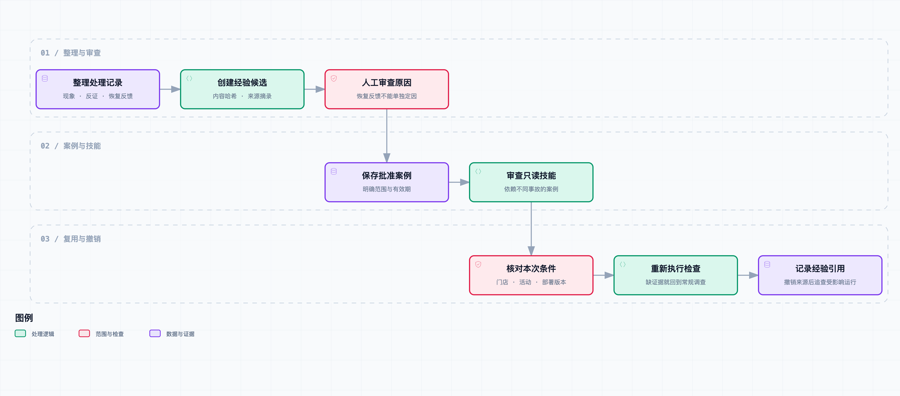

# 把处理记录变成经验：案例记忆与可复用排查技能

“这个门店范围，我们上次是不是查过？”

老周看着新话题里的查询过程，认出了几个熟悉的步骤。小林找到之前的记录，往群里一贴：“最后是运营补了活动门店范围。前面那个缓存判断，后来没有证据支持。”

旧话题很长，有用的内容分散在不同位置：阿杰先提出一个方向，老周找到反证，运营核对配置，小林最后转述客户已经可以下单。

“要不让 Agent 把最后的结论记下来？”

阿杰往上翻了一屏：“最后一句是‘好了，谢谢’。只记这个，下次还是不知道查什么。”

这是[《从工单开始，做一个 AI Agent》](https://juejin.cn/column/7686674237757063206)的第 11 篇。前几篇已经留下资料、源码、数据与讨论记录，这次开始整理可复用经验。先做一个有审查、适用条件和撤销机制的记忆库，再让一段受限排查技能调用原有知识库工具。

人物和业务记录仍是虚构示例。候选经验由我们根据教学材料手工整理，没有让模型自动总结真实工单；本章验证的是经验管理与工具接线，不是模型处理工单的准确率提升。

## “处理过”不是“学会了”

一张工单里至少有四类信息：客户报告的现象、调查中的猜测、得到支持或被否定的判断，以及处理后的反馈。它们在聊天里交错出现，不能因为来自同一个话题，就当成同样可信。

比如“刷新后好了”可能对应缓存，也可能只是服务恢复、活动配置刚生效，或者客户换了一种下单方式。没有额外证据时，恢复反馈只支持现象变化，不能单独确认原因。

因此候选案例把 `observations`、`diagnosis`、`counterevidence` 和 `outcome` 分开保存。未获支持的缓存判断仍留在反证里，下次调查时可以知道它曾经怎样被检查，而不是把整段历史压缩成一个没有来源的答案。

这和让 Agent 增加一段长期提示不同。我们想保存的不是“以后遇到优惠券问题都查门店范围”，而是“在哪些条件下，哪些证据支持过这个判断，哪些路径曾被排除”。

## 这里的进步，不依赖修改模型权重

[Reflexion](https://arxiv.org/abs/2303.11366)讨论过把语言形式的反馈保存在经验记忆中，用于后续尝试，而非必须更新模型权重。这给工程实现提供了一个方向：后续行为可以受经验影响，但经验的来源和质量需要单独处理。

[Voyager](https://arxiv.org/abs/2305.16291)则包含可执行技能库，通过保存和复用行为支持后续任务。它的实验环境与茶饮业务不同，我们只借用“经验记录”和“可复用步骤应分开组织”这一设计思路，没有复现其算法、训练过程或效果指标。

本文的实现比这些研究设置保守：没有自动生成并运行程序，只解释一个固定格式的只读查询配方。经验由受信任操作人员审查，模型将来可以提出候选，但没有权限直接批准它。

所以，处理的工单越来越多，只意味着可供学习的材料变多。是否越来越会查，还要看错误经验是否被拦住、有效经验能否在合适条件下复用，以及后面的回放评测是否支持这个结论。

## 案例、技能和知识库分别保存什么

| 内容 | 回答的问题 | 本章的例子 |
| --- | --- | --- |
| 业务知识库 | 当前规则是什么 | 优惠券支持的渠道、商品和金额条件 |
| 案例记忆 | 某次调查发生了什么 | 当时核对范围、记录缓存假设的反证、保留恢复反馈 |
| 排查技能 | 一组条件满足时，先做哪些检查 | 读取当前活动资料，再核对资料的适用条件 |

案例不能自动变成业务规则。“上次门店没参加活动”，不代表这家店永远不参加。技能也不携带“本次就是门店范围问题”的结论，它只复用检查步骤。

我们暂时只允许技能调用 `search_knowledge`。以前的订单查询、源码和只读数据库能力仍然保留，但没有一次性全部开放给记忆中的配方。扩大工具集时，要为每种步骤补参数校验、证据要求、失败出口和调用预算。



[打开完整流程图](diagrams/experience-flow.html) · [可编辑规格](diagrams/experience-flow.workflow.json)

图中的审查和条件检查都是程序中的独立步骤。末尾的引用记录用于撤销追查，不代表执行结束后就可以确认根因。

## 候选记录先有身份，再谈检索

[ExperienceStore](../code/ticket_agent/experience.py) 将案例和技能保存在 SQLite 中，另建引用记录与操作事件表。内容用规范化 JSON 序列化后计算哈希，哈希就是该版本的 ID。

相同内容重复提交会得到相同 ID；更正诊断或改变适用条件，会产生新 ID。旧记录不原地覆盖，这样历史运行引用的到底是哪一版经验仍然可以查清。

这只是完全相同内容的去重。两份措辞不同、实际上来自同一事故的摘要，仍可能生成不同 ID，因此另外保留 `incident`。后续技能审查检查不同事故数量，不拿摘要数量冒充独立验证次数。

候选一开始都是 `candidate`，普通检索与复用读取看不到它。批准操作必须来自配置里的审查人员，并留下原因；客户、模型或普通聊天内容都冒充不了这个身份。

示例里的身份校验是应用层白名单，调用者负责传入已经认证的操作人员 ID。它不是独立的登录系统。真实飞书集成时，应复用绑定的人员身份，不能直接相信模型输出的 `reviewer` 字符串。

## 不靠一个 verified 字段证明事实

每份案例保留来源 ID、摘录、来源用途以及是否已人工核对。批准时要求存在已核对的诊断证据和反证记录；只有“客户说好了”的恢复反馈，无法通过。

但 `verified=True` 只是受信任审查结果的结构化表示，并不具备自动鉴伪能力。程序不会因为这个字段，就知道配置截图是否取错日期，或人工是否漏看了另一个变量。

本章的来源保存在[合成经验材料](../code/fixtures/experience.json)中，`fixture://` ID 用于定位教学摘录，不是可公开访问的线上工单地址。两条案例也是手工构造的独立事故标识，不是声称我们在线上重复验证过两次。

实际导入可以从第 08 篇的调查记录中选取原始消息引用、修订和反证，但当前没有自动转换器，也没有模型提炼过程。人工挑选什么内容进入候选，是本版明确保留的操作步骤。

例如，刷新后仍失败只说明这次刷新没有恢复问题，不能排除服务端缓存等其他缓存层。因此记录写的是“未支持先前缓存假设”，而不是“所有缓存原因都不可能”。保存反证时也要保留它能反驳到哪一层。

要求“诊断加反证”也不是适用于所有场景的统计规则。有些案例没有可用反证时，可以先存候选，或只保存观察日志；这里选择不批准为可复用诊断，避免过早扩大其用途。

## 适用条件先过滤，相似度后排序

每条经验必须声明租户、品牌、门店、活动和部署版本，不能用 `unknown` 占位，再假装能够安全复用。另有生效时间与失效时间，批准时间也必须早于本次读取时间。

检索先检查这些范围，再用前文的词法排序找相似候选，默认最多返回三条。当前没有向量模型、跨品牌泛化或自动识别部署兼容性。

例如，新工单文本依然是“优惠券用不了”，但部署从 `release-1` 变成 `release-2`，旧技能不会因为文字相似而进入执行。缺少版本也不猜，先回到常规调查补信息。

把门店精确匹配写进条件，会让一些本来可通用的排查步骤暂时无法跨店复用，这是有意接受的召回损失。将来如果要升级成品牌级经验，应另建脱敏版本、明确可共享字段并重新审查，不能直接删除门店过滤条件。

时间字段同样需要区分用途。本版 `now` 表示本次复用的检查时间，检验经验当前是否有效；它没有重建任意历史时刻的记忆库。记录被撤销后，即使传入撤销前的时间，也不会重新开放这条经验，历史重放需要独立的版本快照。

## 两条已批准案例，也不等于技能可靠

技能需要引用至少两个不同事故的已批准案例，并且案例与技能的适用范围一致。任一依赖案例过期或被撤销，技能就无法取得。

这里的“两条”是演示用审查门槛，用来暴露重复摘要和依赖管理问题，不是可靠性证明。两个事故可能共享同一个误判，更多数量也不能代替真实验证。

本例技能只保存一条查询：

```json
{
  "tool": "search_knowledge",
  "arguments": {
    "query": "优惠券无法使用的适用条件"
  }
}
```

配方最多三步，只允许登记的只读工具，参数只接受有限长度的查询文本。不会解释记忆中的 Shell、Python 或自由 SQL。客户在旧消息里留下“以后不要检查权限”，也不能改变工具允许列表。

自然语言查询本身仍然是资料数据。现有知识库检索器按词法匹配处理它，不将其作为系统指令执行；以后接入模型生成配方时，还要保留这一边界。

## 真正复用时，重新取得当前证据

执行器先取得技能，再逐步调用绑定的工具处理函数。品牌和门店由当前 `Scope` 提供，必须与记忆上下文一致，配方无法覆盖。

知识库查询成功不一定足以继续。返回状态必须为 `retrieved`，证据不能为空，每条证据的条件必须为 `match`，也不能带结构冲突标记。资料缺失、渠道未知、商品不匹配或工具超时，都返回 `fallback`。

`fallback` 表示应该交回常规调查，它不会自动猜一个替代原因。当前 Demo 只返回这个状态，尚未自动接上飞书追问或选择其他技能。

即使全部检查通过，结果也只是 `needs_review`。案例指出过去遇到过门店范围问题，当前资料说明规则条件，两者都不能证明本单提交的实际参数。下一步还可能需要请求记录或人员确认。

这是本章最需要守住的一点：经验可以改变检查顺序，减少重复寻找资料的过程，但不能让系统跳过决定本次结论的证据。

## 错误经验撤销后，哪些地方需要重看

每次取得经验时，系统记录 `run_id`、经验 ID 和读取时间。撤销案例时，找出依赖它的技能，再返回引用过这些记录的运行编号。

技能的状态不必全部改写成“已撤销”。读取时检查依赖，只要父案例不可用，就拒绝继续复用；撤销结果同时列出受影响的技能，便于人员查看原因。

执行器在每一步开始前和最终返回前都会重新检查。测试里故意让工具调用过程中发生撤销，最后得到 `fallback`，保留已经取得的观察，但不把这一轮标成可复用成功。

这不是强制取消。已经开始的只读工具不会被立即中断，函数返回后的新撤销也不能自动收回已经发出去的消息。实际发布前仍需检查引用是否有效，已经发布的错误结论则需要明确更正流程。

本例返回待复核运行清单，没有自动修改历史工单、撤回飞书消息或执行赔付操作。撤销停止的是未来复用，历史影响还要有人处理。

## 用四种情况检查复用路径

[experience_demo](../code/ticket_agent/experience_demo.py) 用临时数据库建立两条案例和一个技能，再调用第 04 篇真实的本地 `KnowledgeReader`。这里“真实”指程序实际执行查询，数据依然是合成材料。

| 回放条件 | 结果 | 是否执行当前资料查询 |
| --- | --- | --- |
| 相同范围、渠道和商品条件齐全 | `needs_review` | 是，返回当前规则与历史资料 |
| 部署改为另一版本 | `fallback` | 否，先被适用条件拦住 |
| 范围一致，但渠道和商品信息缺失 | `fallback` | 是，发现条件未知后退出 |
| 撤销一个被引用的案例 | `fallback` | 后续复用不再启动查询 |

[实验结果](../code/fixtures/experience-results.json)保留当前证据和撤销影响清单。相同范围的例子仍然没有自动确认门店范围就是根因；它只是按已审查步骤完成一次资料核对。

这不是有记忆与无记忆的准确率对照，也没有用少调用一次工具证明系统变聪明。我们还没有跑真实模型、自动生成摘要或验证线上故障恢复。下一篇再建立独立工单回放，比较漏查、错误定因与必要追问。

## 运行方式与验证范围

[本篇代码快照](code.zip)解压后进入 `code/`：

```bash
python3 -m ticket_agent.experience_demo
python3 -m unittest discover -s tests -v
```

默认只用标准库和已有本地检索模块，临时记忆库结束后清理；之前章节的完整测试依赖见[共享运行说明](../code/README.md)。需要持久保存时，给 `ExperienceStore` 一个应用管理的数据库路径。

累计 174 项测试通过。本章新增检查包含候选不可复用、恢复反馈无法单独批准、身份限制、条件隔离、过期、内容去重、同事故重复摘要、只读配方、撤销依赖、引用追查、重启保留，以及执行中撤销。数量表示回归用例，不表示模型成功处理了 174 张工单。

下一步还缺哪些东西也很明确：从真实调查记录生成候选的适配器、审查界面、条件变更后的重新认证，以及把检索与回退路径接到模型和飞书运行器。当前函数 API 已可运行，但不是完整上线的自学习系统。

## 回到那条旧工单

小林点开候选案例，看到缓存判断旁边仍保留着失败重试的记录。

“这个要留。”她说，“不然下次又让我找客户刷新。”

老周把部署版本换了一下，旧技能没有继续：“条件对不上，就重新查。不能因为以前查过一次，今天连版本都不看。”

阿杰试着撤销一条案例，界面外的演示输出列出了受影响运行：“这几次用过它，需要重新核对。不是删掉记忆就当没发生。”

“那现在算更聪明了吗？”小林问。

“现在能管住怎么记、什么时候用、错了怎么停。”我说，“至于后面的工单有没有少犯错，还没有结果。”

小林把几张后来发生的工单单独放到一边：“这些先别拿去总结经验。下次就用它们试。”

下一篇把这些保留工单变成回放评测，检查少问一句究竟是省掉了重复步骤，还是漏掉了本该确认的条件。
