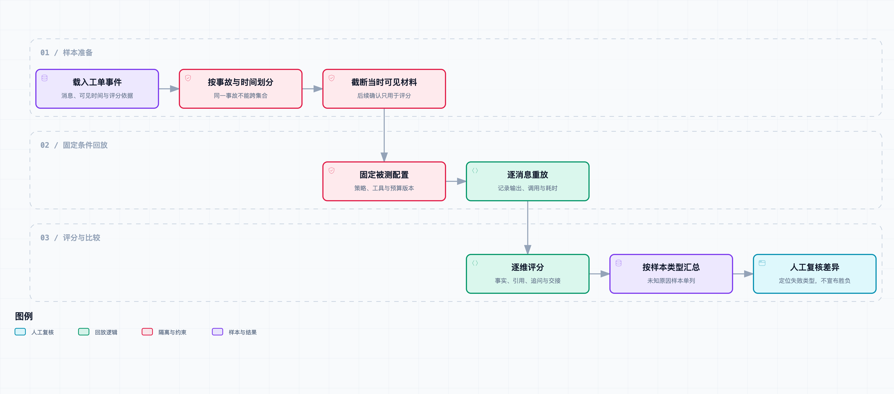

# 怎样知道 Agent 进步了：建立工单回放评测

小林把新版和旧版的两段回复放在一起。

新版短一些，步骤也少一些。她觉得更好转述，老周却指着第一句话问：“它怎么一上来就知道这个活动范围有问题？”

我们回头看回放材料，才发现里面混进了一条后来才出现的运营确认。实际调查开始时，那条消息还没有被任何 Agent 或值班人员看到。

“那这不是在考它会不会记答案吗？”小林说。

这句话把第 11 篇留下的问题说得很具体：有了经验库以后，怎么区分真正少走了弯路，和提前看到了结论、重复遇到同一事故，或者把本该追问的内容省掉了？

这是[《从工单开始，做一个 AI Agent》](https://juejin.cn/column/7686674237757063206)的第 12 篇。我们为同一个 Demo 增加按时间回放、按事故隔离、逐维评分的本地评测器。它运行一套固定的本地策略和已有订单查询工具，没有调用模型、飞书或真实业务数据。结果用于说明评测方法与发现具体回归，不代表线上成功率、成本或模型能力。

## Agent 评测不是给最后一句话打分

普通问答可以把回答和标准答案放在一起比较。工单 Agent 面对的是一段不断更新的对话：客户先描述现象，客服补一个订单号，前后端又陆续提供观察，最终原因常常要到很后面才确认。

因此，一次回放至少要回答四个问题：

| 要检查的事 | 不能偷换成什么 |
| --- | --- |
| 当时 Agent 看到了哪些材料 | 不把后来确认的原因塞进早期上下文 |
| 同类样本怎样划分 | 不把同一事故的多张工单拆到开发集和保留集 |
| 输出是否合格 | 不只看最终原因，还看引用、追问、交接和工具预算 |
| 指标怎样汇总 | 不把原因未知的样本硬算成“答错”，也不让少调用变成自动加分 |

[AgentBench](https://arxiv.org/abs/2308.03688)把 Agent 放在多轮、不同环境中考察，而不是只评一段静态文本。[τ-bench](https://arxiv.org/abs/2406.12045)也把用户交互、领域规则和工具操作一起纳入任务。它们不是本项目的评测集，但提醒了我们一个工程事实：Agent 的输出、调用过程和任务状态都可能影响结果。

本章没有照搬任何公开基准的题目、环境或分数。我们的样本是合成茶饮 SaaS 工单，只验证这套回放器能否把已知边界写进程序。

## 先冻结“当时能看到什么”

每条事件保存 `occurred_at` 与 `visible_at`。前者是事情发生的时间，后者是这条信息真正进入当前调查可见范围的时间。它们并不一定相同：日志可以晚到，客服也可能晚些才把截图内容转进话题。

每个回放样本还有一个 `as_of`。构造 `ReplayInput` 时，程序只交给策略满足下面两个条件的消息：

```text
event.audience == "agent"
AND event.visible_at <= case.as_of
```

`ticket-coupon-001` 的客户在 11:00 说“活动编号 campaign-a，优惠券不能用”。运营到 11:09 才确认门店不在活动范围，而本轮 `as_of` 是 11:04。评测器会保留后者做评分依据，却不会把它交给被测策略。

这比只按消息发生时间筛选更稳妥。假如一条 11:00 发生的日志 11:10 才入库，Agent 在 11:04 的调用不可能看到它。代码中的测试专门把“后来确认根因”伪装成早发生、晚可见的事件，确认它仍会被排除。



[打开完整流程图](diagrams/evaluation-flow.html) · [可编辑规格](diagrams/evaluation-flow.workflow.json)

这里的隔离发生在评测输入 API 边界：`ReplayInput` 只有工单范围、截止时间和可见消息，没有标签、标准引用或根因字段。它不是安全沙箱。被测策略仍然是同一 Python 进程中的可信代码；如果它主动读取评测文件，API 设计无法阻止它。真正要隔离不可信插件或远程 Agent，还需要进程、文件和网络权限边界。

## 同一个事故只能选一边

按单条工单随机切训练集和测试集，看起来样本数更多，实际会把同一次异常的不同描述泄漏给测试集。

本章先按 `incident_id` 分组，再按时间划分。开发截止点是 9 月 15 日：一个事故组中，只要有一张工单落在截止点之后，整组都进入保留集。

这条规则故意有些保守。`incident-version-boundary` 有一张 9 月 14 日工单、另一张 9 月 16 日工单；第一张本可以放进开发集，但为了不让同一事故跨集合，它也一起留在保留集。

| 集合 | 本次样本 | 用途 |
| --- | ---: | --- |
| 开发集 | 2 张，均为打印状态事故 | 可以用于提出或调试候选策略 |
| 保留集 | 5 张，包含跨截止事故、优惠券问题和原因未知问题 | 本章报告的输出只来自这里 |

这仍然不是统计学意义上的独立抽样。事故 ID 本身是教学材料里人工标注的；实际数据中，事故聚合也可能错误。把这个字段、划分阈值和最终分配都写入结果，至少能让后续审查知道测试集是怎样来的。

## 标签能评分，不能提供给被测策略

每个样本的 `labels` 保存可允许的下一步、需要覆盖的追问、引用目录和事实状态。它们只在 `score()` 中读取。

例如，已付款未出单的样本要求引用“出单任务”和“打印回执”。这不是让 Agent 断言根因，而是检查它是否拿到了足以说明当前阶段的证据。引用不仅比对 ID，还比对原始 `quote`；只拿到正确 ID、再把文字改成“已经打印”，一样会失败。

根因的评分比真假题多一个状态：

| 样本状态 | 输出没主张原因 | 输出主张正确原因 | 输出主张其他原因 |
| --- | --- | --- | --- |
| 后续已确认 | `not_claimed`，不强行扣成错误 | `correct` | `incorrect` |
| 到现在仍未知 | `not_applicable` | — | `unsupported` |

这避免了一个常见误导：原因未知的工单如果正确地交给人工，不该被评价成“没有答对”；反过来，随口给一个原因也不能因为没有标准答案就逃过检查。

同样，指标不合成为一个总分。少一次工具调用、少几个 Token，可能是少走了重复步骤，也可能是漏查。每个维度都保留自己的分母，`not_applicable` 不会悄悄计入通过率。

## 固定比较对象，否则只是比较环境变化

`EvalConfig` 固定了策略名称、策略修订、模型标识、最大工具调用数、最大轮数和时间预算，并对全部字段计算哈希。每次结果同时保存评测样本哈希与配置哈希。

```python
CONFIG = EvalConfig(
    "local-ticket-router", "fixture-r1", None,
    tool_budget=2, max_rounds=4, seconds=45,
)
```

这只能标识“本次运行用了什么”，不能让模型输出变成确定性的。若将来接真实模型，还要记录供应商模型版本、采样参数、重试策略、工具实现版本和运行日期；同一配置跑多次时，应报告各次结果和波动，而不是挑一次最好看的。

本次 `model_id` 是 `null`。引用订单号的样本实际调用已有的 `run_ticket`、固定 `Replay` Provider 和本地 `OrderReader`；优惠券与后台加载样本由一个明确写死的路由规则处理。`Replay` 的零 Token 是控制流占位，不是“模型没花钱”，因此演示结果把 `usage` 记为 `null`。

## 逐条记录，而不是只输出一行百分比

每次执行都保存可见事件 ID、实际输出、工具调用数、局部耗时、评分结果和运行错误。策略异常或输出不符合结构时，状态是 `invalid_or_failed`，仍保留在分母中，不能因为报错而从结果里消失。

当前评分维度是：

- `action_appropriate`：追问或交接是否落在允许的下一步里；
- `citation_valid`：输出引用是否来自本样本评分目录且原文一致；
- `required_evidence_covered`：必要阶段证据是否都被引用；
- `question_coverage`：必须追问的字段是否真正提出；
- `no_unsupported_cause`：没有把未知或不同原因说成已确认；
- `tool_budget_ok`：调用数没有超过固定预算。

它没有评分自然语言是否“更会说话”，也不会检查一段自由文本的语气。需要覆盖这类判断时，应另外添加审查准则和人工盲评，不能拿当前这些结构化断言冒充全量质量判断。

## 跑一次保留集，先得到一个具体失败

运行本篇代码后，保留集 5 张样本都完成，没有不支持的根因主张：

| 维度 | 结果 | 该数字说明什么 |
| --- | ---: | --- |
| 下一步是否合适 | 5 / 5 | 这些样本要么追问、要么交接，动作类别都在标注范围内 |
| 引用是否有效 | 2 / 2 | 只有两张订单样本适用，引用 ID 与原文都一致 |
| 必要阶段证据是否齐全 | 2 / 2 | 同样只适用于订单样本 |
| 必要追问是否覆盖 | 1 / 2 | 暴露出一个遗漏，不应被其他通过项掩盖 |
| 没有无依据根因 | 5 / 5 | 没有把原因未知的情况直接定因 |
| Token 用量 | 5 次均未知 | 本轮没有真实模型计量，不计算成本 |

失败发生在 `ticket-coupon-002`。客户写的是“没有提供活动编号”，固定路由器只是做字符串包含判断：

```python
questions = ["channel", "product"] if "活动编号" in text else ["campaign"]
```

这句话虽然表达“缺少活动编号”，却仍然包含“活动编号”四个字。策略错误地追问了渠道和商品，没有问活动编号；`question_coverage` 因此为 `false`。

这不是语言模型幻觉，也不是一次上线事故，而是一条可复现的本地规则缺陷。它恰好说明评测的用途：如果只看动作类别、工具次数或总通过数，这个遗漏很容易被掩盖。第 13 篇会以这类失败作为候选策略修改的输入，并在同一套隔离样本上重新比较。

`ticket-coupon-001` 的后续确认根因是活动范围缺失，但早期策略没有声称知道它。结果记为 `confirmed_not_claimed`，而不是“根因错误”。这不是证明策略已经足够好，只是没有用未来材料做不公平的猜测。

## 怎么运行

[本篇代码快照](code.zip)解压后进入 `code/`：

```bash
# 写出可检查的本次回放结果。
python3 -m ticket_agent.evaluation_demo --output fixtures/evaluation-results.json

# 运行全部回归测试。
python3 -m unittest discover -s tests -v
```

[样本定义](../code/fixtures/evaluation-cases.json)和[实际结果](../code/fixtures/evaluation-results.json)都在仓库中。样本、配置和结果分别保存哈希，便于判断后续差异来自策略、评测集还是运行条件。

本机累计 189 项测试通过。本篇新增用例覆盖：同事故不跨集合、未来确认信息不进入输入、晚可见事件排除、标签结构校验、错误引用、无依据根因、超预算、未知原因、失败不丢分母、配置与样本哈希变化，以及固定路由器漏问活动编号。

测试数量是回归覆盖数量，不是 Agent 成功率；5 张保留集更不是一个能外推的评测规模。真实模型、飞书端到端话题、图片视频、数据库和源码工具都还没有放进这轮整体回放，未来接入每类工具都要补可见时间、范围、标签与失败路径。

## 回到那两段回复

小林重新打开 `ticket-coupon-001`。后来确认活动范围的那条消息已经不在早期输入里，策略只追问了渠道和商品。

“这次比较的，才是当时能知道的那些事。”老周说。

接着他点到 `ticket-coupon-002`：“这里为什么没问活动编号？”

小林看完固定规则，笑了一下：“它看见了这几个字，却没看懂前面有个‘没有’。”

“很好。”老周说，“不用再争新版看起来顺不顺了。把这条失败保留下来，下次只改这一处，再跑一遍。”

评测器现在能说明哪条规则在哪类样本上漏了什么，但还不会自动改策略。下一篇从这些失败记录里提出受限的候选修改，比较后再决定是否保留。
