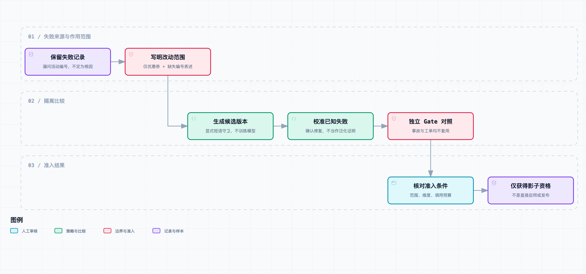

# 根据反馈改进策略：检索、排查步骤和蜂群分工怎样更新

小林把第 12 篇的回放结果放到值班群里。

其中一张优惠券工单很扎眼。客户写的是“没有提供活动编号”，Agent 却追问了渠道和商品。它不是没看见“活动编号”四个字，恰好相反：字符串规则看见了这几个字，便误以为编号已经出现。

“那就让优惠券问题都先查活动配置？”小林说。

老周打开另一张旧工单。那张工单带着活动编号，但最后的问题是旧客户端拿到了错误报价版本。“如果把每张券的问题都压成一条捷径，下一次只是换一种漏法。”

这是[《从工单开始，做一个 AI Agent》](https://juejin.cn/column/7686674237757063206)的第 13 篇。上一篇建立了时间与事故隔离的回放评测，本篇只做一件更小的事：从一条可复现失败提出一个**范围明确的候选策略**，将它和旧策略放进独立样本比较。它没有训练模型、自动改 Prompt，也没有接入真实飞书、活动配置或生产订单。

先说结论：候选策略在已知失败上把必要追问从 1/2 补到 2/2；在三张独立的合成 Gate 样本上，同一维度也从 1/2 变为 2/2，其他适用维度与工具调用数没有退步。因此程序给出的结论只是 `eligible_for_shadow`——可以进入影子对照，不是自动上线。

## 先区分“发现失败”和“证明改动有效”

第 12 篇的 `ticket-coupon-002` 已经暴露了一个问题：

```text
店长说优惠券不能用，没有提供活动编号。
```

旧路由器的逻辑很短：

```python
questions = ["channel", "product"] if "活动编号" in text else ["campaign"]
```

负向表述仍包含“活动编号”，所以它走到了错误分支。这条失败记录足够告诉我们应该检查什么，却不足以证明改动后的策略在新工单里也有用。

如果我们改完规则，再用同一张 `ticket-coupon-002` 宣布“通过率提高了”，那只是把已知答案重新答对。本篇把用途拆开：

| 集合 | 放什么 | 能回答什么 | 不能回答什么 |
| --- | --- | --- | --- |
| 校准集 | 已知失败和一个同类正常对照 | 这次修改是否真的解决了已知问题 | 是否能泛化到新措辞、新门店或新活动 |
| Gate 集 | 未复用工单 ID 和事故 ID 的合成样本 | 同一范围内是否出现可观察退步 | 真实线上分布、模型波动和业务收益 |
| 影子运行 | 后续真实系统才会有的步骤 | 不改变对外回复地比较新旧输出 | 不能用离线结果替代人工审批 |

这不是把 Gate 神化成不可触碰的真相。它也是合成样本，且仍围绕“缺少活动编号”这个已知问题族设计。它的价值只在于：候选代码没有读取它的标签，比较时也没有把来源事故拆到两边。

## 把“经验”写成一份候选单，而不是一句结论

本篇新增的 `PolicyUpdateSuite` 不接受一句“优惠券要先查配置”。每个候选需要留下五项内容：

```json
{
  "id": "proposal-coupon-missing-campaign-r1",
  "source_failure_id": "ticket-coupon-002",
  "policy_revision": "candidate-negation-campaign-r1",
  "trigger_phrases": ["没有提供活动编号", "活动编号未填写"],
  "purpose": "只在明确说明活动编号缺失时，优先追问活动编号。"
}
```

这份记录有两个作用。

第一，后面的人能知道为什么出现这条规则。它不是从“工单数量变多了”中自动长出来的，而是指向一条具体失败。第二，候选的作用范围可检查：它只在优惠券消息同时出现两个指定短语时改变输出。没有这两个条件，就沿用第 12 篇的固定路由器。

核心代码也刻意保持短小：

```python
def candidate_policy(input_data, config, trigger_phrases):
    text = "\n".join(message.text for message in input_data.messages)
    if "优惠券" in text and any(phrase in text for phrase in trigger_phrases):
        return {
            "action": "ask",
            "facts": [],
            "root_cause": None,
            "questions": ["campaign"],
            "tool_calls": 0,
            "usage": None,
        }
    return baseline_policy(input_data, config)
```

这段代码不是自然语言理解器。它没有正确处理“编号为空”“填了一个错误编号”等所有同义表达，也不判断活动实际是否存在。把它写得这么窄，是为了让这一次差异能归因。将来若要改变检索排序、只读技能选择或蜂群分工，也应使用同一份候选单描述：来源失败、适用条件、改变的路径和预期的可观测差异，而不是把几项改动捆在一起。

## 策略输入仍然不能拿到评分标签

`PolicyUpdateSuite` 内部嵌了两个 `ticket-eval-v1` 样本集。每张工单保留时间、门店范围、可见事件和评分标签；调用策略时仍然只构造 `ReplayInput`：

```text
ticket_id / incident_id / as_of / tenant / brand / store / visible messages
```

`labels`、标准追问和根因都不在输入对象上。候选策略能看到“没有提供活动编号”这句话，是因为这本来就是客户消息；它看不到“评分端要求 campaign”这个标签。

另外，校准与 Gate 不能复用工单或事故 ID。程序会拒绝两边任一重合的 fixture。这里的“事故不跨集合”仍然有用：若两个话题来自同一场活动配置异常，即便用词不同，也不该让它们一个在开发侧、另一个在 Gate 侧。



[打开完整流程图](https://github.com/j-tide/juejin-article/blob/main/03-%E4%BB%8E%E5%B7%A5%E5%8D%95%E5%BC%80%E5%A7%8B%EF%BC%8C%E5%81%9A%E4%B8%80%E4%B8%AA%20AI%20Agent/13%EF%BD%9C%E6%A0%B9%E6%8D%AE%E5%8F%8D%E9%A6%88%E6%94%B9%E8%BF%9B%E7%AD%96%E7%95%A5%EF%BC%9A%E6%A3%80%E7%B4%A2%E3%80%81%E6%8E%92%E6%9F%A5%E6%AD%A5%E9%AA%A4%E5%92%8C%E8%9C%82%E7%BE%A4%E5%88%86%E5%B7%A5%E6%80%8E%E6%A0%B7%E6%9B%B4%E6%96%B0/diagrams/policy-update-flow.html) · [可编辑规格](https://github.com/j-tide/juejin-article/blob/main/03-%E4%BB%8E%E5%B7%A5%E5%8D%95%E5%BC%80%E5%A7%8B%EF%BC%8C%E5%81%9A%E4%B8%80%E4%B8%AA%20AI%20Agent/13%EF%BD%9C%E6%A0%B9%E6%8D%AE%E5%8F%8D%E9%A6%88%E6%94%B9%E8%BF%9B%E7%AD%96%E7%95%A5%EF%BC%9A%E6%A3%80%E7%B4%A2%E3%80%81%E6%8E%92%E6%9F%A5%E6%AD%A5%E9%AA%A4%E5%92%8C%E8%9C%82%E7%BE%A4%E5%88%86%E5%B7%A5%E6%80%8E%E6%A0%B7%E6%9B%B4%E6%96%B0/diagrams/policy-update-flow.workflow.json)

这套 API 隔离仍不是不可信代码的安全沙箱。被测策略和评分器在同一 Python 进程内；恶意插件若能自行读取 fixture 文件，仍可能绕过这个边界。真正运行第三方策略时，需要进程、文件和网络权限隔离。

## 校准集只负责确认“修的是哪一处”

校准集有两张合成工单：

- `ticket-coupon-002`：已知的“没有提供活动编号”失败，要求追问 `campaign`；
- `calibration-coupon-known-campaign`：已带 `campaign-a` 的正常对照，要求追问渠道和商品。

旧策略的校准结果是必要追问覆盖 1/2。候选策略只在第一张改变，变为 2/2；第二张输出保持不变。

这一步有两个不能省略的检查。

一是候选必须真的改变已知失败，而不是只改版本号。二是它不应影响范围外的输出。代码会逐张对比新旧结果；若输出不同，必须能在回放输入中同时找到“优惠券”和候选单里的一个触发短语。这里没有用“看起来相似”做判断，使用的是明确、狭窄的程序条件。

这条检查仍挡不住更隐蔽的情况，例如触发短语本身被写错，或模型在相同输入下产生了不同的自由文本。因此它适合给固定规则或受约束输出做第一层保护，不是任意大模型策略更新的万能评测。

## Gate 不拿来挑规则，只负责挡住明显退步

Gate 里有三张未复用的合成工单：

| 工单 | 旧策略 | 候选策略 | 评分关注点 |
| --- | --- | --- | --- |
| `gate-coupon-missing-campaign` | 问渠道、商品 | 问活动编号 | 必要追问 |
| `gate-coupon-known-campaign` | 问渠道、商品 | 保持不变 | 正常对照 |
| `gate-login-control` | 交给人工继续调查 | 保持不变 | 范围外不改变动作 |

运行结果如下：

| 指标 | 旧策略 | 候选策略 |
| --- | ---: | ---: |
| Gate 必要追问覆盖 | 1 / 2 | 2 / 2 |
| 下一步是否合适 | 3 / 3 | 3 / 3 |
| 无依据根因主张 | 3 / 3 | 3 / 3 |
| 工具调用数 | 0 | 0 |
| 范围外输出变化 | 无 | 无 |

其中 0 次工具调用不是成本优势：这一轮是固定本地路由，两个版本本来都没有请求模型或工具，不能推导线上 Token、延迟或费用变化。`citation_valid` 等不适用的维度保持没有分母，程序不会把 0/0 算成通过。

准入条件也不只比较一行百分比。当前程序要求：

1. 已知失败在校准集里必须从失败变为通过；
2. 校准集和 Gate 集的范围外输出不能变化；
3. Gate 中每个适用评分维度都不能比旧策略差；
4. Gate 中的工具调用总数不能增加。

全部满足时，结果才是 `eligible_for_shadow`。任何一项不满足，结果为 `rejected`。没有“表现好就自动发布”的路径。

## 为什么没有顺便修改检索、技能和蜂群

标题里提到检索、排查步骤和蜂群分工，但本篇没有假装同时实现它们。它们需要不同证据：

| 更新对象 | 候选应绑定的失败 | 至少需要的对照 |
| --- | --- | --- |
| 检索排序 | 找到了不适用的历史案例，漏掉带版本条件的反例 | 命中证据、反证覆盖和无关召回 |
| 只读排查技能 | 固定步骤漏查或多查了一个关键来源 | 工具调用序列、权限范围和证据齐全性 |
| 蜂群路由 | 简单工单被过度拆分，或复杂工单漏了分支 | 覆盖、依赖、冲突保留、延迟和总预算 |
| 追问顺序 | 用户缺少关键信息却被问了不相关字段 | 必要字段、重复提问和恰当交接 |

它们可以共享候选单、隔离集和准入门槛，但不应共享一条“自动优化”开关。尤其是蜂群的工作者分配，会同时改变并发数、工具预算和信息汇总方式；把它和一句追问规则合并，失败后就无法判断是哪一部分造成退步。

## 怎么运行

[本篇代码快照](https://github.com/j-tide/juejin-article/blob/main/03-%E4%BB%8E%E5%B7%A5%E5%8D%95%E5%BC%80%E5%A7%8B%EF%BC%8C%E5%81%9A%E4%B8%80%E4%B8%AA%20AI%20Agent/13%EF%BD%9C%E6%A0%B9%E6%8D%AE%E5%8F%8D%E9%A6%88%E6%94%B9%E8%BF%9B%E7%AD%96%E7%95%A5%EF%BC%9A%E6%A3%80%E7%B4%A2%E3%80%81%E6%8E%92%E6%9F%A5%E6%AD%A5%E9%AA%A4%E5%92%8C%E8%9C%82%E7%BE%A4%E5%88%86%E5%B7%A5%E6%80%8E%E6%A0%B7%E6%9B%B4%E6%96%B0/code.zip)解压后进入 `code/`：

```bash
# 运行已知失败、正常对照和独立 Gate 的比较。
python3 -m ticket_agent.policy_update_demo \
  --output fixtures/policy-update-results.json

# 运行全部回归测试。
python3 -m unittest discover -s tests -v
```

[候选与样本定义](https://github.com/j-tide/juejin-article/blob/main/03-%E4%BB%8E%E5%B7%A5%E5%8D%95%E5%BC%80%E5%A7%8B%EF%BC%8C%E5%81%9A%E4%B8%80%E4%B8%AA%20AI%20Agent/code/fixtures/policy-update-cases.json)和[实际比较结果](https://github.com/j-tide/juejin-article/blob/main/03-%E4%BB%8E%E5%B7%A5%E5%8D%95%E5%BC%80%E5%A7%8B%EF%BC%8C%E5%81%9A%E4%B8%80%E4%B8%AA%20AI%20Agent/code/fixtures/policy-update-results.json)都保存在仓库。新增测试覆盖：校准和 Gate 不共享工单或事故、候选只改变指定否定表述、已知失败被修复、Gate 未降低适用维度、fixture 泄漏被拒绝，以及策略输入不含标签。

本机累计 195 项测试通过。这个数字是脚本化回归覆盖数；本篇的 2 张校准样本和 3 张 Gate 样本也是教学数据，不能外推成线上准确率。真实模型的采样波动、真实活动范围、图片视频、数据库读取和多 Agent 协作均未进入这一次比较。

## 回到那张券的问题

小林又看了一遍候选单。

“它没有学会所有优惠券问题。”她说，“只是终于知道，在这两种说法下先要活动编号。”

老周点开 Gate 结果。旧客户端报价那类问题没有被改写成“先查配置”，后台登录问题也还会交给人工继续排查。

“这就够了。”他说，“先让它在影子里跑。新活动上线以后，能保留的不是一句‘它更聪明了’，而是哪个版本在哪些工单上做了什么，以及出了问题能退回哪里。”

候选策略现在只获得影子资格。下一篇会把版本、经验和启用范围固定下来：同一张正在处理的工单不能半路换策略；发现退步时，回滚调查系统，不会替门店宣告业务已经恢复。
