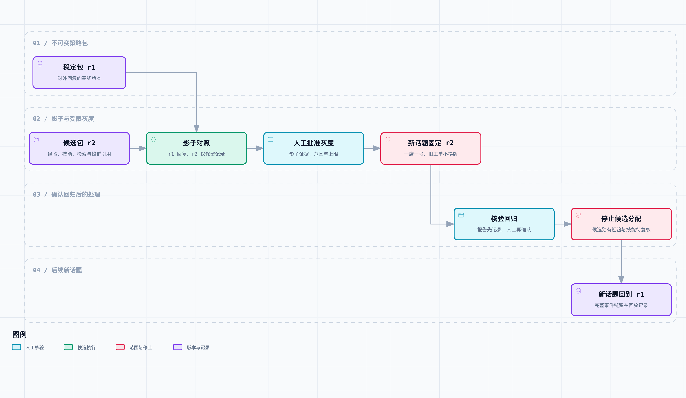

# 把改进用起来：小范围启用、错误经验撤销与完整回放

下午四点，品牌运营在飞书话题里补了一句：

> 同一家店又有团餐优惠算错了。上次那套排查步骤还能直接用吗？

小林翻到昨天的处理记录。上一版 Agent 会先问活动编号，这一点在第 13 篇的合成 Gate 里没有退步；它还会引用一条“缺少活动编号时先查活动条件”的经验和一个只读排查技能。问题在于，今天刚好有一批门店切换了客户端和活动配置版本。

“先别继续扩大试用。”老周说，“这张话题从一开始用的是哪个策略包？那条经验是哪一版配置留下的？”

这是[《从工单开始，做一个 AI Agent》](https://juejin.cn/column/7686674237757063206)的第 14 篇，也是这轮 Demo 的收尾。第 13 篇把一个候选策略比较到 `eligible_for_shadow`；本篇把“可以比较”变成一条可回查的发布路径：**每张新工单先冻结一个策略包；候选先影子运行，再经人工批准进入有上限的灰度；确认退步后停止给新工单分配候选，并标记候选独有的经验与技能待复核。**

这里没有连接真实飞书、模型、订单库或活动系统。结果全来自固定的合成话题与 SQLite 演示库。它管理的是调查策略版本，不能修改活动配置，更不能把“已回滚”写成“门店业务已经恢复”。

## 不要只给 Agent 留一个“当前版本”

如果策略由 Prompt、检索、经验、工具说明和协作计划拼起来，“当前 Agent”不是一个足够精确的对象。上线时只改了一条经验，三天后出了问题，仍然要回答：那张工单用了哪个检索配置？是否开启了多 Agent 分工？经验和技能是不是同一批审核结果？

本篇把这些引用装进不可变的 `PolicyBundle`：

```json
{
  "id": "bundle-r2",
  "revision": "coupon-intake-r2",
  "experience_ids": ["experience-coupon-missing-campaign-r1"],
  "skill_ids": ["skill-coupon-intake-r1"],
  "retrieval_config_id": "retrieval-coupon-r1",
  "swarm_plan_id": "swarm-single-agent-r1"
}
```

`bundle-r1` 是稳定版本，`bundle-r2` 只多出一条经验和一个技能；检索配置、蜂群计划仍复用原来的版本。注册器会对上面整个 JSON 做规范化后哈希：同一个 `id` 再提交不同内容，会直接报 `bundle_id_content_mismatch`。这样不能把旧版本悄悄改成新含义，再拿旧工单的追踪记录解释新代码。

这是一份**引用清单**，不是把所有组件复制一份。组件本身仍有自己的存储与审查流程。策略包只记录“这次运行选择了哪一个 ID”；这样从话题记录反查时，才有机会重新找到当时的经验、技能、检索和协作配置。

## 先冻结工单，再谈发布范围

发布最容易被忽略的一点，是工单可能持续很久。一条飞书话题从客户首帖、客服补材料、研发排查，到最终确认，可能跨越一次策略切换。如果每一轮都读“当前稳定版本”，同一张工单会前半段按 r1 检索，后半段换成 r2 调用技能，事后无法归因。

`route_ticket()` 的第一件事是查已有分配；有记录就原样返回。只有首次路由才根据范围决定稳定、影子或灰度：

```python
existing = db.execute(
    "SELECT * FROM assignments WHERE ticket_id=?", (ticket_id,)
).fetchone()
if existing:
    return {**assignment, "reused_assignment": True}

if rollout and rollout["phase"] == "shadow":
    bundle_id = stable.bundle_id
    shadow_bundle_id = rollout["candidate_bundle_id"]
    mode = "shadow"
elif rollout and rollout["phase"] == "canary":
    bundle_id = rollout["candidate_bundle_id"]
    mode = "canary"
else:
    bundle_id = stable.bundle_id
    mode = "stable"
```

范围不是一个模糊的“先少量门店”。本地实现要求每个 rollout 明确给出 `tenant / brand / store`，并为影子与灰度分别设置最多可分配的话题数。匹配范围外的话题继续使用稳定包；超过上限的新话题也回到稳定包。示例只放开 `demo-tenant / demo-brand / store-002`，影子一张、灰度一张。

这种做法借用了软件发布里的灰度思路：候选只暴露给受限范围，再基于观察决定是否继续。Google SRE 对 canary 的定义也是“部分且有时间限制地部署一个变更并评估它”，同时强调候选和对照都需要可比较的观察过程。[Google SRE《Canarying Releases》](https://sre.google/workbook/canarying-releases/)讨论的是服务发布，本篇把相同的约束转成工单调查策略的版本路由，二者的指标和风险边界并不相同。



[打开完整流程图](https://github.com/j-tide/juejin-article/blob/main/03-%E4%BB%8E%E5%B7%A5%E5%8D%95%E5%BC%80%E5%A7%8B%EF%BC%8C%E5%81%9A%E4%B8%80%E4%B8%AA%20AI%20Agent/14%EF%BD%9C%E6%8A%8A%E6%94%B9%E8%BF%9B%E7%94%A8%E8%B5%B7%E6%9D%A5%EF%BC%9A%E5%B0%8F%E8%8C%83%E5%9B%B4%E5%90%AF%E7%94%A8%E3%80%81%E9%94%99%E8%AF%AF%E7%BB%8F%E9%AA%8C%E6%92%A4%E9%94%80%E4%B8%8E%E5%AE%8C%E6%95%B4%E5%9B%9E%E6%94%BE/diagrams/policy-rollout-flow.html) · [可编辑规格](https://github.com/j-tide/juejin-article/blob/main/03-%E4%BB%8E%E5%B7%A5%E5%8D%95%E5%BC%80%E5%A7%8B%EF%BC%8C%E5%81%9A%E4%B8%80%E4%B8%AA%20AI%20Agent/14%EF%BD%9C%E6%8A%8A%E6%94%B9%E8%BF%9B%E7%94%A8%E8%B5%B7%E6%9D%A5%EF%BC%9A%E5%B0%8F%E8%8C%83%E5%9B%B4%E5%90%AF%E7%94%A8%E3%80%81%E9%94%99%E8%AF%AF%E7%BB%8F%E9%AA%8C%E6%92%A4%E9%94%80%E4%B8%8E%E5%AE%8C%E6%95%B4%E5%9B%9E%E6%94%BE/diagrams/policy-rollout-flow.workflow.json)

## 影子运行：候选可以回答，客户看不到它的回复

第 13 篇的候选只是获得影子资格，本篇的 `create_shadow()` 仍要求受信任审核人提供评测记录号。程序不会读取 Gate 分数后自行放行，也不会把离线通过自动解释成线上安全。

当 `topic-shadow-001` 进入影子范围时，注册器留下两份绑定：

| 字段 | 值 | 含义 |
| --- | --- | --- |
| `bundle_id` | `bundle-r1` | 对外仍由稳定版本回复 |
| `shadow_bundle_id` | `bundle-r2` | 候选版本只生成供比较的记录 |
| `mode` | `shadow` | 后续可以查到这次不是灰度输出 |

演示中，r1 追问 `channel` 与 `product`，r2 追问 `campaign`。两份输出都写进 `shadow_records`，但 `mark_delivered()` 记录的对外版本仍是 r1。影子模式的重点不是“同时跑两份就安全”，而是不能混淆**观察到的候选输出**和**发给客户的回复**。

真正系统里的影子执行还会碰到更麻烦的问题：候选可能多读一次数据、多花 Token，甚至因外部工具的副作用不能安全地重复执行。本篇没有实现这些工具，因此也没有把影子运行说成零成本。若候选需要调用会改变业务状态的工具，应该先设计只读副本、录制回放或明确的幂等保护，而不是直接双跑。

## 从影子到灰度，必须留下谁批准了什么

灰度不是自动状态迁移。本地注册器只允许 `ops-zhou` 这样的受信任审核人调用 `approve_canary()`，且至少要存在一条 shadow 记录：

```python
if observed < 1:
    raise RolloutError("shadow_evidence_required")

registry.approve_canary(
    "rollout-coupon-r2",
    canary_limit=1,
    actor="ops-zhou",
    reason="已核对影子记录，限制为一个门店的一张新话题。",
)
```

它没有要求“候选比旧版高多少分”才允许调用。这不是漏掉一个阈值，而是把阈值留给业务方的准入规则：第 13 篇的离线 Gate、当前活动范围、人工检查过的影子差异、门店高峰时段和客户影响都可能影响判断。程序在这里固定的是可回查的动作：谁在什么时间把什么候选、以什么上限放进灰度。

演示里批准后，`topic-canary-001` 首次路由到 r2，且这个版本被写入 `assignments`。若把同一个 `ticket_id` 再传给路由函数，仍返回 r2，即使灰度后来被停止。这里保留的不是“继续给客户发旧回答”，而是历史事实：这张工单开始调查时，系统确实使用了哪个版本。新的后续动作可以由人工另开任务、重新审查或明确转交，但不能让审计记录半路换版本。

## 一条投诉不是回滚信号，确认过的回归才是

客户补一句“又不行了”很重要，却还不是足够的因果证据。可能是活动版本刚切换，可能是客户端缓存，也可能是候选策略确实跳过了必要排查。本篇把反馈分成两种记录：

| 分类 | 谁可提交 | 会改变 rollout 吗 | 作用 |
| --- | --- | --- | --- |
| `reported_issue` | 值班或客服 | 不会 | 保存现场线索，等待核对 |
| `verified_regression` | 受信任审核人 | 仍不会自动回滚 | 可以作为人工执行 rollback 的依据 |

`record_feedback()` 只写记录，绝不自己改动 rollout 状态。即使有一条 `verified_regression`，仍要审核人显式调用 `rollback()`。这多了一步，但可以避免“一个误报停止整批策略”的隐蔽逻辑，也让事后能区分谁报告现象、谁核验回归、谁决定停止发布。

回滚的动作也刻意很窄：

1. 将 rollout 状态从 `canary` 改成 `rolled_back`；
2. 之后首次进入的同范围新话题重新路由到稳定包 r1；
3. 把候选包独有的经验和技能标记为 `needs_review`；
4. 保留已经分配给 r2 的 `topic-canary-001` 及完整事件链。

候选与稳定包共享的 `retrieval-coupon-r1`、`swarm-single-agent-r1` 不会被一并标记。否则，一个候选策略的错误会意外污染仍被稳定版本使用的共同组件。Demo 中被标记待复核的是 `experience-coupon-missing-campaign-r1` 和 `skill-coupon-intake-r1`。

这也解释了“撤销经验”和“回滚策略包”不是一回事。这里的 `needs_review` 是策略注册器里的依赖标记，没有直接改写第 11 篇 `ExperienceStore` 的审批状态。真实系统需要由经验库的审核流程决定它是修订、撤销，还是只缩小有效范围；在那之前，候选包不再给新工单分配。

## 用一次完整演示检查边界

运行下面命令会建立临时 SQLite 库并写出结果；所有时间、话题、策略输出和反馈都来自 fixture：

```bash
python3 -m ticket_agent.policy_rollout_demo \
  --output fixtures/policy-rollout-results.json

python3 -m unittest discover -s tests -v
```

[本篇代码快照](https://github.com/j-tide/juejin-article/blob/main/03-%E4%BB%8E%E5%B7%A5%E5%8D%95%E5%BC%80%E5%A7%8B%EF%BC%8C%E5%81%9A%E4%B8%80%E4%B8%AA%20AI%20Agent/14%EF%BD%9C%E6%8A%8A%E6%94%B9%E8%BF%9B%E7%94%A8%E8%B5%B7%E6%9D%A5%EF%BC%9A%E5%B0%8F%E8%8C%83%E5%9B%B4%E5%90%AF%E7%94%A8%E3%80%81%E9%94%99%E8%AF%AF%E7%BB%8F%E9%AA%8C%E6%92%A4%E9%94%80%E4%B8%8E%E5%AE%8C%E6%95%B4%E5%9B%9E%E6%94%BE/code.zip)可以独立解压运行。共享代码目录里的[实际演示结果](https://github.com/j-tide/juejin-article/blob/main/03-%E4%BB%8E%E5%B7%A5%E5%8D%95%E5%BC%80%E5%A7%8B%EF%BC%8C%E5%81%9A%E4%B8%80%E4%B8%AA%20AI%20Agent/code/fixtures/policy-rollout-results.json)记录了这一条固定流程：

1. `topic-shadow-001` 对外用 r1，r2 只留下“应追问活动编号”的对照；
2. `ops-zhou` 以一条 shadow 记录批准 r2 在一个门店的一张新话题中灰度；
3. `topic-canary-001` 被冻结在 r2；一条客服报告只记录为 `reported_issue`；
4. 审核人核对配置版本后写入 `verified_regression`，再明确执行 rollback；
5. `topic-after-rollback` 重新使用 r1，已经在运行的 `topic-canary-001` 仍显示最初的 r2；r2 独有经验和技能变为待复核。

新增 8 个回归测试覆盖：策略包内容不可覆盖、范围与上限、影子不对外发送候选、人工批准条件、版本冻结、未核验反馈不能回滚、确认回归后的新旧工单分流，以及完整追踪链。本机累计 203 项测试通过。

203 是本地脚本化测试数，不是 203 张真实工单的效果统计。没有运行真实模型，因此没有准确率、Token、延迟或费用结论；没有接入真实飞书和活动配置，也没有验证身份、并发冲突、跨库事务或生产回滚流程。

## 回到这条团餐工单

小林打开回放记录，先看到 `topic-canary-001` 的 r2 分配、影子对照、两条反馈和回滚事件。她没有把它当成“这张工单已经处理完”。

“候选先停了。”老周说，“新话题会回到 r1；这张已经用过 r2，记录留着。活动范围和客户端版本还得按今天的配置查。”

阿杰把客户端版本补到待办里。小林回复门店：目前确认的是策略经验可能过期，下一步需要核对活动配置、门店范围和订单条件；没有把“系统已回滚”写成“优惠已经恢复”。

这个 Demo 到这里能做到的是把一次改进的来源、范围、版本、观察、批准和停止动作连起来。客户的问题仍然千差万别，下一次新增能力也要从一张具体工单开始：先说明它改了哪一段调查，再用对应的证据决定是否继续保留。
