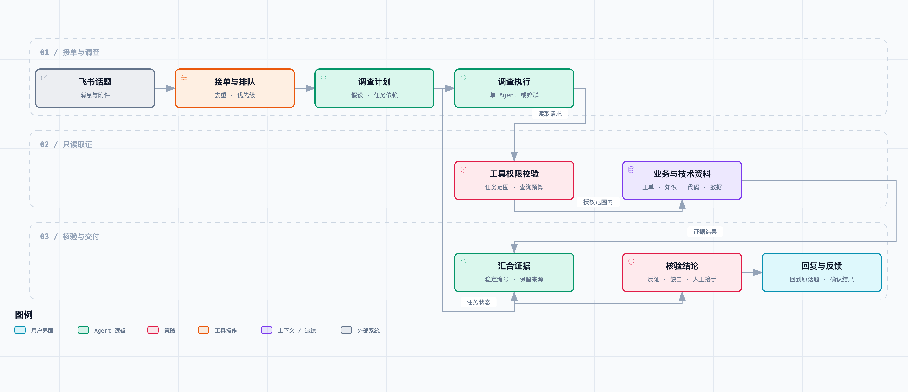
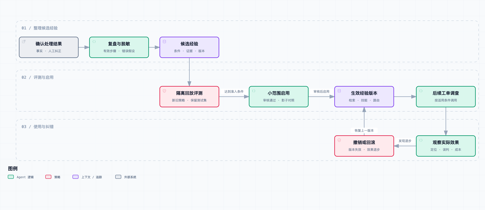

# 从工单开始，做一个 AI Agent

[掘金专栏](https://juejin.cn/column/7686674237757063206)

围绕一个虚构茶饮 SaaS 平台的商户支持与工单处理过程，逐步实现一个能接单、调查、协作和积累经验的 Agent。输入是品牌或门店客户创建的话题及其持续更新的内容：原始问题的文字、图片、演示视频，以及客服、前端和后端值班人员的讨论；输出是有证据支持的调查进展、结论和下一步。Agent 参与已有的值班协作，既要调查业务问题，也要接续人已经做过的工作。

先在本地跑通一个最小 Demo，再接入飞书，随后围绕同一版本逐步增加能力。当前安排 14 篇，前 3 篇完成文字工单的接单、查询、追问与回复；后续篇目随实现和验证结果调整，不设固定总篇数。下文描述的是目标设计。第 01—06 篇已补齐正文、代码快照与配图；第 07—14 篇仍是开头与结尾场景草稿。下文保留目标设计，实际实现范围以各篇说明为准。

## 业务背景：虚构的茶饮 SaaS 平台

专栏统一采用茶饮 SaaS 场景。平台为多个虚构品牌及其门店提供消费者点单、支付、订单流转、门店接单出单、团餐和营销能力。个人日常消费按人均 10—20 元设定；团餐包含多杯、多参与人或多笔关联订单，金额与处理方式单独建模，不能按一杯饮品的价格推算整单。

高峰期请求集中，顾客在等饮品，门店正在制作，客服与研发需要尽快判断影响范围。实时性、高流量和对处理成本的敏感，都是设计约束；具体请求量、门店数、超时阈值、可用性与响应目标，需要随示例配置或实验说明，不冒充真实公司的线上指标。

正文、标题、人物对话、配图、代码、测试数据和附件都使用虚构名称与标识，不出现用于提供背景参考的真实茶饮品牌或商业平台名称，也不影射其事故、架构和内部流程。技术文档与研究的出处继续如实标注。

### 谁在提交问题，谁在使用系统

文中默认把创建飞书话题的平台客户设为品牌运营、门店负责人或商户对接人员，他们提供原始问题，并可能附上消费者的反馈、截图或录屏；平台客服随后参与，前端和后端值班人员继续排查。顾客是下单购买饮品的人，不预设所有顾客都直接进入商户支持群。

叙事中尽量用“门店负责人”“品牌运营”“顾客”“平台客服”说明身份，避免一句“客户说了”混淆消息来源。门店人员报告“没出单”、顾客说“扣钱了”、支付记录显示成功，分别是不同来源的观察，不能互相替代。

所有调查都先确定被授权的品牌、门店与业务对象范围，再按需要补齐点单渠道、订单或支付标识、设备与客户端版本、活动配置、事发时间。工具的授权范围来自可信配置；模型提取出的门店名或群成员自报身份只用于定位线索，不能据此扩大权限。

### 业务过程里有哪些不同状态

“订单成功”不是一个可以代表所有环节的状态。示例系统分别记录顾客提交、支付结果、订单状态、门店接单、打印或出单任务、制作和交付记录；前期 Demo 只实现其中必要部分，其他能力以后再补。

支付成功不代表门店已经收到订单；服务端发送了打印任务不代表小票已经打印；设备回执也不证明顾客拿到了饮品。每条观察要带来源和时间。现场无法取得设备状态时，应请门店核验，而不是从数据库字段推定纸质小票已经出来。

Agent 的主线仍是只读取证和协助处理。补打、补单、退款、修改库存或活动配置会影响资金、制作和营业流程，不能作为超时重试的默认动作；需要明确列出待人工执行的步骤与核验条件。第一版也不预设接入了真实支付渠道、打印设备或门店生产系统。

### 用这些业务问题逐步增加能力

| 业务场景 | 具体工单 | 需要查清什么 |
| --- | --- | --- |
| 支付与门店出单 | 顾客出示付款记录，门店没有看到单或没有打印小票 | 支付、订单、门店接收和设备任务分别到哪一步，是否只是某一环节延迟 |
| 重复出单与重复支付 | 门店出来两张相似小票，顾客担心被扣两次钱 | 是两个业务订单、重复投递还是重复打印，不能凭小票数量判断扣款次数 |
| 菜单、规格与库存 | 小程序能选某款饮品，门店却已售罄；改冰量后价格变化 | 门店与渠道配置、规格组合、库存更新、缓存及版本是否一致 |
| 营销活动 | 券在一家店能用，另一家店不能用；支付金额与页面预估不同 | 活动有效期、适用门店与商品、人群条件、渠道和叠加顺序，以及报价对应的配置版本 |
| 活动高峰 | 活动开始后多人反映点单慢、支付结果迟迟不刷新 | 影响哪些品牌、门店、渠道与时间段，是共同依赖故障、积压还是个别问题 |
| 团餐与预约 | 企业订了多杯饮品，到约定时间有部分门店未接到单或漏了几杯 | 团餐批次、明细、数量、门店路由、预约时间和履约状态，部分成功不能当作整批完成 |
| 多人点单与修改 | 团餐收单前有人改口味，汇总清单与门店看到的不一致 | 修改是否过了截止时间，汇总与子项的版本关系，哪些明细已进入制作 |
| 取消、部分退款与优惠处理 | 团餐取消几杯后，退款状态和优惠券处理引起疑问 | 实际适用规则、已制作明细、支付与退款记录；没有确认规则时不能自行推算应退金额 |
| 会员、积分与营销权益 | 顾客下单后积分未更新，赠券迟迟没到 | 生效条件、异步任务、活动版本与账号匹配，不能套用支付出单问题的处理方法 |
| 门店设备与现场环境 | 系统显示已推送，现场仍没有小票；网络恢复后集中出单 | 设备在线与回执、任务重试、网络时间段和现场确认，不自动重复下发制作任务 |
| 跨门店或跨渠道差异 | 同一品牌不同门店、扫码点单和其他入口表现不同 | 比较配置、上线范围、设备和客户端版本，同时保持品牌与门店的数据隔离 |

团餐指多人或大批量饮品的组织、下单与履约，不等同于团购券核销。后续若增加核销场景，要单独说明凭证、渠道与核销状态，不能用同一套名称混写。

### 实时问题怎样影响 Agent 的行为

先给值班人员可用的进展：目前确认了哪个环节、影响范围有多大、谁在处理、还需要什么现场信息。不能为了生成一份完整长报告，让门店在高峰期持续等待；证据尚不足时也不能给未经证实的原因或恢复时间承诺。

优先级由影响范围、持续时间、营业是否中断、资金是否异常、团餐交付窗口和人工配置共同确定，不能只按订单金额排序。单杯价格低不代表事故优先级低，一次活动故障可能影响多家店，团餐也可能接近约定交付时间。

在权限允许且对象、版本与有效期匹配时复用同一事故的调查结果，仍为每张工单核对必要的差异。简单规则咨询不启动全套蜂群；复杂或大范围问题才增加调查分支。模型、检索与数据库查询预算需要可配置，并观测排队时间、首次有效反馈时间、重复询问、定位质量与成本，而不是只追求回复速度。

## 从哪张工单开始

先用一组虚构、可回放的工单搭建环境，不接真实公司的订单、用户资料或私有仓库。主案例是：

> 门店负责人创建飞书话题：“顾客已经付了款，我们这里没出单，人还在柜台等。”首条消息包含顾客付款截图、点单页面录屏和门店描述。平台客服随后补充品牌、门店及订单信息；前端值班人员说“先确认页面显示的订单状态”；后端值班人员贴出记录：“支付已成功，出单任务还在重试。”

这里的角色、措辞和记录是用于写作与测试的合成示例。页面状态是否过期是待验证假设；“任务还在重试”是值班人员报告的观察，需要保留所附记录与时间；它们都不能自动变成已确认根因。视频里的操作顺序、补充消息和被纠正的判断会一起影响调查。

围绕这个现象准备不同原因的样例：支付回调延迟、出单任务积压、门店路由不一致、页面状态未刷新，以及打印设备断网。它们可能有很相似的描述，却需要不同证据。

一次完整调查需要回答：用户看到的是什么、相关记录当前是什么状态、事发时运行的是哪个版本、哪条业务规则适用，以及已有证据能否解释这个差异。当前代码只能说明代码如何工作，不能独自证明事发时执行了哪条路径；数据库当前值也不能替代事件发生时的记录。

这个案例只用于建立第一条可运行流程。后续引入活动规则、库存与规格、团餐预约、门店设备、偶发异常和未知故障，用不同输入检验系统如何选择处理路径；不要求所有工单都经历检索、读代码和查数据库。

## 用不同工单推动 Demo 迭代

“顾客已付款但门店没出单”用来跑通第一条处理流程。此后的能力要由具体工单暴露的问题推动，不能把所有问题都改写成订单状态查询。业务样例先采用合成数据，明确标注构造条件；这些场景是待验证的设计输入，不是已经处理过的真实客户案例。

不预设每张工单都有订单号、完整截图、复现步骤或正确的原因描述。先理解客户想完成什么、预期发生什么、实际发生什么，再判断下一项最有用的信息。有些问题只需解释规则或指导操作，有些需要代码和数据调查，有些只能提供有限结论并交接。

### 持续保留的场景组

| 场景 | 示例输入或后续变化 | 希望 Agent 怎样处理 |
| --- | --- | --- |
| 描述不清、问题范围未知 | “怎么又不行了”，只有一张截掉标题的截图 | 先问具体操作与异常表现，利用已有截图缩小范围，不索要无关订单号 |
| 规则咨询、操作误解或产品限制 | “这张券为什么不能用”“取消了怎么还没到账” | 核对适用规则、时间和条件，解释可执行步骤；存在矛盾证据时再转调查，不直接判为客户操作错误 |
| 账号、对象或环境不一致 | 截图来自另一个账号，网页端可用但 App 不行 | 对齐账号、设备、应用版本与复现对象，先说明能确认的差异，不跨账号扩大查询 |
| 偶发、弱网与难以复现 | 偶尔白屏，重新进入后恢复，客服无法复现 | 记录发生窗口与操作顺序，检查可得日志；无法确认原因时保留假设，不把“现在好了”当成定位成功 |
| 图片、视频与文字相互矛盾 | 客户说按钮无反应，视频却显示加载后跳回登录页 | 引用具体画面或时间点核对现象，再检查会话与接口线索，不直接采信任意一种材料 |
| 发布、灰度或配置差异 | 只有部分版本、渠道或用户出现异常 | 查实际部署和配置范围，比较正常与异常样本，不只读主分支代码 |
| 异步延迟与第三方依赖 | 付款已完成、团餐已提交或出单任务已发送，后续状态迟迟不出现 | 区分受理、处理中、成功与失败，检查时间窗口及依赖；缺少第三方记录时交代证据缺口，不编造原因 |
| 一个话题有多个问题 | “顾客支付后找不到订单，小票也没出来” | 分别保留现象、检查和结论，再寻找可能关联，避免回复其中一个就关闭整张工单 |
| 多个话题描述同一事故 | 活动高峰多家门店反馈点单、支付和出单异常 | 根据时间、依赖和影响范围提出聚合候选，核验后共享调查；保留混入的独立问题 |
| 人员判断冲突或已经在查 | 前端怀疑缓存，后端说服务正常，客服已试过刷新 | 明确已做检查与证据，查能区分假设的信息；避免重复安排工作或以人员职能代替事实判断 |
| 资料与工具不足 | 没有访问权限、日志过期、知识库没答案、附件失效 | 报告缺少什么及其影响，继续可完成的检查或请求有权限的人员接手；不能将“查不到”解释成“不存在” |
| 未知故障、恢复后复发 | 历史库没有相似问题，前次处理后再次发生 | 从假设和证据重新调查，检查旧结论与技能是否仍适用；保留未解决状态，不强制套入已有分类 |
| 需要及时人工处理 | 客户反映重复扣费、多店停止出单、团餐临近交付仍未接单，或影响正在扩大 | 依据业务配置的优先级及时通知负责人，附现有证据与缺口；调查流程不能自动执行退款、修改数据或承诺恢复时间 |

这些场景可以叠加。例如“旧版本中偶发失败，视频不完整，客服已给过一次错误判断”，比单独列一个“登录失败”更能检验设计。常见表达与生僻故障都保留，未知问题有独立处理路径；场景分类用于组织样例，不作为模型必须命中的封闭答案集合。

### 在十四个版本里逐步引入业务复杂度

01—03 先处理单店单笔订单的文字工单。04 用门店活动、优惠券适用范围和过期案例检验检索；05 增加点单录屏与门店现场图片；06—07 追到点单页面、订单服务、门店路由和设备任务，用受限数据核验。08 引入团餐明细、人员交接和同一话题中的多个问题；09 比较单店简单咨询与跨服务复杂调查是否需要蜂群；10 用活动高峰、多店异常及接近交付时间的团餐检验排队与聚合。11—14 检查经验是否限定了品牌、门店、渠道、活动版本和时间，能否面对新活动、新版本或旧问题复发，并在错误时撤销。

每篇仍保留不同处理路径：付款与出单需要查状态，优惠咨询可能只需核对规则，打印设备异常可能必须取得现场反馈，团餐缺少明细时应先补齐范围。不能给每张工单机械安排完整的代码、数据库和多 Agent 调查。

### 分流与追问要随证据调整

先判断当前更适合解释规则、指导操作、补充信息、调查故障还是交接处理，证据变化后允许改判。一开始按规则咨询处理的问题，后面可能被证明是规则实现错误；不能因为早期分类就限制后续可用工具。

通用工单结构不强制要求订单号。问题描述、目标操作、已有材料和当前缺口作为共同部分；订单、账号、上传任务等业务对象按场景挂载。只有在本次检查需要时才追问具体字段，并先检查客户或值班人员是否已经提供。追问说明需要它做什么；客户没有继续回复时保存等待状态，不能自行推定问题已解决。

调查到什么程度就交付什么程度的结果：解释已确认的规则、给出可验证的操作步骤、说明证据支持的原因、提出待验证假设、等待补充或转交人工，都是可能的处理结果。不同结果使用对应验收标准，不把它们都计作“根因定位成功”。对话结束、现象恢复、原因确认和修复完成分开记录；后续复发可以重新打开调查。

### 各篇如何增加场景覆盖

场景按版本能力逐步引入；前几篇遇到尚不支持的输入时，应如实说明并转交或等待，不要求 Demo 提前具备全部能力。

| 篇号 | 用什么问题推动本次改进 | 至少保留的反例或失败情况 |
| --- | --- | --- |
| 01 | 一条信息足够的文字查询跑通完整流程 | 订单不存在、工具失败，以及与订单无关的输入不能硬查订单 |
| 02 | 客户直接在飞书创建话题、人员继续回复 | 重复事件、不可见历史、只有未解析附件的首帖 |
| 03 | “又不能用了”、缺少对象、客户更正账号 | 反复追问、人员已回答、客户不再回复、旧结果迟到 |
| 04 | 规则咨询与历史故障的相似描述 | 旧规则、条件不符、没有命中，规则解释与故障调查要能切换 |
| 05 | 截图报错与视频里的操作过程 | 瞬时提示、无声视频、文字与画面冲突、附件失效 |
| 06 | 同一操作在网页与 App 或不同版本表现不同 | 错误代码版本、仅同名符号命中、静态路径缺少运行依据 |
| 07 | 查询显示正常，用户仍反馈失败 | 副本延迟、异步处理中、第三方资料缺失、日志已过期 |
| 08 | 一条话题持续多轮，人员意见变化或涉及多个问题 | 已推翻假设、重复人工工作、子问题被遗漏、内部证据误发客户 |
| 09 | 一个复杂问题需要多方向取证 | 简单问题不拆分，分支冲突、共同错误来源、子任务失败仍要保留 |
| 10 | 同一时段大量客户反馈相似故障 | 聚合中混入独立问题、高优先级事件、积压及外部依赖持续失败 |
| 11 | 客服纠正了 Agent，或旧故障再次出现 | 原因未确认、处理方法只暂时有效、过期经验与不适用技能 |
| 12 | 同一版本在常见问题表现好，在新类型上表现差 | 未知故障、信息不全工单、无明确根因的样例不能从统计中消失 |
| 13 | 找到可定位的重复失败，提出策略改进 | 对常见场景有益但损害少数场景的候选应被识别 |
| 14 | 新策略启用后出现新版本或新类型工单 | 效果退步、错误反馈、恢复后复发、经验撤销和版本回滚 |

### 每篇的内容与验证要求

正文先给客户实际可能说的话、已有材料和当时知道的信息，再展示上一版如何处理、哪里不足、为什么需要这次改动。保留人员讨论和证据逐步到达的过程，不在开头泄露最终根因，再让模型复述答案。

每篇至少覆盖一个能够完成的主场景、一个相似但需要不同处理的场景，以及一个证据或能力不足时的处理。具体用例随本篇能力选择，不为了凑数量重复同一种成功路径。每次增加能力都回放已有代表性场景，检查是否破坏原来的处理方式。

验收同时关注证据是否支持结论、下一步是否有用、是否重复追问、是否覆盖子问题、交接是否及时，以及耗时和成本。没有已确认根因的样例，只评价当时可核对的事实和处理动作，不为其编造正确根因。按问题类型、信息完整度、影响范围和常见程度分别报告结果，避免大量容易工单掩盖少数严重错误。

这些要求保留在专题路线中；已完成篇目的实际样例与执行记录见正文，后续篇目继续按同一要求补齐。

## 一条话题就是持续更新的调查现场

接单单位是话题，处理材料是话题中的消息和附件。首条消息保存客户最初反馈的现象，后续回复形成调查过程；不能只读首条消息，也不能把整段讨论压成一个没有来源的“问题描述”。图片和视频可能在首帖里，也可能由任何参与者在后续补充。

| 材料 | 保存和提取什么 | 在调查中的用途 |
| --- | --- | --- |
| 客户原始文字 | 原文、账号或订单线索、预期与实际表现 | 定义要解释的问题，保留后续纠正 |
| 图片 | 原文件引用、文字识别结果、界面区域与观察 | 识别页面状态、错误提示，回查原图 |
| 演示视频 | 原视频引用、操作时间线、带时间戳的片段、必要的转写 | 对齐点击、加载、提示和跳转，核对复现步骤 |
| 客服补充 | 用户环境、问题范围、追问与回答 | 减少重复询问，补齐调查条件 |
| 前端与后端讨论 | 人员提出的假设、已经做过的检查、附带记录与下一步 | 沿已有调查继续，识别冲突和未完成事项 |
| 处理与验证消息 | 采取的措施、结果反馈、验证条件与后续复发 | 区分临时恢复、已验证解决和根因确认 |

所有提取结果都要能回到消息或附件。视频时间戳表示片段在媒体中的位置，不自动等于真实事件发生时间；客户的上传时间也不等于故障发生时间。转写、OCR 和视觉理解的结果保留不确定项，不能补造看不见的接口参数或后台状态。只看稀疏抽帧可能漏掉一闪而过的错误提示，需要围绕变化片段继续检查；缺少识别能力或附件无法读取时，明确记录缺口。

建议的话题状态至少保存以下信息。这里是应用内部的数据模型，具体飞书字段由接入适配器转换，不假设所有事件都有完整回复链。

- **消息记录**：消息标识、根帖或父消息关系、发送者、发送与接收时间、修订状态、附件引用。只有实际接收到或在授权范围内补取到的内容才能进入上下文；缺失历史与不可访问附件要显式标记。
- **观点与观察**：关联原消息和作者，分别记录用户描述、人员报告的观察、模型推断、待验证假设、确认结果、撤回与反证。发言人的职能有助于分配任务，不让猜测自动获得更高证据等级。
- **调查任务**：检查对象、执行人或 Agent、状态、输入版本、证据与待办。人员说“我来查回调”可以形成待确认的认领记录，不等于检查已经完成；系统也不应立即安排另一个 Agent 重复查询。
- **调查版本**：当前已知事实、分歧、缺失信息与下一步。新消息纠正账号、版本或关键事实时，标记受影响的旧任务和结论，而不是只在摘要末尾追加一句话。

参与者身份来自可核对的账号资料与配置，不能凭一句“我是后端”授予工具权限。一个话题后来出现第二个独立问题时，建立关联子问题并分别调查，不能因为处于同一回复链就混成一个根因。

Agent 的回复也要考虑话题里的客户。公开在话题中的进展应说明已核实事实、还缺什么和接下来做什么；涉及其他用户、数据库明细、私有源码或内部日志的原始证据留在受权限控制的调查记录里。根据实际接入方式核对可见范围，不假设飞书同一话题的某条回复对客户不可见。

## 后续逐步实现的完整流程

下面是后期目标，不要求第一版具备所有能力。各篇的实现顺序见后面的版本安排。

[查看交互流程图](diagrams/ticket-investigation.html) · [可编辑规格](diagrams/ticket-investigation.workflow.json)

1. 客户创建话题后，接入层校验消息来源，识别会话、话题及回复关系，去重并保存。文字、图片和视频分别进入解析队列；客服和前后端人员的后续讨论持续更新同一调查。机器人自己的回复不再作为新工单触发，客户或值班人员对机器人的回复仍需处理。
2. 工单进入持久化队列。系统区分缺少信息、可以调查和需要人工接手的任务，并按影响范围、等待时间和资源预算安排执行。
3. 调查 Agent 先整理客户现象、已做的检查、在查事项和讨论中的分歧，再提出可验证假设并决定下一项证据。短时间内的补充合并处理；纠正账号、停止调查和新增关键反证等消息触发及时调整。常见步骤由程序执行，需要根据结果选择下一步时才交给模型。
4. 工具服务按任务授权读取历史工单、业务知识库、前后端代码、数据库及必要的日志或链路记录。每条证据记录来源、版本、时间和可见范围。
5. 需要并行调查时才拆分任务。不同调查者返回结构化证据、推断、反证和缺口；程序检查任务覆盖，再把有分歧的问题交回调查流程。
6. 系统在原话题提供适合参与者可见范围的进展和结论，引用可见的原消息或媒体时间点，说明尚未确定的部分。发布前核对调查版本，避免人员刚纠正事实，Agent 就发出旧结论。只在需要追问、出现有用的新证据或结论变化时回复。
7. 将人工调查和 Agent 调查的有效步骤、被排除的假设、最终措施与客户验证关联起来，再形成候选经验。“可以了”可作为现象恢复的反馈，但不能单独证明根因正确。通过隔离评测和审核后，小范围启用，观察实际收益，再决定是否继续使用。

业务数据库和前后端仓库保持只读。系统自己的任务状态、证据索引和经验版本可以写入内部存储。退款、改订单、改配置和发布代码属于另一类操作，不包含在这里的调查权限内。

## Agent 能力如何体现在这个项目里

| 能力 | 在工单中的具体用途 | 需要检验的问题 |
| --- | --- | --- |
| 多模态理解与信息抽取 | 对齐文字、图片、视频片段和操作顺序，标注原消息与媒体时间点 | 是否遗漏瞬时错误，识别结果是否被误当成已核实事实 |
| 工具调用与 MCP | 按统一契约检索资料、阅读代码、执行受限查询 | 工具调用是否合法、失败后能否继续 |
| RAG 与重排 | 找到条件和版本匹配的历史案例、业务规则 | 相似症状是否被误判为相同原因 |
| 规划与上下文管理 | 为假设选择下一项检查，保留证据和未完成事项 | 计划是否能随新证据调整，压缩是否丢失反证 |
| 人机协作 | 接续客服与前后端讨论，跟踪认领、已做检查、纠正与待办 | 是否重复询问或查询，是否用旧版本结论打断正在进行的调查 |
| 长期记忆与技能复用 | 复用经确认的案例、查询模板和排查步骤 | 适用条件、过期和撤销是否有效 |
| 蜂群协作 | 将可并行的调查分给不同工具能力的执行者 | 是否漏任务、重复查询、掩盖结论冲突 |
| 自进化 | 用反馈更新经验、技能、路由和策略版本 | 后续工单是否实际受益，退步时能否回滚 |
| 评测与可观测性 | 重放工单，跟踪工具、模型、人工接手和最终结果 | 成本是否换来了更准确的调查结果 |

## 当前实现范围

| 篇目 | 已完成 | 待接入或验证 |
| --- | --- | --- |
| 01—03 | 工具执行器、飞书适配器、本地事件回放、持久化话题与版本检查 | 真实模型与飞书平台端到端联调 |
| 04 | 范围过滤、两路词法检索、RRF 合并与结构化条件核对 | 飞书调查类型路由、真实模型检索效果 |
| 05 | 本地图片 OCR、视频帧时间与候选证据、真实原生识别实验 | 飞书附件下载、动作识别、语音转写 |
| 06 | 绑定部署提交的源码工具、合成前后端版本对照 | 真实发布映射、模型自主寻路效果、MCP Server |
| 07—14 | 场景草稿与目标设计 | 正文、代码、实验及分章配图 |

## 按可运行版本安排文章

先用三个小版本完成一个文字工单 Demo，再在同一套程序上增加能力。第一篇结束时就可以输入工单、调用工具并得到带依据的回复；第三篇结束时，客户和值班人员可以在飞书话题里继续补充，Agent 根据新信息接着调查。

各篇沿用同一套话题、消息、任务和证据结构。需要变更结构时说明迁移方式，不另起一个项目。每篇明确上一版的局限、本篇代码增量、运行方法和验收用例，保留能够单独检出的代码版本。第 01—06 篇已有本地实现，下文仍用于记录目标设计；尚未实现的集成不视为交付。

### 第一阶段：先跑通一个能接单的 Demo

#### 01 · 先跑起来：用大模型和一个查询工具处理文字工单

**起点。** 在本地输入“顾客已付款但门店没出单”和一个订单号，暂不接飞书。使用合成支付、订单与出单记录，提供一个只读查询工具，接上模型调用、工具执行和结构化回复，完成最短的一次调查。

**本篇增量。** 模型决定是否调用工具，程序校验参数并执行；结果保存为带编号的证据，回复引用实际查询结果，缺少依据就说明下一步。调用次数、超时、结果大小和凭证管理从这一版就落实，可信身份与业务对象范围不交给模型决定。保留简单的事件记录，供后续比较。

**验证与配图。** 覆盖正常查询、订单不存在和工具超时，给出可运行命令及调用时序图。真实模型演示和脚本化回放分别记录；没有模型调用条件时，只报告回放验证，不把它写成模型实测。此时只回答一次文字输入，还不会持续追踪话题。

#### 02 · 接入飞书：让 Demo 接收客户话题并回复查询结果

**上一版的问题。** 程序只能在终端接收输入，客户仍然需要人工转交工单。

**本篇增量。** 增加飞书接入适配器，将客户创建的首帖和文字回复转换成内部消息结构，沿用第一篇调查函数。保存话题、消息、发送者与时间信息，做最小事件去重和机器人回声过滤；事件接收与耗时调查分开。回复回到原话题，按实际参与者可见范围筛选输出。

**验证与配图。** 在测试群验证一次首帖、重复事件和一条人员回复。核对应用权限、可收到的消息及缺失历史，不假设机器人能读取所有内容。图片和视频先保存附件引用并标记待解析；这一版只调查可用的文字，不能声称已经理解媒体。配图展示话题与内部工单的对应关系。

#### 03 · 新消息来了：让 Demo 会追问、等待和继续调查

**上一版的问题。** 单次消息处理无法应对客户忘记订单号、客服补充信息，或后端已经开始排查的情况。

**本篇增量。** 用轻量持久化保存话题消息、调查状态、待回答问题和已做检查。Agent 先检查已有信息再追问，等待期间不空转；后续消息触发继续调查，客户更正账号时标记旧结果过期。补充消息合并处理，发送前检查输入版本。先实现明确的认领、结果补充和人工接手指令，复杂讨论理解留到第 08 篇。

**验证与配图。** 从客户创建话题、客服补充订单号到查询并回复，完整演示一次；再验证重复补充、人员接手、旧任务迟到与进程重启后恢复等待。配图为状态转换和回复时序。到这里形成可以演示的文字版工单流程，后续都在它上面增加能力。

### 第二阶段：增加调查所需的资料和工具

#### 04 · 接上历史工单和知识库：让 Agent 有依据地查相似问题

**上一版的问题。** Demo 能查状态，却不知道历史上怎样处理过，也不了解当前适用的业务规则。

**本篇增量。** 接入案例和知识库检索，做结构化过滤、召回与重排，保留业务范围、规则生效时间、案例版本和原始引用。根据问题选择检索或直接查询，避免对每张工单都无差别取回大量材料。历史案例作为调查线索，不能直接覆盖当前证据。

**验证与配图。** 加入“相同症状、不同原因”“措辞不同、原因相同”及旧规则反例，与第 03 版对照。配图展示检索结果如何进入调查上下文。没有命中时仍能走原来的查询和追问流程。

#### 05 · 看懂图片和演示视频：把客户操作变成可回查的证据

**上一版的问题。** 文字缺少操作细节，客户已经上传的截图和演示视频还不能参与判断。

**本篇增量。** 在附件解析任务中增加图片识别、视频分段和关键帧分析，按需要加入音频转写。保留原文件、消息引用和媒体时间点，将点击、提示、加载与跳转串成操作序列；围绕疑似变化片段继续查看，避免稀疏抽帧漏掉瞬时提示。分别保存原始材料、观察和推断。

**验证与配图。** 对照只读文字与增加媒体证据的调查，测试一闪而过的报错、无声视频、识别错误和附件读取失败；无法读取时明确缺口，不阻断已有的文字流程。记录解析成本。配图为媒体处理流程与操作时间线。

#### 06 · 给 Agent 阅读前后端代码的能力，沿用户操作查调用链

**上一版的问题。** 有了现象和历史案例，遇到新故障时仍无法解释页面、接口和后端状态之间的关系。

**本篇增量。** 接入受限代码检索与读取工具，从路由、组件和请求追到服务、异步任务与状态转换。关联部署版本与代码提交，返回符号和源码位置，按需展开上下文；静态可达路径与实际执行路径分别说明。先使用本地示例仓库，不开放任意终端执行权限。

**验证与配图。** 对照前后端字段变化、客户端缓存和后端任务失败，检验 Agent 是否找到了相关实现，而非仅命中同名文件。配图串起页面到后端任务的调用关系。工具接口保持与前几篇一致；这里补充 MCP 适配的实现与取舍，不让协议替代执行端授权。

#### 07 · 接上只读数据库和日志，让代码推断得到验证

**上一版的问题。** 读到代码只能说明可能如何运行，不能证明某笔订单实际上经过了哪条路径。

**本篇增量。** 将第一篇的合成查询适配器扩展为受限数据库查询，并增加日志或事件记录工具。数据库账号、只读事务、可见对象、字段脱敏、过滤条件、行数及超时共同限制访问。按订单、请求与时间窗口关联代码版本、支付记录和出单任务，处理副本延迟、时钟差与日志缺失。

**验证与配图。** 对照当前状态相同、历史事件不同的两个样例；验证越权对象、过量查询和不完整日志。结论要说明证据支持到哪一步，不能把推断包装成已确认原因。配图为查询执行流程与跨系统证据时间线。

### 第三阶段：让现有 Demo 能参与持续协作

#### 08 · 值班讨论越来越长：让 Agent 记清事实、分歧和待办

**上一版的问题。** 客服、前端和后端不断补充信息，简单追加消息会增加上下文成本，也容易覆盖纠正过程或重复人工已做的工作。

**本篇增量。** 在第 03 篇状态上加入人员观点、调查认领、未完成检查和结论修订。区分客户描述、人员报告、猜测和验证结果；长话题采用增量摘要与证据索引，原消息按需读取。保留被否定的判断、媒体时间点和人工正在查的事项。重要纠正触发重规划，普通讨论合并处理。

**验证与配图。** 重放“前端怀疑缓存—客户刷新仍失败—后端查到任务异常”的讨论，检查角色归属、证据引用和下一步是否正确。加入旧消息注入指令、已回答问题和迟到结论。配图展示话题状态更新、人工与 Agent 分工及消息发布检查。

#### 09 · 借鉴 EvoX 蜂群协作，让多个 Agent 分头调查

**上一版的问题。** 某些工单需要独立查历史案例、前端代码和后端数据，单 Agent 串行执行较慢，但简单工单没有必要拆分。

**本篇增量。** 在现有运行器外增加协调器，由模型提出任务依赖，执行器检查覆盖和预算。子任务使用稳定编号、独立上下文、输入版本、认领租约和结构化结果；程序检查遗漏、重复与迟到结果。证据有冲突时发起能区分假设的检查，不能以多数同意代替核验。保留单 Agent 路径作为回退与对照。

**验证与配图。** 用相同工单、模型和总预算比较单 Agent、固定并行与动态分工，覆盖执行者超时、重派和部分失败。配图为任务 DAG 和结果汇合时序。明确借鉴 EvoX 的机制与本项目实际验证的效果。

#### 10 · 工单多起来以后：补上排队、事故聚合和运行观测

**上一版的问题。** 同时出现大量话题时，调查会争抢资源；同一事故的重复问题可能触发大量相同查询。

**本篇增量。** 将 Demo 的轻量任务调度扩展为持久化队列，加入优先级、并发预算、背压、取消、失败恢复和发送结果记录。按可能关联的事故聚合工单，在可见范围内复用进展，并保留各用户的差异。扩展第一篇的运行记录，跟踪排队、检索、推理、工具、人工等待与交付时间。

**验证与配图。** 压入重复工单和混入的独立故障，注入重启、工具超时和回复失败。报告端到端时间、关键等待、Token 与成本，未知用量不当成零。配图为队列与执行者结构、一次工单的耗时分解。

### 第四阶段：让已运行的系统从处理记录中改进

#### 11 · 把处理记录变成经验：案例记忆与可复用排查技能

**上一版的问题。** 系统能调查工单，却会重复走相同弯路；人工纠正和有效步骤只留在聊天记录里。

**本篇增量。** 从人工与 Agent 的完整调查轨迹生成经验候选，分别保存现象、确认原因、反证、适用条件、有效期和来源。将反复验证的只读步骤整理成有前置条件、证据要求和退出分支的技能，按需调用。为案例、摘要与技能建立依赖关系，支持去重、过期、纠正和撤销。

**验证与配图。** 重放旧故障与不适用的新版本，检查能否复用有效步骤并拒绝错误套用。客户说“好了”只说明现象可能恢复，不能单独作为根因确认。配图为处理记录到候选案例、技能和依赖关系的流程；本篇先做可审查的复用，不直接自动启用模型生成的修改。

#### 12 · 怎样知道 Agent 进步了：建立工单回放评测

**上一版的问题。** 记住更多案例、调用更少工具，不一定意味着调查更准确，需要正式比较版本。

**本篇增量。** 扩展从第一篇积累的回归用例，按事故和时间划分开发集与保留测试集。逐条重放话题消息，模型只看到当时可获得的信息；后续确认的根因只作评分依据。分别评估定位、错误定因、引用、媒体理解、人员观点归属、恰当接手、耗时与成本。

**验证与配图。** 固定模型、工具版本、任务预算和评分方法，对照无经验与有经验的版本。避免同一事故的重复工单泄漏到两侧，保留困难与少数类型，不用脚本化用例通过数替代模型效果。配图展示回放时间线、数据隔离与版本对照。

#### 13 · 根据反馈改进策略：检索、排查步骤和蜂群分工怎样更新

**上一版的问题。** 已有经验和评测，但哪些地方值得调整、调整后是否有效仍需人工逐项分析。

**本篇增量。** 从有证据的失败轨迹提出候选更新，分别作用于检索配置、工具说明、追问顺序、技能和协作路由。一次只改变可归因的一类行为；在隔离环境回放，通过准入检查后才获得启用资格。执行者的能力记录按领域与任务难度更新，不能仅凭容易工单的高通过率分配全部任务。

**验证与配图。** 比较旧策略、候选策略和拒绝更新的案例，保留少数类型是否退步的结果。代码候选在隔离环境检查，更新不能扩大权限；参数训练不包含在这套在线经验更新机制中。配图为失败记录到候选策略、评测与审核的流程。

#### 14 · 把改进用起来：小范围启用、错误经验撤销与完整回放

**上一版的问题。** 离线评测通过的策略仍可能不适用于新工单，错误反馈或版本变化也会污染已积累的经验。

**本篇增量。** 将经验、技能、检索配置、路由和提示词绑定成可回滚版本。先做有预算的影子对照，再小范围启用；运行中的工单固定策略版本。发现效果退步时停止晋升、恢复旧版本并追踪受污染的案例和技能，保留人工接手途径。

**验证与配图。** 注入错误结案、过期经验和多 Agent 相互引用错误结论的情况，验证撤销与回滚。保留第一篇问题作为贯穿对照，并用不同类型的代表性工单回放文字 Demo、资料与工具增强、蜂群协作、经验更新后的行为，分别报告收益、代价和仍未解决的问题。配图为版本晋升、经验撤销与回滚过程。

## 每次迭代怎样保持能运行

- 第 01 篇就有最小工具契约、证据引用、调用预算、授权检查、事件记录与少量回归用例；后续扩展覆盖范围，第 12 篇再建立严格的整体效果评测。
- 第 02 篇接入真实飞书适配器时保留本地输入与事件回放入口；没有外部凭证也能检查应用逻辑，但不会把回放描述为真实平台联调。
- 新能力都接到已有调查流程中。媒体不可读、知识未命中或蜂群分支失败时，记录能力缺口，继续可完成的检查或交接给人。
- 每篇保存代码版本、依赖、示例输入、运行方式和已执行验证。测试使用合成或授权数据；真实模型、确定性回放、第三方结果分开说明。
- 两张现有总图表示后期目标。写每篇正文时补充该版本的流程图，只画本篇已实现部分，并说明和上一版的变化。

## 自进化具体更新什么

[查看经验更新流程图](diagrams/ticket-evolution.html) · [可编辑规格](diagrams/ticket-evolution.workflow.json)

这里首先做系统层面的学习，不假设每处理一张工单就训练一次底座模型。更新对象需要能单独版本化、比较和撤销：

| 更新对象 | 候选来自哪里 | 怎样知道有用 |
| --- | --- | --- |
| 案例与检索 | 经过确认的根因、业务条件、负面案例 | 后续工单能否找到适用证据，错误复用是否减少 |
| 排查技能 | 多次验证有效的只读步骤、失败分支 | 工具调用是否减少，是否仍能识别反例 |
| 调查与追问策略 | 无效查询、人工纠正、信息缺口 | 是否更早取得关键证据，是否更少重复追问 |
| 协作路由 | 执行者在不同领域和难度下的确认结果 | 相同预算下的质量、延迟与覆盖情况 |
| 提示词与工具说明 | 有定位依据的失败轨迹 | 固定任务、模型与预算下的对照结果 |

经验的生命周期是“候选—评测—审核—小范围启用—生效—撤销或过期”。前半段可以自动整理和运行；是否生效由版本准入规则和必要的人工审核决定。系统不能自行扩大读取权限，也不能为了提高表面成功率把困难工单排除在统计之外。

“越处理越聪明”是要持续检验的目标，不是工单数量增长后的必然结果。观察指标至少包括：有证据支持的定位比例、错误定因率、恰当的人工接手比例、用户重复提供信息次数、重复查询量、耗时和成本。已由事故聚类合并的重复工单需要单独统计，不能把一次定位重复算成多次独立成功。

## EvoX 的思想如何用于这个场景

这里参考的是 EvoMap 的 EvoX。它关于独立上下文、完整任务覆盖和程序化汇合的讨论，可以转成工单调查的任务编号、依赖、租约和结构化结果检查。其公开解题实验并未证明动态工单调查或自主分工同样有效，因此本专题将通过自己的对照验证这些设计。[EvoMap 原始研究](https://evomap.ai/research/self-organizing-ai-swarms)

工单里的“蜂群”会有实际分工：历史案例检索者不需要整个数据库的权限；代码调查者只读取相应仓库与版本；数据调查者通过业务工具取证；核验者检查结论是否由证据支持。角色只表示能力与任务范围，简单工单可以由一个 Agent 完成，不要求固定启动所有执行者。

共享经验按业务权限保留在自己的系统中。借鉴经验复用的思想，不等于把企业工单、代码或数据库记录发送到公共协作网络。经验复用与单次调查的工作上下文也要区分，后者的推测不会自动进入长期经验库。

## 用角色和连续场景带出每次改进

每篇从一段具体的工单现场开始：谁碰到了什么问题，现有做法卡在哪里，为什么值得改这一版 Demo。沿同一个团队和项目推进，让读者看到系统怎样从一次本地查询，逐步参与真实形态的值班协作。

角色和场景使用虚构人物与合成工单，在专栏说明和文章首次出现的场景旁简短交代，不把故事写成作者实际经历过的生产事故。以后如果采用获准使用的真实案例，再说明事实来源与必要的脱敏。故事里的对话可以用于演示；代码执行结果、模型效果和线上收益必须另有实际记录，不能用叙事补出结果。

### 固定角色，各自有要完成的事

| 角色 | 在故事中的职责 | 可以带出的实际问题 |
| --- | --- | --- |
| 小林，客服 | 理解客户描述，补充信息，跟进处理进度 | 客户不会描述问题、重复追问、已有材料被忽略、结论难以转述 |
| 阿杰，前端值班人员 | 核对页面、设备、版本与操作过程 | 现场难以复现、视频与文字不一致、缓存和接口状态冲突 |
| 老周，后端值班人员 | 核对业务状态、服务、异步任务和日志 | 数据与用户感受不一致、依赖延迟、证据缺失、重复查询 |
| “我”，负责实现工单 Agent 的工程师 | 沿着已有 Demo 调查问题、修改实现、验证新版本 | 能力不足、实现取舍、评测与回滚，以及无法自动解决的部分 |
| 门店负责人、品牌运营等平台客户 | 在飞书提出问题，补充营业现场、配置及处理结果 | 关注顾客等待、活动效果、门店出单和团餐交付 |
| 顾客或团餐联系人 | 购买饮品，提供支付、点单或收货反馈 | 反馈可能由门店转述，需要区分原话、现场观察与转述 |

不要求所有人每篇都出场。角色通过实际行动体现分工，不安排一个人一直犯错、另一个人总能立刻指出答案，也不靠职称证明结论正确。客户和值班人员都可能提供关键线索，也都可能需要纠正先前判断。故事中的人类角色与第 09 篇以后引入的 Agent 执行者要明确区分。

### 每篇从场景走到代码，再回到场景

1. **发生了什么。** 用几句对话、原始工单或一次交接带入，交代必要的材料和约束。开头通常两三段即可，时间和环境只在影响调查时展开。
2. **上一版怎样处理。** 展示当前流程会做什么、缺什么。给读者看具体输出或步骤，不仅说“现在不够智能”。第一篇没有已有系统，就展示人工如何接单和查询。
3. **这次改什么。** 从刚才的困难提出一个明确的实现目标，画本篇流程，给出代码与运行方式。解释为什么选择这个方案，以及哪些能力还不需要引入。
4. **回到刚才的工单。** 用同一组输入验证修改，展示证据、回复或状态怎样变化；再换一个相似但处理不同的场景，检查是否只是对特定例子有效。
5. **碰到下一层问题。** 用新增回复、另一个客户、值班交接、工具失败或版本变化暴露局限。本篇能合理修正的就继续修改并验证；需要新增一整项能力的，讲清当前边界和后续工作。

技术部分仍占正文主要篇幅。不能用人物讨论代替机制说明，也不能在故事中提前宣布尚未实现的能力已经生效。暂时未执行的演示写成待运行步骤；已经执行的部分才附实际输出。

结尾可以留下一个具体、尚未解决的问题，不必每次安排“下一秒又来一张工单”，也不使用统一的悬念句。如果本篇问题已经解决，就说明当前版本能处理到哪里、什么情况下还需人工接手。后续问题要能对应真正需要增加的能力。

### 各篇的开场与下一步

下表是可调整的场景提纲，不是已经发生的事故或已经完成的测试。正文以实际代码和验证结果修订情节。

| 篇号 | 从什么现场进入 | 本篇解决后，继续暴露什么问题 |
| --- | --- | --- |
| 01 | 午后高峰，小林转来一条门店未出单的话题，老周正在人工查询相关记录 | 本地可以处理文字输入，但小林还得手动复制问题和转发结果 |
| 02 | 小林问：“能不能就在这个话题里查？来回复制容易漏消息。” | 客户首帖没给订单号，信息随后由客服补充，单次处理无法继续 |
| 03 | Agent 已经追问过，客户回了一条消息；与此同时老周说自己正在查 | 能接续话题了，却不清楚类似问题和业务规则该从哪里找 |
| 04 | 两条看起来相似的工单被给了相同建议，小林发现其中一条适用规则不同 | 文字和规则都能读，客户视频里展示的异常仍被忽略 |
| 05 | 阿杰说本地没复现，小林提醒：“客户视频里有，你看跳转前那一下。” | 能描述画面了，但仍要找到对应页面、请求和后端实现 |
| 06 | 阿杰定位到页面逻辑，老周指出线上部署的版本与主分支不同 | 代码说明了可能路径，具体工单是否走过这条路径还缺运行证据 |
| 07 | 查询记录显示成功，客户仍然没有拿到预期结果 | 需要把时间、异步过程和各人的检查放在一起，讨论开始变长 |
| 08 | 值班交接时，新接手的人问：“哪些查过了？缓存这个判断还成立吗？” | 共享调查状态更清楚，但多个独立方向的取证仍可能串行等待 |
| 09 | 一张复杂工单需要同时检查案例、前端和后端；简单工单仍用单 Agent | 单张工单的并行调查能运行，多个话题同时到来又会争抢资源 |
| 10 | 同一时段出现多条相似反馈，其中混着一张原因不同的工单 | 调度和聚合缓解重复工作，但有效经验仍只留在处理记录里 |
| 11 | 老周发现同一类检查又做了一遍，小林补充此前已有一次人工纠正 | 经验能够复用，但使用旧经验究竟改善还是误导了调查，需要测量 |
| 12 | 回放讨论中，有人问：“看起来回答更完整了，定位真的更准了吗？” | 能比较版本以后，还需要从失败记录提出可验证的改进 |
| 13 | 某类工单反复在同一步失败，团队希望下一次换一种查询或分工方式 | 候选在离线样例中有效，仍需处理上线后的新情况与退步 |
| 14 | 候选策略小范围启用后，遇到版本变化或原经验不再适用的工单 | 验证撤销与回滚，并留下仍需人工处理的具体问题作为后续扩展依据 |

相邻篇目可以延续同一张工单，也可以更换业务场景。承接的是项目版本和已知限制，不强迫同一位客户连续遇到所有故障。开场可以是催单、交接、复现、例行检查或版本回放，紧急程度随实际问题变化。

### 开头与结尾配对

十四篇的场景草稿已写入各篇 README，见[文章目录](README.md)。每篇结尾回到开头的人物与工单，通过对话交代当前版本的交付结果、未确认事项和谁继续处理；需要新能力时，再自然带出下一步。

结尾是写作阶段设想的演示情节。技术正文完成后必须依据实际代码和验证结果核对，不能为了让故事闭合而编造定位结果、门店恢复或性能提升。第 01—06 篇已按实际实现修订结尾；第 07—14 篇仍用“开头”和“结尾”分开，等待对应代码完成后核对。

## 写作与复现约定

每篇从具体角色遇到的工单或使用困难展开，先交代现场和已有证据，再进入实现、验证、失败情况与改进。叙事用于说明为什么需要这次迭代，不能替代技术推导与实际验证。通常写到能复现和判断取舍的程度，不以篇幅上限压缩实现细节，也不靠重复概念扩充篇幅。

涉及架构、时序、状态、数据流和策略更新时配图。图中区分当前实现与目标设计，正文与代码采用同样的任务和证据字段；图要能解释本篇的机制，不为每篇重复一张总架构图。

本地确定性测试、真实模型调用、第三方实验和设计假设分别标明。暂时没有条件执行的实验写清楚方法与待验证问题，不填造结果。专栏引用保留可点击入口，文章结尾只保留必要的限制、结论或尚未解决的问题。

## 一手资料

- [飞书消息接收事件](https://open.feishu.cn/document/server-docs/im-v1/message/events/receive)与[官方 Node SDK](https://github.com/larksuite/node-sdk)：接入时核对事件订阅、鉴权、消息字段与回复接口。实际实现固定 SDK 版本，并通过沙箱事件验证。
- [EvoMap 蜂群文档](https://evomap.ai/wiki/10-swarm)：了解其任务分解、协作会话和共享上下文的产品设计；文档能力说明与本专题实现分开。
- [EvoMap 自组织蜂群研究](https://evomap.ai/research/self-organizing-ai-swarms)：参考任务覆盖、独立上下文与结果汇合，同时保留其任务设置和验证范围。
- [Reflexion 原论文](https://arxiv.org/abs/2303.11366)：通过反馈和文本记忆调整后续尝试，不必更新模型参数。工单场景仍需设计可靠反馈与经验准入。
- [Voyager 原论文](https://arxiv.org/abs/2305.16291)：参考可执行技能库与环境反馈。其 Minecraft 实验不能直接证明工单系统的改进幅度。

[返回专栏目录](README.md)
